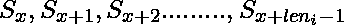
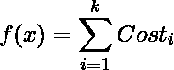

# 聚类/划分一个数组，使平方差之和最小

> 原文:[https://www . geesforgeks . org/clustering partitioning-a-array-so-square-difference-is-minimum/](https://www.geeksforgeeks.org/clusteringpartitioning-an-array-such-that-sum-of-square-differences-is-minimum/)

给定一个由 n 个数字和 k 个数字组成的数组。我们需要将数组分成 k 个长度相同或不同的分区(簇)。对于给定的 k，可以有一种或多种方法来创建集群(分区)。我们为第一个<sup>簇定义了一个函数 Cost(i)，作为它的第一个和最后一个元素之间的差值的平方。如果当前集群是</sup>



，其中 len <sub>i</sub> 是当前簇的长度，那么:


在所有可能的分区中，我们必须找到最小化函数的分区，



**示例:**

```
Input : arr[] = {1, 5, 8, 10}
            k = 2
Output : 20  
Explanation : 
Consider clustering 4 elements 1, 5, 8, 10
into 2 clusters. There are three options:
1\. S1 = 1, S2 = 5, 8, 10, with total cost 
02 + 52 = 25.

2\. S1 = 1, 5, S2 = 8, 10, with total cost
42 + 22 = 20 

3\. S1 = 1, 5, 8, S2 = 10, with total cost 
72 + 02 = 49 

So, the optimal clustering is the second one, 

so the output of the above problem is 20.
Input : arr[] = {5, 8, 1, 10}
            k = 3

Output : 
9 
Explanation :
The three partitions are {5, 8}, {1} and {10}
```

为了解决这个问题，我们假设我们有 k 块板。我们必须将它们插入到数组中一些 k 个不同的位置，这将为我们提供所需的分区方案，具有 f(x)最小值的那个将是答案。
**天真解法:**
如果用天真法求解上述问题，我们会简单地取所有可能性并计算最小值。

## C++

```
// C++ program to find minimum cost k partitions
// of array.
#include<iostream>
using namespace std;

// Initialize answer as infinite.
const int inf = 1000000000;
int ans = inf;

// function to generate all possible answers.
// and compute minimum of all costs.
// i   --> is index of previous partition
// par --> is current number of partitions
// a[] and n --> Input array and its size
// current_ans --> Cost of partitions made so far.
void solve(int i, int par, int a[], int n,
                  int k, int current_ans)
{
    // If number of partitions is more than k
    if (par > k)
        return;

    // If we have mad k partitions and have
    // reached last element
    if (par==k && i==n-1)
    {
        ans = min(ans, current_ans);
        return;
    }

    // 1) Partition array at different points
    // 2) For every point, increase count of
    //    partitions, "par" by 1.
    // 3) Before recursive call, add cost of
    //    the partition to current_ans
    for (int j=i+1; j<n; j++)
        solve(j, par+1, a, n, k, current_ans +
                  (a[j]-a[i+1])*(a[j]-a[i+1]));
}

// Driver code
int main()
{
    int k = 2;
    int a[] = {1, 5, 8, 10};
    int n = sizeof(a)/sizeof(a[0]);
    solve(-1, 0, a, n, k, 0);
    cout << ans << endl;
    return 0;
}
```

## Java 语言(一种计算机语言，尤用于创建网站)

```
// Java program to find minimum cost k partitions
// of array.
import java.io.*;

class GFG
{
    // Initialize answer as infinite.
    static int inf = 1000000000;
    static int ans = inf;

    // function to generate all possible answers.
    // and compute minimum of all costs.
    // i --> is index of previous partition
    // par --> is current number of partitions
    // a[] and n --> Input array and its size
    // current_ans --> Cost of partitions made so far.
    static void solve(int i, int par, int a[], int n,
                               int k, int current_ans)
    {
        // If number of partitions is more than k
        if (par > k)
            return;

        // If we have mad k partitions and have
        // reached last element
        if (par == k && i == n - 1)
        {
            ans = Math.min(ans, current_ans);
            return;
        }

        // 1) Partition array at different points
        // 2) For every point, increase count of
        // partitions, "par" by 1.
        // 3) Before recursive call, add cost of
        // the partition to current_ans
        for (int j = i + 1; j < n; j++)
            solve(j, par + 1, a, n, k, current_ans +
                 (a[j] - a[i + 1]) * (a[j] - a[i + 1]));
    }

    // Driver code
    public static void main (String[] args)
    {
        int k = 2;
        int a[] = {1, 5, 8, 10};
        int n = a.length;
        solve(-1, 0, a, n, k, 0);
        System.out.println(ans);

    }
}

// This code is contributed by vt_m.
```

## 蟒蛇 3

```
# Python3 program to find minimum
# cost k partitions of array.

# Initialize answer as infinite.
inf = 1000000000
ans = inf

# function to generate all possible answers.
# and compute minimum of all costs.
# i --> is index of previous partition
# par --> is current number of partitions
# a[] and n --> Input array and its size
# current_ans --> Cost of partitions made so far.
def solve(i, par, a, n, k, current_ans):

    # If number of partitions is more than k
    if (par > k):
        return 0

    # If we have mad k partitions and
    # have reached last element
    global ans
    if (par == k and i == n - 1):
        ans = min(ans, current_ans)
        return 0

    # 1) Partition array at different points
    # 2) For every point, increase count of
    # partitions, "par" by 1.
    # 3) Before recursive call, add cost of
    # the partition to current_ans
    for j in range(i + 1, n):
        solve(j, par + 1, a, n, k, current_ans +
             (a[j] - a[i + 1]) * (a[j] - a[i + 1]))

# Driver code
k = 2
a = [1, 5, 8, 10]
n = len(a)
solve(-1, 0, a, n, k, 0)
print(ans)

# This code is contributed by sahilshelangia
```

## C#

```
// C# program to find minimum
// cost k partitions of array.
using System;

class GFG
{
    // Initialize answer as infinite.
    static int inf = 1000000000;
    static int ans = inf;

    // function to generate all possible answers.
    // and compute minimum of all costs.
    // i --> is index of previous partition
    // par --> is current number of partitions
    // a[] and n --> Input array and its size
    // current_ans --> Cost of partitions made so far.
    static void solve(int i, int par, int []a,
                      int n, int k, int current_ans)
    {
        // If number of partitions is more than k
        if (par > k)
            return;

        // If we have mad k partitions and
        // have reached last element
        if (par == k && i == n - 1)
        {
            ans = Math.Min(ans, current_ans);
            return;
        }

        // 1) Partition array at different points
        // 2) For every point, increase count of
        // partitions, "par" by 1.
        // 3) Before recursive call, add cost of
        // the partition to current_ans
        for (int j = i + 1; j < n; j++)
            solve(j, par + 1, a, n, k, current_ans +
                 (a[j] - a[i + 1]) * (a[j] - a[i + 1]));
    }

    // Driver code
    public static void Main ()
    {
        int k = 2;
        int []a = {1, 5, 8, 10};
        int n = a.Length;
        solve(-1, 0, a, n, k, 0);
        Console.Write(ans);
    }
}

// This code is contributed by nitin mittal.
```

## 服务器端编程语言（Professional Hypertext Preprocessor 的缩写）

```
<?php
// PHP program to find minimum cost k
// partitions of array.

// Initialize answer as infinite.
$inf = 1000000000;
$ans = $inf;

// function to generate all possible answers.
// and compute minimum of all costs.
// i --> is index of previous partition
// par --> is current number of partitions
// a[] and n --> Input array and its size
// current_ans --> Cost of partitions made so far.
function solve($i, $par, &$a, $n, $k, $current_ans)
{
    global $inf, $ans;

    // If number of partitions is
    // more than k
    if ($par > $k)
        return;

    // If we have mad k partitions and
    // have reached last element
    if ($par == $k && $i == $n - 1)
    {
        $ans = min($ans, $current_ans);
        return;
    }

    // 1) Partition array at different points
    // 2) For every point, increase count of
    //    partitions, "par" by 1.
    // 3) Before recursive call, add cost of
    //    the partition to current_ans
    for ($j = $i + 1; $j < $n; $j++)
        solve($j, $par + 1, $a, $n, $k, $current_ans +
                           ($a[$j] - $a[$i + 1]) *
                           ($a[$j] - $a[$i + 1]));
}

// Driver code
$k = 2;
$a = array(1, 5, 8, 10);
$n = sizeof($a);
solve(-1, 0, $a, $n, $k, 0);
echo $ans . "\n";

// This code is contributed by ita_c
?>
```

## java 描述语言

```
<script>

// Javascript program to find
// minimum cost k partitions
// of array.

    // Initialize answer as infinite.
    let inf = 1000000000;
    let ans = inf;

    // function to generate all possible answers.
    // and compute minimum of all costs.
    // i --> is index of previous partition
    // par --> is current number of partitions
    // a[] and n --> Input array and its size
    // current_ans --> Cost of partitions made so far.
    function solve(i,par,a,n,k,current_ans)
    {
        // If number of partitions is more than k
        if (par > k)
            return;

        // If we have mad k partitions and have
        // reached last element
        if (par == k && i == n - 1)
        {
            ans = Math.min(ans, current_ans);
            return;
        }

        // 1) Partition array at different points
        // 2) For every point, increase count of
        // partitions, "par" by 1.
        // 3) Before recursive call, add cost of
        // the partition to current_ans
        for (let j = i + 1; j < n; j++)
            solve(j, par + 1, a, n, k, current_ans +
                 (a[j] - a[i + 1]) * (a[j] - a[i + 1]));
    }

    // Driver code
    let k = 2;
    let a=[1, 5, 8, 10];
    let  n = a.length;
    solve(-1, 0, a, n, k, 0);
    document.write(ans);

    // This code is contributed by rag2127

</script>
```

**输出:**

```
20
```

**时间复杂度:**很明显上面的算法时间复杂度为 O(2 <sup>n</sup>

**动态编程:**
我们创建一个表 **dp[n+1][k+1]** 表，并将所有值初始化为无穷大。

```
dp[i][j] stores optimal partition cost 
         for arr[0..i-1] and j partitions.
```

让我们计算 dp[i][j]的值。我们取一个索引 m，这样第 m < i, and put a partition next to that position such that there is no slab in between the indices i and m. It can be seen simply that answer to the current scenario is dp[m][j-1] + (a[i-1]-a[m])*(a[i-1]-a[m]), where the first term signifies the minimum f(x) till the m<sup>个</sup>元素有 j-1 个分区，第二个表示当前集群的开销。因此，我们将取所有可能的指数 m 中的最小值，dp[i][j]将被分配其中的最小值。

## C++

```
// C++ program to find minimum cost k partitions
// of array.
#include<iostream>
using namespace std;
const int inf = 1000000000;

// Returns minimum cost of partitioning a[] in
// k clusters.
int minCost(int a[], int n, int k)
{
    // Create a dp[][] table and initialize
    // all values as infinite. dp[i][j] is
    // going to store optimal partition cost
    // for arr[0..i-1] and j partitions
    int dp[n+1][k+1];
    for (int i=0; i<=n; i++)
        for (int j=0;j<=k;j++)
            dp[i][j] = inf;

    // Fill dp[][] in bottom up manner
    dp[0][0] = 0;

    // Current ending position (After i-th
    // iteration result for a[0..i-1] is computed.
    for (int i=1;i<=n;i++)

        // j is number of partitions
        for (int j=1;j<=k;j++)

            // Picking previous partition for
            // current i.
            for (int m=i-1;m>=0;m--)
                dp[i][j] = min(dp[i][j], dp[m][j-1] +
                          (a[i-1]-a[m])*(a[i-1]-a[m]));

    return dp[n][k];
}

// Driver code
int main()
{
    int k = 2;
    int a[] = {1, 5, 8, 10};
    int n = sizeof(a)/sizeof(a[0]);
    cout << minCost(a, n, k) << endl;
    return 0;
}
```

## Java 语言(一种计算机语言，尤用于创建网站)

```
// Java program to find minimum cost
// k partitions of array.
import java.io.*;

class GFG
{
    static int inf = 1000000000;

    // Returns minimum cost of partitioning
    // a[] in k clusters.
    static int minCost(int a[], int n, int k)
    {
        // Create a dp[][] table and initialize
        // all values as infinite. dp[i][j] is
        // going to store optimal partition cost
        // for arr[0..i-1] and j partitions
        int dp[][] = new int[n + 1][k + 1];
        for (int i = 0; i <= n; i++)
            for (int j = 0; j <= k; j++)
                dp[i][j] = inf;

        // Fill dp[][] in bottom up manner
        dp[0][0] = 0;

        // Current ending position (After i-th
        // iteration result for a[0..i-1] is computed.
        for (int i = 1; i <= n; i++)

            // j is number of partitions
            for (int j = 1; j <= k; j++)

                // Picking previous partition for
                // current i.
                for (int m = i - 1; m >= 0; m--)
                    dp[i][j] = Math.min(dp[i][j], dp[m][j - 1] +
                              (a[i - 1] - a[m]) * (a[i - 1] - a[m]));

        return dp[n][k];
    }

    // Driver code
    public static void main (String[] args)
    {
        int k = 2;
        int a[] = {1, 5, 8, 10};
        int n = a.length;
        System.out.println(minCost(a, n, k));

    }
}

// This code is contributed by vt_m.
```

## 蟒蛇 3

```
# Python3 program to find minimum cost k partitions
# of array.
inf = 1000000000;

# Returns minimum cost of partitioning a[] in
# k clusters.
def minCost(a, n, k):

    # Create a dp[][] table and initialize
    # all values as infinite. dp[i][j] is
    # going to store optimal partition cost
    # for arr[0..i-1] and j partitions
    dp = [[inf for i in range(k + 1)]
               for j in range(n + 1)];

    # Fill dp[][] in bottom up manner
    dp[0][0] = 0;

    # Current ending position (After i-th
    # iteration result for a[0..i-1] is computed.
    for i in range(1, n + 1):

        # j is number of partitions
        for j in range(1, k + 1):

            # Picking previous partition for
            # current i.
            for m in range(i - 1, -1, -1):
                dp[i][j] = min(dp[i][j], dp[m][j - 1] +
                                    (a[i - 1] - a[m]) *
                                    (a[i - 1] - a[m]));

    return dp[n][k];

# Driver code
if __name__ == '__main__':
    k = 2;
    a = [1, 5, 8, 10];
    n = len(a);
    print(minCost(a, n, k));

# This code is contributed by 29AjayKumar
```

## C#

```
// C# program to find minimum cost
// k partitions of array.
using System;

class GFG {

    static int inf = 1000000000;

    // Returns minimum cost of partitioning
    // a[] in k clusters.
    static int minCost(int []a, int n, int k)
    {

        // Create a dp[][] table and initialize
        // all values as infinite. dp[i][j] is
        // going to store optimal partition cost
        // for arr[0..i-1] and j partitions
        int [,]dp = new int[n + 1,k + 1];
        for (int i = 0; i <= n; i++)
            for (int j = 0; j <= k; j++)
                dp[i,j] = inf;

        // Fill dp[][] in bottom
        // up manner
        dp[0,0] = 0;

        // Current ending position
        // (After i-th iteration
        // result for a[0..i-1]
        // is computed.
        for (int i = 1; i <= n; i++)

            // j is number of partitions
            for (int j = 1; j <= k; j++)

                // Picking previous
                // partition for
                // current i.
                for (int m = i - 1; m >= 0; m--)
                    dp[i,j] = Math.Min(dp[i,j],
                                 dp[m,j - 1] +
                               (a[i - 1] - a[m]) *
                               (a[i - 1] - a[m]));

        return dp[n,k];
    }

    // Driver code
    public static void Main ()
    {
        int k = 2;
        int []a = {1, 5, 8, 10};
        int n = a.Length;
        Console.Write(minCost(a, n, k));

    }
}

// This code is contributed by nitin mittal
```

## java 描述语言

```
<script>
    // Javascript program to find minimum cost k partitions of array.

    let inf = 1000000000;

    // Returns minimum cost of partitioning
    // a[] in k clusters.
    function minCost(a, n, k)
    {

        // Create a dp[][] table and initialize
        // all values as infinite. dp[i][j] is
        // going to store optimal partition cost
        // for arr[0..i-1] and j partitions
        let dp = new Array(n + 1);
        for (let i = 0; i <= n; i++)
        {
            dp[i] = new Array(k + 1);
            for (let j = 0; j <= k; j++)
                dp[i][j] = inf;
        }

        // Fill dp[][] in bottom up manner
        dp[0][0] = 0;

        // Current ending position (After i-th
        // iteration result for a[0..i-1] is computed.
        for (let i = 1; i <= n; i++)

            // j is number of partitions
            for (let j = 1; j <= k; j++)

                // Picking previous partition for
                // current i.
                for (let m = i - 1; m >= 0; m--)
                    dp[i][j] = Math.min(dp[i][j], dp[m][j - 1] +
                              (a[i - 1] - a[m]) * (a[i - 1] - a[m]));

        return dp[n][k];
    }

    let k = 2;
    let a = [1, 5, 8, 10];
    let n = a.length;
    document.write(minCost(a, n, k));

// This code is contributed by rameshtravel07.
</script>
```

**输出:**

```
20
```

**时间复杂度:**有了这三个简单的循环，上述算法的复杂度为 O(n <sup>2k</sup>

本文由[阿姆利则瓦格米](https://www.facebook.com/amritya.vagmi)投稿，想要投稿，也可以使用[write.geeksforgeeks.org](https://write.geeksforgeeks.org)写一篇，或者将文章邮寄到 review-team@geeksforgeeks.org。看到你的文章出现在极客博客主页上，帮助其他极客。
如果你发现任何不正确的地方，或者你想分享更多关于上面讨论的话题的信息，请写评论。