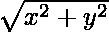
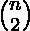

# 碰撞路线| TCS MockVita 2020

> 原文:[https://www . geesforgeks . org/碰撞-航向-tcs-mockvita-2020/](https://www.geeksforgeeks.org/collision-course-tcs-mockvita-2020/)

#### 问题描述

在繁忙的道路上，多辆车经过。运行一个模拟来看看如果路上所有的汽车刹车失灵会发生什么。他们安全的唯一方法是不要相互碰撞和擦肩而过。目标是确定任何给定的汽车是否会在环形交叉路口发生碰撞或彼此安全通过。把它想象成一个参考点 O(坐标为(0，0)的原点)，但是汽车没有绕过它，而是穿过它。

考虑到每辆车都以各自统一的速度沿直线向原点移动。汽车将继续沿着同一条直线行驶，即使在穿过原点之后。计算在这种情况下将发生的冲突数量。

**注意:**只在原点计算碰撞。忽略其他碰撞。假设每辆车即使在碰撞后也在各自的路径上继续行驶，而没有改变方向或速度，持续了无限长的距离。

给定一个包含每个元素的坐标及其速度的数组 **car[]** 。求原点碰撞的总数。

**示例:**

> **输入:** car[] = {(5 12 1)、(16 63 5)、(-10 24 2)、(7 24 2)、(-24 7 2)}
> **输出:** 4
> **解释:**
> 让这 5 辆车分别为 A、B、C、D、E。
> 4 碰撞如下–
> A&B、A & C、B & C、D & E

**进场:**思路是找出原点碰撞的车数。给我们汽车的坐标位置，从中我们可以找到汽车离原点的距离。

假设 x，y 是汽车的位置，那么离原点的距离将是:



用速度来划分这段距离将会给我们一辆汽车在原点出现的时间。因此，如果在某个时刻有“N”辆汽车出现在原点，那么总碰撞数将为



在不同的时间添加所有的碰撞将给出我们需要的答案。

下面是上述方法的实现:

## C++

```
// C++ implementation to find the
// collision at the origin

#include <bits/stdc++.h>
using namespace std;

// Structure to store the
// co-ordinates of car and speed
struct Car {
    long long x;
    long long y;
    long long v;
};

// Function to find the co-ordinates
// of the car and speed
long long solve(long long c,
                vector<Car>& arr)
{
    map<long long, long long> freq;

    long sum = 0;
    for (long long i = 0; i < c; i++) {
        long long x = arr[i].x,
                  y = arr[i].y,
                  v = arr[i].v;
        long long dist_square
            = (x * x) + (y * y);
        long long time_square
            = dist_square / (v * v);
        freq[time_square]++;
    }

    // Loop to iterate over the
    // frequency of the elements
    for (auto it = freq.begin();
         it != freq.end(); it++) {
        long long f = it->second;
        if (f <= 0)
            continue;

        sum += (f * (f - 1)) / 2;
    }

    return sum;
}

// Driver Code
int main()
{
    long long c = 5;

    vector<Car> arr;

    Car tmp;
    tmp.x = 5;
    tmp.y = 12;
    tmp.v = 1;
    arr.push_back(tmp);

    tmp.x = 16;
    tmp.y = 63;
    tmp.v = 5;
    arr.push_back(tmp);

    tmp.x = -10;
    tmp.y = 24;
    tmp.v = 2;
    arr.push_back(tmp);

    tmp.x = 7;
    tmp.y = 24;
    tmp.v = 2;
    arr.push_back(tmp);

    tmp.x = -24;
    tmp.y = 7;
    tmp.v = 2;
    arr.push_back(tmp);

    cout << solve(c, arr);

    return 0;
}
```

**Output:**

```
4

```