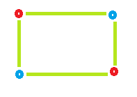

# 给循环图着色

> 原文:[https://www.geeksforgeeks.org/coloring-a-cycle-graph/](https://www.geeksforgeeks.org/coloring-a-cycle-graph/)

**循环:-** 循环是边和顶点的路径，其中一个顶点可以从自身到达。或者换句话说，这是一个封闭的步行。

**偶数顶点数为偶数的偶循环:-** 称为偶循环。

**奇数周期:-** 存在奇数个顶点的周期称为奇数周期。
给定循环图的顶点数。任务是确定给图形着色所需的颜色数量，以便没有两个相邻顶点具有相同的颜色。

**进场:**

> 如果顶点的数量是偶数，那么它就是偶数循环，为了给这样的图着色，我们需要 2 种颜色。
> 如果顶点的数量是奇数，那么它就是奇数循环，为了给这样的图着色，我们需要 3 种颜色。

**示例:**

```
Input : vertices = 3
Output : No. of colors require is: 3

Input : vertices = 4
Output : No. of colors require is: 2
```

**示例 1:偶循环:**顶点数= 4


所需颜色= 2



**示例 2:奇数周期:**顶点数= 5


所需颜色= 3


## C++

```
// CPP program to find number of colors
// required to color a cycle graph
#include <bits/stdc++.h>
using namespace std;

// Function that calculates Color
// require to color a graph.
int Color(int vertices)
{
    int result = 0;

    // Check if number of vertices
    // is odd or even.
    // If number of vertices is even
    // then color require is 2 otherwise 3
    if (vertices % 2 == 0)
        result = 2;
    else
        result = 3;

    return result;
}

// Driver code
int main()
{
    int vertices = 3;
    cout << "No. of colors require is: " << Color(vertices);
    return 0;
}
```

## Java 语言(一种计算机语言，尤用于创建网站)

```
// Java program to find number of colors
// required to color a cycle graph
import java.io.*;

class GFG {

    // Function that calculates Color
    // require to color a graph. 
    static int Color(int vertices)
    {
        int result = 0;

        // Check if number of vertices
        // is odd or even.
        // If number of vertices is even
        // then color require is 2 otherwise 3
        if (vertices % 2 == 0)
            result = 2;
        else
            result = 3;

        return result;
    } 

    // Driver program to test above function
    public static void main (String[] args)
    {
        int vertices = 3;

        System.out.println("No. of colors require is: " + Color(vertices));

    }
}

// this code is contributed by Naman_Garg
```

## 蟒蛇 3

```
# Naive Python3 Program to
# find the number of colors
# required to color a cycle graph 

# Function to find Color required.
def Color(vertices): 

    result = 0

    # Check if number of vertices
    # is odd or even.
    # If number of vertices is even
    # then color require is 2 otherwise 3
    if (vertices % 2 == 0):
        result = 2
    else:
        result = 3

    return result

# Driver Code
if __name__=='__main__':
    vertices = 3
    print ("No. of colors require is:",Color(vertices))

# this code is contributed by Naman_Garg
```

## C#

```
// C# program to find number of colors
// required to color a cycle graph
using System;

class GFG
{

// Function that calculates Color
// require to color a graph.
static int Color(int vertices)
{
    int result = 0;

    // Check if number of vertices
    // is odd or even.
    // If number of vertices is even
    // then color require is 2 otherwise 3
    if (vertices % 2 == 0)
        result = 2;
    else
        result = 3;

    return result;
}

// Driver Code
public static void Main ()
{
    int vertices = 3;

    Console.WriteLine("No. of colors required is: " +
                                   Color(vertices));
}
}

// This code is contributed by anuj_67
```

## 服务器端编程语言（Professional Hypertext Preprocessor 的缩写）

```
<?php
// PHP program to find number of colors
// required to color a cycle graph

// Function that calculates Color
// require to color a graph.
function Color($vertices)
{
    $result = 0;

    // Check if number of vertices
    // is odd or even.
    // If number of vertices is even
    // then color require is 2 otherwise 3
    if ($vertices % 2 == 0)
        $result = 2;
    else
        $result = 3;

    return $result;
}

// Driver code
$vertices = 3;
echo "No. of colors required is: " ,
                  Color($vertices);

// This code is contributed
// by anuj_67
?>
```

## java 描述语言

```
<script>

// Javascript program to find number of colors
// required to color a cycle graph

// Function that calculates Color
// require to color a graph.
function Color(vertices)
{
    var result = 0;

    // Check if number of vertices
    // is odd or even.
    // If number of vertices is even
    // then color require is 2 otherwise 3
    if (vertices % 2 == 0)
        result = 2;
    else
        result = 3;

    return result;
}

// Driver code
var vertices = 3;
document.write("No. of colors require is: " +
               Color(vertices));

// This code is contributed by itsok

</script>
```

**Output:** 

```
No. of colors require is: 3
```