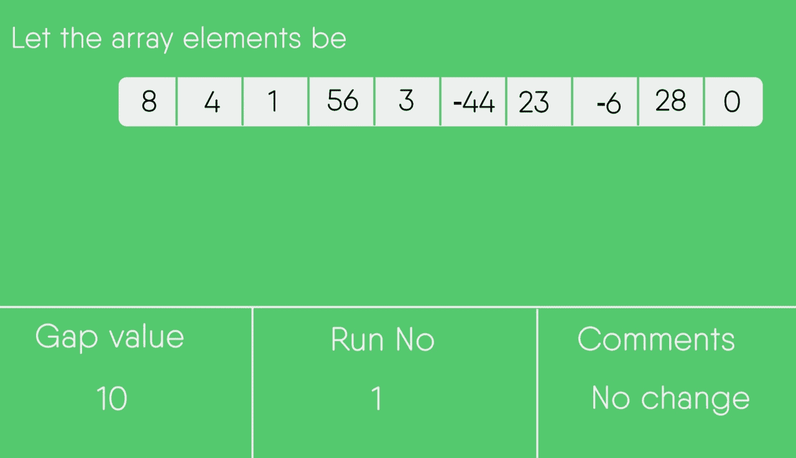
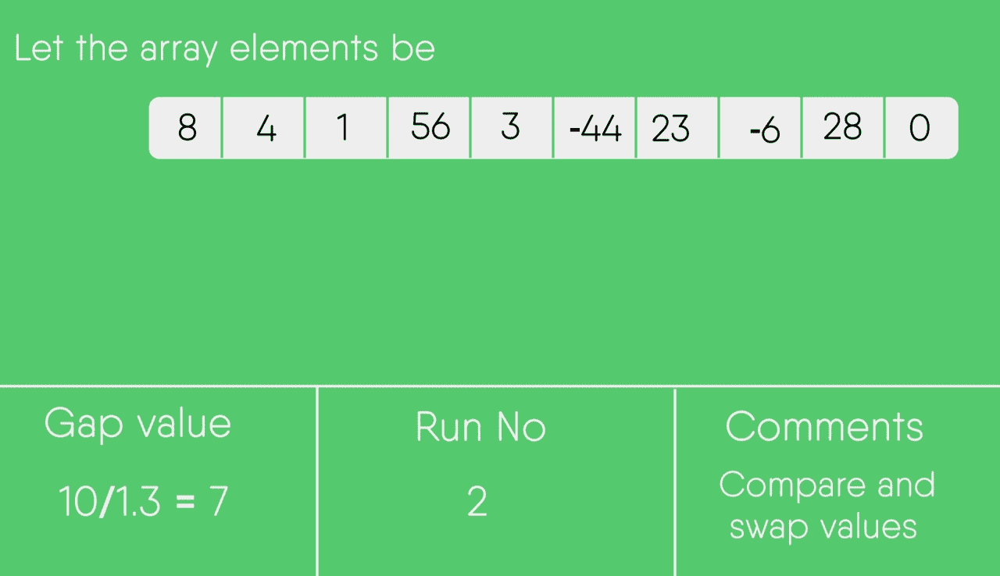
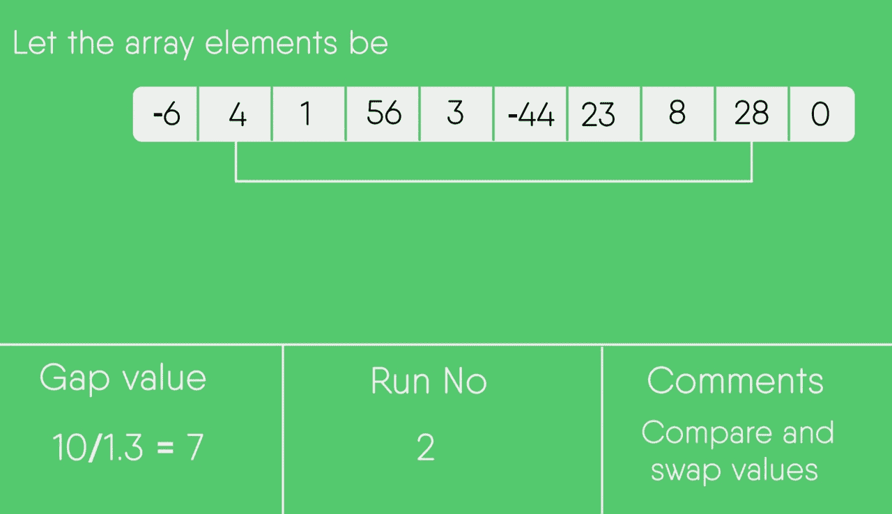
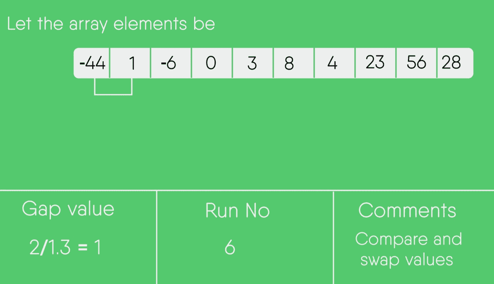
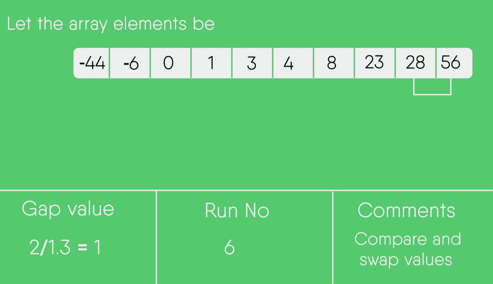
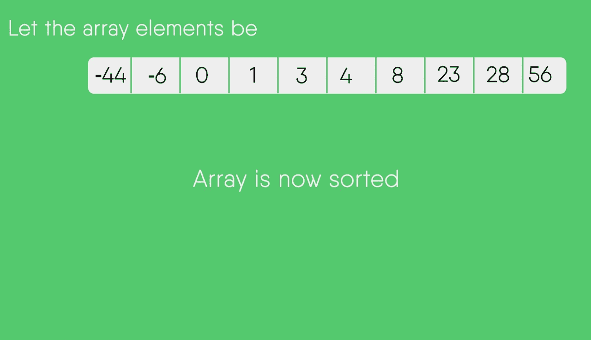

# 梳理分类

> 原文:[https://www.geeksforgeeks.org/comb-sort/](https://www.geeksforgeeks.org/comb-sort/)

梳状排序主要是对冒泡排序的改进。冒泡排序总是比较相邻的值。所以所有的[反演](https://www.geeksforgeeks.org/counting-inversions/)都被一个一个的去掉了。梳状排序通过使用大于 1 的间隙改进了冒泡排序。间隙从一个大值开始，在每次迭代中缩小 1.3 倍，直到达到值 1。因此，梳状排序通过一次交换去除了多个[反转计数](https://www.geeksforgeeks.org/counting-inversions/)，性能优于冒泡排序。
经验发现收缩因子为 1.3(通过在超过 200，000 个随机列表上测试组合排序)【来源:[Wiki](https://en.wikipedia.org/wiki/Comb_sort)
虽然，它的平均效果比冒泡排序好，但最坏的情况仍然是 O(n <sup>2</sup> )。
下面是实现。

## C++

```
// C++ implementation of Comb Sort
#include<bits/stdc++.h>
using namespace std;

// To find gap between elements
int getNextGap(int gap)
{
    // Shrink gap by Shrink factor
    gap = (gap*10)/13;

    if (gap < 1)
        return 1;
    return gap;
}

// Function to sort a[0..n-1] using Comb Sort
void combSort(int a[], int n)
{
    // Initialize gap
    int gap = n;

    // Initialize swapped as true to make sure that
    // loop runs
    bool swapped = true;

    // Keep running while gap is more than 1 and last
    // iteration caused a swap
    while (gap != 1 || swapped == true)
    {
        // Find next gap
        gap = getNextGap(gap);

        // Initialize swapped as false so that we can
        // check if swap happened or not
        swapped = false;

        // Compare all elements with current gap
        for (int i=0; i<n-gap; i++)
        {
            if (a[i] > a[i+gap])
            {
                swap(a[i], a[i+gap]);
                swapped = true;
            }
        }
    }
}

// Driver program
int main()
{
    int a[] = {8, 4, 1, 56, 3, -44, 23, -6, 28, 0};
    int n = sizeof(a)/sizeof(a[0]);

    combSort(a, n);

    printf("Sorted array: \n");
    for (int i=0; i<n; i++)
        printf("%d ", a[i]);

    return 0;
}
```

## Java 语言(一种计算机语言，尤用于创建网站)

```
// Java program for implementation of Comb Sort
class CombSort
{
    // To find gap between elements
    int getNextGap(int gap)
    {
        // Shrink gap by Shrink factor
        gap = (gap*10)/13;
        if (gap < 1)
            return 1;
        return gap;
    }

    // Function to sort arr[] using Comb Sort
    void sort(int arr[])
    {
        int n = arr.length;

        // initialize gap
        int gap = n;

        // Initialize swapped as true to make sure that
        // loop runs
        boolean swapped = true;

        // Keep running while gap is more than 1 and last
        // iteration caused a swap
        while (gap != 1 || swapped == true)
        {
            // Find next gap
            gap = getNextGap(gap);

            // Initialize swapped as false so that we can
            // check if swap happened or not
            swapped = false;

            // Compare all elements with current gap
            for (int i=0; i<n-gap; i++)
            {
                if (arr[i] > arr[i+gap])
                {
                    // Swap arr[i] and arr[i+gap]
                    int temp = arr[i];
                    arr[i] = arr[i+gap];
                    arr[i+gap] = temp;

                    // Set swapped
                    swapped = true;
                }
            }
        }
    }

    // Driver method
    public static void main(String args[])
    {
        CombSort ob = new CombSort();
        int arr[] = {8, 4, 1, 56, 3, -44, 23, -6, 28, 0};
        ob.sort(arr);

        System.out.println("sorted array");
        for (int i=0; i<arr.length; ++i)
            System.out.print(arr[i] + " ");

    }
}
/* This code is contributed by Rajat Mishra */
```

## 计算机编程语言

```
# Python program for implementation of CombSort

# To find next gap from current
def getNextGap(gap):

    # Shrink gap by Shrink factor
    gap = (gap * 10)/13
    if gap < 1:
        return 1
    return gap

# Function to sort arr[] using Comb Sort
def combSort(arr):
    n = len(arr)

    # Initialize gap
    gap = n

    # Initialize swapped as true to make sure that
    # loop runs
    swapped = True

    # Keep running while gap is more than 1 and last
    # iteration caused a swap
    while gap !=1 or swapped == 1:

        # Find next gap
        gap = getNextGap(gap)

        # Initialize swapped as false so that we can
        # check if swap happened or not
        swapped = False

        # Compare all elements with current gap
        for i in range(0, n-gap):
            if arr[i] > arr[i + gap]:
                arr[i], arr[i + gap]=arr[i + gap], arr[i]
                swapped = True

# Driver code to test above
arr = [ 8, 4, 1, 3, -44, 23, -6, 28, 0]
combSort(arr)

print ("Sorted array:")
for i in range(len(arr)):
    print (arr[i]),

# This code is contributed by Mohit Kumra
```

## C#

```
// C# program for implementation of Comb Sort
using System;

class GFG
{
    // To find gap between elements
    static int getNextGap(int gap)
    {
        // Shrink gap by Shrink factor
        gap = (gap*10)/13;
        if (gap < 1)
            return 1;
        return gap;
    }

    // Function to sort arr[] using Comb Sort
    static void sort(int []arr)
    {
        int n = arr.Length;

        // initialize gap
        int gap = n;

        // Initialize swapped as true to
        // make sure that loop runs
        bool swapped = true;

        // Keep running while gap is more than
        // 1 and last iteration caused a swap
        while (gap != 1 || swapped == true)
        {
            // Find next gap
            gap = getNextGap(gap);

            // Initialize swapped as false so that we can
            // check if swap happened or not
            swapped = false;

            // Compare all elements with current gap
            for (int i=0; i<n-gap; i++)
            {
                if (arr[i] > arr[i+gap])
                {
                    // Swap arr[i] and arr[i+gap]
                    int temp = arr[i];
                    arr[i] = arr[i+gap];
                    arr[i+gap] = temp;

                    // Set swapped
                    swapped = true;
                }
            }
        }
    }

    // Driver method
    public static void Main()
    {
        int []arr = {8, 4, 1, 56, 3, -44, 23, -6, 28, 0};
        sort(arr);

        Console.WriteLine("sorted array");
        for (int i=0; i<arr.Length; ++i)
            Console.Write(arr[i] + " ");

    }
}

// This code is contributed by Sam007
```

## java 描述语言

```
<script>
    // Javascript program for implementation of Comb Sort

    // To find gap between elements
    function getNextGap(gap)
    {
        // Shrink gap by Shrink factor
        gap = parseInt((gap*10)/13, 10);
        if (gap < 1)
            return 1;
        return gap;
    }

    // Function to sort arr[] using Comb Sort
    function sort(arr)
    {
        let n = arr.length;

        // initialize gap
        let gap = n;

        // Initialize swapped as true to
        // make sure that loop runs
        let swapped = true;

        // Keep running while gap is more than
        // 1 and last iteration caused a swap
        while (gap != 1 || swapped == true)
        {
            // Find next gap
            gap = getNextGap(gap);

            // Initialize swapped as false so that we can
            // check if swap happened or not
            swapped = false;

            // Compare all elements with current gap
            for (let i=0; i<n-gap; i++)
            {
                if (arr[i] > arr[i+gap])
                {
                    // Swap arr[i] and arr[i+gap]
                    let temp = arr[i];
                    arr[i] = arr[i+gap];
                    arr[i+gap] = temp;

                    // Set swapped
                    swapped = true;
                }
            }
        }
    }

    let arr = [8, 4, 1, 56, 3, -44, 23, -6, 28, 0];
    sort(arr);

    document.write("sorted array" + "</br>");
    for (let i=0; i<arr.length; ++i)
      document.write(arr[i] + " ");

 // This code is contributed by decode2207
</script>
```

输出:

```
Sorted array: 
-44 -6 0 1 3 4 8 23 28 56 
```

**图解:**
让数组元素

```
8, 4, 1, 56, 3, -44, 23, -6, 28, 0
```

初始间隙值= 10
缩小后间隙值=>10/1.3 =**7**；

```
 8 4 1 56 3 -44 23 -6 28 0
-6 4 1 56 3 -44 23  8 28 0
-6 4 0 56 3 -44 23  8 28 1
```

新间隙值= > 7/1.3 =**5**；

```
-44 4 0 56 3 -6 23 8 28 1
-44 4 0 28 3 -6 23 8 56 1
-44 4 0 28 1 -6 23 8 56 3
```

新间隙值= > 5/1.3 =**3**；

```
-44 1  0 28 4 -6 23 8 56 3
-44 1 -6 28 4  0 23 8 56 3
-44 1 -6 23 4  0 28 8 56 3
-44 1 -6 23 4  0  3 8 56 28
```

新间隙值= > 3/1.3 =**2**；

```
-44 1 -6 0 4 23 3 8 56 28
-44 1 -6 0 3 23 4 8 56 28
-44 1 -6 0 3 8 4 23 56 28
```

新间隙值= > 2/1.3 =**1**；

```
-44 -6 1 0 3 8 4 23 56 28
-44 -6 0 1 3 8 4 23 56 28
-44 -6 0 1 3 4 8 23 56 28
-44 -6 0 1 3 4 8 23 28 56 

no more swaps required (Array sorted)
```

**时间复杂度:**算法的平均案例时间复杂度为ω(N<sup>2</sup>/2<sup>p</sup>，其中 p 为增量数。该算法的最坏情况复杂度为 O(n <sup>2</sup> )，最佳情况复杂度为 O(nlogn)。
**辅助空间:** O(1)。

## [梳子分类测验](http://geeksquiz.com/quiz-combsort/)

本文由**拉胡尔·阿格沃尔**供稿。如果你喜欢极客博客并想投稿，你也可以写一篇文章并把你的文章邮寄到 contribute@geeksforgeeks.org。看到你的文章出现在极客博客主页上，帮助其他极客。

**快照:**

     

**geeks forgesquiz 上的其他排序算法**
[选择排序](http://geeksquiz.com/selection-sort/)[冒泡排序](http://geeksquiz.com/bubble-sort/)[插入排序](http://geeksquiz.com/insertion-sort/)[合并排序](http://geeksquiz.com/merge-sort/)[堆排序](http://geeksquiz.com/heap-sort/)[快速排序](http://geeksquiz.com/quick-sort/)[基数排序](https://www.geeksforgeeks.org/radix-sort/)[计数排序](https://www.geeksforgeeks.org/counting-sort/)[桶排序](https://www.geeksforgeeks.org/bucket-sort-2/)[壳排序](http://geeksquiz.com/shellsort/)【T27】