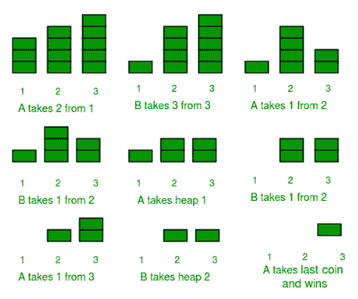
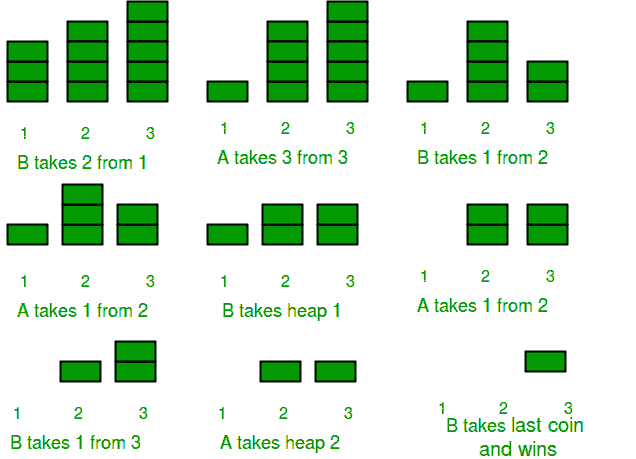
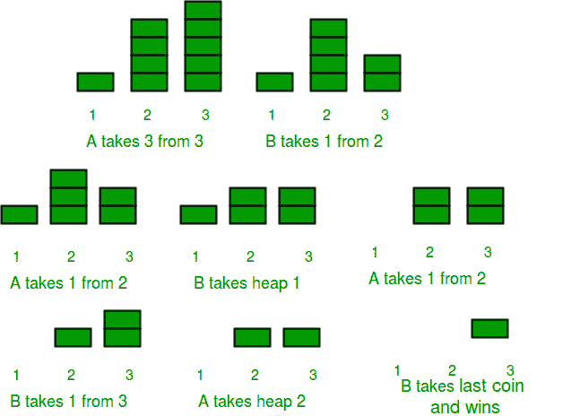

# 组合博弈论|第二集(尼姆的游戏)

> 原文:[https://www . geesforgeks . org/组合-博弈论-集合-2-博弈-nim/](https://www.geeksforgeeks.org/combinatorial-game-theory-set-2-game-nim/)

我们强烈建议参考以下文章作为先决条件。

[组合博弈论|第一集(简介)](https://www.geeksforgeeks.org/introduction-to-combinatorial-game-theory/)

这篇文章讨论了《尼姆的游戏》。尼姆的游戏由以下规则描述

"*给定一定数量的堆，其中每堆包含一定数量的石头/硬币。在每一回合中，玩家只能选择一堆，并从该堆中移除任意数量的石头(至少一个)。不能移动的玩家被认为输掉游戏(即拿走最后一块石头的玩家是赢家)。*”

例如，考虑有两个玩家- **A** 和 **B** ，最初有三堆硬币，每个硬币中最初有 **3、4、5** 硬币，如下所示。我们假设第一步由 **A** 进行。看下图可以清楚的了解整个游戏玩法。

[](https://media.geeksforgeeks.org/wp-content/uploads/tower.png) 
<font color="Red">A 赢了比赛(注:A 先动的)</font>

那么 **A** 在这个游戏中有很强的专长吗？还是他/她先发制人比 T2 B 级 T3 有优势？

让我们现在再玩一次，堆的配置和上面一样，但是这次 **B** 先开始，而不是 **A** 。

[](https://media.geeksforgeeks.org/wp-content/uploads/combinatorial.jpg) 
<font color="Red">B 赢了这场比赛(注:B 先动的)</font>

**B** 从上图来看，必须明确的是，比赛取决于一个重要因素——谁先开始比赛？

**那么首发的玩家每次都会赢吗？**
让我们再次玩游戏，从 **A** 开始，这次用不同的初始配置堆。这些硬币堆最初有 1、4、5 枚硬币。

**A** 会不会又赢了，因为他已经先开始了？让我们看看。
[](https://media.geeksforgeeks.org/wp-content/uploads/game3-2.jpg) 
<font color="Red">A 做出了第一步棋，但输掉了比赛。</font>

所以，结果很明显。 **A** 输了。但是怎么做呢？我们知道这个游戏很大程度上取决于哪个玩家先开始。因此，一定还有另一个因素支配着这个简单而有趣的游戏的结果。该因素是堆/堆的初始配置。这一次的初始配置与上一次不同。

所以，我们可以得出结论，这个游戏取决于两个因素-

1.  先开始的玩家。
2.  堆的初始配置。

**其实我们甚至可以在玩游戏之前就预测出游戏的赢家！**

**尼姆-Sum :** 游戏任意一点每堆/堆中硬币/石头数量的累计 XOR 值在该点称为尼姆-Sum。*否则，如果尼姆-Sum 评估为零，那么玩家 **A** 肯定会输。”*

上述定理的证明见-[https://en . Wikipedia . org/wiki/Nim # of _ the _ winding _ formula](https://en.wikipedia.org/wiki/Nim#Proof_of_the_winning_formula)

**最优策略:**

*   如果“n”个数字的异或和已经为零，则不可能通过一个数字的单个减少使异或和为零。*   If the XOR sum of ‘n’ numbers is non-zero then there is at least a single approach by which if you reduce a number, the XOR sum is zero.

    最初可能存在两种情况。

    **情况 1:初始尼姆和为零**
    众所周知，在这种情况下如果打得最优 **B** 获胜，这意味着 **B** 总是更希望轮到 **A** 时尼姆和为零。
    因此，由于尼姆和最初为零，无论删除新尼姆和的项目数是多少 **A** 都将是非零的(如上所述)。此外，由于 **B** 更喜欢 **A** 的尼姆和为零，因此他会进行一次移动，以使尼姆和再次为零(如上所述，这总是可能的)。
    只要任何一堆中有物品，并且在它们各自的回合中有物品，游戏就会继续进行 **A** 将使尼姆总和非零，而 **B** 将使其再次为零，最终将没有剩余的元素，而 **B** 将是最后一个选择的人赢得游戏。

    **以上解释很明显，每个玩家的最优策略是让对手的尼姆总和在他们的每个回合都为零，如果已经为零，这是不可能的。**

    **情况 2:初始尼姆和不为零**
    现在按照最优方法 **A** 将使尼姆和现在为零(这是可能的，因为初始尼姆和不为零，如上所述)。现在，轮到 **B** 了，因为 nim 和已经是零了，不管 **B** 选择什么数字，nim 和都将是非零的，并且 **A** 可以选择一个数字来使 nim 和再次为零。只要任何一堆都有可用的物品，这就行了。
    和 **A** 将是选择最后一个项目的人。

    因此，正如在上面的例子中所讨论的，现在应该很明显，对于任何玩家来说，最佳策略是，如果 nim 和非零，那么 nim 和为零，如果 nim 和已经为零，那么无论玩家现在移动什么，它都可以被反击。

    让我们在上面的游戏中应用上面的定理。第一局 **A** 先开始，游戏开始的 Nim-Sum 为，3 XOR 4 XOR 5 = 2，为非零值，因此 **A** 获胜。而在第二场比赛中，当桩的初始配置为 1、4 和 5 并且 **A** 首先开始时，那么 **A** 注定会输，因为游戏开始时的尼姆-Sum 是 1 异或 4 异或 5 = 0。

    **实施:**

    在下面的程序中，我们玩了电脑和人类(用户)
    之间的 Nim-Game 下面的程序使用了两个功能
    ***knownwnerbeforeplaying():***:在玩之前告知结果。
    ***playGame() :*** 打满全场，最后宣布胜者。playGame()函数不接受人类(用户)的输入，而是使用 rand()函数随机拾取一堆石头，并从拾取的石头堆中随机移除任意数量的石头。

    通过删除 rand()函数并插入 cin 或 scanf()函数，可以修改下面的程序以接受用户的输入。

    ## C++

    ```
    /* A C++ program to implement Game of Nim. The program
    assumes that both players are playing optimally */
    #include <iostream>
    #include <math.h>
    using namespace std;

    #define COMPUTER 1
    #define HUMAN 2

    /* A Structure to hold the two parameters of a move

    A move has two parameters-
    1) pile_index = The index of pile from which stone is
                        going to be removed
    2) stones_removed = Number of stones removed from the
                            pile indexed = pile_index */
    struct move
    {
        int pile_index;
        int stones_removed;
    };

    /*
    piles[] -> Array having the initial count of stones/coins
                in each piles before the game has started.
    n     -> Number of piles

    The piles[] are having 0-based indexing*/

    // A C function to output the current game state.
    void showPiles (int piles[], int n)
    {
        int i;
        cout <<"Current Game Status -> ";
        for (i=0; i<n; i++)
            cout << " " << piles[i];
        cout <<"\n";
        return;
    }

    // A C function that returns True if game has ended and
    // False if game is not yet over
    bool gameOver(int piles[], int n)
    {
        int i;
        for (i=0; i<n; i++)
            if (piles[i]!=0)
                return (false);

        return (true);
    }

    // A C function to declare the winner of the game
    void declareWinner(int whoseTurn)
    {
        if (whoseTurn == COMPUTER)
            cout <<"\nHUMAN won\n\n";
        else
            cout <<"\nCOMPUTER won\n\n";
        return;
    }

    // A C function to calculate the Nim-Sum at any point
    // of the game.
    int calculateNimSum(int piles[], int n)
    {
        int i, nimsum = piles[0];
        for (i=1; i<n; i++)
            nimsum = nimsum ^ piles[i];
        return(nimsum);
    }

    // A C function to make moves of the Nim Game
    void makeMove(int piles[], int n, struct move * moves)
    {
        int i, nim_sum = calculateNimSum(piles, n);

        // The player having the current turn is on a winning
        // position. So he/she/it play optimally and tries to make
        // Nim-Sum as 0
        if (nim_sum != 0)
        {
            for (i=0; i<n; i++)
            {
                // If this is not an illegal move
                // then make this move.
                if ((piles[i] ^ nim_sum) < piles[i])
                {
                    (*moves).pile_index = i;
                    (*moves).stones_removed =
                                    piles[i]-(piles[i]^nim_sum);
                    piles[i] = (piles[i] ^ nim_sum);
                    break;
                }
            }
        }

        // The player having the current turn is on losing
        // position, so he/she/it can only wait for the opponent
        // to make a mistake(which doesn't happen in this program
        // as both players are playing optimally). He randomly
        // choose a non-empty pile and randomly removes few stones
        // from it. If the opponent doesn't make a mistake,then it
        // doesn't matter which pile this player chooses, as he is
        // destined to lose this game.

        // If you want to input yourself then remove the rand()
        // functions and modify the code to take inputs.
        // But remember, you still won't be able to change your
        // fate/prediction.
        else
        {
            // Create an array to hold indices of non-empty piles
            int non_zero_indices[n], count;

            for (i=0, count=0; i<n; i++)
                if (piles[i] > 0)
                    non_zero_indices [count++] = i;

            (*moves).pile_index = (rand() % (count));
            (*moves).stones_removed =
                    1 + (rand() % (piles[(*moves).pile_index]));
            piles[(*moves).pile_index] =
            piles[(*moves).pile_index] - (*moves).stones_removed;

            if (piles[(*moves).pile_index] < 0)
                piles[(*moves).pile_index]=0;
        }
        return;
    }

    // A C function to play the Game of Nim
    void playGame(int piles[], int n, int whoseTurn)
    {
        cout <<"\nGAME STARTS\n\n";
        struct move moves;

        while (gameOver (piles, n) == false)
        {
            showPiles(piles, n);

            makeMove(piles, n, &moves);

            if (whoseTurn == COMPUTER)
            {
                cout <<"COMPUTER removes" << moves.stones_removed << "stones from pile at index " 
                 << moves.pile_index << endl;
                whoseTurn = HUMAN;
            }
            else
            {
                cout <<"HUMAN removes"<< moves.stones_removed << "stones from pile at index " 
                << moves.pile_index << endl;
                whoseTurn = COMPUTER;
            }
        }

        showPiles(piles, n);
        declareWinner(whoseTurn);
        return;
    }

    void knowWinnerBeforePlaying(int piles[], int n,
                                int whoseTurn)
    {
        cout <<"Prediction before playing the game -> ";

        if (calculateNimSum(piles, n) !=0)
        {
            if (whoseTurn == COMPUTER)
                cout <<"COMPUTER will win\n";
            else
                cout <<"HUMAN will win\n";
        }
        else
        {
            if (whoseTurn == COMPUTER)
                cout <<"HUMAN will win\n";
            else
                cout <<"COMPUTER will win\n";
        }

        return;
    }

    // Driver program to test above functions
    int main()
    {
        // Test Case 1
        int piles[] = {3, 4, 5};
        int n = sizeof(piles)/sizeof(piles[0]);

        // We will predict the results before playing
        // The COMPUTER starts first
        knowWinnerBeforePlaying(piles, n, COMPUTER);

        // Let us play the game with COMPUTER starting first
        // and check whether our prediction was right or not
        playGame(piles, n, COMPUTER);

        /*
        Test Case 2
        int piles[] = {3, 4, 7};
        int n = sizeof(piles)/sizeof(piles[0]);

        // We will predict the results before playing
        // The HUMAN(You) starts first
        knowWinnerBeforePlaying (piles, n, COMPUTER);

        // Let us play the game with COMPUTER starting first
        // and check whether our prediction was right or not
        playGame (piles, n, HUMAN); */

        return(0);
    }

    // This code is contributed by shivanisinghss2110
    ```

    ## C

    ```
    /* A C program to implement Game of Nim. The program
       assumes that both players are playing optimally */
    #include <stdio.h>
    #include <stdlib.h>
    #include <stdbool.h>

    #define COMPUTER 1
    #define HUMAN 2

    /* A Structure to hold the two parameters of a move

     A move has two parameters-
      1) pile_index = The index of pile from which stone is
                        going to be removed
      2) stones_removed = Number of stones removed from the
                            pile indexed = pile_index  */
    struct move
    {
        int pile_index;
        int stones_removed;
    };

    /*
     piles[] -> Array having the initial count of stones/coins
                in each piles before the game has started.
     n       -> Number of piles

     The piles[] are having 0-based indexing*/

    // A C function to output the current game state.
    void showPiles (int piles[], int n)
    {
        int i;
        printf ("Current Game Status -> ");
        for (i=0; i<n; i++)
            printf ("%d ", piles[i]);
        printf("\n");
        return;
    }

    // A C function that returns True if game has ended and
    // False if game is not yet over
    bool gameOver(int piles[], int n)
    {
        int i;
        for (i=0; i<n; i++)
            if (piles[i]!=0)
                return (false);

        return (true);
    }

    // A C function to declare the winner of the game
    void declareWinner(int whoseTurn)
    {
        if (whoseTurn == COMPUTER)
            printf ("\nHUMAN won\n\n");
        else
            printf("\nCOMPUTER won\n\n");
        return;
    }

    // A C function to calculate the Nim-Sum at any point
    // of the game.
    int calculateNimSum(int piles[], int n)
    {
        int i, nimsum = piles[0];
        for (i=1; i<n; i++)
            nimsum = nimsum ^ piles[i];
        return(nimsum);
    }

    // A C function to make moves of the Nim Game
    void makeMove(int piles[], int n, struct move * moves)
    {
        int i, nim_sum = calculateNimSum(piles, n);

        // The player having the current turn is on a winning
        // position. So he/she/it play optimally and tries to make
        // Nim-Sum as 0
        if (nim_sum != 0)
        {
            for (i=0; i<n; i++)
            {
                // If this is not an illegal move
                // then make this move.
                if ((piles[i] ^ nim_sum) < piles[i])
                {
                    (*moves).pile_index = i;
                    (*moves).stones_removed =
                                     piles[i]-(piles[i]^nim_sum);
                    piles[i] = (piles[i] ^ nim_sum);
                    break;
                }
            }
        }

        // The player having the current turn is on losing
        // position, so he/she/it can only wait for the opponent
        // to make a mistake(which doesn't happen in this program
        // as both players are playing optimally). He randomly
        // choose a non-empty pile and randomly removes few stones
        // from it. If the opponent doesn't make a mistake,then it
        // doesn't matter which pile this player chooses, as he is
        // destined to lose this game.

        // If you want to input yourself then remove the rand()
        // functions and modify the code to take inputs.
        // But remember, you still won't be able to change your
        // fate/prediction.
        else
        {
            // Create an array to hold indices of non-empty piles
            int non_zero_indices[n], count;

            for (i=0, count=0; i<n; i++)
                if (piles[i] > 0)
                    non_zero_indices [count++] = i;

            (*moves).pile_index = (rand() % (count));
            (*moves).stones_removed =
                     1 + (rand() % (piles[(*moves).pile_index]));
            piles[(*moves).pile_index] =
             piles[(*moves).pile_index] - (*moves).stones_removed;

            if (piles[(*moves).pile_index] < 0)
                piles[(*moves).pile_index]=0;
        }
        return;
    }

    // A C function to play the Game of Nim
    void playGame(int piles[], int n, int whoseTurn)
    {
        printf("\nGAME STARTS\n\n");
        struct move moves;

        while (gameOver (piles, n) == false)
        {
            showPiles(piles, n);

            makeMove(piles, n, &moves);

            if (whoseTurn == COMPUTER)
            {
                printf("COMPUTER removes %d stones from pile "
                       "at index %d\n", moves.stones_removed,
                       moves.pile_index);
                whoseTurn = HUMAN;
            }
            else
            {
                printf("HUMAN removes %d stones from pile at "
                       "index %d\n", moves.stones_removed,
                       moves.pile_index);
                whoseTurn = COMPUTER;
            }
        }

        showPiles(piles, n);
        declareWinner(whoseTurn);
        return;
    }

    void knowWinnerBeforePlaying(int piles[], int n,
                                 int whoseTurn)
    {
        printf("Prediction before playing the game -> ");

        if (calculateNimSum(piles, n) !=0)
        {
            if (whoseTurn == COMPUTER)
                printf("COMPUTER will win\n");
            else
                printf("HUMAN will win\n");
        }
        else
        {
            if (whoseTurn == COMPUTER)
                printf("HUMAN will win\n");
            else
                printf("COMPUTER will win\n");
        }

        return;
    }

    // Driver program to test above functions
    int main()
    {
        // Test Case 1
        int piles[] = {3, 4, 5};
        int n = sizeof(piles)/sizeof(piles[0]);

        // We will predict the results before playing
        // The COMPUTER starts first
        knowWinnerBeforePlaying(piles, n, COMPUTER);

        // Let us play the game with COMPUTER starting first
        // and check whether our prediction was right or not
        playGame(piles, n, COMPUTER);

        /*
        Test Case 2
        int piles[] = {3, 4, 7};
        int n = sizeof(piles)/sizeof(piles[0]);

        // We will predict the results before playing
        // The HUMAN(You) starts first
        knowWinnerBeforePlaying (piles, n, COMPUTER);

        // Let us play the game with COMPUTER starting first
        // and check whether our prediction was right or not
        playGame (piles, n, HUMAN);    */

        return(0);
    }
    ```

    Output : May be different on different runs as random numbers are used to decide next move (for the loosing player).

    ```
    Prediction before playing the game -> COMPUTER will win

    GAME STARTS

    Current Game Status -> 3 4 5 
    COMPUTER removes 2 stones from pile at index 0
    Current Game Status -> 1 4 5 
    HUMAN removes 3 stones from pile at index 1
    Current Game Status -> 1 1 5 
    COMPUTER removes 5 stones from pile at index 2
    Current Game Status -> 1 1 0 
    HUMAN removes 1 stones from pile at index 1
    Current Game Status -> 1 0 0 
    COMPUTER removes 1 stones from pile at index 0
    Current Game Status -> 0 0 0 

    COMPUTER won

    ```

    **参考资料:**
    [https://en . Wikipedia . org/wiki/nim](https://en.wikipedia.org/wiki/Nim)

    本文由**拉希特·贝尔瓦亚尔**供稿。如果你喜欢极客博客并想投稿，你也可以写一篇文章并把你的文章邮寄到 contribute@geeksforgeeks.org。看到你的文章出现在极客博客主页上，帮助其他极客。

    如果您发现任何不正确的地方，或者您想分享更多关于上面讨论的主题的信息，请写评论