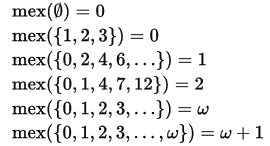
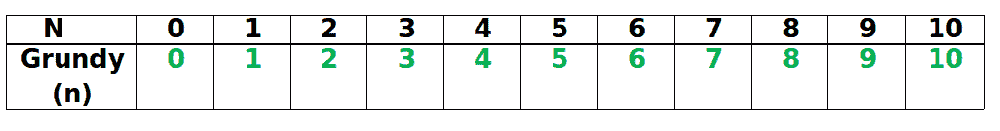
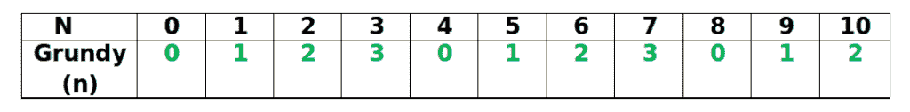
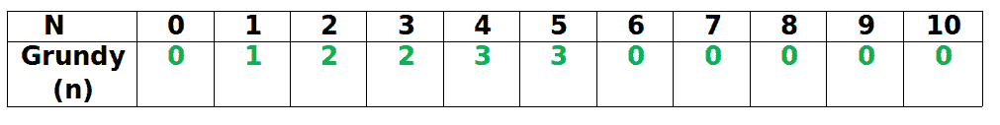

# 组合博弈论|集合 3 (Grundy 数/Numbers 和 Mex)

> 原文:[https://www . geesforgeks . org/组合-博弈论-集合-3-grundy-numbers-numbers-and-MEX/](https://www.geeksforgeeks.org/combinatorial-game-theory-set-3-grundy-numbers-numbers-and-mex/)

我们在[第 1 集](http://www.geeksforgeeks.org/introduction-to-combinatorial-game-theory/)中介绍了组合博弈论，在[第 2 集](http://www.geeksforgeeks.org/combinatorial-game-theory-set-2-game-nim/)中讨论了尼姆的博弈。
[Grundy Number](https://en.wikipedia.org/wiki/Nimber) 是定义游戏状态的数字。我们可以用 Grundy Number 来定义任何[公正游戏](http://www.geeksforgeeks.org/introduction-to-combinatorial-game-theory/)(例子:nim 游戏)。

一旦我们使用斯普拉格-格伦迪定理计算出与任何不偏不倚的游戏(不仅仅是尼姆的游戏)相关的格伦迪数，那么格伦迪数或数字就决定了如何求解该游戏。
但是在计算 Grundy 数之前，我们需要了解另一个术语——Mex。

**什么是 Mex？**
“最小排除数”又称“Mex”，是集合中不存在的最小非负数。



**如何计算 Grundy 数？**
我们使用这个定义——对于第一个玩家立即输掉的游戏，Grundy Number/ number 等于 0，对于任何其他游戏，Grundy Number 等于所有可能的下一个位置的数字的 Mex。
下面是三个示例游戏和程序，分别计算 Grundy Number 和 Mex。Grundy 数的计算基本上是通过一个称为 calculateGrundy()函数的递归函数来完成的，该函数使用 calculateMex()函数作为其子程序。

**例 1**
游戏以一堆 n 块石头开始，要移动的玩家可以拿任意正数量的石头。计算这个游戏的 Grundy 数字。最后移动的玩家获胜。哪个玩家赢了比赛？
由于如果第一个玩家有 0 块石头，他会立即输，所以 Grundy(0) = 0
如果一个玩家有 1 块石头，那么他可以拿走所有的石头并赢。因此游戏的下一个可能位置(对于另一个玩家)是(0)石头
因此，Grundy(1) = Mex(0) = 1【根据 Mex 的定义】
同样，如果一个玩家有 2 块石头，那么他只能拿 1 块石头，或者他可以拿走所有的石头并获胜。所以游戏的下一个可能位置(对于另一个玩家)分别是(1，0)个石头。
因此，Grundy(2) = Mex(0，1) = 2【根据 Mex 的定义】
同样，如果一个玩家有‘n’个石头，那么他只能拿 1 个石头，或者他可以拿 2 个石头……..或者他可以拿走所有的石头并获胜。所以游戏的下一个可能位置(对于另一个玩家)分别是(n-1，n-2，….1)个石头。
因此，Grundy(n) = Mex (0，1，2，…)。n-1)= n[根据 Mex 的定义]

我们总结了下表中从 0 到 10 的第一个 Grundy 值-



## C++

```
/* A recursive C++ program to find Grundy Number for
   a game which is like a one-pile version of Nim.
  Game Description : The game starts with a pile of n stones,
  and the player to move may take any positive number of stones. 
The last player to move wins. Which player wins the game? */
#include<bits/stdc++.h>
using namespace std;

// A Function to calculate Mex of all the values in
// that set.
int calculateMex(unordered_set<int> Set)
{
    int Mex = 0;

    while (Set.find(Mex) != Set.end())
        Mex++;

    return (Mex);
}

// A function to Compute Grundy Number of 'n'
// Only this function varies according to the game
int calculateGrundy(int n)
{
    if (n == 0)
        return (0);

    unordered_set<int> Set; // A Hash Table

    for (int i=0; i<=n-1; i++)
            Set.insert(calculateGrundy(i));

    return (calculateMex(Set));
}

// Driver program to test above functions
int main()
{
    int n = 10;
    printf("%d", calculateGrundy(n));
    return (0);
}
```

## Java 语言(一种计算机语言，尤用于创建网站)

```
// A recursive Java program to find Grundy
// Number for a game which is like a 
// one-pile version of Nim. Game 
// Description : The game starts
// with a pile of n stones, and the
// player to move may take any
// positive number of stones.  
// The last player to move wins.
// Which player wins the game? 
import java.util.*; 

class GFG{

// A Function to calculate Mex of all
// the values in that set. 
public static int calculateMex(Set<Integer> Set) 
{ 
    int Mex = 0; 

    while (Set.contains(Mex)) 
        Mex++; 

    return (Mex); 
} 

// A function to Compute Grundy Number
// of 'n'. Only this function varies
// according to the game 
public static int calculateGrundy(int n) 
{ 
    if (n == 0) 
        return (0); 

    // A Hash Table 
    Set<Integer> Set = new HashSet<Integer>();   

    for(int i = 0; i <= n - 1; i++) 
        Set.add(calculateGrundy(i)); 

    return (calculateMex(Set)); 
} 

// Driver code
public static void main(String[] args)
{
    int n = 10;

    System.out.print(calculateGrundy(n));
}
}

// This code is contributed by divyeshrabadiya07
```

## 蟒蛇 3

```
''' A recursive Python3 program to find Grundy Number for
a game which is like a one-pile version of Nim.
Game Description : The game starts with a pile of n stones,
and the player to move may take any positive number of stones. 
The last player to move wins. Which player wins the game? '''

# A Function to calculate Mex of all the values in
# that set.
def calculateMex(Set):
    Mex = 0

    while (Mex in Set):
        Mex += 1

    return (Mex)

# A function to Compute Grundy Number of 'n'
# Only this function varies according to the game
def calculateGrundy( n):
    if (n == 0):
        return (0)

    Set = set() # A Hash Table

    for i in range(n):
        Set.add(calculateGrundy(i));

    return (calculateMex(Set))

# Driver program to test above functions
n = 10;
print(calculateGrundy(n))

# This code is contributed by ANKITKUMAR34
```

## C#

```
// A recursive C# program to find Grundy
// Number for a game which is like a 
// one-pile version of Nim. Game 
// Description : The game starts 
// with a pile of n stones, and 
// the player to move may take
// any positive number of stones.
// The last player to move wins.
// Which player wins the game?
using System;
using System.Collections; 
using System.Collections.Generic; 

class GFG{

// A Function to calculate Mex of all
// the values in that set. 
static int calculateMex(HashSet<int> Set) 
{ 
    int Mex = 0; 

    while (Set.Contains(Mex)) 
        Mex++; 

    return (Mex); 
} 

// A function to Compute Grundy Number
// of 'n'. Only this function varies
// according to the game 
static int calculateGrundy(int n) 
{ 
    if (n == 0) 
        return (0); 

    // A Hash Table 
    HashSet<int> Set = new HashSet<int>(); 

    for(int i = 0; i <= n - 1; i++) 
            Set.Add(calculateGrundy(i)); 

    return (calculateMex(Set)); 
}    

// Driver code
public static void Main(string []arg)
{
    int n = 10; 

    Console.Write(calculateGrundy(n)); 
}
}

// This code is contributed by rutvik_56
```

## java 描述语言

```
<script>
// A recursive javascript program to find Grundy
// Number for a game which is like a 
// one-pile version of Nim. Game 
// Description : The game starts
// with a pile of n stones, and the
// player to move may take any
// positive number of stones.  
// The last player to move wins.
// Which player wins the game? 

    // A Function to calculate Mex of all
    // the values in that set.
    function calculateMex( Set) {
        var Mex = 0;

        while (Set.has(Mex))
            Mex++;

        return (Mex);
    }

    // A function to Compute Grundy Number
    // of 'n'. Only this function varies
    // according to the game
    function calculateGrundy(n) {
        if (n == 0)
            return (0);

        // A Hash Table
        var set = new Set();

        for (i = 0; i <= n - 1; i++)
            set.add(calculateGrundy(i));

        return (calculateMex(set));
    }

    // Driver code

        var n = 10;

        document.write(calculateGrundy(n));

// This code contributed by aashish1995
</script>
```

**输出:**

```
10
```

由于存在重叠的子问题，上述解决方案可以使用动态规划进行优化。基于动态编程的实现可以在这里找到。

**例 2**
游戏以一堆 n 块石头开始，玩家要移动的石头最多只能拿 3 块。最后移动的玩家获胜。哪个玩家赢了比赛？这个游戏是尼姆的 1 堆版本。
由于如果第一个玩家有 0 块石头，他会立即输，所以 Grundy(0) = 0
如果一个玩家有 1 块石头，那么他可以拿走所有的石头并赢。所以游戏的下一个可能位置(对于另一个玩家)是(0)个石头

因此，Grundy(1)= Mex(0)= 1[根据 Mex 的定义]
同样，如果一个玩家有 2 块石头，那么他只能拿 1 块石头，或者他可以拿 2 块石头赢。所以游戏的下一个可能位置(对于另一个玩家)分别是(1，0)个石头。
因此，Grundy(2) = Mex(0，1)= 2[根据 Mex 的定义]
类似地，Grundy(3) = Mex(0，1，2)= 3[根据 Mex 的定义]

但是 4 块石头呢？
如果玩家有 4 块石头，那么他可以拿 1 块石头，也可以拿 2 块或 3 块石头，但不能拿 4 块石头(见游戏的限制条件)。所以游戏的下一个可能位置(对于另一个玩家)分别是(3，2，1)个石头。
因此，Grundy(4) = Mex (1，2，3)= 0[根据 Mex 的定义]
所以我们可以将任意 n 的 Grundy 数> = 4 递归定义为-
Grundy(n) = Mex[Grundy (n-1)，Grundy (n-2)，Grundy (n-3)]

我们总结了下表中第一个从 0 到 10 的 Grundy 值-



## C++

```
/* A recursive C++ program to find Grundy Number for
a game which is one-pile version of Nim.
Game Description : The game starts with a pile of
n stones, and the player to move may take any
positive number of stones up to 3 only.
The last player to move wins. */
#include<bits/stdc++.h>
using namespace std;

// A Function to calculate Mex of all the values in
// that set.

// A function to Compute Grundy Number of 'n'
// Only this function varies according to the game
int calculateGrundy(int n)
{
    if (n == 0)
        return (0);
    if (n == 1)
        return (1);
    if (n == 2)
        return (2);
    if (n == 3)
        return (3);
    else
        return (n%(3+1));
}

// Driver program to test above functions
int main()
{
    int n = 10;
    printf("%d", calculateGrundy(n));
    return (0);
}
```

## Java 语言(一种计算机语言，尤用于创建网站)

```
/* A recursive Java program to find 
Grundy Number for a game which is 
one-pile version of Nim.
Game Description : The game starts with
a pile of n stones, and the player to
move may take any positive number of stones 
up to 3 only.The last player to move wins. */
import java.util.*;

class GFG
{

    // A function to Compute Grundy 
    // Number of 'n' Only this function 
    // varies according to the game
    static int calculateGrundy(int n) 
    {
        if (n == 0) 
            return 0;
        if (n == 1) 
            return 1;
        if (n == 2) 
            return 2;
        if (n == 3)
            return 3;
        else
            return (n%(3+1));
    }

    // Driver code
    public static void main(String[] args)
    {
        int n = 10;
        System.out.printf("%d", calculateGrundy(n));
    }
} 
// This code is contributed by rahulnamdevrn27
```

## 蟒蛇 3

```
# A recursive Python3 program to find Grundy Number 
# for a game which is one-pile version of Nim. 
# Game Description : The game starts with a pile 
# of n stones, and the player to move may take 
# any positive number of stones up to 3 only. 
# The last player to move wins.

# A function to Compute Grundy Number of 'n' 
# Only this function varies according to the game 
def calculateGrundy(n): 

    if 0 <= n <= 3:
        return n

    else:
        return (n%(3+1));

# Driver program to test above functions 
if __name__ == "__main__": 

    n = 10 
    print(calculateGrundy(n)) 

# This code is contributed by rahulnamdevrn27
```

## C#

```
/* A recursive Java program to find Grundy Number 
for a game which is one-pile version of Nim. 
Game Description : The game starts with a pile of 
n stones, and the player to move may take any 
positive number of stones up to 3 only.The last 
player to move wins. */
using System; 
using System.Collections.Generic;

class GFG 
{ 

    // A function to Compute Grundy Number of 
    // 'n' Only this function varies according 
    // to the game 
    static int calculateGrundy(int n) 
    { 
        if (n == 0) 
            return 0;
        if (n == 1) 
            return 1;
        if (n == 2) 
            return 2;
        if (n == 3)
            return 3;
        else
            return (n%(3+1));

    } 

    // Driver code 
    public static void Main(String[] args) 
    { 
        int n = 10; 
        Console.Write(calculateGrundy(n)); 
    } 
} 
// This code is contributed by rahulnamdevrn27
```

## java 描述语言

```
<script>

/* A recursive Javascript program to find
Grundy Number for a game which is
one-pile version of Nim.
Game Description : The game starts with
a pile of n stones, and the player to
move may take any positive number of stones
up to 3 only.The last player to move wins. */

// A function to Compute Grundy
// Number of 'n' Only this function
// varies according to the game
function calculateGrundy(n)
{
    if (n == 0)
        return 0;
    if (n == 1)
        return 1;
    if (n == 2)
        return 2;
    if (n == 3)
        return 3;
    else
        return (n % (3 + 1));
}

// Driver code
let n = 10;

document.write(calculateGrundy(n));

// This code is contributed by rag2127

</script>
```

**输出:**

```
2
```

当我们被允许拾取 k 块石头时，上述代码的一般解决方案可以在这里找到。

**例 3**
游戏以数字“-n”开始，要移动的玩家将数字“-n”除以 2、3 或 6，然后进行发言。如果该整数变为 0，则会被移除。最后移动的玩家获胜。哪个玩家赢了比赛？

我们总结了下表中从 0 到 10 的第一个 Grundy 值:



想想我们是如何生成这个表的。

## C++

```
/* A recursive C++ program to find Grundy Number for
   a game.
 Game Description:  The game starts with a number- 'n'
 and the player to move divides the number- 'n' with 2, 3
 or 6 and then takes the floor. If the integer becomes 0,
 it is removed. The last player to move wins.  */
#include<bits/stdc++.h>
using namespace std;

// A Function to calculate Mex of all the values in
// that set.
int calculateMex(unordered_set<int> Set)
{
    int Mex = 0;

    while (Set.find(Mex) != Set.end())
        Mex++;

    return (Mex);
}

// A function to Compute Grundy Number of 'n'
// Only this function varies according to the game
int calculateGrundy (int n)
{
    if (n == 0)
        return (0);

    unordered_set<int> Set; // A Hash Table

    Set.insert(calculateGrundy(n/2));
    Set.insert(calculateGrundy(n/3));
    Set.insert(calculateGrundy(n/6));

    return (calculateMex(Set));
}

// Driver program to test above functions
int main()
{
    int n = 10;
    printf("%d", calculateGrundy (n));
    return (0);
}
```

## Java 语言(一种计算机语言，尤用于创建网站)

```
/* A recursive Java program to find Grundy Number for
a game.
Game Description : The game starts with a number- 'n'
and the player to move divides the number- 'n' with 2, 3
or 6 and then takes the floor. If the integer becomes 0,
it is removed. The last player to move wins. */
import java.util.*;

class GFG 
{

    // A Function to calculate Mex of all the values in
    // that set.
    static int calculateMex(HashSet<Integer> Set) 
    {
        int Mex = 0;

        while (Set.contains(Mex)) 
        {
            Mex++;
        }

        return (Mex);
    }

    // A function to Compute Grundy Number of 'n'
    // Only this function varies according to the game
    static int calculateGrundy(int n) 
    {
        if (n == 0) 
        {
            return (0);
        }

        HashSet<Integer> Set = new HashSet<Integer>(); // A Hash Table

        Set.add(calculateGrundy(n / 2));
        Set.add(calculateGrundy(n / 3));
        Set.add(calculateGrundy(n / 6));

        return (calculateMex(Set));
    }

    // Driver code
    public static void main(String[] args) 
    {
        int n = 10;
        System.out.printf("%d", calculateGrundy(n));
    }
} 

// This code is contributed by PrinciRaj1992
```

## 蟒蛇 3

```
# A recursive Python3 program to 
# find Grundy Number for a game. 
# Game Description : The game starts with a number- 'n' 
# and the player to move divides the number- 'n' with 2, 3 
# or 6 and then take the floor. If the integer becomes 0, 
# it is removed. The last player to move wins.

# A Function to calculate Mex 
# of all the values in that set. 
def calculateMex(Set): 

    Mex = 0 
    while Mex in Set: 
        Mex += 1

    return Mex 

# A function to Compute Grundy Number of 'n' 
# Only this function varies according to the game 
def calculateGrundy(n): 

    if n == 0:
        return 0 

    Set = set() # A Hash Table 

    Set.add(calculateGrundy(n // 2)) 
    Set.add(calculateGrundy(n // 3)) 
    Set.add(calculateGrundy(n // 6)) 

    return (calculateMex(Set)) 

# Driver program to test above functions 
if __name__ == "__main__": 

    n = 10 
    print(calculateGrundy(n)) 

# This code is contributed by Rituraj Jain
```

## C#

```
/* A recursive C# program to find Grundy Number for 
a game. 
Game Description: The game starts with a number- 'n' 
and the player to move divides the number- 'n' with 2, 3 
or 6 and then takes the floor. If the integer becomes 0, 
it is removed. The last player to move wins. */
using System;
using System.Collections.Generic;

class GFG 
{ 

    // A Function to calculate Mex of  
    // all the values in that set. 
    static int calculateMex(HashSet<int> Set) 
    { 
        int Mex = 0; 

        while (Set.Contains(Mex)) 
        { 
            Mex++; 
        } 

        return (Mex); 
    } 

    // A function to Compute Grundy Number of 'n' 
    // Only this function varies according to the game 
    static int calculateGrundy(int n) 
    { 
        if (n == 0) 
        { 
            return (0); 
        } 

        // A Hash Table 
        HashSet<int> Set = new HashSet<int>(); 

        Set.Add(calculateGrundy(n / 2)); 
        Set.Add(calculateGrundy(n / 3)); 
        Set.Add(calculateGrundy(n / 6)); 

        return (calculateMex(Set)); 
    } 

    // Driver code 
    public static void Main() 
    { 
        int n = 10; 
        Console.WriteLine(calculateGrundy(n)); 
    } 
} 

// This code is contributed by PrinciRaj1992
```

## java 描述语言

```
<script>

/* A recursive Javascript program to find 
Grundy Number for a game.
Game Description : The game starts with a 
number- 'n' and the player to move divides 
the number- 'n' with 2, 3 or 6 and then
takes the floor. If the integer becomes 0,
it is removed. The last player to move wins. */

// A Function to calculate Mex of all
// the values in that set.
function calculateMex(set)
{
    let Mex = 0;

    while (set.has(Mex))
    {
        Mex++;
    }
    return (Mex);
}

// A function to Compute Grundy Number 
// of 'n'. Only this function varies
// according to the game
function calculateGrundy(n)
{
    if (n == 0)
    {
        return (0);
    }

    // A Hash Table
    let set = new Set(); 

    set.add(calculateGrundy(Math.floor(n / 2)));
    set.add(calculateGrundy(Math.floor(n / 3)));
    set.add(calculateGrundy(Math.floor(n / 6)));

    return(calculateMex(set));
}

// Driver code
let n = 10;

document.write(calculateGrundy(n));

// This code is contributed by avanitrachhadiya2155

</script>
```

**输出:**

```
0
```

由于存在重叠的子问题，上述解决方案可以使用动态规划进行优化。基于动态编程的实现可以在这里找到。

**参考文献-**
[https://en . Wikipedia . org/wiki/Mex _(数学)](https://en.wikipedia.org/wiki/Mex_(mathematics))
[https://en.wikipedia.org/wiki/Number](https://en.wikipedia.org/wiki/Nimber)
在下一篇帖子中，我们将讨论使用 Grundy Numbers 或 Numbers 的公正游戏解决方案。
本文由 **Rachit Belwariar** 供稿。如果你喜欢极客博客并想投稿，你也可以写一篇文章并把你的文章邮寄到 review-team@geeksforgeeks.org。看到你的文章出现在极客博客主页上，帮助其他极客。
发现有不正确的地方请写评论，或者想分享更多以上讨论话题的信息