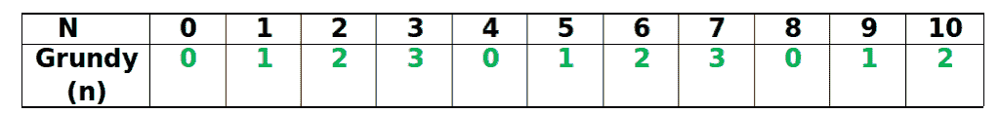

# 组合博弈论|集合 4(斯普拉格-格兰迪定理)

> 原文:[https://www . geesforgeks . org/组合-博弈论-集合-4-Sprague-grundy-定理/](https://www.geeksforgeeks.org/combinatorial-game-theory-set-4-sprague-grundy-theorem/)

先决条件:[Grundy Numbers/Numbers and Mex](https://www.geeksforgeeks.org/combinatorial-game-theory-set-3-grundy-numbersnimbers-and-mex/)
我们已经在 Set 2(https://www . geeksforgeeks . org/组合-博弈论-set-2-game-nim/)中看到，我们可以在 nim 的一场游戏中找到谁赢了，而无需实际玩游戏。
假设我们稍微改变一下经典的 Nim 游戏。这一次每个玩家只能移除 1、2 或 3 块石头(不像尼姆的经典游戏那样移除任何数量的石头)。我们能预测谁会赢吗？
是的，我们可以用斯普拉格-格伦迪定理来预测获胜者。

**什么是 Sprague-Grundy 定理？**
假设有一个由 N 个子游戏和两个玩家 A 和 B 组成的复合游戏(不止一个子游戏)，那么 Sprague-Grundy 定理说，如果 A 和 B 都玩得最优(即不犯任何错误)，那么如果游戏开始时每个子游戏中位置的 Grundy 数的 XOR 为非零，那么先开始的玩家就保证赢。否则，如果 XOR 评估为零，那么玩家 A 无论如何肯定会输。

**如何应用 Sprague Grundy 定理？**
我们可以在任何[不偏不倚的游戏](https://www.geeksforgeeks.org/introduction-to-combinatorial-game-theory/)中应用斯普拉格-格伦迪定理并求解。基本步骤如下:

1.  把复合游戏分成子游戏。
2.  然后对于每个子游戏，计算那个位置的 Grundy 数。
3.  然后计算所有计算出的格兰迪数的异或。
4.  如果异或值为非零，那么将要进行回合的玩家(第一个玩家)将会赢，否则无论如何他都注定会输。

**示例游戏:**游戏从 3 堆石头开始，每堆有 3、4 和 5 块石头，玩家可以从任何一堆石头中取出任意正数量的最多 3 块石头[前提是该堆有那么多石头]。最后移动的玩家获胜。假设两个玩家都玩得最好，哪个玩家会赢？

**如何应用 Sprague-Grundy 定理判断谁会赢？**
正如，我们可以看到这个游戏本身就是由几个子游戏组成的。
**第一步:**子赛可考虑每一桩。
**第二步:**我们从下表中看到

```
Grundy(3) = 3
Grundy(4) = 0 
Grundy(5) = 1 
```



我们已经在[之前的](https://www.geeksforgeeks.org/combinatorial-game-theory-set-3-grundy-numbersnimbers-and-mex/)文章中看到了如何计算这个游戏的 Grundy 数字。
**第三步:**3，0，1 = 2 的异或
**第四步:**既然异或是非零数，那么我们可以说第一个玩家会赢。

下面是实现以上 4 个步骤的程序。

## C++

```
/*  Game Description-
 "A game is played between two players and there are N piles
 of stones such that each pile has certain number of stones.
 On his/her turn, a player selects a pile and can take any
 non-zero number of stones upto 3 (i.e- 1,2,3)
 The player who cannot move is considered to lose the game
 (i.e., one who take the last stone is the winner).
 Can you find which player wins the game if both players play
 optimally (they don't make any mistake)? "

 A Dynamic Programming approach to calculate Grundy Number
 and Mex and find the Winner using Sprague - Grundy Theorem. */

#include<bits/stdc++.h>
using namespace std;

/* piles[] -> Array having the initial count of stones/coins
            in each piles before the game has started.
   n       -> Number of piles

   Grundy[] -> Array having the Grundy Number corresponding to
             the initial position of each piles in the game

   The piles[] and Grundy[] are having 0-based indexing*/

#define PLAYER1 1
#define PLAYER2 2

// A Function to calculate Mex of all the values in that set
int calculateMex(unordered_set<int> Set)
{
    int Mex = 0;

    while (Set.find(Mex) != Set.end())
        Mex++;

    return (Mex);
}

// A function to Compute Grundy Number of 'n'
int calculateGrundy(int n, int Grundy[])
{
    Grundy[0] = 0;
    Grundy[1] = 1;
    Grundy[2] = 2;
    Grundy[3] = 3;

    if (Grundy[n] != -1)
        return (Grundy[n]);

    unordered_set<int> Set; // A Hash Table

    for (int i=1; i<=3; i++)
            Set.insert (calculateGrundy (n-i, Grundy));

    // Store the result
    Grundy[n] = calculateMex (Set);

    return (Grundy[n]);
}

// A function to declare the winner of the game
void declareWinner(int whoseTurn, int piles[],
                    int Grundy[], int n)
{
    int xorValue = Grundy[piles[0]];

    for (int i=1; i<=n-1; i++)
        xorValue = xorValue ^ Grundy[piles[i]];

    if (xorValue != 0)
    {
        if (whoseTurn == PLAYER1)
            printf("Player 1 will win\n");
        else
            printf("Player 2 will win\n");
    }
    else
    {
        if (whoseTurn == PLAYER1)
            printf("Player 2 will win\n");
        else
            printf("Player 1 will win\n");
    }

    return;
}

// Driver program to test above functions
int main()
{
    // Test Case 1
    int piles[] = {3, 4, 5};
    int n = sizeof(piles)/sizeof(piles[0]);

    // Find the maximum element
    int maximum = *max_element(piles, piles + n);

    // An array to cache the sub-problems so that
    // re-computation of same sub-problems is avoided
    int Grundy[maximum + 1];
    memset(Grundy, -1, sizeof (Grundy));

    // Calculate Grundy Value of piles[i] and store it
    for (int i=0; i<=n-1; i++)
        calculateGrundy(piles[i], Grundy);

    declareWinner(PLAYER1, piles, Grundy, n);

    /* Test Case 2
    int piles[] = {3, 8, 2};
    int n = sizeof(piles)/sizeof(piles[0]);

    int maximum = *max_element (piles, piles + n);

    // An array to cache the sub-problems so that
    // re-computation of same sub-problems is avoided
    int Grundy [maximum + 1];
    memset(Grundy, -1, sizeof (Grundy));

    // Calculate Grundy Value of piles[i] and store it
    for (int i=0; i<=n-1; i++)
        calculateGrundy(piles[i], Grundy);

    declareWinner(PLAYER2, piles, Grundy, n);   */

    return (0);
}
```

## Java 语言(一种计算机语言，尤用于创建网站)

```
import java.util.*;

/* Game Description-
"A game is played between two players and there are N piles
of stones such that each pile has certain number of stones.
On his/her turn, a player selects a pile and can take any
non-zero number of stones upto 3 (i.e- 1,2,3)
The player who cannot move is considered to lose the game
(i.e., one who take the last stone is the winner).
Can you find which player wins the game if both players play
optimally (they don't make any mistake)? "

A Dynamic Programming approach to calculate Grundy Number
and Mex and find the Winner using Sprague - Grundy Theorem. */

class GFG {

/* piles[] -> Array having the initial count of stones/coins
            in each piles before the game has started.
n     -> Number of piles

Grundy[] -> Array having the Grundy Number corresponding to
            the initial position of each piles in the game

The piles[] and Grundy[] are having 0-based indexing*/

static int PLAYER1 = 1;
static int PLAYER2 = 2;

// A Function to calculate Mex of all the values in that set
static int calculateMex(HashSet<Integer> Set)
{
    int Mex = 0;

    while (Set.contains(Mex))
        Mex++;

    return (Mex);
}

// A function to Compute Grundy Number of 'n'
static int calculateGrundy(int n, int Grundy[])
{
    Grundy[0] = 0;
    Grundy[1] = 1;
    Grundy[2] = 2;
    Grundy[3] = 3;

    if (Grundy[n] != -1)
        return (Grundy[n]);

    // A Hash Table
    HashSet<Integer> Set = new HashSet<Integer>();

    for (int i = 1; i <= 3; i++)
            Set.add(calculateGrundy (n - i, Grundy));

    // Store the result
    Grundy[n] = calculateMex (Set);

    return (Grundy[n]);
}

// A function to declare the winner of the game
static void declareWinner(int whoseTurn, int piles[],
                    int Grundy[], int n)
{
    int xorValue = Grundy[piles[0]];

    for (int i = 1; i <= n - 1; i++)
        xorValue = xorValue ^ Grundy[piles[i]];

    if (xorValue != 0)
    {
        if (whoseTurn == PLAYER1)
            System.out.printf("Player 1 will win\n");
        else
            System.out.printf("Player 2 will win\n");
    }
    else
    {
        if (whoseTurn == PLAYER1)
            System.out.printf("Player 2 will win\n");
        else
            System.out.printf("Player 1 will win\n");
    }

    return;
}

// Driver code
public static void main(String[] args)
{

    // Test Case 1
    int piles[] = {3, 4, 5};
    int n = piles.length;

    // Find the maximum element
    int maximum = Arrays.stream(piles).max().getAsInt();

    // An array to cache the sub-problems so that
    // re-computation of same sub-problems is avoided
    int Grundy[] = new int[maximum + 1];
    Arrays.fill(Grundy, -1);

    // Calculate Grundy Value of piles[i] and store it
    for (int i = 0; i <= n - 1; i++)
        calculateGrundy(piles[i], Grundy);

    declareWinner(PLAYER1, piles, Grundy, n);

    /* Test Case 2
    int piles[] = {3, 8, 2};
    int n = sizeof(piles)/sizeof(piles[0]);

    int maximum = *max_element (piles, piles + n);

    // An array to cache the sub-problems so that
    // re-computation of same sub-problems is avoided
    int Grundy [maximum + 1];
    memset(Grundy, -1, sizeof (Grundy));

    // Calculate Grundy Value of piles[i] and store it
    for (int i=0; i<=n-1; i++)
        calculateGrundy(piles[i], Grundy);

    declareWinner(PLAYER2, piles, Grundy, n); */

    }
}

// This code is contributed by PrinciRaj1992
```

## 蟒蛇 3

```
'''  Game Description-
 "A game is played between two players and there are N piles
 of stones such that each pile has certain number of stones.
 On his/her turn, a player selects a pile and can take any
 non-zero number of stones upto 3 (i.e- 1,2,3)
 The player who cannot move is considered to lose the game
 (i.e., one who take the last stone is the winner).
 Can you find which player wins the game if both players play
 optimally (they don't make any mistake)? "

 A Dynamic Programming approach to calculate Grundy Number
 and Mex and find the Winner using Sprague - Grundy Theorem.

     piles[] -> Array having the initial count of stones/coins
            in each piles before the game has started.
   n       -> Number of piles

   Grundy[] -> Array having the Grundy Number corresponding to
             the initial position of each piles in the game

   The piles[] and Grundy[] are having 0-based indexing'''

PLAYER1 = 1
PLAYER2 = 2  

# A Function to calculate Mex of all
# the values in that set
def calculateMex(Set):

    Mex = 0;

    while (Mex in Set):
        Mex += 1

    return (Mex)

# A function to Compute Grundy Number of 'n'
def calculateGrundy(n, Grundy):

    Grundy[0] = 0
    Grundy[1] = 1
    Grundy[2] = 2
    Grundy[3] = 3

    if (Grundy[n] != -1):
        return (Grundy[n])

    # A Hash Table
    Set = set()

    for i in range(1, 4):
        Set.add(calculateGrundy(n - i,
                                Grundy))

    # Store the result
    Grundy[n] = calculateMex(Set)

    return (Grundy[n])

# A function to declare the winner of the game
def declareWinner(whoseTurn, piles, Grundy, n):

    xorValue = Grundy[piles[0]];

    for i in range(1, n):
        xorValue = (xorValue ^
                    Grundy[piles[i]])

    if (xorValue != 0):

        if (whoseTurn == PLAYER1):
            print("Player 1 will win\n");
        else:
            print("Player 2 will win\n");
    else:

        if (whoseTurn == PLAYER1):
            print("Player 2 will win\n");
        else:
            print("Player 1 will win\n");

# Driver code
if __name__=="__main__":

    # Test Case 1
    piles = [ 3, 4, 5 ]
    n = len(piles)

    # Find the maximum element
    maximum = max(piles)

    # An array to cache the sub-problems so that
    # re-computation of same sub-problems is avoided
    Grundy = [-1 for i in range(maximum + 1)];

    # Calculate Grundy Value of piles[i] and store it
    for i in range(n):
        calculateGrundy(piles[i], Grundy);

    declareWinner(PLAYER1, piles, Grundy, n);

    ''' Test Case 2
    int piles[] = {3, 8, 2};
    int n = sizeof(piles)/sizeof(piles[0]);

    int maximum = *max_element (piles, piles + n);

    // An array to cache the sub-problems so that
    // re-computation of same sub-problems is avoided
    int Grundy [maximum + 1];
    memset(Grundy, -1, sizeof (Grundy));

    // Calculate Grundy Value of piles[i] and store it
    for (int i=0; i<=n-1; i++)
        calculateGrundy(piles[i], Grundy);

    declareWinner(PLAYER2, piles, Grundy, n);   '''

# This code is contributed by rutvik_56
```

## C#

```
using System;
using System.Linq;
using System.Collections.Generic;

/* Game Description-
"A game is played between two players and there are N piles
of stones such that each pile has certain number of stones.
On his/her turn, a player selects a pile and can take any
non-zero number of stones upto 3 (i.e- 1,2,3)
The player who cannot move is considered to lose the game
(i.e., one who take the last stone is the winner).
Can you find which player wins the game if both players play
optimally (they don't make any mistake)? "

A Dynamic Programming approach to calculate Grundy Number
and Mex and find the Winner using Sprague - Grundy Theorem. */

class GFG
{

/* piles[] -> Array having the initial count of stones/coins
            in each piles before the game has started.
n -> Number of piles

Grundy[] -> Array having the Grundy Number corresponding to
            the initial position of each piles in the game

The piles[] and Grundy[] are having 0-based indexing*/

static int PLAYER1 = 1;
//static int PLAYER2 = 2;

// A Function to calculate Mex of all the values in that set
static int calculateMex(HashSet<int> Set)
{
    int Mex = 0;

    while (Set.Contains(Mex))
        Mex++;

    return (Mex);
}

// A function to Compute Grundy Number of 'n'
static int calculateGrundy(int n, int []Grundy)
{
    Grundy[0] = 0;
    Grundy[1] = 1;
    Grundy[2] = 2;
    Grundy[3] = 3;

    if (Grundy[n] != -1)
        return (Grundy[n]);

    // A Hash Table
    HashSet<int> Set = new HashSet<int>();

    for (int i = 1; i <= 3; i++)
            Set.Add(calculateGrundy (n - i, Grundy));

    // Store the result
    Grundy[n] = calculateMex (Set);

    return (Grundy[n]);
}

// A function to declare the winner of the game
static void declareWinner(int whoseTurn, int []piles,
                    int []Grundy, int n)
{
    int xorValue = Grundy[piles[0]];

    for (int i = 1; i <= n - 1; i++)
        xorValue = xorValue ^ Grundy[piles[i]];

    if (xorValue != 0)
    {
        if (whoseTurn == PLAYER1)
            Console.Write("Player 1 will win\n");
        else
            Console.Write("Player 2 will win\n");
    }
    else
    {
        if (whoseTurn == PLAYER1)
            Console.Write("Player 2 will win\n");
        else
            Console.Write("Player 1 will win\n");
    }

    return;
}

// Driver code
static void Main()
{

    // Test Case 1
    int []piles = {3, 4, 5};
    int n = piles.Length;

    // Find the maximum element
    int maximum = piles.Max();

    // An array to cache the sub-problems so that
    // re-computation of same sub-problems is avoided
    int []Grundy = new int[maximum + 1];
    Array.Fill(Grundy, -1);

    // Calculate Grundy Value of piles[i] and store it
    for (int i = 0; i <= n - 1; i++)
        calculateGrundy(piles[i], Grundy);

    declareWinner(PLAYER1, piles, Grundy, n);

    /* Test Case 2
    int piles[] = {3, 8, 2};
    int n = sizeof(piles)/sizeof(piles[0]);

    int maximum = *max_element (piles, piles + n);

    // An array to cache the sub-problems so that
    // re-computation of same sub-problems is avoided
    int Grundy [maximum + 1];
    memset(Grundy, -1, sizeof (Grundy));

    // Calculate Grundy Value of piles[i] and store it
    for (int i=0; i<=n-1; i++)
        calculateGrundy(piles[i], Grundy);

    declareWinner(PLAYER2, piles, Grundy, n); */

    }
}

// This code is contributed by mits
```

## java 描述语言

```
<script>

/* Game Description-
"A game is played between two players and there are N piles
of stones such that each pile has certain number of stones.
On his/her turn, a player selects a pile and can take any
non-zero number of stones upto 3 (i.e- 1,2,3)
The player who cannot move is considered to lose the game
(i.e., one who take the last stone is the winner).
Can you find which player wins the game if both players play
optimally (they don't make any mistake)? "

A Dynamic Programming approach to calculate Grundy Number
and Mex and find the Winner using Sprague - Grundy Theorem. */

/* piles[] -> Array having the initial count of stones/coins
            in each piles before the game has started.
n     -> Number of piles

Grundy[] -> Array having the Grundy Number corresponding to
            the initial position of each piles in the game

The piles[] and Grundy[] are having 0-based indexing*/
let PLAYER1 = 1;
let PLAYER2 = 2;

// A Function to calculate Mex of all the values in that set
function calculateMex(Set)
{
    let Mex = 0;

    while (Set.has(Mex))
        Mex++;

    return (Mex);
}

// A function to Compute Grundy Number of 'n'
function calculateGrundy(n,Grundy)
{
    Grundy[0] = 0;
    Grundy[1] = 1;
    Grundy[2] = 2;
    Grundy[3] = 3;

    if (Grundy[n] != -1)
        return (Grundy[n]);

    // A Hash Table
    let Set = new Set();

    for (let i = 1; i <= 3; i++)
            Set.add(calculateGrundy (n - i, Grundy));

    // Store the result
    Grundy[n] = calculateMex (Set);

    return (Grundy[n]);
}

// A function to declare the winner of the game
function declareWinner(whoseTurn,piles,Grundy,n)
{
    let xorValue = Grundy[piles[0]];

    for (let i = 1; i <= n - 1; i++)
        xorValue = xorValue ^ Grundy[piles[i]];

    if (xorValue != 0)
    {
        if (whoseTurn == PLAYER1)
            document.write("Player 1 will win<br>");
        else
            document.write("Player 2 will win<br>");
    }
    else
    {
        if (whoseTurn == PLAYER1)
            document.write("Player 2 will win<br>");
        else
            document.write("Player 1 will win<br>");
    }

    return;
}

// Driver code

// Test Case 1
    let piles = [3, 4, 5];
    let n = piles.length;

    // Find the maximum element
    let maximum = Math.max(...piles)

    // An array to cache the sub-problems so that
    // re-computation of same sub-problems is avoided
    let Grundy = new Array(maximum + 1);
    for(let i=0;i<maximum+1;i++)
        Grundy[i]=0;

    // Calculate Grundy Value of piles[i] and store it
    for (let i = 0; i <= n - 1; i++)
        calculateGrundy(piles[i], Grundy);

    declareWinner(PLAYER1, piles, Grundy, n);

    /* Test Case 2
    int piles[] = {3, 8, 2};
    int n = sizeof(piles)/sizeof(piles[0]);

    int maximum = *max_element (piles, piles + n);

    // An array to cache the sub-problems so that
    // re-computation of same sub-problems is avoided
    int Grundy [maximum + 1];
    memset(Grundy, -1, sizeof (Grundy));

    // Calculate Grundy Value of piles[i] and store it
    for (int i=0; i<=n-1; i++)
        calculateGrundy(piles[i], Grundy);

    declareWinner(PLAYER2, piles, Grundy, n); */

// This code is contributed by avanitrachhadiya2155
</script>
```

**输出:**

```
Player 1 will win
```

**参考文献:**
[https://en . Wikipedia . org/wiki/Sprague % E2 % 80% 93 grundy _ 定理](https://en.wikipedia.org/wiki/Sprague%E2%80%93Grundy_theorem)

**给读者的练习:**考虑下面的游戏。
“一个游戏由两个玩家用 N 个整数 A1，A2，..，AN。轮到他/她时，玩家选择一个整数，除以 2、3 或 6，然后发言。如果该整数变为 0，则会被移除。最后移动的玩家获胜。如果两个玩家都玩得最好，哪个玩家会赢？”
提示:参见[上一篇](https://www.geeksforgeeks.org/combinatorial-game-theory-set-3-grundy-numbersnimbers-and-mex/)的示例 3。

本文由**拉希特·贝尔瓦亚尔**供稿。如果你喜欢极客博客并想投稿，你也可以写一篇文章并把你的文章邮寄到 review-team@geeksforgeeks.org。看到你的文章出现在极客博客主页上，帮助其他极客。
如发现任何不正确的地方，请写评论，或者您想分享更多关于上述话题的信息