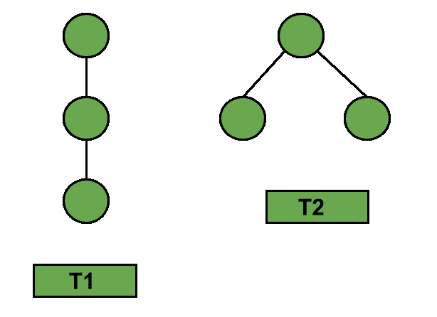
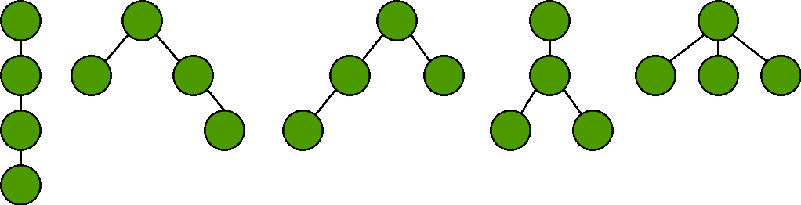
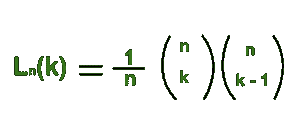
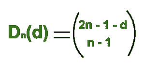
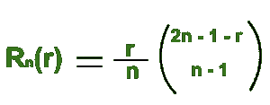

# 有序树上的组合学

> 原文:[https://www.geeksforgeeks.org/combinatorics-ordered-trees/](https://www.geeksforgeeks.org/combinatorics-ordered-trees/)

**有序树**是一种定向树，其中节点的子节点以某种方式有序。它是一棵有根的树，其中为每个顶点的子节点指定了顺序。这被称为“平面树”，因为子树的排序相当于树在平面中的嵌入，根在顶部，每个顶点的子树低于该顶点。
有序树可以进一步指定为标记有序树和未标记有序树。

**先决条件:**T2】加泰罗尼亚数字 | [二项式系数](https://www.geeksforgeeks.org/dynamic-programming-set-9-binomial-coefficient/)。

**标记有序树:**标记树是指每个顶点被赋予从 1 到 n 的唯一数字的树。


如果 T1 和 T2 是有序树。然后，T1！= T2 else T1 = T2。

**未标记有序树:**未标记树是每个顶点都没有标记的树。下面给出了可能的具有 3 个顶点的无标签有序树。



具有 n 个节点的未标记有序树的总数等于第(n–1)个[加泰罗尼亚数](https://www.geeksforgeeks.org/program-nth-catalan-number/)。
下面给出了可能的具有 4 个节点的未标记有序树。该图将作为接下来几个结果的参考示例。



**1。正好有 k 片叶子的树的数量。**
让我们考虑一下我们有‘n’个边。然后，具有‘k’叶的全部可能有序树的解由下式给出:



**2。这些树中 d 度的节点总数。**
让我们考虑一下我们有‘n’个边。然后，具有度数‘d’的节点总数的解由下式给出:



**3。根的度数为 r 的树的数量**
让我们考虑我们有‘n’条边。然后，根具有度“r”的全部可能有序树的解由下式给出:



**下面是使用二项式系数实现上述组合函数:**

## C++

```
// C++ code to find the number of ordered trees
// with given number of edges and leaves
#include <bits/stdc++.h>
using namespace std;

// Function returns value of
// Binomial Coefficient C(n, k)
int binomialCoeff(int n, int k)
{
    int C[n + 1][k + 1] = { 0 };
    int i, j;

    // Calculate value of Binomial
    // Coefficient in bottom up manner
    for (i = 0; i <= n; i++) {
        for (j = 0; j <= min(i, k); j++) {

            // Base Cases
            if (j == 0 || j == i)
                C[i][j] = 1;

            // Calculate value using
            // previously stored values
            else
                C[i][j] = C[i - 1][j - 1] + C[i - 1][j];
        }
    }

    return C[n][k];
}

// Function to calculate the number
// of trees with exactly k leaves.
int k_Leaves(int n, int k)
{
    int ans = (binomialCoeff(n, k) * binomialCoeff(n, k - 1)) / n;
    cout << "Number of trees having 4 edges"
         << " and exactly 2 leaves : " << ans << endl;
    return 0;
}

// Function to calculate total number of
// nodes of degree d in these trees.
int numberOfNodes(int n, int d)
{
    int ans = binomialCoeff(2 * n - 1 - d, n - 1);
    cout << "Number of nodes of degree 1 in"
         << " a tree having 4 edges : " << ans << endl;
    return 0;
}

// Function to calculate the number of
// trees in which the root has degree r.
int rootDegreeR(int n, int r)
{
    int ans = r * binomialCoeff(2 * n - 1 - r, n - 1);
    ans = ans / n;
    cout << "Number of trees having 4 edges"
         << " where root has degree 2 : " << ans << endl;
    return 0;
}

// Driver program to test above functions
int main()
{
    // Number of trees having 3
    // edges and exactly 2 leaves
    k_Leaves(3, 2);

    // Number of nodes of degree
    // 3 in a tree having 4 edges
    numberOfNodes(3, 1);

    // Number of trees having 3
    // edges where root has degree 2
    rootDegreeR(3, 2);

    return 0;
}
```

## Java 语言(一种计算机语言，尤用于创建网站)

```
// java code to find the number of ordered
// trees with given number of edges and
// leaves
import java.io.*;

class GFG {

    // Function returns value of
    // Binomial Coefficient C(n, k)
    static int binomialCoeff(int n, int k)
    {
        int [][]C = new int[n+1][k+1];
        int i, j;

        // Calculate value of Binomial
        // Coefficient in bottom up manner
        for (i = 0; i <= n; i++) {
            for (j = 0; j <= Math.min(i, k); j++)
            {

                // Base Cases
                if (j == 0 || j == i)
                    C[i][j] = 1;

                // Calculate value using
                // previously stored values
                else
                    C[i][j] = C[i - 1][j - 1]
                               + C[i - 1][j];
            }
        }

        return C[n][k];
    }

    // Function to calculate the number
    // of trees with exactly k leaves.
    static int k_Leaves(int n, int k)
    {
        int ans = (binomialCoeff(n, k) *
                binomialCoeff(n, k - 1)) / n;
        System.out.println( "Number of trees "
             + "having 4 edges and exactly 2 "
                        + "leaves : " + ans) ;
        return 0;
    }

    // Function to calculate total number of
    // nodes of degree d in these trees.
    static int numberOfNodes(int n, int d)
    {
        int ans = binomialCoeff(2 * n - 1 - d,
                                       n - 1);
        System.out.println("Number of nodes "
           +"of degree 1 in a tree having 4 "
                          + "edges : " + ans);
        return 0;
    }

    // Function to calculate the number of
    // trees in which the root has degree r.
    static int rootDegreeR(int n, int r)
    {
        int ans = r * binomialCoeff(2 * n
                              - 1 - r, n - 1);
        ans = ans / n;
        System.out.println("Number of trees "
            + "having 4 edges where root has"
                      + " degree 2 : " + ans);
        return 0;
    }

    // Driver program to test above functions

    public static void main (String[] args)
    {

        // Number of trees having 3
        // edges and exactly 2 leaves
        k_Leaves(3, 2);

        // Number of nodes of degree
        // 3 in a tree having 4 edges
        numberOfNodes(3, 1);

        // Number of trees having 3
        // edges where root has degree 2
        rootDegreeR(3, 2);
    }
}

// This code is contributed by anuj_67.
```

## 蟒蛇 3

```
# Python3 code to find the number of ordered
# trees with given number of edges and
# leaves

# Function returns value of
# Binomial Coefficient C(n, k)
def binomialCoeff(n, k):

    C = [[0 for i in range(k + 1)]
            for j in range(n + 1)]

    # Calculate value of Binomial
    # Coefficient in bottom up manner
    for i in range(n + 1):
        for j in range(min(i, k) + 1):

            # Base Cases
            if (j == 0 or j == i):
                C[i][j] = 1

            # Calculate value using
            # previously stored values
            else:
                C[i][j] = (C[i - 1][j - 1] +
                           C[i - 1][j])

    return C[n][k]

# Function to calculate the number
# of trees with exactly k leaves.
def k_Leaves(n, k):

    ans = ((binomialCoeff(n, k) *
            binomialCoeff(n, k - 1)) // n)
    print("Number of trees ",
          "having 4 edges and exactly 2 ",
          "leaves : ", ans)

# Function to calculate total number of
# Nodes of degree d in these trees.
def numberOfNodes(n, d):

    ans = binomialCoeff(2 * n - 1 - d, n - 1)
    print("Number of Nodes ",
          "of degree 1 in a tree having 4 ",
          "edges : ", ans)

# Function to calculate the number of
# trees in which the root has degree r.
def rootDegreeR(n, r):

    ans = r * binomialCoeff(2 * n - 1 - r, n - 1)
    ans = ans // n

    print("Number of trees ",
          "having 4 edges where root has ",
          "degree 2 : ", ans)

# Driver code
if __name__ == '__main__':

    # Number of trees having 3
    # edges and exactly 2 leaves
    k_Leaves(3, 2)

    # Number of Nodes of degree
    # 3 in a tree having 4 edges
    numberOfNodes(3, 1)

    # Number of trees having 3
    # edges where root has degree 2
    rootDegreeR(3, 2)

# This code is contributed by aashish1995
```

## C#

```
// C# code to find the number of ordered
// trees with given number of edges and
// leaves
using System;

class GFG {

    // Function returns value of
    // Binomial Coefficient C(n, k)
    static int binomialCoeff(int n, int k)
    {
        int [,]C = new int[n+1,k+1];
        int i, j;

        // Calculate value of Binomial
        // Coefficient in bottom up manner
        for (i = 0; i <= n; i++) {
            for (j = 0; j <= Math.Min(i, k); j++)
            {

                // Base Cases
                if (j == 0 || j == i)
                    C[i,j] = 1;

                // Calculate value using
                // previously stored values
                else
                    C[i,j] = C[i - 1,j - 1]
                            + C[i - 1,j];
            }
        }

        return C[n,k];
    }

    // Function to calculate the number
    // of trees with exactly k leaves.
    static int k_Leaves(int n, int k)
    {
        int ans = (binomialCoeff(n, k) *
                binomialCoeff(n, k - 1)) / n;
        Console.WriteLine( "Number of trees "
            + "having 4 edges and exactly 2 "
                        + "leaves : " + ans) ;
        return 0;
    }

    // Function to calculate total number of
    // nodes of degree d in these trees.
    static int numberOfNodes(int n, int d)
    {
        int ans = binomialCoeff(2 * n - 1 - d,
                                    n - 1);
        Console.WriteLine("Number of nodes "
        +"of degree 1 in a tree having 4 "
                        + "edges : " + ans);
        return 0;
    }

    // Function to calculate the number of
    // trees in which the root has degree r.
    static int rootDegreeR(int n, int r)
    {
        int ans = r * binomialCoeff(2 * n
                            - 1 - r, n - 1);
        ans = ans / n;
        Console.WriteLine("Number of trees "
            + "having 4 edges where root has"
                    + " degree 2 : " + ans);
        return 0;
    }

    // Driver program to test above functions

    public static void Main ()
    {

        // Number of trees having 3
        // edges and exactly 2 leaves
        k_Leaves(3, 2);

        // Number of nodes of degree
        // 3 in a tree having 4 edges
        numberOfNodes(3, 1);

        // Number of trees having 3
        // edges where root has degree 2
        rootDegreeR(3, 2);
    }
}

// This code is contributed by anuj_67.
```

## 服务器端编程语言（Professional Hypertext Preprocessor 的缩写）

```
<?php
// PHP code to find the number of ordered
// trees with given number of edges and
// leaves

// Function returns value of Binomial
// Coefficient C(n, k)
function binomialCoeff($n, $k)
{
    $C = array(array());
    $i; $j;

    // Calculate value of Binomial
    // Coefficient in bottom up manner
    for ($i = 0; $i <= $n; $i++) {
        for ($j = 0; $j <= min($i, $k); $j++)
        {

            // Base Cases
            if ($j == 0 or $j == $i)
                $C[$i][$j] = 1;

            // Calculate value using
            // previously stored values
            else
                $C[$i][$j] = $C[$i - 1][$j - 1]
                              + $C[$i - 1][$j];
        }
    }

    return $C[$n][$k];
}

// Function to calculate the number
// of trees with exactly k leaves.
function k_Leaves( $n, $k)
{
    $ans = (binomialCoeff($n, $k) *
               binomialCoeff($n, $k - 1)) / $n;

    echo "Number of trees having 4 edges and ",
          "exactly 2 leaves : " , $ans ,"\n";

    return 0;
}

// Function to calculate total number of
// nodes of degree d in these trees.
function numberOfNodes( $n, $d)
{
    $ans = binomialCoeff(2 * $n - 1 - $d, $n - 1);
    echo "Number of nodes of degree 1 in"
        , " a tree having 4 edges : " , $ans,"\n" ;
    return 0;
}

// Function to calculate the number of
// trees in which the root has degree r.
function rootDegreeR( $n, $r)
{
    $ans = $r * binomialCoeff(2 * $n - 1 - $r,
                                         $n - 1);
    $ans = $ans / $n;
    echo "Number of trees having 4 edges"
        , " where root has degree 2 : " , $ans ;
    return 0;
}

// Driver program to test above functions
    // Number of trees having 3
    // edges and exactly 2 leaves
    k_Leaves(3, 2);

    // Number of nodes of degree
    // 3 in a tree having 4 edges
    numberOfNodes(3, 1);

    // Number of trees having 3
    // edges where root has degree 2
    rootDegreeR(3, 2);

// This code is contributed by anuj_67.
?>
```

## java 描述语言

```
<script>
    // javascript code to find the number of ordered
    // trees with given number of edges and leaves

    // Function returns value of
    // Binomial Coefficient C(n, k)
    function binomialCoeff(n, k)
    {
        let C = new Array(n+1);
        let i, j;
        for (i = 0; i <= n; i++)
        {
            C[i] = new Array(k + 1);
            for (j = 0; j <= k; j++)
            {
                C[i][j] = 0;
            }
        }

        // Calculate value of Binomial
        // Coefficient in bottom up manner
        for (i = 0; i <= n; i++) {
            for (j = 0; j <= Math.min(i, k); j++)
            {

                // Base Cases
                if (j == 0 || j == i)
                    C[i][j] = 1;

                // Calculate value using
                // previously stored values
                else
                    C[i][j] = C[i - 1][j - 1]
                               + C[i - 1][j];
            }
        }

        return C[n][k];
    }

    // Function to calculate the number
    // of trees with exactly k leaves.
    function k_Leaves(n, k)
    {
        let ans = parseInt((binomialCoeff(n, k) * binomialCoeff(n, k - 1)) / n, 10);
        document.write( "Number of trees "
             + "having 4 edges and exactly 2 "
                        + "leaves : " + ans + "</br>");
        return 0;
    }

    // Function to calculate total number of
    // nodes of degree d in these trees.
    function numberOfNodes(n, d)
    {
        let ans = binomialCoeff(2 * n - 1 - d,
                                       n - 1);
        document.write("Number of nodes "
           +"of degree 1 in a tree having 4 "
                          + "edges : " + ans + "</br>");
        return 0;
    }

    // Function to calculate the number of
    // trees in which the root has degree r.
    function rootDegreeR(n, r)
    {
        let ans = r * binomialCoeff(2 * n - 1 - r, n - 1);
        ans = parseInt(ans / n, 10);
        document.write("Number of trees "
            + "having 4 edges where root has"
                      + " degree 2 : " + ans + "</br>");
        return 0;
    }

    // Number of trees having 3
    // edges and exactly 2 leaves
    k_Leaves(3, 2);

    // Number of nodes of degree
    // 3 in a tree having 4 edges
    numberOfNodes(3, 1);

    // Number of trees having 3
    // edges where root has degree 2
    rootDegreeR(3, 2);

</script>
```

**Output:** 

```
Number of trees having 4 edges and exactly 2 leaves : 3
Number of nodes of degree 1 in a tree having 4 edges : 6
Number of trees having 4 edges where root has degree 2 : 2
```

**时间复杂度:** O(n*k)。
**辅助空间:** O(n*k)。