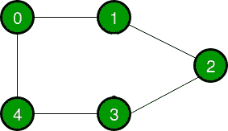

# 图的邻接表和邻接矩阵表示的比较

> 原文:[https://www . geesforgeks . org/邻接表和邻接矩阵图的表示之间的比较/](https://www.geeksforgeeks.org/comparison-between-adjacency-list-and-adjacency-matrix-representation-of-graph/)

A [图](https://www.geeksforgeeks.org/graph-data-structure-and-algorithms/)是由节点和边组成的非线性数据结构。节点有时也称为顶点，边是连接图中任意两个节点的直线或圆弧。在本文中，我们将了解图形表示方式之间的区别。

[一个图形主要可以用两种方式来表示](https://www.geeksforgeeks.org/graph-and-its-representations/)。他们是:

1.  **邻接表:**邻接表是由所有[链表](https://www.geeksforgeeks.org/data-structures/linked-list/)的地址组成的数组。链接列表的第一个节点代表顶点，连接到该节点的其余列表代表该节点所连接的顶点。这种表示也可以用来表示加权图。链表可以稍微改变，甚至可以存储边的权重。
2.  **邻接矩阵:**邻接矩阵是一个大小为 V x V 的 [2D 数组](https://www.geeksforgeeks.org/multidimensional-arrays-in-java/)，其中 V 是图中的顶点数。设 2D 数组为 adj[][]，槽 adj[i][j] = 1 表示从顶点 I 到顶点 j 有一条边，无向图的邻接矩阵总是对称的。邻接矩阵也用于表示加权图。如果 adj[i][j] = w，那么从顶点 I 到顶点 j 有一条边，权重为 w。

让我们考虑一个图来理解邻接表和邻接矩阵表示。设无向图为:

下面的图在上面的表示中表示为:

1.  **Adjacency Matrix:** In the adjacency matrix representation, a graph is represented in the form of a two-dimensional array. The size of the array is **V x V**, where V is the set of vertices. The following image represents the adjacency matrix representation: 

1.  **Adjacency List:** In the adjacency list representation, a graph is represented as an array of linked list. The index of the array represents a vertex and each element in its linked list represents the  vertices that form an edge with the vertex. The following image represents the adjacency list representation: 

下表描述了邻接矩阵和邻接表的区别:

<figure class="table">

| 操作 | 邻接矩阵 | 邻接表 |
| --- | --- | --- |
| 储存空间 | 该表示利用了 VxV 矩阵，因此最坏情况下所需空间为 **O(&#124;V&#124; 2 )** 。 | 在这个表示中，对于每个顶点，我们存储它的邻居。在最坏的情况下，如果一个图是连通的，那么一个顶点需要 O(V)，存储对应于每个顶点的邻居需要 O(E)。因此，整体空间复杂度为 O(&#124;V&#124;+&#124;E&#124;)。 |
| 添加顶点 | 为了给 VxV 矩阵添加一个新顶点，存储必须增加到(&#124;V&#124;+1) 2 。为了实现这一点，我们需要复制整个矩阵。因此复杂度为 **O(&#124;V&#124; 2 )** 。 | 邻接表中有两个指针，一个指向前节点，另一个指向后节点。因此顶点的插入可以直接在 **O(1)时间内完成。** |
| 添加边 | 要添加从 I 到 j 的边，矩阵[i][j] = 1，这需要 **O(1)** 时间。 | 类似于插入顶点，这里也使用了两个指针指向列表的后面和前面。因此，可以在 **O(1)** 时间内插入一条边。 |
| 移除顶点 | 为了从 V*V 矩阵中移除顶点，存储必须从(&#124;V&#124;+1) 2 减少到&#124;V&#124; 2 。为了实现这一点，我们需要复制整个矩阵。所以复杂度是 **O(&#124;V&#124; 2 )** 。 | 为了移除一个顶点，我们需要搜索在最坏情况下需要 O(&#124;V&#124;)时间的顶点，之后我们需要遍历边，在最坏情况下需要 O(&#124;E&#124;)时间。因此，总时间复杂度为 **O(&#124;V&#124;+&#124;E&#124;)** 。 |
| 移除边缘 | 要移除从 I 到 j 的边，矩阵[i][j] = 0，这需要 **O(1)** 时间。 | 要移除一条穿过边的边是需要的，在最坏的情况下，我们需要穿过所有的边。由此可见，时间复杂度为 **O(&#124;E&#124;)** 。 |
| 询问 | 为了找到现有的边，需要检查矩阵的内容。给定两个顶点，比如 I 和 j，矩阵[i][j]可以在 **O(1)** 时间检查。 | 在邻接列表中，每个顶点都与相邻顶点列表相关联。对于给定的图，为了检查边，我们需要检查与给定顶点相邻的顶点。一个顶点最多可以有 O(&#124;V&#124;)个邻居，最坏的情况是我们必须检查每个相邻的顶点。因此，时间复杂度为 **O(&#124;V&#124;)** 。 |

</figure>