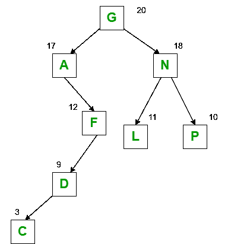

# 身高平衡树和体重平衡树的比较

> 原文:[https://www . geesforgeks . org/高度平衡树和重量平衡树的比较/](https://www.geeksforgeeks.org/comparison-between-height-balanced-tree-and-weight-balanced-tree/)

**<u>什么是高度平衡树？</u>T3】**

[自平衡二分搜索法树](https://www.geeksforgeeks.org/self-balancing-binary-search-trees-comparisons/)是[高度平衡二叉树](https://www.geeksforgeeks.org/how-to-determine-if-a-binary-tree-is-balanced/)是在每个节点，左右子树高度差的绝对值不大于 1 的树。一棵空树是高度平衡的。非空二叉树 T 是平衡的，如果:

1.  T 的左子树是平衡的。
2.  T 的右子树是平衡的。
3.  左子树和右子树的高度差不超过 1。

**注:**

> 每棵完整的二叉树都是高度平衡的。

**示例:**

红黑树、八字树和 AVL 树是高度平衡的二叉查找树。

**<u>什么是权重平衡二叉树？</u>T3】**

权重平衡树是一种[二叉树](https://www.geeksforgeeks.org/binary-tree-data-structure/)，其中对于每个节点，左子树中的节点数至少是右子树中节点数的一半，最多是其两倍。它是一棵二叉树，基于搜索每个单独节点的概率知识进行平衡。在每个子树中，具有最高权重的节点出现在根，从而导致更有效的搜索性能。最有可能被搜索/访问的节点具有最低的搜索时间。

**示例:**

霍夫曼树。

在上图中，字母代表节点值，数字代表节点权重。

**<u>为什么对均衡的定义不同</u>**

二叉查找树(BST)的发明是为了使搜索成为一个比在无序数组中搜索更有效的过程。然而，当 BST 不平衡时，案例搜索是低效的。为了有效搜索，保持树的平衡是明智的。但是，由于频繁地添加和删除值，保持 BST 平衡是困难且低效的。因此，发明了一种通过向每个节点添加更多信息或允许一个节点有两个以上的子节点来保持 BST 平衡的方法。这种发明的树的一些例子是 AVL 树、2-3 树、B 树、红黑树等。

**<u>身高平衡树与体重平衡树的比较</u>**

高度平衡的树改善了最坏情况下的查找时间(对于二叉树，它将总是以 log2(n)为界)，代价是使典型情况大约少查找一次(大约一半的节点将处于最大深度)。

如果您的权重与查找频率相关，则权重平衡树将提高平均查找时间，但代价是使最坏情况变得更高(更频繁请求的项目具有更高的权重，因此将倾向于在更浅的树中，对于不太频繁请求的项目，代价是更深的树)。

<figure class="table">

| **序列号** | **高度平衡树** | **重量平衡树** |
| one | 基于子树的高度来平衡的是二叉树。 | 基于树边缘的权重来平衡的是二叉树。 |
| Two | 在高度平衡的树中，左子树和右子树的绝对高度差应该最小。 | 在权重平衡树中，左子树和右子树的权重的绝对差应该最小。 |
| three | 它将改进最坏情况下的查找时间，但代价是使典型情况大约少查找一次 | 它将提高平均查找时间，但代价是提高最坏情况下的查找时间。 |
| four | 每 2 个 -O(lg n) 操作就发生一次具有 n 个子节点的节点上的重组操作。 | 具有 n 个子节点的节点上的重组操作每 O(1/n)个操作发生一次。 |

**<u>哪个最好？</u>T3】**

确定这两个中哪个是最好的二叉查找树的最好方法是测量这两棵树的性能。这可以通过以下步骤完成:

1.  收集有代表性的查询流量。
2.  建立一个测试平台，在那里可以计算树的操作。
3.  针对高度平衡树和重量平衡树重放预设查询。

一般来说，高度平衡的树在数据集上的请求频率越均匀，效果就越好，而且越偏斜，就越能从重量平衡的树中获得优势。

</figure>