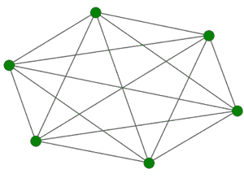
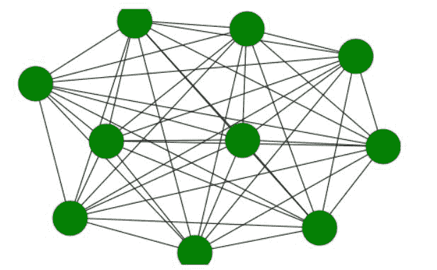

# 使用 Python 中的 Networkx 完成图形

> 原文:[https://www . geesforgeks . org/complete-graph-use-networkx-in-python/](https://www.geeksforgeeks.org/complete-graph-using-networkx-in-python/)

完全图也称为全图，它是一个有 n 个顶点的图，其中每个顶点的度是 n-1。换句话说，每个顶点都与其他顶点相连。

**示例:**具有 6 条边的完整图形:



C_G <sub>6</sub>

**完全图的性质:**

*   每个顶点的度数是 n-1。
*   边的总数是 n(n-1)/2。
*   简单图中所有可能的边都存在于一个完整的图中。
*   它是一个循环图。
*   任意一对节点之间的最大距离为 1。
*   色数是 n，因为每个节点都与其他节点相连。
*   它的补图是一个空图。

我们将使用网络模块来实现一个完整的图形。它带有一个内置函数 networkx.complete_graph()，可以使用 networkx.draw()方法进行说明。Python 中的这个模块用于可视化和分析不同类型的图形。

> **语法:** networkx.complete_graph(n)
> 
> **参数:**
> 
> *   n:完全图中的节点数。
> *   返回一个网络图完整对象。
> *   节点的索引从零到 n-1。
> 
> **用于通过传递图形对象来实现图形。**
> 
> 绘制(G，节点大小，节点颜色)
> 
> **参数:**
> 
> *   **G:** 指完整的图形对象
> *   **node_size:** 指节点的大小。
> *   **node_color:** 指节点的颜色。

**进场:**

*   我们将导入所需的模块 networkx。
*   然后我们将使用 networkx.complete_graph(n)创建一个图形对象。
*   其中 n 指定 n 个节点。
*   为了实现图形，我们将使用 networkx.draw(G，node_color = 'green '，node_size=1500)
*   node_color 和 node_size 参数指定图形节点的颜色和大小。

**例 1:**

## 蟒蛇 3

```
# import required module
import networkx

# create object
G = networkx.complete_graph(6)

# illustrate graph
networkx.draw(G, node_color = 'green',
              node_size = 1500)
```

**输出:**


输出

上面程序的输出给出了一个完整的图，其中有 6 个节点作为输出，因为我们将 6 作为参数传递给了 complete_graph 函数。

**例 2:**

## 蟒蛇 3

```
# import required module
import networkx

# create object
G = networkx.complete_graph(10)

# illustrate graph
networkx.draw(G, node_color = 'green',
              node_size = 1500)
```

**输出:**

