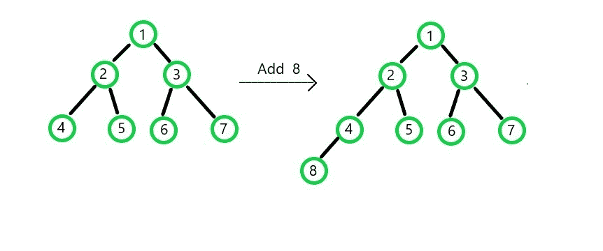

# 二进制最小堆各种操作的复杂度分析

> 原文:[https://www . geeksforgeeks . org/complexity-分析二进制最小堆的各种操作/](https://www.geeksforgeeks.org/complexity-analysis-of-various-operations-of-binary-min-heap/)

A [Min Heap](https://www.geeksforgeeks.org/binary-heap/) 是一个完整的二叉树，其中子节点比父节点具有更高的值(较低的优先级)，即从根节点到叶节点的任何路径都具有元素的升序。在二叉树的情况下，根被认为在高度 0，其子节点被认为在高度 1，以此类推。每个节点最多可以有两个子节点。

**敏堆的重要属性:**
1。父节点总是比子节点具有更高的优先级和更小的值(在最小堆的情况下)。
2。堆是一个完整的二叉树。因此，为了填充第 N 级级，(N-1)级应该首先被完全填充，并且第 N 级级中的节点的填充应该从左到右进行。

基于这些属性，最小堆的各种操作如下:

1.  **Min 堆中插入操作的复杂性分析**
    当一个节点应该添加到堆中时，该元素被添加到数组的下一个空索引处。然后检查插入的子节点是否与父节点一致。如果子节点的值比父节点的值低(优先级高)，则完成节点交换。这个交换过程一直持续到最小堆的属性被满足。
    

> 如果要在高度为 H 的水平插入节点:
> 
> 添加节点的复杂度为: **O(1)**
> 
> 交换节点的复杂性(uphaptive):**O(H)**
> (在最坏的情况下交换将进行 H 次)
> 
> 总复杂度: **O(1) + O(H) = O(H)**
> 
> 对于完全二叉树，其高度 H = O(对数 N)，其中 N 表示节点总数。
> 
> 因此，插入操作的整体复杂度为 **O(log N)** 。

*   **Complexity Analysis of Delete operation in min heap**

    不能随机删除节点。具有最高优先级的元素(即父元素)将首先被删除，然后按优先级顺序删除下一个节点。这就是为什么堆被称为优先级队列。
    首先交换父节点和叶节点的位置，然后将新形成的叶节点(原来是父节点)从队列中移除。接下来，开始交换过程，以便根据最小堆的属性将新的父节点放在正确的位置。

    > 如果要从高度为 H 的堆中删除节点:
    > 
    > 交换父节点和叶节点的复杂度为: **O(1)**
    > 
    > 交换节点的复杂性(降级): **O(H)**
    > (在最坏的情况下交换将进行 H 次)
    > 
    > 总复杂度: **O(1) + O(H) = O(H)**
    > 
    > 对于完全二叉树，其高度 H = O(对数 N)，其中 N 表示节点总数。
    > 
    > 因此，删除操作的整体复杂度为 **O(log N)** 。

    *   **Complexity of getting the Minimum value from min heap**

    为了获得最小值，只需返回根节点的值(这是最小堆中的最小元素)，因此只需返回数组索引 0 处的元素。

    > 因此，求最小值的复杂度为: **O(1)**