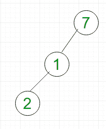
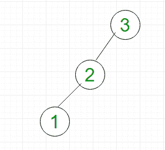
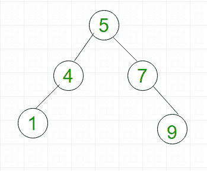

# 二叉树、二叉查找树树、AVL 树中不同运算的复杂度

> 原文:[https://www . geesforgeks . org/complex-differential-operations-二叉树-二叉树-搜索树-avl-tree/](https://www.geeksforgeeks.org/complexity-different-operations-binary-tree-binary-search-tree-avl-tree/)

在本文中，我们将讨论二叉树(包括 BST 树和 AVL 树)中不同操作的复杂性。在理解这篇文章之前，你应该有一个基本的概念:[二叉树](https://www.geeksforgeeks.org/binary-tree-data-structure/)、[二叉查找树](https://www.geeksforgeeks.org/binary-search-tree-data-structure/)和 [AVL 树](https://www.geeksforgeeks.org/tag/avl-tree/)。

二叉树中的主要操作有:搜索、插入和删除。我们将在二叉树中看到这些操作的最坏情况时间复杂度。

**二叉树–**
在二叉树中，一个节点最多可以有两个子节点。考虑图 1 所示的左倾二叉树。

*   **搜索:**为了搜索元素 2，我们必须遍历所有元素(假设我们进行广度优先遍历)。因此，二叉树搜索的最坏情况复杂度为 O(n)。
*   **插入:**为了将元素作为 2 的左子元素插入，我们必须遍历所有元素。因此，二叉树中的插入具有 O(n)的最坏情况复杂度。
*   **删除:**对于元素 2 的删除，我们必须遍历所有元素才能找到 2(假设我们进行广度优先遍历)。因此，二叉树中的删除具有 O(n)的最坏情况复杂度。

**二叉查找树(BST)–**
BST 是一种特殊类型的二叉树，其中节点的左子节点的值小于父节点，右子节点的值大于父节点。考虑图 2 所示的左侧偏斜的 BST。

*   **搜索:**为了搜索元素 1，我们必须遍历所有元素(按照 3，2，1 的顺序)。因此，在二叉查找树搜索具有 O(n)的最坏情况复杂性。一般情况下，时间复杂度为 O(h)，其中 **h** 为 BST 的高度。
*   **插入:**要插入元素 0，必须作为 1 的左子元素插入。因此，我们需要遍历所有元素(按照 3，2，1 的顺序)来插入 0，0 的最坏情况复杂度为 O(n)。一般来说，时间复杂度为 O(h)。
*   **删除:**对于元素 1 的删除，我们要遍历所有元素才能找到 1(按照 3，2，1 的顺序)。因此，二叉树中的删除具有 O(n)的最坏情况复杂度。一般来说，时间复杂度为 O(h)。

**AVL/高度平衡树–**
AVL 树是二叉查找树，附加属性是任意节点的左子树和右子树的高度差不能大于 1。例如，图 2 中所示的 BST 不是 AVL，因为节点 3 的左子树和右子树之间的差是 2。但是，图 3 所示的 BST 是 AVL 树。

*   **搜索:**为了搜索元素 1，我们必须遍历元素(按照 5，4，1 的顺序)= 3 = log 2 n，因此在 AVL 树中搜索的最坏情况复杂度为 O(log 2 n)。
*   **插入:**要插入元素 12，必须将其作为 9 的右子元素插入。因此，我们需要遍历元素(按照 5，7，9 的顺序)来插入 12，它具有 O(log 2 n)的最坏情况复杂度。
*   **删除:**对于元素 9 的删除，我们要遍历元素才能找到 9(按照 5，7，9 的顺序)。因此，二叉树中删除的最坏情况复杂度为 O(log 2 n)。

我们将讨论基于二叉树操作复杂性的问题。

**Que-1。**在一般二叉查找树中，搜索、插入和删除操作的最坏情况时间复杂度是多少？
(A) O(n)代表所有
(B) O(Logn)代表所有
(C) O(Logn)代表搜索和插入，O(n)代表删除
(D) O(Logn)代表搜索，O(n)代表插入和删除

**解决方案:**如前所述，BST 中所有操作的最坏情况时间复杂度为 O(n)。所以，正确的选择是(A)。

**Que-2。**二叉树、BST 和 AVL 树中搜索的最坏情况时间复杂度分别是多少？
(A) O(n)代表所有
(B) O(Logn)代表所有
(C) O(n)代表二叉树，O(Logn)代表其他
(D) O(n)代表二叉树和 BST，O(Logn)代表 AVL

**解:**如前所述，二叉树和 BST 中的搜索操作的最坏情况时间复杂度为 O(n)。而 AVL 树的最坏情况时间复杂度为 O(logn)。所以，正确的选项是(D)。