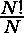

# 一个数字的组合

> 原文:[https://www.geeksforgeeks.org/compositorial-of-a-number/](https://www.geeksforgeeks.org/compositorial-of-a-number/)

给定一个自然数 **N** ，任务是找到第 N 个<sup>组合数</sup>。

> **一个数的组合**是指 N 个以上的所有正整数的乘积。
> 一个数 N 的组合由下式表示
> 
> 
> 
> 哪里 **N！**是数字的[因子，**是数字**的](https://www.geeksforgeeks.org/program-for-factorial-of-a-number/)[因子。](https://www.geeksforgeeks.org/primorial-of-a-number/)

**示例:**

> **输入:** N = 4
> **输出:** 1728
> **说明:**
> 前 4 个复合数为 4、6、8、9。因此，复合词是所有数字的乘积。
> **输入:** N = 5
> **输出:** 17280

**方法:**可以按照以下步骤计算第 N <sup>个</sup>组合数。

1.  得到数字 n。
2.  找到所有的[合成数字](https://www.geeksforgeeks.org/composite-number/)直到 n
3.  将得到的复合数相乘。
4.  打印产品。

以下是上述方法的实现:

## C++

```
// C++ program to find compositorial
// of composite numbers
#include <bits/stdc++.h>
using namespace std;

vector<int> compo;

// Function to check if
// a number is composite.
bool isComposite(int n)
{

    // Corner cases
    if (n <= 3)
        return false;

    // This is checked so that we can
    // skip the middle five numbers
    // in the below loop
    if (n % 2 == 0 or n % 3 == 0)
        return true;

    int i = 5;
    while(i * i <= n)
    {
        if (n % i == 0 or
            n % (i + 2) == 0)
            return true;
        i = i + 6;
    }
    return false;
}

// This function stores all
// composite numbers less than N
void Compositorial_list(int n)
{
    int l = 0;
    for(int i = 4; i < 1000000; i++)
    {
       if (l < n)
       {
           if (isComposite(i))
           {
               compo.push_back(i);
               l += 1;
           }
       }
    }
}

// Function to calculate
// the compositorial of n
int calculateCompositorial(int n)
{

    // Multiply first n composite number
    int result = 1;

    for(int i = 0; i < n; i++)
        result = result * compo[i];
    return result;
}

// Driver code
int main()
{
    int n = 5;

    // Vector to store all the
    // composite less than N
    Compositorial_list(n);

    cout << (calculateCompositorial(n));

    return 0;
}

// This code is contributed by mohit kumar 29
```

## Java 语言(一种计算机语言，尤用于创建网站)

```
// Java program to find compositorial
// of composite numbers
import java.util.*;
class GFG{

static Vector<Integer> compo =
              new Vector<Integer>();

// Function to check if
// a number is composite.
static boolean isComposite(int n)
{
  // Corner cases
  if (n <= 3)
    return false;

  // This is checked so that we can
  // skip the middle five numbers
  // in the below loop
  if (n % 2 == 0 || n % 3 == 0)
    return true;

  int i = 5;
  while(i * i <= n)
  {
    if (n % i == 0 ||
        n % (i + 2) == 0)
      return true;
    i = i + 6;
  }
  return false;
}

// This function stores all
// composite numbers less than N
static void Compositorial_list(int n)
{
  int l = 0;
  for(int i = 4; i < 1000000; i++)
  {
    if (l < n)
    {
      if (isComposite(i))
      {
        compo.add(i);
        l += 1;
      }
    }
  }
}

// Function to calculate
// the compositorial of n
static int calculateCompositorial(int n)
{
  // Multiply first n
  // composite number
  int result = 1;

  for(int i = 0; i < n; i++)
    result = result * compo.get(i);
  return result;
}

// Driver code
public static void main(String[] args)
{
  int n = 5;

  // Vector to store all the
  // composite less than N
  Compositorial_list(n);

  System.out.print((calculateCompositorial(n)));
}
}

// This code is contributed by Princi Singh
```

## 蟒蛇 3

```
# Python3 program to find Compositorial
# of composite numbers 

# Function to check
# if a number is composite.
def isComposite(n):

    # Corner cases
    if (n <= 3):
        return False

    # This is checked so that we can
    # skip the middle five numbers
    # in the below loop
    if (n % 2 == 0 or n % 3 == 0):
        return True

    i = 5
    while(i * i <= n):

        if (n % i == 0\
            or n % (i + 2) == 0):
            return True
        i = i + 6

    return False

# This function stores all 
# Composite numbers less than N
def Compositorial_list(n):
    l = 0
    for i in range(4, 10**6):
        if l<n:
            if isComposite(i):
                compo.append(i)
                l+= 1

# Function to calculate the
# Compositorial of n 
def calculateCompositorial(n):

    # Multiply first n composite number 
    result = 1
    for i in range(n):
        result = result * compo[i] 
    return result 

# Driver code 
if __name__ == "__main__":
    n = 5

    # Vector to store all the
    # composite less than N
    compo =[]

    Compositorial_list(n)

    print(calculateCompositorial(n))
```

## C#

```
// C# program to find compositorial
// of composite numbers
using System;
using System.Collections.Generic;
class GFG{

static List<int> compo =
            new List<int>();

// Function to check if
// a number is composite.
static bool isComposite(int n)
{
  // Corner cases
  if (n <= 3)
    return false;

  // This is checked so that we can
  // skip the middle five numbers
  // in the below loop
  if (n % 2 == 0 || n % 3 == 0)
    return true;

  int i = 5;
  while(i * i <= n)
  {
    if (n % i == 0 ||
        n % (i + 2) == 0)
      return true;
    i = i + 6;
  }
  return false;
}

// This function stores all
// composite numbers less than N
static void Compositorial_list(int n)
{
  int l = 0;
  for(int i = 4; i < 1000000; i++)
  {
    if (l < n)
    {
      if (isComposite(i))
      {
        compo.Add(i);
        l += 1;
      }
    }
  }
}

// Function to calculate
// the compositorial of n
static int calculateCompositorial(int n)
{
  // Multiply first n
  // composite number
  int result = 1;

  for(int i = 0; i < n; i++)
    result = result * compo[i];
  return result;
}

// Driver code
public static void Main(String[] args)
{
  int n = 5;

  // List to store all the
  // composite less than N
  Compositorial_list(n);

  Console.Write((calculateCompositorial(n)));
}
}

// This code is contributed by Rajput-Ji
```

## java 描述语言

```
<script>
    // Javascript program to find compositorial
    // of composite numbers
    let compo = [];

    // Function to check if
    // a number is composite.
    function isComposite(n)
    {

        // Corner cases
        if (n <= 3)
            return false;

        // This is checked so that we can
        // skip the middle five numbers
        // in the below loop
        if (n % 2 == 0 || n % 3 == 0)
            return true;
        let i = 5;
        while(i * i <= n)
        {
            if (n % i == 0 ||
                n % (i + 2) == 0)
                return true;
            i = i + 6;
        }
        return false;
    }

    // This function stores all
    // composite numbers less than N
    function Compositorial_list(n)
    {
        let l = 0;
        for(let i = 4; i < 1000000; i++)
        {
           if (l < n)
           {
               if (isComposite(i))
               {
                   compo.push(i);
                   l += 1;
               }
           }
        }
    }

    // Function to calculate
    // the compositorial of n
    function calculateCompositorial(n)
    {

        // Multiply first n composite number
        let result = 1;

        for(let i = 0; i < n; i++)
            result = result * compo[i];
        return result;
    }

    let n = 5;

    // Vector to store all the
    // composite less than N
    Compositorial_list(n);
    document.write(calculateCompositorial(n));

// This code is contributed by divyeshrabadiya07.
</script>
```

**Output:** 

```
17280
```