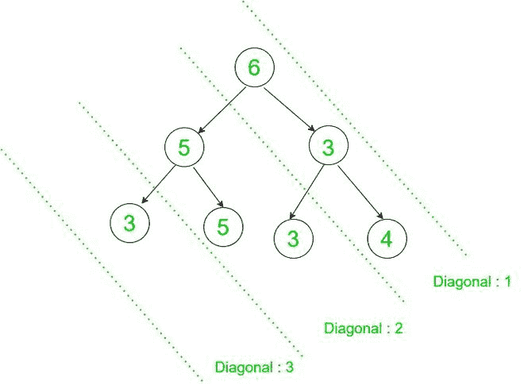

# 对角压缩二叉树为整数

> 原文:[https://www . geesforgeks . org/compress-a-二叉树成整数-对角/](https://www.geeksforgeeks.org/compress-a-binary-tree-into-an-integer-diagonally/)

给定一个由 **N** 节点组成的[二叉树](https://www.geeksforgeeks.org/binary-tree-data-structure/)，任务是首先对角压缩该树得到一个[整数列表](https://www.geeksforgeeks.org/initializing-a-list-in-java/)，然后再次压缩该列表得到单个整数，使用以下操作:

*   当一棵树被对角压缩时，它在[二进制表示](https://www.geeksforgeeks.org/binary-representation-of-a-given-number/)中的值被压缩。
*   考虑对角线上每个节点值的每个位位置。如果一个位置有 **S** 设定位和 **NS** 非设定位，那么只有当 **S** 大于 **NS** 时，才设定该位置的位。否则，取消设置该位置的位。
*   压缩每个对角线，将树转换为列表。然后，使用相同的过程将每个数组元素压缩成一个整数。

> **示例:**如果 **7、6、3** 和 **4** 被压缩，那么它们的二进制表示，即 **(111) <sub>2</sub> 、(110) <sub>2</sub> 、(011) <sub>2</sub>** 和 **(100) <sub>2</sub>** 被压缩。对于 **0 <sup>th</sup>** 位置， **S ≤ NS** 和对于**1<sup>ST</sup>T27】和**2<sup>nd</sup>T31】位置**，S > NS** 。
> 因此，编号变为 **(110) <sub>2</sub> = 6** 。****

**示例:**

> **输入:**6
> /\
> 5 3
> /\/\
> 3 5 3 4
> T7】输出:3
> T10】解释:
> 
> 
> 
> 对角线 1:压缩(6，3，4 ) = 6
> 对角线 2:压缩(5，5，3 ) = 5
> 对角线 3:压缩(3 ) = 3
> 最后，压缩列表(6，5，3)得到 7。
> 
> **输入:**10
> /\
> 5 2
> /\
> 6 8
> T7】输出: 2

**方法:**想法是使用[散列表](https://www.geeksforgeeks.org/hash-map-in-python/)来存储属于树的特定对角线的所有节点。按照以下步骤解决问题:

*   对于树的[对角遍历，跟踪每个节点到根节点的水平距离。](https://www.geeksforgeeks.org/diagonal-traversal-of-binary-tree/)
*   使用[散列表](https://www.geeksforgeeks.org/hash-map-in-python/)存储属于同一对角线的元素。
*   遍历后，[对树的每个对角线的每个位置计算设置位的数量](https://www.geeksforgeeks.org/count-set-bits-in-an-integer/)，并对设置位的数量超过未设置位的数量的位置设置位。
*   将每个对角线的压缩值存储在[数组](https://www.geeksforgeeks.org/array-data-structure/)中。
*   获取数组后，应用相同的压缩步骤来获取所需的整数。

下面是上述方法的实现:

## C++

```
#include <bits/stdc++.h>

using namespace std;

struct TreeNode{
  int val;
  TreeNode *left,*right;

    TreeNode(int v){
        val = v;
        left = NULL;
        right = NULL;
    }
};

// Function to compress the elements
// in an array into an integer
int findCompressValue(vector<int> arr){
    int ans = 0;
    int getBit = 1;

    // Check for each bit position
    for (int i = 0; i < 32; i++){
        int S = 0;
        int NS = 0;

        for (int j:arr){

            // Update the count of
            // set and non-set bits
            if (getBit & j)
                S += 1;
            else
                NS += 1;
          }

        // If number of set bits exceeds
        // the number of non-set bits,
        // then add set bits value to ans
        if (S > NS)
            ans += pow(2,i);

        getBit <<= 1;
      }
    return ans;
}

// Perform Inorder Traversal
// on the Binary Tree
void diagonalOrder(TreeNode *root,int d,map<int,vector<int> > &mp){
    if (!root)
        return;

    // Store all nodes of the same
    // line together as a vector
    mp[d].push_back(root->val);

    // Increase the vertical
    // distance of left child
    diagonalOrder(root->left, d + 1, mp);

    // Vertical distance remains
    // same for right child
    diagonalOrder(root->right, d, mp);
}

// Function to compress a given
// Binary Tree into an integer
int findInteger(TreeNode *root){

    // Declare a map
    map<int,vector<int> > mp;

    diagonalOrder(root, 0, mp);

    //Store all the compressed values of
    //diagonal elements in an array
    vector<int> arr;

    for (auto i:mp)
        arr.push_back(findCompressValue(i.second));

    // Compress the array into an integer
    return findCompressValue(arr);
}

// Driver Code
// Given Input
int main()
{
  TreeNode *root = new TreeNode(6);
  root->left = new TreeNode(5);
  root->right = new TreeNode(3);
  root->left->left = new TreeNode(3);
  root->left->right = new TreeNode(5);
  root->right->left = new TreeNode(3);
  root->right->right = new TreeNode(4);

  // Function Call
  cout << findInteger(root);

  return 0;
}

// This code is contributed by mohit kumar 29.
```

## 蟒蛇 3

```
# Python program for the above approach

class TreeNode:

    def __init__(self, val ='',
                 left = None,
                 right = None):
        self.val = val
        self.left = left
        self.right = right

# Function to compress the elements
# in an array into an integer
def findCompressValue(arr):
    ans = 0
    getBit = 1

    # Check for each bit position
    for i in range(32):
        S = 0
        NS = 0

        for j in arr:

            # Update the count of
            # set and non-set bits
            if getBit & j:
                S += 1
            else:
                NS += 1

        # If number of set bits exceeds
        # the number of non-set bits,
        # then add set bits value to ans
        if S > NS:
            ans += 2**i

        getBit <<= 1

    return ans

# Function to compress a given
# Binary Tree into an integer
def findInteger(root):

    # Declare a map
    mp = {}

    # Perform Inorder Traversal
    # on the Binary Tree
    def diagonalOrder(root, d, mp):
        if not root:
            return

        # Store all nodes of the same
        # line together as a vector
        try:
            mp[d].append(root.val)

        except KeyError:
            mp[d] = [root.val]

        # Increase the vertical
        # distance of left child
        diagonalOrder(root.left, d + 1, mp)

        # Vertical distance remains
        # same for right child
        diagonalOrder(root.right, d, mp)

    diagonalOrder(root, 0, mp)

    # Store all the compressed values of
    # diagonal elements in an array
    arr = []
    for i in mp:
        arr.append(findCompressValue(mp[i]))

    # Compress the array into an integer
    return findCompressValue(arr)

# Driver Code
# Given Input
root = TreeNode(6)
root.left = TreeNode(5)
root.right = TreeNode(3)
root.left.left = TreeNode(3)
root.left.right = TreeNode(5)
root.right.left = TreeNode(3)
root.right.right = TreeNode(4)

# Function Call
print(findInteger(root))
```

**Output:** 

```
7
```

***时间复杂度:**O(N)*
T5**辅助空间:** O(N)