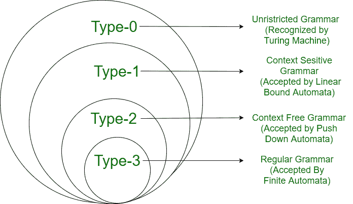

# 计算复杂度 v/s 乔姆斯基层次结构

> 原文:[https://www . geesforgeks . org/computational-complex-v-s-Chomsky-hierarchy/](https://www.geeksforgeeks.org/computational-complexity-v-s-chomsky-hierarchy/)

**1。计算复杂度:**
计算复杂度，衡量特定算法运行时消耗的计算资源(时间和空间)数量。

图灵机的时间复杂度由函数 T(n)给出，其中

**T(n)**= TM 处理长度为 n 的字符串的最大移动次数

图灵机的*空间复杂度*由函数 S(n)给出，其中

**S(n)** =对于长度为 n 的输入，TM 使用的最大磁带方块数

**简单图灵机的** [**时间复杂度**](https://www.geeksforgeeks.org/understanding-time-complexity-simple-examples/) **考虑一下语言，**

```
L = {ωcωR |ω∈(0+1)*}
```

要识别形式为ωcω <sup>R</sup> 的字符串，TM 需要:

比较第一个和最后一个字符= 2n + 1 次移动

比较两端的第二个字符= 2(n -1) + 1 次移动

找到中心字符 c = 1 移动

总移动次数 T(n)，

```
= (2n + 1) + (2 (n - 1) +1)+.......(2(n -(n -1)) + 1) + 1
 = 2(1+2+.........+n)+n = 2 X (n)(n+1) / 2 + n = n2 + 2n
= n2+2n 
= O(n<sup>2</sup>)
```

采用双带机器可以降低时间复杂度。

*   机器将 c 左边的输入字符串复制到第二盘磁带上。
*   当在输入磁带上找到 c 时，TM 将其第二个磁带头向左移动。
*   输入磁头继续向右移动，第二个磁头继续向左移动。
*   随着头部的移动，两个头部下的符号会进行比较。
*   如果所有的符号都匹配，并且中心字符是 c，那么该字符串被接受。

TM 最多进行 n+1 次移动。

```
 T(n) = n+1 = O(n)
```

TM 的空间复杂度由**S(n)= n+1**【n-字符串长度和一个空白符号】给出

**非确定性时间和空间复杂度:**
如果没有选择序列导致机器移动超过 T(n)，则非确定性 TM 的时间复杂度为 T(n)。如果没有一个选择序列需要更多的磁带单元，那么空间复杂度就是 S(n)。

[**【乔姆斯基层次结构】**](https://www.geeksforgeeks.org/chomsky-hierarchy-in-theory-of-computation/) **:**
一个语法可以根据产生式规则进行分类。乔姆斯基将语法分为以下几种类型:



<figure class="table">

| **语法类型** | **语法** | **自动机** |
| 类型 0 | 无限制语法 | 车床 |
| 类型 1 | 上下文敏感语法 | 线性有界自动机 |
| 类型 2 | 上下文无关语法 | 下推自动机 |
| 类型 3 | 常规语法 | 有限状态自动机 |

**第三类或规则语法:**
如果一种语法的所有产物都是下列形式，则称之为第三类或规则语法:-

```
A ⇢ ε     A ⇢ a
A ⇢ aB    A ⇢ Ba
```

其中 A∑∑和 A，B ∈ V。

由 type-3 语法生成的语言被称为**常规语言**。

**Type-2 或上下文无关语法:**
如果一个语法的所有产物都是以下形式的⇢ α，其中 A ∈ V 和α ∈ (V ∪ T)*，则该语法称为 type 2 或上下文无关语法。

v 是一组变量，T 是一组终端。

由类型 2 语法生成的语言称为**上下文无关语言**。

**Type-1 或上下文相关语法:**
如果一个语法的所有产物都是以下形式，则该语法被称为 Type-1 或上下文相关语法:α ⇢ β，其中β至少与α一样长。

**Type-0 或无限制语法:**
制作可以不受任何限制地用无限制语法编写。如果产生了α ⇢ β，那么α的长度可能大于β的长度。

*   每种语法也是数字 0 型语法。
*   类型 2 语法也是类型 1 语法。
*   第三类语法也是第二类语法。

**计算复杂度 v/s 乔姆斯基层次:**

<figure class="table">

| 

#### Complexity of calculation

 | 

#### Chomsky hierarchy

 |
| --- | --- |
| 计算复杂度是对特定算法在运行时消耗的计算资源(时间和空间)数量的度量。 | 乔姆斯基层次结构代表了不同机器所接受的语言类别。 |
| 计算复杂度在算法分析中非常重要。 | 乔姆斯基层次结构在认知科学中很重要，因为层次结构中语法的复杂性可以用来评估。 |
| 计算复杂性是不受限制的语法 | 乔姆斯基层次结构是上下文相关的语法 |
| 计算复杂性在图灵自动机中的应用 | 线性有界自动机中的乔姆斯基层次结构 |

</figure>

</figure>