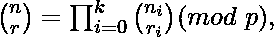
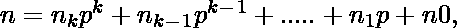

# 计算 nCr % p |集合 2(卢卡斯定理)

> 原文:[https://www . geesforgeks . org/compute-NCR-p-set-2-Lucas-定理/](https://www.geeksforgeeks.org/compute-ncr-p-set-2-lucas-theorem/)

给定三个数字 n、r 和 p，计算<sup>n</sup>C<sub>r</sub>mod p
T5】的值示例:

```
Input:  n = 10, r = 2, p = 13
Output: 6
Explanation: 10C2 is 45 and 45 % 13 is 6.

Input:  n = 1000, r = 900, p = 13
Output: 8
```

我们强烈建议将以下帖子作为先决条件。
[Compute<sup>n</sup>C<sub>r</sub>% p | Set 1(介绍和动态规划解决方案)](https://www.geeksforgeeks.org/compute-ncr-p-set-1-introduction-and-dynamic-programming-solution/)
我们在上面的 Set 1 中介绍了溢出问题并讨论了基于动态规划的解决方案。基于 DP 的解决方案的时间复杂度为 O(n*r)，并且需要 O(n)个空间。对于大的 n 值，特别是接近 10 <sup>9</sup> 的值，所花费的时间和额外的空间变得非常高。
本文讨论了基于卢卡斯定理的求解。该解决方案的时间复杂度为 O(p <sup>2</sup> * Log <sub>p</sub> n)，只需要 O(p)空间。
**卢卡斯定理:**
对于非负整数 n 和 r 以及一个素数 p， 以下同余关系成立:

其中

和

**使用卢卡斯定理对<sup>n</sup>C<sub>r</sub>% p:**
T35】卢卡斯定理基本上暗示了 <sup>n</sup> C <sub>r</sub> 可以通过将<sup>n</sup>T42<sup>I 相乘的结果计算出来 。
思路是对基数 p 中的单个数字 n <sub>i</sub> 和 r <sub>i</sub> 逐一计算<sup>I</sup>T59】C<sub>ri</sub>我们可以根据[上一篇文章](https://www.geeksforgeeks.org/compute-ncr-p-set-1-introduction-and-dynamic-programming-solution/)中讨论的解算出这些数值 DP。由于这些数字以 p 为基数，我们永远不需要超过 O(p)的空间，并且这些独立计算的时间复杂度将以 O 为界(p <sup>2</sup> )。
以下是上述想法的实现</sup> 

## C++

```
// A Lucas Theorem based solution to compute nCr % p
#include<bits/stdc++.h>
using namespace std;

// Returns nCr % p.  In this Lucas Theorem based program,
// this function is only called for n < p and r < p.
int nCrModpDP(int n, int r, int p)
{
    // The array C is going to store last row of
    // pascal triangle at the end. And last entry
    // of last row is nCr
    int C[r+1];
    memset(C, 0, sizeof(C));

    C[0] = 1; // Top row of Pascal Triangle

    // One by constructs remaining rows of Pascal
    // Triangle from top to bottom
    for (int i = 1; i <= n; i++)
    {
        // Fill entries of current row using previous
        // row values
        for (int j = min(i, r); j > 0; j--)

            // nCj = (n-1)Cj + (n-1)C(j-1);
            C[j] = (C[j] + C[j-1])%p;
    }
    return C[r];
}

// Lucas Theorem based function that returns nCr % p
// This function works like decimal to binary conversion
// recursive function.  First we compute last digits of
// n and r in base p, then recur for remaining digits
int nCrModpLucas(int n, int r, int p)
{
   // Base case
   if (r==0)
      return 1;

   // Compute last digits of n and r in base p
   int ni = n%p, ri = r%p;

   // Compute result for last digits computed above, and
   // for remaining digits.  Multiply the two results and
   // compute the result of multiplication in modulo p.
   return (nCrModpLucas(n/p, r/p, p) * // Last digits of n and r
           nCrModpDP(ni, ri, p)) % p;  // Remaining digits
}

// Driver program
int main()
{
    int n = 1000, r = 900, p = 13;
    cout << "Value of nCr % p is " << nCrModpLucas(n, r, p);
    return 0;
}
```

## Java 语言(一种计算机语言，尤用于创建网站)

```
// A Lucas Theorem based solution to compute nCr % p

class GFG{
// Returns nCr % p. In this Lucas Theorem based program,
// this function is only called for n < p and r < p.
static int nCrModpDP(int n, int r, int p)
{
    // The array C is going to store last row of
    // pascal triangle at the end. And last entry
    // of last row is nCr
    int[] C=new int[r+1];

    C[0] = 1; // Top row of Pascal Triangle

    // One by constructs remaining rows of Pascal
    // Triangle from top to bottom
    for (int i = 1; i <= n; i++)
    {
        // Fill entries of current row using previous
        // row values
        for (int j = Math.min(i, r); j > 0; j--)

            // nCj = (n-1)Cj + (n-1)C(j-1);
            C[j] = (C[j] + C[j-1])%p;
    }
    return C[r];
}

// Lucas Theorem based function that returns nCr % p
// This function works like decimal to binary conversion
// recursive function. First we compute last digits of
// n and r in base p, then recur for remaining digits
static int nCrModpLucas(int n, int r, int p)
{
// Base case
if (r==0)
    return 1;

// Compute last digits of n and r in base p
int ni = n%p;
int ri = r%p;

// Compute result for last digits computed above, and
// for remaining digits. Multiply the two results and
// compute the result of multiplication in modulo p.
return (nCrModpLucas(n/p, r/p, p) * // Last digits of n and r
        nCrModpDP(ni, ri, p)) % p; // Remaining digits
}

// Driver program
public static void main(String[] args)
{
    int n = 1000, r = 900, p = 13;
    System.out.println("Value of nCr % p is "+nCrModpLucas(n, r, p));
}
}
// This code is contributed by mits
```

## 蟒蛇 3

```
# A Lucas Theorem based solution
# to compute nCr % p

# Returns nCr % p. In this Lucas
# Theorem based program, this
# function is only called for
# n < p and r < p.
def nCrModpDP(n, r, p):

    # The array C is going to store
    # last row of pascal triangle
    # at the end. And last entry
    # of last row is nCr
    C = [0] * (n + 1);

    # Top row of Pascal Triangle
    C[0] = 1;

    # One by constructs remaining
    # rows of Pascal Triangle from
    # top to bottom
    for i in range(1, (n + 1)):

        # Fill entries of current
        # row using previous row
        # values
        j = min(i, r);
        while(j > 0):
            C[j] = (C[j] + C[j - 1]) % p;
            j -= 1;
    return C[r];

# Lucas Theorem based function that 
# returns nCr % p. This function
# works like decimal to binary
# conversion recursive function.
# First we compute last digits of
# n and r in base p, then recur
# for remaining digits
def nCrModpLucas(n, r, p):

    # Base case
    if (r == 0):
        return 1;

    # Compute last digits of n
    # and r in base p
    ni = int(n % p);
    ri = int(r % p);

    # Compute result for last digits
    # computed above, and for remaining
    # digits. Multiply the two results
    # and compute the result of
    # multiplication in modulo p.
    # Last digits of n and r
    return (nCrModpLucas(int(n / p), int(r / p), p) *
            nCrModpDP(ni, ri, p)) % p; # Remaining digits

# Driver Code
n = 1000;
r = 900;
p = 13;
print("Value of nCr % p is",
       nCrModpLucas(n, r, p));

# This code is contributed by mits
```

## C#

```
// A Lucas Theorem based solution
// to compute nCr % p
using System;

class GFG
{
// Returns nCr % p. In this Lucas
// Theorem based program, this
// function is only called for
// n < p and r < p.
static int nCrModpDP(int n, int r, int p)
{
    // The array C is going to store
    // last row of pascal triangle
    // at the end. And last entry
    // of last row is nCr
    int[] C = new int[r + 1];

    C[0] = 1; // Top row of Pascal Triangle

    // One by constructs remaining
    // rows of Pascal Triangle
    // from top to bottom
    for (int i = 1; i <= n; i++)
    {
        // Fill entries of current row
        // using previous row values
        for (int j = Math.Min(i, r); j > 0; j--)

            // nCj = (n-1)Cj + (n-1)C(j-1);
            C[j] = (C[j] + C[j - 1]) % p;
    }
    return C[r];
}

// Lucas Theorem based function that
// returns nCr % p. This function works
// like decimal to binary conversion
// recursive function. First we compute
// last digits of n and r in base p,
// then recur for remaining digits
static int nCrModpLucas(int n, int r, int p)
{
// Base case
if (r == 0)
    return 1;

// Compute last digits of n
// and r in base p
int ni = n % p;
int ri = r % p;

// Compute result for last digits
// computed above, and for remaining
// digits. Multiply the two results
// and compute the result of
// multiplication in modulo p.
return (nCrModpLucas(n / p, r / p, p) * // Last digits of n and r
        nCrModpDP(ni, ri, p)) % p; // Remaining digits
}

// Driver Code
public static void Main()
{
    int n = 1000, r = 900, p = 13;
    Console.Write("Value of nCr % p is " +
                   nCrModpLucas(n, r, p));
}
}

// This code is contributed
// by ChitraNayal
```

## 服务器端编程语言（Professional Hypertext Preprocessor 的缩写）

```
<?php
// A Lucas Theorem based
// solution to compute
// nCr % p

// Returns nCr % p. In this
// Lucas Theorem based program,
// this function is only called
// for n < p and r < p.
function nCrModpDP($n, $r, $p)
{
    // The array C is going to
    // store last row of pascal
    // triangle at the end. And
    // last entry of last row is nCr
    $C = array_fill(0, $n + 1,
                       false);

    // Top row of
    // Pascal Triangle
    $C[0] = 1;

    // One by constructs remaining
    // rows of Pascal Triangle from
    // top to bottom
    for ($i = 1; $i <= $n; $i++)
    {
        // Fill entries of current
        // row using previous row
        // values
        for ($j = min($i, $r);
             $j > 0; $j--)

            $C[$j] = ($C[$j] +
                      $C[$j - 1]) % $p;
    }
    return $C[$r];
}

// Lucas Theorem based function
// that returns nCr % p. This
// function works like decimal
// to binary conversion recursive
// function. First we compute last
// digits of n and r in base p,
// then recur for remaining digits
function nCrModpLucas($n, $r, $p)
{

// Base case
if ($r == 0)
    return 1;

// Compute last digits
// of n and r in base p
$ni = $n % $p;
$ri = $r % $p;

// Compute result for last
// digits computed above,
// and for remaining digits.
// Multiply the two results
// and compute the result of
// multiplication in modulo p.
return (nCrModpLucas($n / $p,
                     $r / $p, $p) * // Last digits of n and r
        nCrModpDP($ni, $ri, $p)) % $p; // Remaining digits
}

// Driver Code
$n = 1000; $r = 900; $p = 13;
echo "Value of nCr % p is " ,
    nCrModpLucas($n, $r, $p);

// This code is contributed by ajit
?>
```

## java 描述语言

```
<script>

// A Lucas Theorem based solution to compute nCr % p

// Returns nCr % p. In this Lucas Theorem based program,
// this function is only called for n < p and r < p.
function nCrModpDP(n, r, p)
{
    // The array C is going to store last row of
    // pascal triangle at the end. And last entry
    // of last row is nCr
    C = Array(r+1).fill(0);

    C[0] = 1; // Top row of Pascal Triangle

    // One by constructs remaining rows of Pascal
    // Triangle from top to bottom
    for (var i = 1; i <= n; i++)
    {
        // Fill entries of current row using previous
        // row values
        for (var j = Math.min(i, r); j > 0; j--)

            // nCj = (n-1)Cj + (n-1)C(j-1);
            C[j] = (C[j] + C[j-1])%p;
    }
    return C[r];
}

// Lucas Theorem based function that returns nCr % p
// This function works like decimal to binary conversion
// recursive function. First we compute last digits of
// n and r in base p, then recur for remaining digits
function nCrModpLucas(n, r, p)
{
// Base case
if (r==0)
    return 1;

// Compute last digits of n and r in base p
var ni = n%p, ri = r%p;

// Compute result for last digits computed above, and
// for remaining digits. Multiply the two results and
// compute the result of multiplication in modulo p.
return (nCrModpLucas(parseInt(n/p), parseInt(r/p), p) * // Last digits of n and r
        nCrModpDP(ni, ri, p)) % p; // Remaining digits
}

// Driver program
var n = 1000, r = 900, p = 13;
document.write("Value of nCr % p is " + nCrModpLucas(n, r, p));

</script>
```

**输出:**

```
Value of nCr % p is 8
```

**时间复杂度:**本方案时间复杂度为 O(p <sup>2</sup> * Log <sub>p</sub> n)。n 的基 p 表示中有 O(Log <sub>p</sub> n)个数字，这些数字中的每一个都小于 p，因此，单个数字的计算取 O(p <sup>2</sup> )。请注意，这些计算是使用 [DP 方法](https://www.geeksforgeeks.org/compute-ncr-p-set-1-introduction-and-dynamic-programming-solution/)完成的，该方法需要 0(n * r)时间。
**交替实现 O(p <sup>2</sup> + Log <sub>p</sub> n)时间和 O(p <sup>2</sup> )空间:**
想法是预先计算大小为 p x p 的帕斯卡三角形，并将其存储在 2D 数组中。所有需要的值现在需要 0(1)时间。因此整体时间复杂度变为 O(p <sup>2</sup> + Log <sub>p</sub> n)。
本文由 **Ruchir Garg** 供稿。如果您发现任何不正确的地方，请写评论，或者您想分享更多关于上面讨论的主题的信息