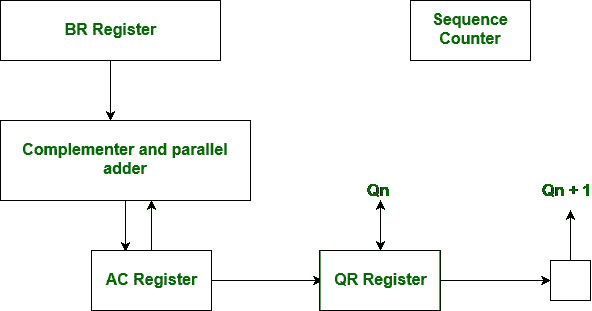
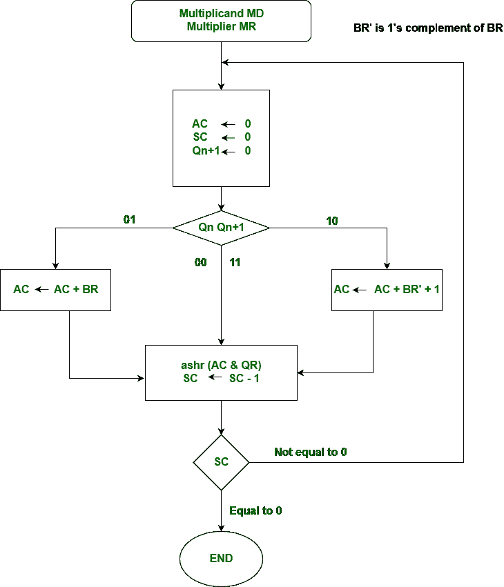

# 计算机组织|布斯算法

> 原文:[https://www . geesforgeks . org/computer-organization-boots-algorithm/](https://www.geeksforgeeks.org/computer-organization-booths-algorithm/)

Booth 算法给出了以有效方式将有符号 2 的补码表示**中的二进制整数**相乘的过程，即所需的加法/减法次数更少。它的工作原理是，乘法器中的 0 串不需要加法，只需要移位，乘法器中的 1 串从比特权重 2^k 到权重 2^m 可以被视为 2^(k+1)到 2^m.

与所有乘法方案一样，布斯算法需要检查乘法器位**和部分乘积的移位。在移位之前，被乘数可以被加到部分乘积上，从部分乘积中减去，或者根据以下规则保持不变:**

1.  在乘法器中遇到 1 串中的第一个最低有效 1 时，被乘数从部分乘积中减去
2.  被乘数在遇到第一个 0 时被加到部分乘积中(前提是乘数中的 0 串中有一个先前的“1”)。
3.  当乘数位与前一乘数位相同时，部分乘积不变。

**boots 算法的硬件实现–**boots 算法的硬件实现需要下图所示的寄存器配置。

**布斯的算法流程图–**

我们把寄存器分别命名为 A、B 和 Q、AC、BR 和 QR。Qn 指定寄存器 QR 中乘法器的最低有效位。一个额外的触发器 Qn+1 被附加到 QR 上，以便于倍增器的双重检查。布斯算法的流程图如下所示。



AC 和附加位 Qn+1 最初被清零，序列 SC 被设置为等于乘法器中位数的数 n。检查 Qn 和 Qn+1 中乘法器的两位。如果两位等于 10，则表示遇到了字符串中的第一个 1。这需要从交流部分积中减去被乘数。如果 2 位等于 01，则表示遇到了 0 字符串中的第一个 0。这需要将被乘数加到 AC 中的部分乘积上。

当两位相等时，部分乘积不变。不会发生溢出，因为被乘数的加法和减法是相互跟随的。因此，相加的两个数字总是有相反的符号，这种情况排除了溢出。下一步是右移部分积和乘数(包括 Qn+1)。这是一种算术右移(ashr)操作，AC 和 QR 向右移动，而 AC 中的符号位保持不变。序列计数器递减，计算循环重复 n 次。

**示例–**下面显示了 n = 4 时 booth 算法的数值示例。它显示了-5 和-7 的逐步乘法。

```
MD = -5 = 1011, MD = 1011, MD'+1 = 0101
MR = -7 = 1001 
The explanation of first step is as follows: Qn+1                             
AC = 0000, MR = 1001, Qn+1 = 0,  SC = 4   
Qn Qn+1 = 10    
So, we do AC + (MD)'+1, which gives AC = 0101
On right shifting AC and MR, we get
AC = 0010, MR = 1100 and Qn+1 = 1 
```

| 操作 | 交流电（alternating current） | 先生 | Qn+1 | 南卡罗来纳州 |
| --- | --- | --- | --- | --- |
|  | 0000 | One thousand and one | Zero | four |
| 交流电 + MD' + 1 | 0101 | One thousand and one | Zero |  |
| ASHR | 0010 | One thousand one hundred | one | three |
| 交流+磁共振 | One thousand one hundred and one | One thousand one hundred | one |  |
| ASHR | One thousand one hundred and ten | One thousand one hundred and ten | Zero | Two |
| ASHR | One thousand one hundred and eleven | 0111 | Zero | one |
| 交流电 + MD' + 1 | 0010 | 0011 | one | Zero |

产品计算如下:

```
Product = AC MR
Product = 0010 0011 =  35
```

**最佳情况和最差情况发生:**
最佳情况是乘法器中有一大块连续的 1 和 0，因此发生的逻辑运算最少，如加法和减法。

最坏的情况是当乘法器中有成对交替的 0 和 1，01 或 10，因此需要最大数量的加法和减法。

**GATE 练习题–**

1.  [GATE IT 2008 |第 40 题](https://www.geeksforgeeks.org/gate-gate-it-2008-question-40/)
2.  [GATE IT 2006 |问题 38](https://www.geeksforgeeks.org/gate-gate-it-2006-question-38/)
3.  [GATE IT 2005 |问题 8](https://www.geeksforgeeks.org/gate-gate-it-2005-question-8/)
4.  [GATE CS 1996 |问题 23](https://www.geeksforgeeks.org/gate-gate-cs-1996-question-23/)