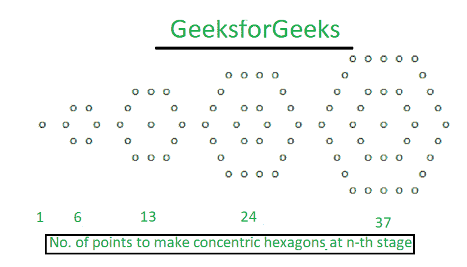

# 同心六边形数字

> 原文:[https://www.geeksforgeeks.org/concentric-hexagonal-numbers/](https://www.geeksforgeeks.org/concentric-hexagonal-numbers/)

以下数字组成同心六边形序列:
*0、1、6、13、24、37、54、73、96、121、150 ……*
数字序列组成同心六边形的图案，数字表示图案第 n 阶段后需要的点数。



**示例:**

> **输入:**N = 3
> T3】输出: 13
> 
> **输入:**N = 4
> T3】输出: 24

**进场:**
以上系列可参考[同心六角数字](https://oeis.org/A032528)。
**N** 该系列的第三个术语为 **3*n <sup>2</sup> /2**

下面是上述方法的实现:

## C++

```
// CPP program to find nth concentric hexagon number
#include <bits/stdc++.h>
using namespace std;

// Function to find nth concentric hexagon number
int concentric_Hexagon(int n)
{
    return 3 * pow(n, 2) / 2;
}

// Driver code
int main()
{
    int n = 3;

    // Function call
    cout << concentric_Hexagon(n);

    return 0;
}
```

## Java 语言(一种计算机语言，尤用于创建网站)

```
// Java program to find
// nth concentric hexagon number
class GFG
{

    // Function to find
    // nth concentric hexagon number
    static int concentric_Haxagon(int n)
    {
        return 3 * (int)Math.pow(n, 2) / 2;
    }

    // Driver Code
    public static void main (String[] args)
    {
        int n = 3;

        // Function call
        System.out.println(concentric_Haxagon(n));
    }
}

// This code is contributed by
// sanjeev2552
```

## 蟒蛇 3

```
# Python3 program to find
# nth concentric hexagon number

# Function to find
# nth concentric hexagon number
def concentric_Hexagon(n):

    return 3 * pow(n, 2) // 2

# Driver code
n = 3

# Function call
print(concentric_Hexagon(n))

# This code is contributed by Mohit Kumar
```

## C#

```
// C# program to find nth concentric hexagon number
using System;
class GFG
{

// Function to find nth concentric hexagon number
static int concentric_Hexagon(int n)
{
    return 3 * (int)Math.Pow(n, 2) / 2;
}

// Driver code
public static void Main()
{
    int n = 3;

    // Function call
    Console.WriteLine(concentric_Hexagon(n));
}
}

// This code is contributed by Nidhi
```

## java 描述语言

```
<script>

// Javascript program to find
// nth concentric hexagon number

// Function to find
// nth concentric hexagon number
function concentric_Haxagon(n)
{
    return parseInt(3 * Math.pow(n, 2) / 2);
}

// Driver code
var n = 3;

// Function call
document.write(concentric_Haxagon(n));

// This code is contributed by Ankita saini

</script>
```

**Output:** 

```
13
```