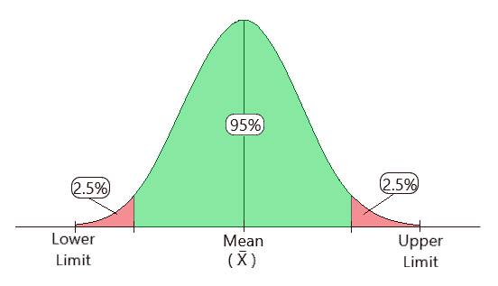
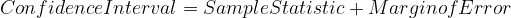
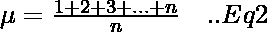
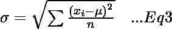
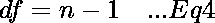
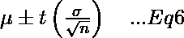
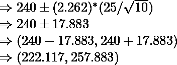

# 置信区间

> 原文:[https://www.geeksforgeeks.org/confidence-interval/](https://www.geeksforgeeks.org/confidence-interval/)

**先决条件:**[t-test](https://www.geeksforgeeks.org/t-test/)[z-test](https://www.geeksforgeeks.org/z-test/)

简单来说，置信区间是我们确信真实值存在的范围。区间置信水平的选择决定了置信区间包含真实参数值的概率。这个范围的值通常用于处理基于人口的数据，以一定的置信度提取特定的、有价值的信息，因此称为“置信区间”。

**图 1。**显示置信区间通常是什么样子的。

<center>

**图 1:置信区间图解**

</center>

**置信水平:**

置信水平描述了与取样方法相关的不确定性。

假设我们使用相同的抽样方法(比如样本均值)为每个样本计算不同的区间估计。一些区间估计会包括真实的总体参数，而一些则不会。

90%的置信水平意味着我们期望 90%的区间估计包含人口参数。95%的置信水平意味着 95%的区间将包括总体参数。

例如，假设你在调查一个特定城市的男性平均身高。为了找到这一点，您设置了 95%的置信水平，发现 95%的置信区间为(168，182)。这意味着，如果你一遍又一遍地重复这个过程，95%的情况下，一个人的身高会在 168 厘米到 182 厘米之间。

**构建置信区间:**

构建置信区间包括 4 个步骤。

```
Step 1: Identify the sample problem. Choose the statistic (like sample mean, etc) that 
    you will use to estimate population parameter.

Step 2: Select a confidence level. (Usually, it is 90%, 95% or 99%)

Step 3: Find the margin of error. (Usually given) If not given, use the following formula:-
    Margin of error = Critical value * Standard deviation 

Step 4: Specify the confidence interval. The uncertainty is denoted by the confidence level. 
    And the range of the confidence interval is defined by Eq-1.

```



**等式-1**

```
where, 
Sample_Statistic --> Can be any kind of statistic. (eg. sample mean)
Margin_of_Error  --> generally, its (± 2.5)

```

**计算置信区间**

CI 的计算需要两个统计参数。

*   **平均值(μ) —** 算术平均值是数字的平均值。它被定义为 n 个数的和除以数的计数直到 n. **(等式-2)**

<center></center>

*   **标准差(σ)** — 它是衡量数字分布的尺度。它被定义为每个数和平均值之间的差的平方和。**(等式-3)**

<center></center>

**a)使用 t 型分布**

当样本量 *n < 30* 时，我们使用 t 分布。

考虑下面的例子。随机抽取了 10 架 UFC 战斗机，测量了它们的重量。平均体重是 240 公斤。构建平均重量的 95%置信区间估计样本标准偏差为 25 千克。找出所有 UFC 战斗机真实平均重量样本的置信区间。

```
Step 1 - Subtract 1 from your sample size.[Eq-4] 
     This gives the degrees of freedom (df), required in Step-3.  

```

<center></center>

```
where, 
df = degree of freedom
n = sample size 

```

使用等式-4，我们得到**df = 10–1 = 9。**

```
Step 2 - Subtract the confidence interval from 1, then divide by two.
 [Eq-5]
     This gives the significance level (α), required in Step-3\. 

```

<center></center>

```
α = Significance level
CL = Confidence Level

```

使用等式-5，我们得到**α=(1 –. 95)/2 = 0.025**

```
Step 3 - Use the values of α and df in the t-distribution table and find the value of t.  

```

<figure class="table">

| (df)/(α) | Zero point one | Zero point zero five | 0.025 | 。。 |
| --- | --- | --- | --- | --- |
| 

∞

 | One point two eight two | One point six four five | 1.960 | 。。 |
| 

one

 | Three point zero seven eight | Six point three one four | 12.706 | 。。 |
| 

Two

 | One point eight eight six | Two point nine two | 4.303 | 。。 |
| 

：

 | ： | ： | : | 。。 |
| 

eight

 | One point three nine seven | One point eight six | 2.306 | 。。 |
| 

9

 | 1.383 | 1.833 | 2.262 | 。。 |

</figure>

利用 t 分布表中 df 和α的值，我们得到 **t = 2.262。**

```
Step 4 - Use the t-value obtained in step 3 in the formula given for Confidence Interval 
      with t-distribution. [Eq-6]

```

<center></center>

```
where,
μ = mean
t = chosen t-value from the table above
σ = the standard deviation
n = number of observations

```

所以，把这些值放在方程 6 中，我们得到



```
where,
Lower Limit = 222.117
Upper Limit = 257.883

```

因此，我们有 95%的把握 UFC 战斗机的真实平均重量在 222.117 到 257.883 之间。

**b)使用 z 分布**

当样本量 n>30 时，我们使用 z 分布。当标准差已知时，z 检验更有用。

考虑下面的例子。随机抽取 50 名成年女性，测量她们的红细胞计数。样本平均值为 4.63，红细胞计数的标准偏差为 0.54。构建成年女性真实平均红细胞计数的 95%置信区间估计值。

```
Step 1 - Find the mean. [Eq-2] (If not already given)
Step 2 - Find the standard deviation. [Eq-3] (If not already given)
Step 3 - Determine the z-value for the specified confidence interval. 
     (some common values in the table given below)

```

<figure class="table">

| 置信区间 | z 值 |
| 90% | One point six four five |
| 95% | 1.960 |
| 99% | Two point five seven six |

</figure>

```
Step 4 - Use the z-value obtained in step 3 in the formula given for Confidence Interval 
      with z-distribution. [Eq-7]
```

<center></center>

```
where,
μ = mean
z = chosen z-value from the table above
σ = the standard deviation
n = number of observations
```

将这些值放入方程 7，我们得到


```
where,
Lower Limit = 4.480
Upper Limit = 4.780

```

因此，我们有 95%的把握成年女性的真实平均红细胞计数在 4.480 和 4.780 之间。

置信区间是统计学的基本概念之一。它讲述了关于数据的陈述。各种抽样方法，如平均值、中位数等。可以根据现有数据使用。人们还可以确定什么时候使用什么分布，以获得最佳结果。如有任何疑问/疑问，请在下面评论。