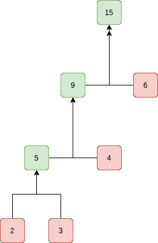

# 以最小的成本连接 n 根绳索

> 原文:[https://www.geeksforgeeks.org/connect-n-ropes-minimum-cost/](https://www.geeksforgeeks.org/connect-n-ropes-minimum-cost/)

给定 n 根不同长度的绳子，我们需要将这些绳子连接成一根绳子。连接两根绳子的费用等于它们长度的总和。我们需要以最低的成本连接绳索。

例如，如果给我们 4 根长度为 4、3、2 和 6 的绳子。我们可以用以下方法连接绳子。
1)首先，连接长度为 2 和 3 的绳索。现在我们有三根长度分别为 4、6 和 5 的绳子。
2)现在连接长度为 4 和 5 的绳索。现在我们有两条长度分别为 6 和 9 的绳子。
3)最后连接两根绳子，所有的绳子都连接好了。
连接所有绳索的总费用为 5 + 9 + 15 = 29。这是连接绳索的最佳成本。其他连接绳索的方式总会有相同或更多的成本。例如，如果我们首先连接 4 和 6(我们得到三串 3、2 和 10)，然后连接 10 和 3(我们得到两串 13 和 2)。最后，我们连接 13 和 2。这样的总成本是 10 + 13 + 15 = 38。

## [我们强烈建议您点击此处进行练习，然后再进入解决方案。](https://practice.geeksforgeeks.org/problems/minimum-cost-of-ropes-1587115620/1)

**<u>解决方案:</u>**
如果我们仔细观察上述问题，我们可以注意到，首先被挑选的绳子的长度在总成本中被包含了不止一次。因此，想法是先连接最小的两条绳子，然后对剩余的绳子重复。这种方法类似于[霍夫曼编码](https://www.geeksforgeeks.org/greedy-algorithms-set-3-huffman-coding/)。我们把最小的绳子放在树上，这样它们就可以重复多次，而不是长绳子。

*所以它形成了一个像树一样的结构:*



总和包含每个值的深度总和。对于数组(2，3，4，6)，和等于 2 * 3 + 3 * 3 + 4 * 2 + 6 * 1 = 29(根据图示)。

**算法:**

1.  创建一个最小堆并将所有长度插入到最小堆中。
2.  当最小堆中的元素数不是 1 时，执行以下操作。
    1.  从最小堆中提取最小值和第二个最小值
    2.  将以上两个提取的值相加，并将相加的值插入到最小堆中。
    3.  维护一个总成本变量，并根据提取值的总和不断递增。
3.  返回总成本的值。

下面是上述算法的实现。

## C++

```
// C++ program for connecting
// n ropes with minimum cost
#include <bits/stdc++.h>

using namespace std;

// A Min Heap: Collection of min heap nodes
struct MinHeap {
    unsigned size; // Current size of min heap
    unsigned capacity; // capacity of min heap
    int* harr; // Array of minheap nodes
};

// A utility function to create
// a min-heap of a given capacity
struct MinHeap* createMinHeap(unsigned capacity)
{
    struct MinHeap* minHeap = new MinHeap;
    minHeap->size = 0; // current size is 0
    minHeap->capacity = capacity;
    minHeap->harr = new int[capacity];
    return minHeap;
}

// A utility function to swap two min heap nodes
void swapMinHeapNode(int* a, int* b)
{
    int temp = *a;
    *a = *b;
    *b = temp;
}

// The standard minHeapify function.
void minHeapify(struct MinHeap* minHeap, int idx)
{
    int smallest = idx;
    int left = 2 * idx + 1;
    int right = 2 * idx + 2;

    if (left < minHeap->size
        && minHeap->harr[left] < minHeap->harr[smallest])
        smallest = left;

    if (right < minHeap->size
        && minHeap->harr[right] < minHeap->harr[smallest])
        smallest = right;

    if (smallest != idx) {
        swapMinHeapNode(&minHeap->harr[smallest], &minHeap->harr[idx]);
        minHeapify(minHeap, smallest);
    }
}

// A utility function to check
// if size of heap is 1 or not
int isSizeOne(struct MinHeap* minHeap)
{
    return (minHeap->size == 1);
}

// A standard function to extract
// minimum value node from heap
int extractMin(struct MinHeap* minHeap)
{
    int temp = minHeap->harr[0];
    minHeap->harr[0] = minHeap->harr[minHeap->size - 1];
    --minHeap->size;
    minHeapify(minHeap, 0);
    return temp;
}

// A utility function to insert
// a new node to Min Heap
void insertMinHeap(struct MinHeap* minHeap, int val)
{
    ++minHeap->size;
    int i = minHeap->size - 1;
    while (i && (val < minHeap->harr[(i - 1) / 2])) {
        minHeap->harr[i] = minHeap->harr[(i - 1) / 2];
        i = (i - 1) / 2;
    }
    minHeap->harr[i] = val;
}

// A standard function to build min-heap
void buildMinHeap(struct MinHeap* minHeap)
{
    int n = minHeap->size - 1;
    int i;
    for (i = (n - 1) / 2; i >= 0; --i)
        minHeapify(minHeap, i);
}

// Creates a min-heap of capacity
// equal to size and inserts all values
// from len[] in it. Initially, size
// of min heap is equal to capacity
struct MinHeap* createAndBuildMinHeap(
    int len[], int size)
{
    struct MinHeap* minHeap = createMinHeap(size);
    for (int i = 0; i < size; ++i)
        minHeap->harr[i] = len[i];
    minHeap->size = size;
    buildMinHeap(minHeap);
    return minHeap;
}

// The main function that returns
// the minimum cost to connect n
// ropes of lengths stored in len[0..n-1]
int minCost(int len[], int n)
{
    int cost = 0; // Initialize result

    // Create a min heap of capacity
    // equal to n and put all ropes in it
    struct MinHeap* minHeap = createAndBuildMinHeap(len, n);

    // Iterate while size of heap doesn't become 1
    while (!isSizeOne(minHeap)) {
        // Extract two minimum length
        // ropes from min heap
        int min = extractMin(minHeap);
        int sec_min = extractMin(minHeap);

        cost += (min + sec_min); // Update total cost

        // Insert a new rope in min heap
        // with length equal to sum
        // of two extracted minimum lengths
        insertMinHeap(minHeap, min + sec_min);
    }

    // Finally return total minimum
    // cost for connecting all ropes
    return cost;
}

// Driver program to test above functions
int main()
{
    int len[] = { 4, 3, 2, 6 };
    int size = sizeof(len) / sizeof(len[0]);
    cout << "Total cost for connecting ropes is "
         << minCost(len, size);
    return 0;
}
```

## Java 语言(一种计算机语言，尤用于创建网站)

```
// Java program to connect n
// ropes with minimum cost

// A class for Min Heap
class MinHeap {
    int[] harr; // Array of elements in heap
    int heap_size; // Current number of elements in min heap
    int capacity; // maximum possible size of min heap

    // Constructor: Builds a heap from
    // a given array a[] of given size
    public MinHeap(int a[], int size)
    {
        heap_size = size;
        capacity = size;
        harr = a;
        int i = (heap_size - 1) / 2;
        while (i >= 0) {
            MinHeapify(i);
            i--;
        }
    }

    // A recursive method to heapify a subtree
    // with the root at given index
    // This method assumes that the subtrees
    // are already heapified
    void MinHeapify(int i)
    {
        int l = left(i);
        int r = right(i);
        int smallest = i;
        if (l < heap_size && harr[l] < harr[i])
            smallest = l;
        if (r < heap_size && harr[r] < harr[smallest])
            smallest = r;
        if (smallest != i) {
            swap(i, smallest);
            MinHeapify(smallest);
        }
    }

    int parent(int i) { return (i - 1) / 2; }

    // to get index of left child of node at index i
    int left(int i) { return (2 * i + 1); }

    // to get index of right child of node at index i
    int right(int i) { return (2 * i + 2); }

    // Method to remove minimum element (or root) from min heap
    int extractMin()
    {
        if (heap_size <= 0)
            return Integer.MAX_VALUE;
        if (heap_size == 1) {
            heap_size--;
            return harr[0];
        }

        // Store the minimum value, and remove it from heap
        int root = harr[0];
        harr[0] = harr[heap_size - 1];
        heap_size--;
        MinHeapify(0);

        return root;
    }

    // Inserts a new key 'k'
    void insertKey(int k)
    {
        if (heap_size == capacity) {
            System.out.println("Overflow: Could not insertKey");
            return;
        }

        // First insert the new key at the end
        heap_size++;
        int i = heap_size - 1;
        harr[i] = k;

        // Fix the min heap property if it is violated
        while (i != 0 && harr[parent(i)] > harr[i]) {
            swap(i, parent(i));
            i = parent(i);
        }
    }

    // A utility function to check
    // if size of heap is 1 or not
    boolean isSizeOne()
    {
        return (heap_size == 1);
    }

    // A utility function to swap two elements
    void swap(int x, int y)
    {
        int temp = harr[x];
        harr[x] = harr[y];
        harr[y] = temp;
    }

    // The main function that returns the
    // minimum cost to connect n ropes of
    // lengths stored in len[0..n-1]
    static int minCost(int len[], int n)
    {
        int cost = 0; // Initialize result

        // Create a min heap of capacity equal
        // to n and put all ropes in it
        MinHeap minHeap = new MinHeap(len, n);

        // Iterate while size of heap doesn't become 1
        while (!minHeap.isSizeOne()) {
            // Extract two minimum length ropes from min heap
            int min = minHeap.extractMin();
            int sec_min = minHeap.extractMin();

            cost += (min + sec_min); // Update total cost

            // Insert a new rope in min heap with length equal to sum
            // of two extracted minimum lengths
            minHeap.insertKey(min + sec_min);
        }

        // Finally return total minimum
        // cost for connecting all ropes
        return cost;
    }

    // Driver code
    public static void main(String args[])
    {
        int len[] = { 4, 3, 2, 6 };
        int size = len.length;

        System.out.println("Total cost for connecting ropes is " + minCost(len, size));
    }
};

// This code is contributed by shubham96301
```

## C#

```
// C# program to connect n ropes with minimum cost
using System;

// A class for Min Heap
class MinHeap {
    int[] harr; // Array of elements in heap
    int heap_size; // Current number of elements in min heap
    int capacity; // maximum possible size of min heap

    // Constructor: Builds a heap from
    // a given array a[] of given size
    public MinHeap(int[] a, int size)
    {
        heap_size = size;
        capacity = size;
        harr = a;
        int i = (heap_size - 1) / 2;
        while (i >= 0) {
            MinHeapify(i);
            i--;
        }
    }

    // A recursive method to heapify a subtree
    // with the root at given index
    // This method assumes that the subtrees
    // are already heapified
    void MinHeapify(int i)
    {
        int l = left(i);
        int r = right(i);
        int smallest = i;
        if (l < heap_size && harr[l] < harr[i])
            smallest = l;
        if (r < heap_size && harr[r] < harr[smallest])
            smallest = r;
        if (smallest != i) {
            swap(i, smallest);
            MinHeapify(smallest);
        }
    }

    int parent(int i) { return (i - 1) / 2; }

    // to get index of left child of node at index i
    int left(int i) { return (2 * i + 1); }

    // to get index of right child of node at index i
    int right(int i) { return (2 * i + 2); }

    // Method to remove minimum element (or root) from min heap
    int extractMin()
    {
        if (heap_size <= 0)
            return int.MaxValue;
        if (heap_size == 1) {
            heap_size--;
            return harr[0];
        }

        // Store the minimum value, and remove it from heap
        int root = harr[0];
        harr[0] = harr[heap_size - 1];
        heap_size--;
        MinHeapify(0);

        return root;
    }

    // Inserts a new key 'k'
    void insertKey(int k)
    {
        if (heap_size == capacity) {
            Console.WriteLine("Overflow: Could not insertKey");
            return;
        }

        // First insert the new key at the end
        heap_size++;
        int i = heap_size - 1;
        harr[i] = k;

        // Fix the min heap property if it is violated
        while (i != 0 && harr[parent(i)] > harr[i]) {
            swap(i, parent(i));
            i = parent(i);
        }
    }

    // A utility function to check
    // if size of heap is 1 or not
    Boolean isSizeOne()
    {
        return (heap_size == 1);
    }

    // A utility function to swap two elements
    void swap(int x, int y)
    {
        int temp = harr[x];
        harr[x] = harr[y];
        harr[y] = temp;
    }

    // The main function that returns the
    // minimum cost to connect n ropes of
    // lengths stored in len[0..n-1]
    static int minCost(int[] len, int n)
    {
        int cost = 0; // Initialize result

        // Create a min heap of capacity equal
        // to n and put all ropes in it
        MinHeap minHeap = new MinHeap(len, n);

        // Iterate while size of heap doesn't become 1
        while (!minHeap.isSizeOne()) {
            // Extract two minimum length ropes from min heap
            int min = minHeap.extractMin();
            int sec_min = minHeap.extractMin();

            cost += (min + sec_min); // Update total cost

            // Insert a new rope in min heap with length equal to sum
            // of two extracted minimum lengths
            minHeap.insertKey(min + sec_min);
        }

        // Finally return total minimum
        // cost for connecting all ropes
        return cost;
    }

    // Driver code
    public static void Main(String[] args)
    {
        int[] len = { 4, 3, 2, 6 };
        int size = len.Length;

        Console.WriteLine("Total cost for connecting ropes is " + minCost(len, size));
    }
};

// This code is contributed by Arnab Kundu
```

**输出:**

```
Total cost for connecting ropes is 29
```

**复杂度分析:**

*   **时间复杂度:** O(nLogn)，假设我们使用的是 O(nLogn)排序算法。请注意，像插入和提取这样的堆操作需要 O(Logn)时间。
*   **辅助复杂度:** O(n)，在最小堆中存储值所需的空间

**算法范式:**贪婪算法
**<u>c++中 STL 的简单实现</u>**
这使用了 STL 中可用的 [priority_queue](https://www.geeksforgeeks.org/priority-queue-in-cpp-stl/) 。感谢 Pango89 提供以下代码。方法和算法保持不变。最小堆被优先队列取代。

## C++

```
#include <bits/stdc++.h>

using namespace std;

int minCost(int arr[], int n)
{
    // Create a priority queue
    // https:// www.geeksforgeeks.org/priority-queue-in-cpp-stl/
    // By default 'less' is used which is for decreasing order
    // and 'greater' is used for increasing order
    priority_queue<int, vector<int>, greater<int> > pq(arr, arr + n);

    // Initialize result
    int res = 0;

    // While size of priority queue is more than 1
    while (pq.size() > 1) {
        // Extract shortest two ropes from pq
        int first = pq.top();
        pq.pop();
        int second = pq.top();
        pq.pop();

        // Connect the ropes: update result and
        // insert the new rope to pq
        res += first + second;
        pq.push(first + second);
    }

    return res;
}

// Driver program to test above function
int main()
{
    int len[] = { 4, 3, 2, 6 };
    int size = sizeof(len) / sizeof(len[0]);
    cout << "Total cost for connecting ropes is " << minCost(len, size);
    return 0;
}
```

## Java 语言(一种计算机语言，尤用于创建网站)

```
// Java program to connect n
// ropes with minimum cost
import java.util.*;

class ConnectRopes {
    static int minCost(int arr[], int n)
    {
        // Create a priority queue
        PriorityQueue<Integer> pq = new PriorityQueue<Integer>();

        // Adding items to the pQueue
        for (int i = 0; i < n; i++) {
            pq.add(arr[i]);
        }

        // Initialize result
        int res = 0;

        // While size of priority queue
        // is more than 1
        while (pq.size() > 1) {
            // Extract shortest two ropes from pq
            int first = pq.poll();
            int second = pq.poll();

            // Connect the ropes: update result
            // and insert the new rope to pq
            res += first + second;
            pq.add(first + second);
        }

        return res;
    }

    // Driver program to test above function
    public static void main(String args[])
    {
        int len[] = { 4, 3, 2, 6 };
        int size = len.length;
        System.out.println("Total cost for connecting"
                           + " ropes is " + minCost(len, size));
    }
}
// This code is contributed by yash_pec
```

## 蟒蛇 3

```
# Python3 program to connect n
# ropes with minimum cost
import heapq

def minCost(arr, n):

    # Create a priority queue out of the
    # given list
    heapq.heapify(arr)

    # Initialize result
    res = 0

    # While size of priority queue
    # is more than 1
    while(len(arr) > 1):

        # Extract shortest two ropes from arr
        first = heapq.heappop(arr)
        second = heapq.heappop(arr)

        #Connect the ropes: update result
        # and insert the new rope to arr
        res += first + second
        heapq.heappush(arr, first + second)

    return res

# Driver code
if __name__ == '__main__':

    lengths = [ 4, 3, 2, 6 ]
    size = len(lengths)

    print("Total cost for connecting ropes is " +
          str(minCost(lengths, size)))

# This code is contributed by shivampatel5
```

## C#

```
// C# program to connect n
// ropes with minimum cost
using System;
using System.Collections.Generic;
public class ConnectRopes
{
  static int minCost(int []arr, int n)
  {
    // Create a priority queue
    List<int> pq = new List<int>();

    // Adding items to the pQueue
    for (int i = 0; i < n; i++)
    {
      pq.Add(arr[i]);
    }

    // Initialize result
    int res = 0;

    // While size of priority queue
    // is more than 1
    while (pq.Count > 1)
    {
      pq.Sort();

      // Extract shortest two ropes from pq
      int first = pq[0];
      int second = pq[1];
      pq.RemoveRange(0, 2);

      // Connect the ropes: update result
      // and insert the new rope to pq
      res += first + second;
      pq.Add(first + second);
    }
    return res;
  }

  // Driver program to test above function
  public static void Main(String []args)
  {
    int []len = { 4, 3, 2, 6 };
    int size = len.Length;
    Console.WriteLine("Total cost for connecting"
                      + " ropes is " + minCost(len, size));
  }
}

// This code is contributed by Rajput-Ji
```

## java 描述语言

```
<script>

// JavaScript program to connect n
// ropes with minimum cost

function minCost(arr,n)
{
    // Create a priority queue
        let pq = [];

        // Adding items to the pQueue
        for (let i = 0; i < n; i++) {
            pq.push(arr[i]);
        }   

        pq.sort(function(a,b){return a-b;});

        // Initialize result
        let res = 0;

        // While size of priority queue
        // is more than 1
        while (pq.length > 1) {
            // Extract shortest two ropes from pq
            let first = pq.shift();
            let second = pq.shift();

            // Connect the ropes: update result
            // and insert the new rope to pq
            res += first + second;
            pq.push(first + second);
            pq.sort(function(a,b){return a-b;});
        }

        return res;
}

// Driver program to test above function
let len = [4, 3, 2, 6];
let size = len.length;
document.write("Total cost for connecting"
                           + " ropes is " + minCost(len, size));

// This code is contributed by avanitrachhadiya2155

</script>
```

**输出:**

```
Total cost for connecting ropes is 29
```

**复杂度分析:**

*   **时间复杂度:** O(nLogn)，假设我们使用的是 O(nLogn)排序算法。
    注意，像插入和提取这样的堆操作需要 O(Logn)时间。
*   **辅助复杂度:** O(n)。
    在最小堆中存储值所需的空间

本文由 **Abhishek** 整理。如果你发现任何不正确的地方，请写评论，或者你想分享更多关于上面讨论的话题的信息