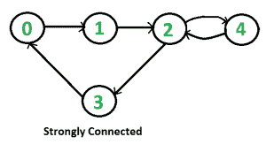

# 检查图是否强连通|集合 1(使用 DFS 的 Kosaraju)

> 原文:[https://www . geesforgeks . org/有向图连接/](https://www.geeksforgeeks.org/connectivity-in-a-directed-graph/)

给定一个有向图，找出该图是否强连通。如果任意两对顶点之间有路径，则有向图是强连通的。例如，下面是一个强连通图。



**无向图**很容易，我们可以从任意一个顶点开始做一个 BFS 和 DFS。如果 BFS 或 DFS 访问所有顶点，那么给定的无向图是连通的。这种方法不适用于有向图。例如，考虑以下不是强连通的图。如果我们从顶点 0 开始 DFS(或 BFS)，我们可以到达所有顶点，但是如果我们从任何其他顶点开始，我们不能到达所有顶点。


**有向图怎么办？**

一个简单的想法是使用像 [**弗洛伊德·沃肖尔**](https://www.geeksforgeeks.org/dynamic-programming-set-16-floyd-warshall-algorithm/) **这样的全对最短路径算法，或者找到图的** [**传递闭包**](https://www.geeksforgeeks.org/transitive-closure-of-a-graph/) 。该方法的时间复杂度为 0(v<sup>3</sup>)。
我们也可以从每个顶点开始**做**[**DFS**](https://www.geeksforgeeks.org/depth-first-traversal-for-a-graph/)**V 次**。如果任何 DFS 没有访问所有顶点，则图不是强连通的。该算法花费的时间与稠密图的传递闭包相同。
更好的想法可以是 [**强连接组件(SCC)**](https://www.geeksforgeeks.org/strongly-connected-components/) **算法**。我们可以在 O(V+E)时间内找到所有的 SCC。如果 SCC 的数目是 1，那么图是强连通的。SCC 的算法会做额外的工作，因为它会找到所有的 SCC。
以下是 **Kosaraju 的基于 DFS 的简单算法，该算法对图进行两次 DFS 遍历**:
**1)**将所有顶点初始化为未访问。
**2)** 从任意顶点 v 开始对图进行 DFS 遍历，如果 DFS 遍历没有访问所有顶点，则返回 false。
**3)** 反转所有弧(或查找图的转置或反转)
**4)** 在反转图中将所有顶点标记为未访问。
**5)** 从同一个顶点 v 开始，对反向图进行 DFS 遍历(与步骤 2 相同)。如果 DFS 遍历没有访问所有顶点，那么返回 false。否则返回真。
思想是，如果从一个顶点 v 可以到达每个节点，并且每个节点都可以到达 v，那么图是强连通的。在第二步中，我们检查是否所有的顶点都可以从 v 到达。在第四步中，我们检查是否所有的顶点都可以到达 v(在反图中，如果所有的顶点都可以从 v 到达，那么在原始图中所有的顶点都可以到达 v)。
以下是上述算法的实现。

## C++

```
// C++ program to check if a given directed graph is strongly
// connected or not
#include <iostream>
#include <list>
#include <stack>
using namespace std;

class Graph
{
    int V;    // No. of vertices
    list<int> *adj;    // An array of adjacency lists

    // A recursive function to print DFS starting from v
    void DFSUtil(int v, bool visited[]);
public:
    // Constructor and Destructor
    Graph(int V) { this->V = V;  adj = new list<int>[V];}
    ~Graph() { delete [] adj; }

    // Method to add an edge
    void addEdge(int v, int w);

    // The main function that returns true if the graph is strongly
    // connected, otherwise false
    bool isSC();

    // Function that returns reverse (or transpose) of this graph
    Graph getTranspose();
};

// A recursive function to print DFS starting from v
void Graph::DFSUtil(int v, bool visited[])
{
    // Mark the current node as visited and print it
    visited[v] = true;

    // Recur for all the vertices adjacent to this vertex
    list<int>::iterator i;
    for (i = adj[v].begin(); i != adj[v].end(); ++i)
        if (!visited[*i])
            DFSUtil(*i, visited);
}

// Function that returns reverse (or transpose) of this graph
Graph Graph::getTranspose()
{
    Graph g(V);
    for (int v = 0; v < V; v++)
    {
        // Recur for all the vertices adjacent to this vertex
        list<int>::iterator i;
        for(i = adj[v].begin(); i != adj[v].end(); ++i)
        {
            g.adj[*i].push_back(v);
        }
    }
    return g;
}

void Graph::addEdge(int v, int w)
{
    adj[v].push_back(w); // Add w to v’s list.
}

// The main function that returns true if graph is strongly connected
bool Graph::isSC()
{
    // St1p 1: Mark all the vertices as not visited (For first DFS)
    bool visited[V];
    for (int i = 0; i < V; i++)
        visited[i] = false;

    // Step 2: Do DFS traversal starting from first vertex.
    DFSUtil(0, visited);

     // If DFS traversal doesn’t visit all vertices, then return false.
    for (int i = 0; i < V; i++)
        if (visited[i] == false)
             return false;

    // Step 3: Create a reversed graph
    Graph gr = getTranspose();

    // Step 4: Mark all the vertices as not visited (For second DFS)
    for(int i = 0; i < V; i++)
        visited[i] = false;

    // Step 5: Do DFS for reversed graph starting from first vertex.
    // Starting Vertex must be same starting point of first DFS
    gr.DFSUtil(0, visited);

    // If all vertices are not visited in second DFS, then
    // return false
    for (int i = 0; i < V; i++)
        if (visited[i] == false)
             return false;

    return true;
}

// Driver program to test above functions
int main()
{
    // Create graphs given in the above diagrams
    Graph g1(5);
    g1.addEdge(0, 1);
    g1.addEdge(1, 2);
    g1.addEdge(2, 3);
    g1.addEdge(3, 0);
    g1.addEdge(2, 4);
    g1.addEdge(4, 2);
    g1.isSC()? cout << "Yes\n" : cout << "No\n";

    Graph g2(4);
    g2.addEdge(0, 1);
    g2.addEdge(1, 2);
    g2.addEdge(2, 3);
    g2.isSC()? cout << "Yes\n" : cout << "No\n";

    return 0;
}
```

## Java 语言(一种计算机语言，尤用于创建网站)

```
// Java program to check if a given directed graph is strongly
// connected or not
import java.io.*;
import java.util.*;
import java.util.LinkedList;

// This class represents a directed graph using adjacency
// list representation
class Graph
{
    private int V;   // No. of vertices
    private LinkedList<Integer> adj[]; //Adjacency List

    //Constructor
    Graph(int v)
    {
        V = v;
        adj = new LinkedList[v];
        for (int i=0; i<v; ++i)
            adj[i] = new LinkedList();
    }

    //Function to add an edge into the graph
    void addEdge(int v,int w) {  adj[v].add(w); }

    // A recursive function to print DFS starting from v
    void DFSUtil(int v,Boolean visited[])
    {
        // Mark the current node as visited and print it
        visited[v] = true;

        int n;

        // Recur for all the vertices adjacent to this vertex
        Iterator<Integer> i = adj[v].iterator();
        while (i.hasNext())
        {
            n = i.next();
            if (!visited[n])
                DFSUtil(n,visited);
        }
    }

    // Function that returns transpose of this graph
    Graph getTranspose()
    {
        Graph g = new Graph(V);
        for (int v = 0; v < V; v++)
        {
            // Recur for all the vertices adjacent to this vertex
            Iterator<Integer> i = adj[v].listIterator();
            while (i.hasNext())
                g.adj[i.next()].add(v);
        }
        return g;
    }

    // The main function that returns true if graph is strongly
    // connected
    Boolean isSC()
    {
        // Step 1: Mark all the vertices as not visited
        // (For first DFS)
        Boolean visited[] = new Boolean[V];
        for (int i = 0; i < V; i++)
            visited[i] = false;

        // Step 2: Do DFS traversal starting from first vertex.
        DFSUtil(0, visited);

        // If DFS traversal doesn't visit all vertices, then
        // return false.
        for (int i = 0; i < V; i++)
            if (visited[i] == false)
                return false;

        // Step 3: Create a reversed graph
        Graph gr = getTranspose();

        // Step 4: Mark all the vertices as not visited (For
        // second DFS)
        for (int i = 0; i < V; i++)
            visited[i] = false;

        // Step 5: Do DFS for reversed graph starting from
        // first vertex. Starting Vertex must be same starting
        // point of first DFS
        gr.DFSUtil(0, visited);

        // If all vertices are not visited in second DFS, then
        // return false
        for (int i = 0; i < V; i++)
            if (visited[i] == false)
                return false;

        return true;
    }

    public static void main(String args[])
    {
        // Create graphs given in the above diagrams
        Graph g1 = new Graph(5);
        g1.addEdge(0, 1);
        g1.addEdge(1, 2);
        g1.addEdge(2, 3);
        g1.addEdge(3, 0);
        g1.addEdge(2, 4);
        g1.addEdge(4, 2);
        if (g1.isSC())
            System.out.println("Yes");
        else
            System.out.println("No");

        Graph g2 = new Graph(4);
        g2.addEdge(0, 1);
        g2.addEdge(1, 2);
        g2.addEdge(2, 3);
        if (g2.isSC())
            System.out.println("Yes");
        else
            System.out.println("No");
    }
}
// This code is contributed by Aakash Hasija
```

## 计算机编程语言

```
# Python program to check if a given directed graph is strongly
# connected or not

from collections import defaultdict

#This class represents a directed graph using adjacency list representation
class Graph:

    def __init__(self,vertices):
        self.V= vertices #No. of vertices
        self.graph = defaultdict(list) # default dictionary to store graph

    # function to add an edge to graph
    def addEdge(self,u,v):
        self.graph[u].append(v)

     #A function used by isSC() to perform DFS
    def DFSUtil(self,v,visited):

        # Mark the current node as visited
        visited[v]= True

        #Recur for all the vertices adjacent to this vertex
        for i in self.graph[v]:
            if visited[i]==False:
                self.DFSUtil(i,visited)

    # Function that returns reverse (or transpose) of this graph
    def getTranspose(self):

        g = Graph(self.V)

        # Recur for all the vertices adjacent to this vertex
        for i in self.graph:
            for j in self.graph[i]:
                g.addEdge(j,i)

        return g

    # The main function that returns true if graph is strongly connected
     def isSC(self):

         # Step 1: Mark all the vertices as not visited (For first DFS)
        visited =[False]*(self.V)

        # Step 2: Do DFS traversal starting from first vertex.
        self.DFSUtil(0,visited)

        # If DFS traversal doesnt visit all vertices, then return false
        if any(i == False for i in visited):
            return False

        # Step 3: Create a reversed graph
        gr = self.getTranspose()

        # Step 4: Mark all the vertices as not visited (For second DFS)
        visited =[False]*(self.V)

        # Step 5: Do DFS for reversed graph starting from first vertex.
        # Starting Vertex must be same starting point of first DFS
        gr.DFSUtil(0,visited)

        # If all vertices are not visited in second DFS, then
        # return false
        if any(i == False for i in visited):
            return False

        return True

# Create a graph given in the above diagram
g1 = Graph(5)
g1.addEdge(0, 1)
g1.addEdge(1, 2)
g1.addEdge(2, 3)
g1.addEdge(3, 0)
g1.addEdge(2, 4)
g1.addEdge(4, 2)
print "Yes" if g1.isSC() else "No"

g2 = Graph(4)
g2.addEdge(0, 1)
g2.addEdge(1, 2)
g2.addEdge(2, 3)
print "Yes" if g2.isSC() else "No"

#This code is contributed by Neelam Yadav
```

## java 描述语言

```
<script>
// Javascript program to check if a given directed graph is strongly
// connected or not

// This class represents a directed graph using adjacency
// list representation
class Graph
{
    // Constructor
    constructor(v)
    {
        this.V = v;
        this.adj = new Array(v);
        for (let i = 0; i < v; ++i)
            this.adj[i] = [];
    }

    // Function to add an edge into the graph
    addEdge(v,w)
    {
        this.adj[v].push(w);
    }

    // A recursive function to print DFS starting from v
    DFSUtil(v,visited)
    {
        // Mark the current node as visited and print it
        visited[v] = true;

        let n;

        // Recur for all the vertices adjacent to this vertex

        for(let i of this.adj[v].values())
        {
            n = i;
            if (!visited[n])
                this.DFSUtil(n,visited);
        }
    }

    // Function that returns transpose of this graph
    getTranspose()
    {
        let g = new Graph(this.V);
        for (let v = 0; v < this.V; v++)
        {

            // Recur for all the vertices adjacent to this vertex

            for(let i of this.adj[v].values())
                g.adj[i].push(v);
        }
        return g;
    }

    // The main function that returns true if graph is strongly
    // connected
    isSC()
    {

        // Step 1: Mark all the vertices as not visited
        // (For first DFS)
        let visited = new Array(this.V);
        for (let i = 0; i < this.V; i++)
            visited[i] = false;

        // Step 2: Do DFS traversal starting from first vertex.
        this.DFSUtil(0, visited);

        // If DFS traversal doesn't visit all vertices, then
        // return false.
        for (let i = 0; i < this.V; i++)
            if (visited[i] == false)
                return false;

        // Step 3: Create a reversed graph
        let gr = this.getTranspose();

        // Step 4: Mark all the vertices as not visited (For
        // second DFS)
        for (let i = 0; i < this.V; i++)
            visited[i] = false;

        // Step 5: Do DFS for reversed graph starting from
        // first vertex. Starting Vertex must be same starting
        // point of first DFS
        gr.DFSUtil(0, visited);

        // If all vertices are not visited in second DFS, then
        // return false
        for (let i = 0; i < this.V; i++)
            if (visited[i] == false)
                return false;

        return true;
    }
}

// Create graphs given in the above diagrams
let g1 = new Graph(5);
g1.addEdge(0, 1);
g1.addEdge(1, 2);
g1.addEdge(2, 3);
g1.addEdge(3, 0);
g1.addEdge(2, 4);
g1.addEdge(4, 2);
if (g1.isSC())
    document.write("Yes<br>");
else
    document.write("No<br>");

let g2 = new Graph(4);
g2.addEdge(0, 1);
g2.addEdge(1, 2);
g2.addEdge(2, 3);
if (g2.isSC())
    document.write("Yes");
else
    document.write("No");

// This code is contributed by avanitrachhadiya2155
</script>
```

**输出:**

```
Yes
No
```

**时间复杂度:**上述实现的时间复杂度与[深度优先搜索](https://www.geeksforgeeks.org/depth-first-traversal-for-a-graph/)相同，如果图是用邻接表表示的，则为 O(V+E)。
**还能进一步提高吗？**
上述方法需要两次遍历图形。我们可以使用[塔尔扬寻找强连通分量的算法](https://www.geeksforgeeks.org/tarjan-algorithm-find-strongly-connected-components/)在一次遍历中找到一个图是否强连通。
**练习:**
我们可以用 BFS 代替上面算法中的 DFS 吗？参见[本](https://www.geeksforgeeks.org/check-given-directed-graph-strongly-connected-set-2-kosaraju-using-bfs/)。
**参考文献:**
[http://www . ieor . Berkeley . edu/~ hochbaum/files/ieor 266-2012 . pdf](http://www.ieor.berkeley.edu/~hochbaum/files/ieor266-2012.pdf)
如发现有不正确的地方，或想分享更多关于以上讨论话题的信息请写评论