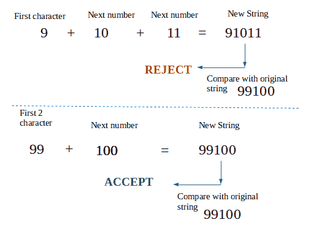

# 一个字符串中连续的有序数字

> 原文:[https://www . geesforgeks . org/连续序列字符串中的数字/](https://www.geeksforgeeks.org/consecutive-sequenced-numbers-in-a-string/)

给定一个只包含数字的字符串，我们需要检查该字符串是否包含以递增顺序连续排列的数字。
注意:负数不算这个问题的一部分。所以我们认为输入只包含正整数。
示例:

```
Input :  str = "1234"
Output : Yes 
         1
Explanation : 
There are 1, 2, 3, 4 which are 
consecutive and in increasing order.
And the starting number is 1

Input :  str = "91012"
Output : No
Explanation : 
There are no such sequence in the
string. 

Input :  str = "99100"
Output : Yes 
         99
Explanation : The consecutive sequential 
numbers are 99, 100

Input :  str = "010203"
Output : NO 
Explanation : 
Although at first glance there seems to
be 01, 02, 03\. But those wouldn't be 
considered a number. 01 is not 1  it's 0, 1 
```

**方法**:一个容易实现且有用的方法是首先开始取一个字符(假设我们的字符串以 1 位数开头)，然后通过串联下一个数字形成一个新的字符串，直到新字符串的长度等于原始字符串。
也许一个例子可以澄清:
我们来举个例子**【99100】**



## C++

```
// CPP Program to check whether a string contains
// consecutive sequential numbers or not
#include <iostream>
using namespace std;

// function to check consecutive sequential number
int isConsecutive(string str)
{
    // variable to store starting number
    int start;

    // length of the input string
    int length = str.size();

    // find the number till half of the string
    for (int i = 0; i < length / 2; i++) {

        // new string containing the starting
        // substring of input string
        string new_str = str.substr(0, i + 1);

        // converting starting substring into number
        int num = atoi(new_str.c_str());

        // backing up the starting number in start
        start = num;

        // while loop until the new_string is
        // smaller than input string
        while (new_str.size() < length) {

            // next number
            num++;

            // concatenate the next number
            new_str = new_str + to_string(num);
        }

        // check if new string becomes equal to
        // input string
        if (new_str == str)
           return start;
    }

    // if string doesn't contains consecutive numbers
    return -1;
}

// Driver's Code
int main()
{
    string str = "99100";
    cout << "String: " << str << endl;
    int start = isConsecutive(str);
    if (start != -1)
        cout << "Yes \n" << start << endl;
    else
        cout << "No" << endl;

    string str1 = "121315";
    cout << "\nString: " << str1 << endl;
    start = isConsecutive(str1);
    if (start != -1)
        cout << "Yes \n" << start << endl;
    else
        cout << "No" << endl;

    return 0;
}
```

## Java 语言(一种计算机语言，尤用于创建网站)

```
// Java Program to check whether a String contains
// consecutive sequential numbers or not
class GFG
{

// function to check consecutive sequential number
static int isConsecutive(String str)
{
    // variable to store starting number
    int start;

    // length of the input String
    int length = str.length();

    // find the number till half of the String
    for (int i = 0; i < length / 2; i++)
    {

        // new String containing the starting
        // substring of input String
        String new_str = str.substring(0, i + 1);

        // converting starting substring into number
        int num = Integer.parseInt(new_str);

        // backing up the starting number in start
        start = num;

        // while loop until the new_String is
        // smaller than input String
        while (new_str.length() < length)
        {

            // next number
            num++;

            // concatenate the next number
            new_str = new_str + String.valueOf(num);
        }

        // check if new String becomes equal to
        // input String
        if (new_str.equals(str))
        return start;
    }

    // if String doesn't contains consecutive numbers
    return -1;
}

// Driver Code
public static void main(String[] args)
{
    String str = "99100";
    System.out.println("String: " + str);
    int start = isConsecutive(str);
    if (start != -1)
        System.out.println("Yes \n" + start);
    else
        System.out.println("No");

    String str1 = "121315";
    System.out.println("\nString: " + str1);
    start = isConsecutive(str1);
    if (start != -1)
        System.out.println("Yes \n" + start);
    else
        System.out.println("No");
    }
}

// This code contributed by Rajput-Ji
```

## C#

```
// C# Program to check whether a String contains
// consecutive sequential numbers or not
using System;

class GFG
{

// function to check consecutive sequential number
static int isConsecutive(String str)
{
    // variable to store starting number
    int start;

    // length of the input String
    int length = str.Length;

    // find the number till half of the String
    for (int i = 0; i < length / 2; i++)
    {

        // new String containing the starting
        // substring of input String
        String new_str = str.Substring(0, i + 1);

        // converting starting substring into number
        int num = int.Parse(new_str);

        // backing up the starting number in start
        start = num;

        // while loop until the new_String is
        // smaller than input String
        while (new_str.Length < length)
        {

            // next number
            num++;

            // concatenate the next number
            new_str = new_str + String.Join("",num);
        }

        // check if new String becomes equal to
        // input String
        if (new_str.Equals(str))
        return start;
    }

    // if String doesn't contains consecutive numbers
    return -1;
}

// Driver Code
public static void Main(String[] args)
{
    String str = "99100";
    Console.WriteLine("String: " + str);
    int start = isConsecutive(str);
    if (start != -1)
        Console.WriteLine("Yes \n" + start);
    else
        Console.WriteLine("No");

    String str1 = "121315";
    Console.WriteLine("\nString: " + str1);
    start = isConsecutive(str1);
    if (start != -1)
        Console.WriteLine("Yes \n" + start);
    else
        Console.WriteLine("No");
    }
}

// This code has been contributed by 29AjayKumar
```

## java 描述语言

```
<script>

// JavaScript Program to check whether a String contains
// consecutive sequential numbers or not

// function to check consecutive sequential number
function isConsecutive(str)
{
    // variable to store starting number
    let start;

    // length of the input String
    let length = str.length;

    // find the number till half of the String
    for (let i = 0; i < length / 2; i++)
    {

        // new String containing the starting
        // substring of input String
        let new_str = str.substring(0, i + 1);

        // converting starting substring into number
        let num = parseInt(new_str);

        // backing up the starting number in start
        start = num;

        // while loop until the new_String is
        // smaller than input String
        while (new_str.length < length)
        {

            // next number
            num++;

            // concatenate the next number
            new_str = new_str + (num).toString();
        }

        // check if new String becomes equal to
        // input String
        if (new_str == (str))
        return start;
    }

    // if String doesn't contains consecutive numbers
    return -1;
}

// Driver Code
let str = "99100";
document.write("String: " + str+"<br>");
let start = isConsecutive(str);
if (start != -1)
    document.write("Yes <br>" + start+"<br>");
else
    document.write("No<br>");

let str1 = "121315";
document.write("<br>String: " + str1+"<br>");
start = isConsecutive(str1);
if (start != -1)
    document.write("Yes <br>" + start+"<br>");
else
    document.write("No<br>");

// This code is contributed by rag2127

</script>
```

**Output:** 

```
String: 99100
Yes 
99

String: 121315
No
```