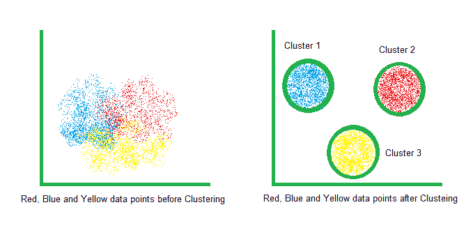
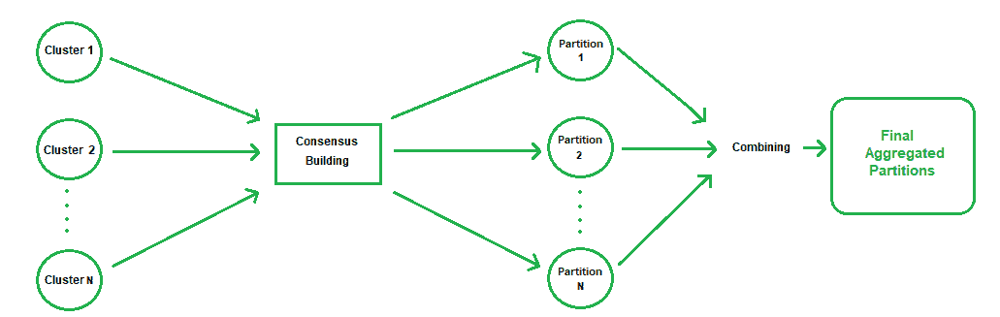
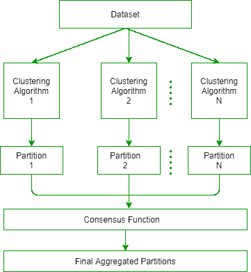

# 共识聚类

> 原文:[https://www.geeksforgeeks.org/consensus-clustering/](https://www.geeksforgeeks.org/consensus-clustering/)

### [聚类:](https://www.geeksforgeeks.org/clustering-in-machine-learning/)

在学习*共识聚类之前，*我们必须知道*聚类*是什么。在机器学习中，聚类是一种用于根据相似性将不同的对象分组到分离的聚类中的技术，即相似的对象将在相同的聚类中，与相似对象的其他聚类分离。这是一种[无监督学习](https://www.geeksforgeeks.org/supervised-unsupervised-learning/)方法。常用的聚类算法很少是 [K-means](https://www.geeksforgeeks.org/k-means-clustering-introduction/) 、K-prototype、 [DBSCAN](https://www.geeksforgeeks.org/dbscan-clustering-in-ml-density-based-clustering/) 等。

使聚集

### 共识聚类:

正常的聚类过程几乎没有缺点。像 K-means 或 K-prototype 等算法使用随机初始化过程，该过程在算法的每次迭代中导致不同的聚类结果或聚类初始化。还需要初始化 K 的值，一般由 [*【肘法】*](https://www.geeksforgeeks.org/elbow-method-for-optimal-value-of-k-in-kmeans/) *选择。*因此，聚类过程非常依赖于这些度量，因此，它会产生也非常不稳定的有偏聚类。为了消除这些缺点，我们采用了一种不同的聚类方法，即*共识聚类。*

*“共识”*一词来自拉丁语，意思是“*普遍一致”。*共识聚类是将多个聚类组合成比输入聚类更稳定的单个聚类的技术。这样，所有的聚类被合并成一个稳定的单个聚类，这个过程通过在每个级别生成一个*共识矩阵*来迭代完成。

#### 共识集群的优势:

1.  集群的质量和健壮性更好。
2.  产生正确数量的簇。
3.  更好地处理丢失的数据。
4.  单个分区可以独立获得。

共识聚类过程

#### 共识聚类的过程:

共识聚类基于两个阶段-

1.  **分区生成:**在这个阶段，使用不同的数据属性子集创建数据对象的不同分区，应用不同偏差的不同聚类算法，取不同的参数进行聚类，并使用整个数据集的不同随机子样本。一旦我们生成了初始分区，我们就开始在分区之间生成共识，并基于之前的共识进一步生成新的分区。
2.  **共识生成:**数据分区之间的共识是使用*共识函数*生成的，该函数通常通过以下方法获得–
    *   **基于中值划分的方法:**这里，不同分区的数据点通过它们的相似性指数被分组在一起。我们基于先前分区的数据点的中间值来形成新的分区。相似性指数取决于数据点的一致&和不一致*F-测度、兰德指数*等。
    *   **基于共现的方法:**在这种方法中，我们可以使用 3 种方法: *1。基于重新标记/投票的方法，2。协同关联*基于矩阵的*方法，3。*基于图形的*方法。**重新标记/投票*** ***基方法*** 通过确定与当前共识的对应关系生成新的聚类。每个实例从其集群分配中获得一定的投票，并相应地更新共识和集群分配。 ***协同关联*** 基于矩阵的 ***方法*** 通过数据点的相似性基于协同关联矩阵生成新的聚类，而基于图的 ***方法** g* 生成加权图来表示多个聚类，并通过最小化图割找到最优分割。

共识聚类的工作流程

基于不同的共识函数生成方法，有许多不同的共识聚类算法，并且有许多研究工作仍在对现有模型进行改进。