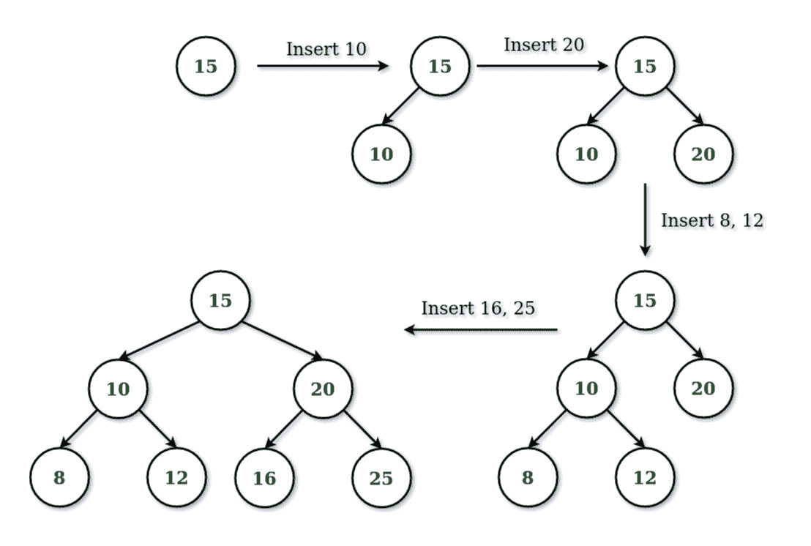

# 使用递归

按照级别顺序构建二叉树

> 原文:[https://www . geeksforgeeks . org/construct-a-二进制按级别顺序使用递归/](https://www.geeksforgeeks.org/construct-a-binary-in-level-order-using-recursion/)

给定一个整数数组，任务是使用递归以层次顺序的方式构建一个二叉树。

**示例**

> 给定数组 arr[] = {15，10，20，8，12，16，25}
> 
> 

**方法:**
想法是跟踪左子树和右子树中的子节点数量，然后根据这些计数做出决定。

*   当左右子树中的子节点数相等时，则必须通过在二叉树中创建新的级别来将该节点插入到左子树中。
*   当左侧子树中的子节点数大于右侧子树中的子节点数时，有两种情况。
    *   当左子树为[完美二叉树](https://www.geeksforgeeks.org/binary-tree-set-3-types-of-binary-tree/)时，则节点要插入右子树。
    *   当左子树不是完美二叉树时，节点将被插入左子树。

一棵 n 层的完美二叉树有 2 个 <sup>(n-1)</sup> 节点，所有的叶节点都在同一层。

下面是上述方法的实现

## C++

```
// C++ implementation to construct
// Binary Tree in level order fashion
#include <iostream>
using namespace std;

// Structure of the Node of Binary tree
// with count of Children nodes in
// left sub-tree and right sub-tree.
struct Node {
    int data;
    int rcount;
    int lcount;
    struct Node* left;
    struct Node* right;
};

// Function to check whether the given
// Binary tree is a perfect binary tree
// using the no. of nodes in tree.
bool isPBT(int count)
{
    count = count + 1;

    // Loop to check the count is in
    // the form of 2^(n-1)
    while (count % 2 == 0)
        count = count / 2;

    if (count == 1)
        return true;
    else
        return false;
}

// Function to create a new Node
struct Node* newNode(int data)
{
    struct Node* temp =
      (struct Node*)malloc(
           sizeof(struct Node)
       );
    temp->data = data;
    temp->right = NULL;
    temp->left = NULL;
    temp->rcount = 0;
    temp->lcount = 0;
}

// Recursive function to insert
// elements in a binary tree
struct Node* insert(struct Node* root,
                       int data)
{

    // Condition when root is NULL
    if (root == NULL) {
        struct Node* n = newNode(data);
        return n;
    }

    // Condition when count of left sub-tree
    // nodes is equal to the count
    // of right sub-tree nodes
    if (root->rcount == root->lcount) {
        root->left = insert(root->left, data);
        root->lcount += 1;
    }

    // Condition when count of left sub-tree
    // nodes is greater than
    // the right sub-tree nodes
    else if (root->rcount < root->lcount) {

        // Condition when left Sub-tree is
        // Perfect Binary Tree then Insert
        // in right sub-tree.
        if (isPBT(root->lcount)) {
            root->right = insert(root->right, data);
            root->rcount += 1;
        }

        // If Left Sub-tree is not Perfect
        // Binary Tree then Insert in left sub-tree
        else {
            root->left = insert(root->left, data);
            root->lcount += 1;
        }
    }
    return root;
}

// Function for inorder Traversal of tree.
void inorder(struct Node* root)
{
    if (root != NULL) {
        inorder(root->left);
        cout << root->data << " ";
        inorder(root->right);
    }
}

// Driver Code
int main()
{
    int arr[] = { 8, 6, 7, 12, 5, 1, 9 };
    int size = sizeof(arr) / sizeof(int);
    struct Node* root = NULL;

    // Loop to insert nodes in
    // Binary Tree in level order
    for (int i = 0; i < size; i++)
        root = insert(root, arr[i]);
    inorder(root);
    return 0;
}
```

## Java 语言(一种计算机语言，尤用于创建网站)

```
// Java implementation to construct
// Binary Tree in level order fashion

class Node {

    int data;
    int rcount;
    int lcount;

        Node left;
    Node right;
    Node(int data)
    {
        this.data = data;
        this.rcount = this.lcount = 0;
        this.left = this.right = null;
    }

    // Function for inorder Traversal of tree.
    static void inorder(Node root)
    {
        if (root != null) {
            inorder(root.left);
            System.out.print(root.data + " ");
            inorder(root.right);
        }
    }

    // Function to check whether the given
    // Binary tree is a perfect binary tree
    // using the no. of nodes in tree.
    static boolean isPBT(int count)
    {
        count = count + 1;

        // Loop to check the count is in
        // the form of 2^(n-1)
        while (count % 2 == 0)
            count = count / 2;
        if (count == 1)
            return true;
        else
            return false;
    }

    // Recursive function to insert
    // elements in a binary tree
    static Node insert(Node root, int data)
    {

        // Condition when root is NULL
        if (root == null) {
            Node n = new Node(data);
            return n;
        }

        // Condition when count of left sub-tree
        // nodes is equal to the count
        // of right sub-tree nodes
        if (root.rcount == root.lcount) {
            root.left = insert(root.left, data);
            root.lcount += 1;
        }

        // Condition when count of left sub-tree
        // nodes is greater than
        // the right sub-tree nodes
        else if (root.rcount < root.lcount) {

            // Condition when left Sub-tree is
            // Perfect Binary Tree then Insert
            // in right sub-tree.
               if (isPBT(root.lcount)) {
                root.right = insert(root.right, data);
                root.rcount += 1;
            }

            // If Left Sub-tree is not Perfect
            // Binary Tree then Insert in left sub-tree
            else {
                root.left = insert(root.left, data);
                root.lcount += 1;
            }
        }
        return root;
    }

        // Driver Code
    public static void main(String args[])
    {
        int arr[] = { 8, 6, 7, 12, 5, 1, 9 };
        int size = 7;
        Node root = null;

        // Loop to insert nodes in
        // Binary Tree in level order Traversal
        for (int i = 0; i < size; i++)
            root = insert(root, arr[i]);
        inorder(root);
    }
}
```

## 蟒蛇 3

```
# Python3 implementation to construct
# Binary Tree in level order fashion

# Structure of the Node of Binary tree
# with count of Children nodes in
# left sub-tree and right sub-tree.
class Node:

    def __init__(self, data):

        self.data = data
        self.rcount = 0
        self.lcount = 0
        self.left = None
        self.right = None

# Function to check whether the given
# Binary tree is a perfect binary tree
# using the no. of nodes in tree.
def isPBT(count: int) -> bool:

    count = count + 1

    # Loop to check the count is in
    # the form of 2^(n-1)
    while (count % 2 == 0):
        count = count / 2

    if (count == 1):
        return True
    else:
        return False

# Recursive function to insert
# elements in a binary tree
def insert(root: Node, data: int) -> Node:

    # Condition when root is NULL
    if (root is None):
        n = Node(data)
        return n

    # Condition when count of left sub-tree
    # nodes is equal to the count
    # of right sub-tree nodes
    if (root.rcount == root.lcount):
        root.left = insert(root.left, data)
        root.lcount += 1

    # Condition when count of left sub-tree
    # nodes is greater than
    # the right sub-tree nodes
    elif (root.rcount < root.lcount):

        # Condition when left Sub-tree is
        # Perfect Binary Tree then Insert
        # in right sub-tree.
        if (isPBT(root.lcount)):
            root.right = insert(root.right, data)
            root.rcount += 1

        # If Left Sub-tree is not Perfect
        # Binary Tree then Insert in left sub-tree
        else:
            root.left = insert(root.left, data)
            root.lcount += 1

    return root

# Function for inorder Traversal of tree.
def inorder(root: Node) -> None:

    if root != None:
        inorder(root.left)
        print(root.data, end = " ")
        inorder(root.right)

# Driver Code
if __name__ == "__main__":

    arr = [ 8, 6, 7, 12, 5, 1, 9 ]
    size = len(arr)
    root = None

    # Loop to insert nodes in
    # Binary Tree in level order
    for i in range(size):
        root = insert(root, arr[i])

    inorder(root)

# This code is contributed by sanjeev2552
```

## C#

```
// C# implementation to construct
// Binary Tree in level order fashion
using System;

class Node {

    public int data;
    public int rcount;
    public int lcount;

    public Node left;
    public Node right;
    public Node(int data)
    {
        this.data = data;
        this.rcount = this.lcount = 0;
        this.left = this.right = null;
    }

    // Function for inorder Traversal of tree.
    static void inorder(Node root)
    {
        if (root != null) {
            inorder(root.left);
            Console.Write(root.data + " ");
            inorder(root.right);
        }
    }

    // Function to check whether the given
    // Binary tree is a perfect binary tree
    // using the no. of nodes in tree.
    static bool isPBT(int count)
    {
        count = count + 1;

        // Loop to check the count is in
        // the form of 2^(n-1)
        while (count % 2 == 0)
            count = count / 2;
        if (count == 1)
            return true;
        else
            return false;
    }

    // Recursive function to insert
    // elements in a binary tree
    static Node insert(Node root, int data)
    {

        // Condition when root is NULL
        if (root == null) {
            Node n = new Node(data);
            return n;
        }

        // Condition when count of left sub-tree
        // nodes is equal to the count
        // of right sub-tree nodes
        if (root.rcount == root.lcount) {
            root.left = insert(root.left, data);
            root.lcount += 1;
        }

        // Condition when count of left sub-tree
        // nodes is greater than
        // the right sub-tree nodes
        else if (root.rcount < root.lcount) {

            // Condition when left Sub-tree is
            // Perfect Binary Tree then Insert
            // in right sub-tree.
               if (isPBT(root.lcount)) {
                root.right = insert(root.right, data);
                root.rcount += 1;
            }

            // If Left Sub-tree is not Perfect
            // Binary Tree then Insert in left sub-tree
            else {
                root.left = insert(root.left, data);
                root.lcount += 1;
            }
        }
        return root;
    }

        // Driver Code
    public static void Main(String []args)
    {
        int []arr = { 8, 6, 7, 12, 5, 1, 9 };
        int size = 7;
        Node root = null;

        // Loop to insert nodes in
        // Binary Tree in level order Traversal
        for (int i = 0; i < size; i++)
            root = insert(root, arr[i]);
        inorder(root);
    }
}

// This code is contributed by 29AjayKumar
```

**Output:** 

```
12 6 5 8 1 7 9
```