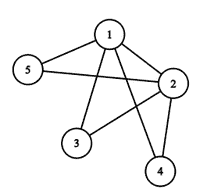

# 用 K 对顶点之间最短距离为 2 的 N 个顶点构建一个图

> 原文:[https://www . geeksforgeeks . org/construct-a-graph-use-n-顶点-其-k-对顶点之间的最短距离为-2/](https://www.geeksforgeeks.org/construct-a-graph-using-n-vertices-whose-shortest-distance-between-k-pair-of-vertices-is-2/)

给定两个正整数 **N** 和 **K** ，任务是构造一个由 **N** 个顶点组成的简单连通图，每个边的长度为 **1** 个单位，使得恰好 **K** 对顶点之间的最短距离为 **2** 。如果无法构建图形，则打印 **-1** 。否则，打印图形的边缘。

**示例:**

> **输入:** N = 5，K = 3
> **输出:** { { 1，2 }、{ 1，3}、{ 1，4 }、{ 1，5 }、{ 2，3 }、{ 2，4 }、{ 2，5 } }
> **解释:**
> 成对顶点之间的距离{ (3，4)、(4，5)、(3，5) }为 2。
> 
> 
> 
> **输入:** N = 5，K = 8
> **输出:** -1

**方法:**按照以下步骤解决问题:

*   由于图是简单且连通的，因此最大可能的边数，比如 **Max** 是**((N–1)*(N–2))/2**。
*   如果 **K** 大于 **Max** ，则打印 **-1** 。
*   初始化一个数组，比如**边[]** ，来存储图的边。
*   否则，首先将所有顶点与 **1** 连接并存储在**边【】**中，然后将所有顶点对 **(i，j)** 连接起来，使得 **i > = 2** 和 **j > i** 并存储在**边【】**中。
*   最后打印**边[]** 数组的第一个**((N–1)+Max–K)**元素。

下面是上述方法的实现:

## C++

```
// C++ program to implement
// the above approach

#include <iostream>
#include <vector>
using namespace std;

// Function to construct the simple and
// connected graph such that the distance
// between exactly K pairs of vertices is 2
void constGraphWithCon(int N, int K)
{

    // Stores maximum possible count
    // of edges in a graph
    int Max = ((N - 1) * (N - 2)) / 2;

    // Base Case
    if (K > Max) {
        cout << -1 << endl;
        return;
    }

    // Stores edges of a graph
    vector<pair<int, int> > ans;

    // Connect all vertices of pairs (i, j)
    for (int i = 1; i < N; i++) {
        for (int j = i + 1; j <= N; j++) {
            ans.emplace_back(make_pair(i, j));
        }
    }

    // Print first ((N - 1) + Max - K)  elements
    // of edges[]
    for (int i = 0; i < (N - 1) + Max - K; i++) {
        cout << ans[i].first << " "
             << ans[i].second << endl;
    }
}

// Driver Code
int main()
{
    int N = 5, K = 3;
    constGraphWithCon(N, K);

    return 0;
}
```

## C

```
// C program to implement
// the above approach

#include <stdio.h>

// Function to construct the simple and
// connected graph such that the distance
// between exactly K pairs of vertices is 2
void constGraphWithCon(int N, int K)
{

    // Stores maximum possible count
    // of edges in a graph
    int Max = ((N - 1) * (N - 2)) / 2;

    // Base Case
    if (K > Max) {
        printf("-1");
        return;
    }

    // Stores count of edges in a graph
    int count = 0;

    // Connect all vertices of pairs (i, j)
    for (int i = 1; i < N; i++) {

        for (int j = i + 1; j <= N; j++) {

            printf("%d %d\n", i, j);

            // Update
            count++;

            if (count == N * (N - 1) / 2 - K)
                break;
        }

        if (count == N * (N - 1) / 2 - K)
            break;
    }
}

// Driver Code
int main()
{
    int N = 5, K = 3;
    constGraphWithCon(N, K);

    return 0;
}
```

## Java 语言(一种计算机语言，尤用于创建网站)

```
// Java program to implement
// the above approach
import java.util.*;

class GFG{

static class pair
{
    int first, second;

    public pair(int first, int second) 
    {
        this.first = first;
        this.second = second;
    }   
}

// Function to construct the simple and connected
// graph such that the distance between
// exactly K pairs of vertices is 2
static void constGraphWithCon(int N, int K)
{

    // Stores maximum possible count
    // of edges in a graph
    int Max = ((N - 1) * (N - 2)) / 2;

    // Base Case
    if (K > Max)
    {
        System.out.print(-1 + "\n");
        return;
    }

    // Stores edges of a graph
    Vector<pair> ans = new Vector<>();

    // Connect all vertices of pairs (i, j)
    for(int i = 1; i < N; i++)
    {
        for(int j = i + 1; j <= N; j++)
        {
            ans.add(new pair(i, j));
        }
    }

    // Print first ((N - 1) + Max - K)  elements
    // of edges[]
    for(int i = 0; i < (N - 1) + Max - K; i++)
    {
        System.out.print(ans.get(i).first + " " +
                         ans.get(i).second +"\n");
    }
}

// Driver Code
public static void main(String[] args)
{
    int N = 5, K = 3;

    constGraphWithCon(N, K);
}
}

// This code is contributed by 29AjayKumar
```

## 蟒蛇 3

```
# Python3 program to implement
# the above approach

# Function to construct the simple and
# connected graph such that the distance
# between exactly K pairs of vertices is 2
def constGraphWithCon(N, K):

    # Stores maximum possible count
    # of edges in a graph
    Max = ((N - 1) * (N - 2)) // 2

    # Base case
    if (K > Max):
        print(-1)
        return

    # Stores edges of a graph
    ans = []

    # Connect all vertices of pairs (i, j)
    for i in range(1, N):
        for j in range(i + 1, N + 1):
            ans.append([i, j])

    # Print first ((N - 1) + Max - K)  elements
    # of edges[]
    for i in range(0, (N - 1) + Max - K):
        print(ans[i][0], ans[i][1], sep = " ")

# Driver code
if __name__ == '__main__':

    N = 5
    K = 3

    constGraphWithCon(N, K)

# This code is contributed by MuskanKalra1
```

## C#

```
// C# program to implement
// the above approach
using System;
using System.Collections.Generic;

public class GFG{

class pair
{
    public int first, second;

    public pair(int first, int second) 
    {
        this.first = first;
        this.second = second;
    }   
}

// Function to construct the simple and connected
// graph such that the distance between
// exactly K pairs of vertices is 2
static void constGraphWithCon(int N, int K)
{

    // Stores maximum possible count
    // of edges in a graph
    int Max = ((N - 1) * (N - 2)) / 2;

    // Base Case
    if (K > Max)
    {
        Console.Write(-1 + "\n");
        return;
    }

    // Stores edges of a graph
    List<pair> ans = new List<pair>();

    // Connect all vertices of pairs (i, j)
    for(int i = 1; i < N; i++)
    {
        for(int j = i + 1; j <= N; j++)
        {
            ans.Add(new pair(i, j));
        }
    }

    // Print first ((N - 1) + Max - K)  elements
    // of edges[]
    for(int i = 0; i < (N - 1) + Max - K; i++)
    {
        Console.Write(ans[i].first + " " +
                         ans[i].second +"\n");
    }
}

// Driver Code
public static void Main(String[] args)
{
    int N = 5, K = 3;
    constGraphWithCon(N, K);
}
}

// This code is contributed by 29AjayKumar
```

## java 描述语言

```
<script>

// Javascript program to implement
// the above approach

class pair
{
    constructor(first, second)
    {
        this[0] = first;
        this[1] = second;
    }
}

// Function to construct the simple and connected
// graph such that the distance between
// exactly K pairs of vertices is 2
function constGraphWithCon(N, K)
{

    // Stores maximum possible count
    // of edges in a graph
    var Max = ((N - 1) * (N - 2)) / 2;

    // Base Case
    if (K > Max)
    {
        document.write(-1 + "<br>");
        return;
    }

    // Stores edges of a graph
    var ans = [];

    // Connect all vertices of pairs (i, j)
    for(var i = 1; i < N; i++)
    {
        for(var j = i + 1; j <= N; j++)
        {
            ans.push([i, j]);
        }
    }

    // Print first ((N - 1) + Max - K)  elements
    // of edges[]
    for(var i = 0; i < (N - 1) + Max - K; i++)
    {
        document.write(ans[i][0] + " " +
                         ans[i][1] +"<br>");
    }
}

// Driver Code
var N = 5, K = 3;
constGraphWithCon(N, K);

</script>
```

**Output:** 

```
1 2
1 3
1 4
1 5
2 3
2 4
2 5
```

***时间复杂度:**O(N<sup>2</sup>)*
***辅助空间:** O(N <sup>2</sup> )*