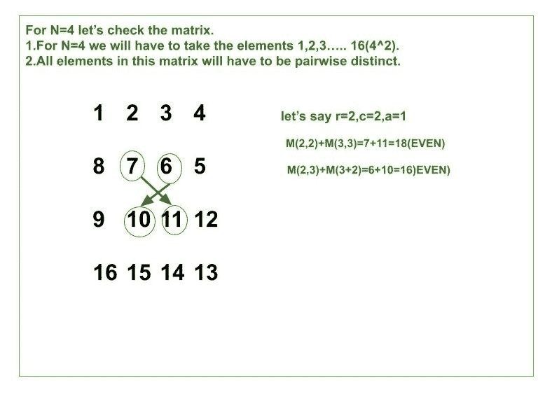

# 用输入 n 的第一 N^2 自然数构造矩阵 n×n

> 原文:[https://www . geeksforgeeks . org/construct-a-matrix-其每个正方形子矩阵的对角线之和为偶数/](https://www.geeksforgeeks.org/construct-a-matrix-whose-sum-of-diagonals-for-each-square-submatrix-is-even/)

给定一个整数 **N** ，任务是构造一个矩阵 **M[][]** ,其大小为 **N x N** ,数字在**【1，n^2】**范围内，条件如下:

1.  矩阵 m 的元素应该是 1 和 N^2.之间的整数
2.  矩阵 M 的所有元素都是成对不同的。
3.  对于包含行 r 到 r+a 和列 c 到 c+a(含)中单元格的每个正方形子矩阵，对于某些有效整数 r、c 和 a>=0: M(r，c)+M(r+a，c+a)为偶数，M(r，c+a)+M(r+a，c)为偶数。

**例:**

> **输入:** N = 2
> **输出:**
> 1 2
> 4 3
> **说明:**
> 这个矩阵有 5 个正方形子矩阵，其中 4 个([1]，[2]，[3]，[4])a = 0，所以满足条件。
> 最后一个正方形子矩阵是整个矩阵 M，其中 r=c=a=1。我们可以看到 M <sub>(1，1)</sub> +M <sub>(2，2)</sub> =1+3=4 和 M <sub>(1，2)</sub> +M <sub>(2，1)</sub> =2+4=6 都是偶数。
> **输入:** N = 4
> **输出:**
> 1 2 3 4
> 8 7 6 5
> 9 10 11 12
> 16 15 14 13

**方法:**我们知道当两个数的奇偶性相同时，两个数的和是偶数。假设 **M <sub>(i，j)</sub>T5】的奇偶性是奇数，这意味着 **M <sub>(i+1，j+1)</sub> 、M <sub>(i+1，j-1)</sub> 、M <sub>(i-1，j+1)</sub> 、M <sub>(i-1，j-1)</sub>** 的奇偶性必须是奇数。
下图为 N = 4 生成大小为 4×4 的矩阵:** 



所以从上图中我们必须填充[棋盘图案](https://en.wikipedia.org/wiki/Checkerboard)中的矩阵。我们可以用两种方式填写:

*   所有黑色单元格都有一个奇数，白色单元格有一个偶数。
*   所有黑色单元格都有一个偶数，白色单元格有一个奇数。

以下是上述方法的实现:

## C++

```
// C++ program for the above approach
#include<bits/stdc++.h>
using namespace std;

// Function to print the desired matrix
void UniqueMatrix(int N)
{
    int element_value = 1;
    int i = 0;

    // element_value will start from 1
    // and go up to N ^ 2

    // i is row number and it starts
    // from 0 and go up to N-1

    // Iterate ove all [0, N]
    while(i < N)
    {

        // If is even
        if(i % 2 == 0)
        {
            for(int f = element_value;
                    f < element_value + N; f++)
            {

                // If row number is even print
                // the row in forward order
                cout << f << " ";
            }
            element_value += N;
        }
        else
        {
            for(int k = element_value + N - 1;
                    k > element_value - 1; k--)
            {

                // If row number is odd print
                // the row in reversed order
                cout << k << " ";

            }
            element_value += N;
        }
        cout << endl;
        i = i + 1;
    }
}

// Driver Code
int main()
{

    // Given matrix size
    int N = 4;

    // Function call
    UniqueMatrix(N);
}

// This code is contributed by chitranayal
```

## Java 语言(一种计算机语言，尤用于创建网站)

```
// Java program for the above approach
public class Gfg
{

    // Function to print the desired matrix
    public static void UniqueMatrix(int N)
    {
        int element_value = 1;
        int i = 0;

        // element_value will start from 1
        // and go up to N ^ 2

        // i is row number and it starts
        // from 0 and go up to N-1

        // Iterate ove all [0, N]
        while(i < N)
        {
            // If is even
            if(i % 2 == 0)
            {
                for(int f = element_value;
                    f < element_value + N; f++)
                {

                    // If row number is even print
                    // the row in forward order
                    System.out.print(f+" ");
                }
                element_value += N;
            }
            else
            {
                for(int k = element_value + N - 1;
                    k > element_value - 1; k--)
                {

                    // If row number is odd print
                    // the row in reversed order
                    System.out.print(k+" ");
                }
                element_value += N;
            }
            System.out.println();
            i = i + 1;
        }
    }

    // Driver Code
    public static void main(String []args)
    {

        // Given matrix size
        int N = 4;

        // Function call
        UniqueMatrix(N);
    }
}

// This code is contributed by avanitrachhadiya2155
```

## 蟒蛇 3

```
# Python3 program for the above approach

# Function to print the desired matrix
def UniqueMatrix(N):

    element_value = 1
    i = 0

    # element_value will start from 1
    # and go up to N ^ 2

    # i is row number and it starts
    # from 0 and go up to N-1

    # Iterate ove all [0, N]
    while(i < N):

        # If is even
        if(i % 2 == 0):

            for f in range(element_value, element_value + N, 1):

                # If row number is even print
                # the row in forward order
                print(f, end =' ')
            element_value += N

        else:

            for k in range(element_value + N-1, element_value-1, -1):

                # if row number is odd print
                # the row in reversed order
                print(k, end =' ')

            element_value += N

        print()
        i = i + 1

# Driver Code

# Given Matrix Size
N = 4

# Function Call
UniqueMatrix(N)
```

## C#

```
// C# program for the above approach
using System;
class GFG
{
    static void UniqueMatrix(int N)
    {
        int element_value = 1;
        int i = 0;

        // element_value will start from 1
        // and go up to N ^ 2

        // i is row number and it starts
        // from 0 and go up to N-1

        // Iterate ove all [0, N]
        while(i < N)
        {

            // If is even
            if(i % 2 == 0)
            {
                for(int f = element_value;
                    f < element_value + N; f++)
                {

                    // If row number is even print
                    // the row in forward order
                    Console.Write(f + " ");
                }
                element_value += N;
            }
            else
            {
                for(int k = element_value + N - 1;
                    k > element_value - 1; k--)
                {
                    Console.Write(k + " ");
                }
                element_value += N;
            }
            Console.WriteLine();
            i = i + 1;
        }
    }

  // Driver code
  static public void Main ()
  {
    // Given matrix size
    int N = 4;

    // Function call
    UniqueMatrix(N);
  }
}

// This code is contributed by rag2127
```

## java 描述语言

```
<script>
// Java script  program for the above approach

    // Function to print the desired matrix
    function  UniqueMatrix( N)
    {
        let element_value = 1;
        let i = 0;

        // element_value will start from 1
        // and go up to N ^ 2

        // i is row number and it starts
        // from 0 and go up to N-1

        // Iterate ove all [0, N]
        while(i < N)
        {
            // If is even
            if(i % 2 == 0)
            {
                for(let f = element_value;
                    f < element_value + N; f++)
                {

                    // If row number is even print
                    // the row in forward order
                    document.write(f+" ");
                }
                element_value += N;
            }
            else
            {
                for(let k = element_value + N - 1;
                    k > element_value - 1; k--)
                {

                    // If row number is odd print
                    // the row in reversed order
                    document.write(k+" ");
                }
                element_value += N;
            }
            document.write("<br>");
            i = i + 1;
        }
    }

    // Driver Code

        // Given matrix size
        let N = 4;

        // Function call
        UniqueMatrix(N);

// contributed by sravan kumar
</script>
```

**Output:** 

```
1 2 3 4 
8 7 6 5 
9 10 11 12 
16 15 14 13
```

***时间复杂度:** O(N^2)*
***辅助空间:** O(N^2)*