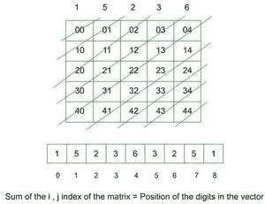

# 基于给定的模式，使用给定数字 N 的数字构造一个正方形矩阵

> 原文:[https://www . geesforgeks . org/construct-a-square-matrix-使用基于给定模式的给定数字 n 位数/](https://www.geeksforgeeks.org/construct-a-square-matrix-using-digits-of-given-number-n-based-on-given-pattern/)

给定一个整数 **N** ，任务是构造一个矩阵**mat【】【】**的大小**M x M**(“M”是给定整数中的位数)使得矩阵的每个**对角线** l 包含相同的**位数，根据给定整数中位数的**位置**放置，然后从后面再次重复上述步骤。**

****

****示例:****

> ****输入:** N = 123
> **输出:** {{1，2，3}，
> {2，3，2}，
> {3，2，1}}
> **说明:**所需矩阵的大小必须为 3*3。N 的位数是 1、2 和 3。沿着对角线放置 1、2 和 3，从左上角单元格到第 n 个对角线，在第 n 个对角线之后放置 2、1，直到最下面的单元格。**
> 
>  ****输入:** N = 3219
> **输出:** {{3，2，1，9}，{2，1，9，1}，{1，9，1，2}，{9，1，2，3}**

****方法:**该任务可以通过以[对角线方式](https://www.geeksforgeeks.org/zigzag-or-diagonal-traversal-of-matrix/)遍历矩阵并根据给定数字中的相应数字分配单元值来解决。**

1.  **[提取给定整数的数字](https://www.geeksforgeeks.org/c-program-to-print-all-digits-of-a-given-number/)并存储在一个向量中，比如 **v** 。**
2.  **对于矩阵的后半对角线，再次以相反的顺序存储数字。**
3.  **按照所需的顺序分配数字。**
4.  **打印矩阵。**

**下面是上述方法的实现:**

## **C++**

```
// C++ program for the above approach
#include <bits/stdc++.h>
using namespace std;

// Function to construct the matrix
void constructMatrix(int n)
{
    // Vector to store the
    // digits of the integer
    vector<int> v;

    // Extracting the digits
    // from the integer
    while (n > 0) {
        v.push_back(n % 10);
        n = n / 10;
    }

    // Reverse the vector
    reverse(v.begin(), v.end());

    // Size of the vector
    int N = v.size();

    // Loop to store the digits in
    // reverse order in the same vector
    for (int i = N - 2; i >= 0; i--) {
        v.push_back(v[i]);
    }

    // Matrix to be constructed
    int mat[N][N];

    // Assign the digits and
    // print the desired matrix
    for (int i = 0; i < N; i++) {
        for (int j = 0; j < N; j++) {
            mat[i][j] = v[i + j];
            cout << mat[i][j] << " ";
        }
        cout << endl;
    }
}

// Driver Code
int main()
{
    int n = 3219;

    // Passing n to constructMatrix function
    constructMatrix(n);

    return 0;
}
```

## **Java 语言(一种计算机语言，尤用于创建网站)**

```
// Java program for the above approach

import java.util.ArrayList;
import java.util.Collections;

class GFG {

    // Function to construct the matrix
    public static void constructMatrix(int n)
    {

        // Vector to store the
        // digits of the integer
        ArrayList<Integer> v = new ArrayList<Integer>();

        // Extracting the digits
        // from the integer
        while (n > 0) {
            v.add(n % 10);
            n = n / 10;
        }

        // Reverse the vector
        Collections.reverse(v);

        // Size of the vector
        int N = v.size();

        // Loop to store the digits in
        // reverse order in the same vector
        for (int i = N - 2; i >= 0; i--) {
            v.add(v.get(i));
        }

        // Matrix to be constructed
        int[][] mat = new int[N][N];

        // Assign the digits and
        // print the desired matrix
        for (int i = 0; i < N; i++) {
            for (int j = 0; j < N; j++) {
                mat[i][j] = v.get(i + j);
                System.out.print(mat[i][j] + " ");
            }
            System.out.println("");
        }
    }

    // Driver Code
    public static void main(String args[]) {
        int n = 3219;

        // Passing n to constructMatrix function
        constructMatrix(n);
    }
}

// This code is contributed by gfgking.
```

## **蟒蛇 3**

```
# python program for the above approach

# Function to construct the matrix
def constructMatrix(n):

    # Vector to store the
    # digits of the integer
    v = []

    # Extracting the digits
    # from the integer
    while (n > 0):
        v.append(n % 10)
        n = n // 10

    # Reverse the vector
    v.reverse()

    # Size of the vector
    N = len(v)

    # Loop to store the digits in
    # reverse order in the same vector
    for i in range(N-2, -1, -1):
        v.append(v[i])

    # Matrix to be constructed
    mat = [[0 for _ in range(N)] for _ in range(N)]

    # Assign the digits and
    # print the desired matrix
    for i in range(0, N):
        for j in range(0, N):
            mat[i][j] = v[i + j]
            print(mat[i][j], end=" ")

        print()

# Driver Code
if __name__ == "__main__":
    n = 3219

    # Passing n to constructMatrix function
    constructMatrix(n)

# This code is contributed by rakeshsahni
```

## **C#**

```
// C# program for the above approach
using System;
using System.Collections.Generic;

class GFG{

// Function to construct the matrix
static void constructMatrix(int n)
{

    // Vector to store the
    // digits of the integer
    List<int> v = new List<int>();

    // Extracting the digits
    // from the integer
    while (n > 0) {
        v.Add(n % 10);
        n = n / 10;
    }

    // Reverse the vector
    v.Reverse();

    // Size of the vector
    int N = v.Count;

    // Loop to store the digits in
    // reverse order in the same vector
    for (int i = N - 2; i >= 0; i--) {
        v.Add(v[i]);
    }

    // Matrix to be constructed
    int[,] mat = new int[N, N];

    // Assign the digits and
    // print the desired matrix
    for (int i = 0; i < N; i++) {
        for (int j = 0; j < N; j++) {
            mat[i, j] = v[i + j];
            Console.Write(mat[i, j] + " ");
        }
        Console.WriteLine();
    }
}

// Driver Code
public static void Main()
{
    int n = 3219;

    // Passing n to constructMatrix function
    constructMatrix(n);
}
}

// This code is contributed by sanjoy_62.
```

## **java 描述语言**

```
<script>
       // JavaScript Program to implement
       // the above approach

       // Function to construct the matrix
       function constructMatrix(n)
       {

           // Vector to store the
           // digits of the integer
           let v = [];

           // Extracting the digits
           // from the integer
           while (n > 0) {
               v.push(n % 10);
               n = Math.floor(n / 10);
           }

           // Reverse the vector
           v.reverse();

           // Size of the vector
           let N = v.length;

           // Loop to store the digits in
           // reverse order in the same vector
           for (let i = N - 2; i >= 0; i--) {
               v.push(v[i]);
           }

           // Matrix to be constructed
           let mat = new Array(N);
           for (let i = 0; i < mat.length; i++) {
               mat[i] = new Array(N).fill(0);
           }

           // Assign the digits and
           // print the desired matrix
           for (let i = 0; i < N; i++) {
               for (let j = 0; j < N; j++) {
                   mat[i][j] = v[i + j];
                   document.write(mat[i][j] + " ");
               }
               document.write("<br>")
           }
       }

       // Driver Code
       let n = 3219;

       // Passing n to constructMatrix function
       constructMatrix(n);

   // This code is contributed by Potta Lokesh
   </script>
```

****Output:** 

```
3 2 1 9 
2 1 9 1 
1 9 1 2 
9 1 2 3
```** 

*****时间复杂度:**O(N<sup>2</sup>)*
***辅助空间:** O(1)***