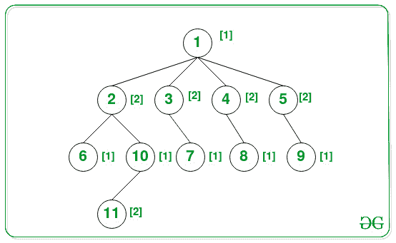

# 构造一棵树，其所有根到叶路径的节点的总和不能被该路径中的节点数所整除

> 原文:[https://www . geeksforgeeks . org/construct-a-tree-其根到叶路径的所有节点的总和不能被该路径中的节点数整除/](https://www.geeksforgeeks.org/construct-a-tree-whose-sum-of-nodes-of-all-the-root-to-leaf-path-is-not-divisible-by-the-count-of-nodes-in-that-path/)

给定由从 **1 到扎根于**节点 1** 的 N 个**节点组成的 [N 元树](https://www.geeksforgeeks.org/generic-treesn-array-trees/)，任务是给树的每个节点赋值，使得从任何[根到包含至少两个节点的叶路径](https://www.geeksforgeeks.org/given-a-binary-tree-print-all-root-to-leaf-paths/)的值之和不能被沿着该路径的节点数整除。

**示例:**

> **输入:** N = 11，边[][] = {{1，2}，{1，3}，{1，4}，{1，5}，{2，6}，{2，10}，{10，11}，{3，7}，{4，8}，{5，9}}
> **输出:**1 2 1 2 2 1 1
> T6】解释:
> 
> [](https://media.geeksforgeeks.org/wp-content/uploads/20210322113051/2499720r.jpg)
> 
> 根据上面的赋值，下面是从根到叶的所有可能路径:
> 
> *   路径 1 → 2 → 6，总和= 1 + 2 + 1 = 4，长度= 3。
> *   路径 1 → 2 → 10 → 11，总和= 1 + 2 + 1 + 2 = 6，长度= 4
> *   路径 1 → 3 → 7，总和= 1 + 2 + 1 = 4，长度= 3。
> *   路径 1 → 4 → 8，总和= 1 + 2 + 1 = 4，长度= 3。
> *   路径 1 → 5 → 9，总和= 1 + 2 + 1 = 4，长度= 3。
> 
> 从以上所有路径来看，没有一条路径的值之和可以被它们的长度整除。
> 
> **输入:** N = 3，边= {{1，2}，{2，3 } }
> T3】输出: 1 2 1

**方法:**给定的问题可以基于以下观察来解决:对于任何具有至少 2 个节点**的[根到叶路径](https://www.geeksforgeeks.org/given-a-binary-tree-print-all-root-to-leaf-paths/)，比如说 **K** 如果沿着该路径的值之和位于 **K** 和 **2*K** 之间，那么该和永远不能被 **K** 整除，因为在 **(K，2*K)** 范围内的任何数都是因此对于 **K = 1** ，将奇数级节点的节点值赋值为 **1** ，其余为 **2** 。按照以下步骤解决问题:**

*   初始化一个[数组](https://www.geeksforgeeks.org/array-data-structure/)，说出**答案【】**的大小 **N + 1** 来存储分配给节点的值。
*   初始化一个变量，说 **K** 为 **1** 给每个节点赋值。
*   初始化一个[队列](https://www.geeksforgeeks.org/queue-data-structure/)，用于在给定的树上执行 [BFS 遍历](https://www.geeksforgeeks.org/breadth-first-search-or-bfs-for-a-graph/)，并将队列中值为 1 的节点[推入，并将该值初始化为节点 **1** 。](https://www.geeksforgeeks.org/queuepush-and-queuepop-in-cpp-stl/)
*   迭代直到[队列非空](https://www.geeksforgeeks.org/queueempty-queuesize-c-stl/)并执行以下步骤:
    *   弹出队列的[前节点，如果分配给弹出节点的值为 **1** ，则将 **K** 的值更新为 **2** 。否则，更新 **K** 为 **1** 。](https://www.geeksforgeeks.org/queuefront-queueback-c-stl/)
    *   遍历当前弹出节点的所有子节点，[将子节点推送到队列](https://www.geeksforgeeks.org/queuepush-and-queuepop-in-cpp-stl/)中，并将值 **K** 赋给子节点。
*   完成上述步骤后，将数组**中存储的值打印为结果答案[]** 。

下面是上述方法的实现:

## C++

```
// C++ program for the above approach
#include "bits/stdc++.h"
using namespace std;

// Function to assign values to nodes
// of the tree s.t. sum of values of
// nodes of path between any 2 nodes
// is not divisible by length of path
void assignValues(int Edges[][2], int n)
{
    // Stores the adjacency list
    vector <int> tree[n + 1];

      // Create a adjacency list
      for(int i = 0; i < n - 1; i++) {

      int u = Edges[i][0];
      int v = Edges[i][1];
      tree[u].push_back(v);
      tree[v].push_back(u);
    }

    // Stores whether node is
      // visited or not
    vector <bool> visited(n + 1, false);

    // Stores the node values
    vector <int> answer(n + 1);

    // Variable used to assign values to
      // the nodes alternatively to the
      // parent child
    int K = 1;

    // Declare a queue
    queue <int> q;

    // Push the 1st node
    q.push(1);

    // Assign K value to this node
    answer[1] = K;

    while (!q.empty()) {

        // Dequeue the node
        int node = q.front();
        q.pop();

        // Mark it as visited
        visited[node] = true;

        // Upgrade the value of K
        K = ((answer[node] == 1) ? 2 : 1);

        // Assign K to the child nodes
        for (auto child : tree[node]) {

            // If the child is unvisited
            if (!visited[child]) {

                // Enqueue the child
                q.push(child);

                // Assign K to the child
                answer[child] = K;
            }
        }
    }

      // Print the value assigned to
      // the nodes
    for (int i = 1; i <= n; i++) {
        cout << answer[i] << " ";
    }
}

// Driver Code
int main()
{
    int N = 11;
    int Edges[][2] = {{1, 2}, {1, 3}, {1, 4},
                      {1, 5}, {2, 6}, {2, 10},
                      {10, 11}, {3, 7}, {4, 8},
                      {5, 9}};

    // Function Call
    assignValues(Edges, N);

    return 0;
}
```

## Java 语言(一种计算机语言，尤用于创建网站)

```
// Java program for the above approach
import java.util.*;

class GFG{

// Function to assign values to nodes
// of the tree s.t. sum of values of
// nodes of path between any 2 nodes
// is not divisible by length of path
static void assignValues(int Edges[][], int n)
{

    // Stores the adjacency list
    ArrayList<ArrayList<Integer>> tree = new ArrayList<>();

    for(int i = 0; i < n + 1; i++)
        tree.add(new ArrayList<>());

    // Create a adjacency list
    for(int i = 0; i < n - 1; i++)
    {
        int u = Edges[i][0];
        int v = Edges[i][1];
        tree.get(u).add(v);
        tree.get(v).add(u);
    }

    // Stores whether node is
    // visited or not
    boolean[] visited = new boolean[n + 1];

    // Stores the node values
    int[] answer = new int[n + 1];

    // Variable used to assign values to
    // the nodes alternatively to the
    // parent child
    int K = 1;

    // Declare a queue
    Queue<Integer> q = new LinkedList<>();

    // Push the 1st node
    q.add(1);

    // Assign K value to this node
    answer[1] = K;

    while (!q.isEmpty())
    {

        // Dequeue the node
        int node = q.peek();
        q.poll();

        // Mark it as visited
        visited[node] = true;

        // Upgrade the value of K
        K = ((answer[node] == 1) ? 2 : 1);

        // Assign K to the child nodes
        for(Integer child : tree.get(node))
        {

            // If the child is unvisited
            if (!visited[child])
            {

                // Enqueue the child
                q.add(child);

                // Assign K to the child
                answer[child] = K;
            }
        }
    }

    // Print the value assigned to
    // the nodes
    for(int i = 1; i <= n; i++)
    {
        System.out.print(answer[i] + " ");
    }
}

// Driver code
public static void main(String[] args)
{
    int N = 11;
    int Edges[][] = { { 1, 2 }, { 1, 3 }, 
                      { 1, 4 }, { 1, 5 },
                      { 2, 6 }, { 2, 10 },
                      { 10, 11 }, { 3, 7 },
                      { 4, 8 }, { 5, 9 } };

    // Function Call
    assignValues(Edges, N);
}
}

// This code is contributed by offbeat
```

## 蟒蛇 3

```
# Python3 program for the above approach
from collections import deque

# Function to assign values to nodes
# of the tree s.t. sum of values of
# nodes of path between any 2 nodes
# is not divisible by length of path
def assignValues(Edges, n):

    # Stores the adjacency list
    tree = [[] for i in range(n + 1)]

    # Create a adjacency list
    for i in range(n - 1):

        u = Edges[i][0]
        v = Edges[i][1]
        tree[u].append(v)
        tree[v].append(u)

    # Stores whether any node is
    # visited or not
    visited = [False]*(n+1)

    # Stores the node values
    answer = [0]*(n + 1)

    # Variable used to assign values to
    # the nodes alternatively to the
    # parent child
    K = 1

    # Declare a queue
    q = deque()

    # Push the 1st node
    q.append(1)

    # Assign K value to this node
    answer[1] = K

    while (len(q) > 0):

        # Dequeue the node
        node = q.popleft()
        # q.pop()

        # Mark it as visited
        visited[node] = True

        # Upgrade the value of K
        K = 2 if (answer[node] == 1) else 1

        # Assign K to the child nodes
        for child in tree[node]:

            # If the child is unvisited
            if (not visited[child]):

                # Enqueue the child
                q.append(child)

                # Assign K to the child
                answer[child] = K

    # Print the value assigned to
    # the nodes
    for i in range(1, n + 1):
        print(answer[i],end=" ")

# Driver Code
if __name__ == '__main__':
    N = 7
    Edges = [ [ 1, 2 ], [ 4, 6 ],
               [ 3, 5 ], [ 1, 4 ],
               [ 7, 5 ], [ 5, 1 ] ]

    # Function Call
    assignValues(Edges, N)

# This code is contributed by mohit kumar 29.
```

## C#

```
// C# program for the above approach
using System;
using System.Collections;
using System.Collections.Generic;

public class GFG{

// Function to assign values to nodes
// of the tree s.t. sum of values of
// nodes of path between any 2 nodes
// is not divisible by length of path
static void assignValues(int[, ] Edges, int n)
{

      // Stores the adjacency list
      LinkedList<int>[] tree = new LinkedList<int>[n+1];

    for(int i = 0; i < n + 1; i++)
        tree[i] = new LinkedList<int>();

    // Create a adjacency list
    for(int i = 0; i < n - 1; i++)
    {
        int u = Edges[i, 0];
        int v = Edges[i, 1];
        tree[u].AddLast(v);
        tree[v].AddLast(u);
    }

    // Stores whether node is
    // visited or not
    bool[] visited = new bool[n + 1];

    // Stores the node values
    int[] answer = new int[n + 1];

    // Variable used to assign values to
    // the nodes alternatively to the
    // parent child
    int K = 1;

    // Declare a queue
    Queue q = new Queue();

    // Push the 1st node
    q.Enqueue(1);

    // Assign K value to this node
    answer[1] = K;

    while (q.Count > 0)
    {

        // Dequeue the node
        int node = (int)q.Peek();
        q.Dequeue();

        // Mark it as visited
        visited[node] = true;

        // Upgrade the value of K
        K = ((answer[node] == 1) ? 2 : 1);

        // Assign K to the child nodes
        foreach (var child in tree[node])
        {

            // If the child is unvisited
            if (!visited[child])
            {

                // Enqueue the child
                q.Enqueue(child);

                // Assign K to the child
                answer[child] = K;
            }
        }
    }

    // Print the value assigned to
    // the nodes
    for(int i = 1; i <= n; i++)
    {
           Console.Write(answer[i] + " ");
    }
}

// Driver code
static public void Main (){

    int N = 11;
    int[, ] Edges = { { 1, 2 }, { 1, 3 }, 
                      { 1, 4 }, { 1, 5 },
                      { 2, 6 }, { 2, 10 },
                      { 10, 11 }, { 3, 7 },
                      { 4, 8 }, { 5, 9 } };

    // Function Call
    assignValues(Edges, N);
}
}

// This code is contributed by Dharanendra L V.
```

## java 描述语言

```
<script>

// Javascript program for the above approach

// Function to assign values to nodes
// of the tree s.t. sum of values of
// nodes of path between any 2 nodes
// is not divisible by length of path
function assignValues(Edges, n)
{
    // Stores the adjacency list
    var tree = Array.from(Array(n+1), ()=> Array());

    // Create a adjacency list
    for(var i = 0; i < n - 1; i++) {

        var u = Edges[i][0];
          var v = Edges[i][1];
          tree[u].push(v);
          tree[v].push(u);
    }

    // Stores whether node is
    // visited or not
    var visited = Array(n + 1).fill(false);

    // Stores the node values
    var answer = Array(n + 1);

    // Variable used to assign values to
    // the nodes alternatively to the
    // parent child
    var K = 1;

    // Declare a queue
    var q = [];

    // Push the 1st node
    q.push(1);

    // Assign K value to this node
    answer[1] = K;

    while (q.length!=0) {

        // Dequeue the node
        var node = q[0];
        q.shift();

        // Mark it as visited
        visited[node] = true;

        // Upgrade the value of K
        K = ((answer[node] == 1) ? 2 : 1);

        // Assign K to the child nodes
        tree[node].forEach(child => {

            // If the child is unvisited
            if (!visited[child]) {

                // Enqueue the child
                q.push(child);

                // Assign K to the child
                answer[child] = K;
            }
        });
    }

      // Print the value assigned to
      // the nodes
    for (var i = 1; i <= n; i++) {
        document.write( answer[i] + " ");
    }
}

// Driver Code
var N = 11;
var Edges = [[1, 2], [1, 3], [1, 4],
                  [1, 5], [2, 6], [2, 10],
                  [10, 11], [3, 7], [4, 8],
                  [5, 9]];
// Function Call
assignValues(Edges, N);

</script>
```

**Output:** 

```
1 2 2 2 2 1 1 1 1 1 2
```

***时间复杂度:** O(N)，其中 N 为树中节点总数。*
***辅助空间:** O(N)*