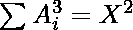
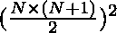
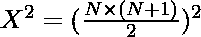
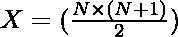

# 构造一个大小为 N 的数组，其所有元素的立方之和为一个完美的正方形

> 原文:[https://www . geeksforgeeks . org/construct-一个 n 大小的数组，其所有元素的立方之和是一个完美的正方形/](https://www.geeksforgeeks.org/construct-an-array-of-size-n-whose-sum-of-cube-of-all-elements-is-a-perfect-square/)

给定一个整数 **N** ，任务是构造一个大小为 **N** 的排序数组**arr【】**，这样所有元素的立方之和就是一个完美的正方形，即，其中 X 是一个整数。

**示例:**

> **输入:** N = 5
> **输出:** 1 2 3 4 5
> **解释**
> 所有元素的立方之和= 1 + 8 + 27 + 64 + 125 = 225
> 这是一个完美的平方数。
> 
> **输入:**N = 1
> T3】输出: 1

**解决方法:**

1.  第一个 N 个自然数的立方之和[由:
    给出](https://www.geeksforgeeks.org/program-cube-sum-first-n-natural-numbers/)
2.  所以，求和本身就是整数的完美平方
3.  因此，无非是 N 个自然数的和。
4.  所以，只需打印前 N 个自然数来构造数组。

下面是上述方法的实现:

## C++

```
// C++ implementation of the
// above approach

#include <bits/stdc++.h>
using namespace std;

// Function to construct an array
// of size N
void constructArray(int N)
{
    for (int i = 1; i <= N; i++) {

        // Prints the first N
        // natural numbers
        cout << i << " ";
    }
}

// Driver code
int main()
{
    int N = 5;
    constructArray(N);
    return 0;
}
```

## Java 语言(一种计算机语言，尤用于创建网站)

```
// Java implementation of the
// above approach
class GFG{

// Function to construct an array
// of size N
public static void constructArray(int N)
{
    for(int i = 1; i <= N; i++)
    {

       // Prints the first N
       // natural numbers
       System.out.print(i + " ");
    }
}

// Driver Code
public static void main(String[] args)
{
    int N = 5;
    constructArray(N);
}
}

// This code is contributed by divyeshrabadiya07   
```

## 蟒蛇 3

```
# Python3 implementation of the
# above approach

# Function to construct an array
# of size N
def constructArray(N):

    for i in range(1, N + 1):

        # Prints the first N
        # natural numbers
        print(i, end = ' ')

# Driver code
if __name__=='__main__':

    N = 5

    constructArray(N)

# This code is contributed by rutvik_56   
```

## C#

```
// C# implementation of the
// above approach
using System;
class GFG{

// Function to construct an array
// of size N
public static void constructArray(int N)
{
    for(int i = 1; i <= N; i++)
    {

        // Prints the first N
        // natural numbers
        Console.Write(i + " ");
    }
}

// Driver Code
public static void Main(String[] args)
{
    int N = 5;
    constructArray(N);
}
}

// This code is contributed by sapnasingh4991
```

## java 描述语言

```
<script>

// JavaScript implementation of the
// above approach

// Function to construct an array
// of size N
function constructArray(N)
{
    for(let i = 1; i <= N; i++)
    {

        // Prints the first N
        // natural numbers
        document.write(i + " ");
    }
}

// Driver code
let N = 5;

constructArray(N);

// This code is contributed by Surbhi Tyagi.

</script>
```

**Output:** 

```
1 2 3 4 5
```

***时间复杂度:** O(N)*
***辅助空间:** O(1)*