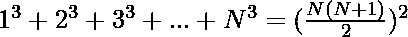

# 构造一个数组，使得所有元素的立方和都是一个完美的正方形

> 原文:[https://www . geesforgeks . org/construct-a-array-so-cube-sum-all-element-is-perfect-square/](https://www.geeksforgeeks.org/construct-an-array-such-that-cube-sum-of-all-element-is-a-perfect-square/)

给定数组 **N** 的大小，任务是用正整数元素构造一个大小为 N 的数组，这样这个数组所有元素的立方和就是一个完美的正方形。
**注意:**允许整数重复。
**例:**

> **输入:** N = 1
> **输出:** 4
> **说明:**4 的立方是 64，64 是正方。
> **输入:** N = 6
> **输出:**5 10 5 10 5
> **解释:**数组元素的三次和为(5)<sup>3</sup>+(10)<sup>3</sup>+(5)<sup>3</sup>+(10)<sup>3</sup>+(5)<sup>3</sup>+(5)
> 输入

**方法:**思路是构造大小为 **N** 的数组，其中首先包含 **N 个自然数**。如果仔细观察，

> 第一 **N** 自然数的立方和:(1)<sup>3</sup>+(2)<sup>3</sup>+(3)<sup>3</sup>+(4)<sup>3</sup>+……。(N) <sup>3</sup> 永远是完美的正方形。
> 为

下面是上述方法的实现。

## C++

```
// C++ program to construct an array
// that cube sum of all element
// is a perfect square

#include <bits/stdc++.h>
using namespace std;

// Function to create
// and print the array
void constructArray(int N)
{
    int arr[N];

    // initialise the array of size N
    for (int i = 1; i <= N; i++) {
        arr[i - 1] = i;
    }

    // Print the array
    for (int i = 0; i < N; i++) {
        cout << arr[i] << ", ";
    }
}

// Driver code
int main()
{
    int N = 6;

    constructArray(N);

    return 0;
}
```

## Java 语言(一种计算机语言，尤用于创建网站)

```
// Java program to construct array
// that cube sum of all element
// is a perfect square
import java.util.*;

class GFG{

// Function to create
// and print the array
static void constructArray(int N)
{
    int arr[] = new int[N];

    // Initialise the array of size N
    for(int i = 1; i <= N; i++)
    {
       arr[i - 1] = i;
    }

    // Print the array
    for(int i = 0; i < N; i++)
    {
        System.out.print(arr[i] + ", ");
    }
}

// Driver code
public static void main(String[] args)
{
    int N = 6;

    constructArray(N);
}
}

// This code is contributed by AbhiThakur
```

## 蟒蛇 3

```
# Python3 program to construct
# array that cube sum of all 
# element is a perfect square

# Function to create
# and print the array
def constructArray(N):

    arr = [0] * N

    # Initialise the array of size N
    for i in range(1, N + 1):
        arr[i - 1] = i;

    # Print the array
    for i in range(N):
        print(arr[i], end = ", ")

# Driver code
N = 6;
constructArray(N);

# This code is contributed by grand_master
```

## C#

```
// C# program to construct array
// that cube sum of all element
// is a perfect square
using System;

class GFG{

// Function to create
// and print the array
static void constructArray(int N)
{
    int []arr = new int[N];

    // Initialise the array of size N
    for(int i = 1; i <= N; i++)
    {
       arr[i - 1] = i;
    }

    // Print the array
    for(int i = 0; i < N; i++)
    {
       Console.Write(arr[i] + ", ");
    }
}

// Driver code
public static void Main()
{
    int N = 6;

    constructArray(N);
}
}

// This code is contributed by Code_Mech
```

## java 描述语言

```
<script>
// JavaScript program to construct an array
// that cube sum of all element
// is a perfect square

// Function to create
// and print the array
function constructArray(N)
{
    let arr = new Array(N);

    // initialise the array of size N
    for (let i = 1; i <= N; i++)
    {
        arr[i - 1] = i;
    }

    // Print the array
    for (let i = 0; i < N; i++)
    {
        document.write(arr[i] + ", ");
    }
}

// Driver code
let N = 6;
constructArray(N);

// This code is contributed by Manoj.
</script>
```

**Output:** 

```
1, 2, 3, 4, 5, 6,
```

***时间复杂度:** O(N)* 其中 N 是数组的大小。
***空间复杂度:** O(1)*