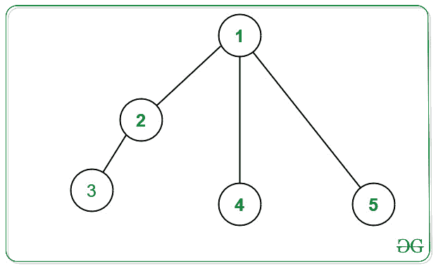

# 从给定的权重中构建一个没有一对相邻节点具有相同权重的 N 元树

> 原文:[https://www . geeksforgeeks . org/construct-an-n-ary-tree-具有来自给定权重的相同权重的无对相邻节点/](https://www.geeksforgeeks.org/construct-an-n-ary-tree-having-no-pair-of-adjacent-nodes-with-same-weight-from-given-weights/)

给定由 **N** 正整数组成的[数组](https://www.geeksforgeeks.org/introduction-to-arrays/) **权重[]** ，其中**权重【I】**表示 **i** <sup>th</sup> 节点的权重，任务是构建一个 [N 元树](https://www.geeksforgeeks.org/generic-treesn-array-trees/)，使得没有两个直接相连的节点具有相同的权重。如果有可能做出这样的树，那么沿着它们的边缘打印**“是”**。否则，打印**“否”**。

**示例:**

> **输入:**权重[]= { 1 2 1 2 5 }
> T3】输出:T5】是
> 1 2
> 1 4
> 1 5
> 2 3
> T11】说明:
> 索引:1 2 3 4 5
> 权重:1 2 1 2 5
> 构建的树如下图所示:
> 
> 
> 
> **输入:**权重[]= { 1 1 1 }
> T3】输出:否
> T6】说明:由于所有权重已经相同，因此无法构建这样的树。

**方法:**解决这个问题的思路是首先检查是否所有节点都分配了相同的权重。如果发现为真，则无法构建所需的树。否则，可以构建这样的树。因此[遍历数组](https://www.geeksforgeeks.org/c-program-to-traverse-an-array/) **权重[]** ，检查所有值是否相同。如果发现是真的，则打印“**否”**。否则，打印**“是”**并按照以下步骤构建树:

*   取**任意节点**，使其成为**根**节点。
*   现在，将权重不等于根的所有其他节点连接到根节点。现在剩下的节点是值等于根节点的节点。
*   选择**根节点**的任何子节点，并将所有剩余节点连接到它们。因此，相同权重的节点之间不存在**直边**。
*   要检查哪些节点尚未包括在内，请使用辅助数组**来跟踪已访问的节点。如果一个节点被访问，加入一个节点，但不要将被访问的节点加入另一个节点，因为将未访问的节点加入被访问的节点是可能的，但反之亦然。**

下面是上述方法的实现:

## C++

```
// C++ program to implement
// the above approach 

#include <bits/stdc++.h>
using namespace std;
const int N = 1e5 + 5;

// Keep track of visited nodes
int visited[N];

// Function to construct a tree such
// that there are no two adjacent
// nodes with the same weight
void construct_tree(int weights[], int n)
{
    int minimum = *min_element(weights, weights + n);
    int maximum = *max_element(weights, weights + n);

    // If minimum and maximum
    // elements are equal, i.e.
    // array contains one distinct element
    if (minimum == maximum) {

        // Tree cannot be constructed
        cout << "No";
        return;
    }

    // Otherwise
    else {

        // Tree can be constructed
        cout << "Yes" << endl;
    }

    // Find the edges below

    // Choose weights[0] as root
    int root = weights[0];

    // First Node is visited
    visited[1] = 1;

    // Traverse the array
    for (int i = 0; i < n; i++) {

        // If current element has the
        // same weight as root and if
        // the node is visited, then
        // do not make an edge

        // Otherwise, make an edge
        if (weights[i] != root
            && visited[i + 1] == 0) {
            cout << 1 << " "
                 << i + 1 << " "
                 << endl;

            // Mark this node as visited
            visited[i + 1] = 1;
        }
    }

    // Find a weight not same as the
    // root & make edges with that node
    int notroot = 0;
    for (int i = 0; i < n; i++) {

        if (weights[i] != root) {
            notroot = i + 1;
            break;
        }
    }

    // Join non-roots with remaining nodes
    for (int i = 0; i < n; i++) {

        // Check if current node's weight
        // is same as root node's weight
        // and if it is not visited or not
        if (weights[i] == root
            && visited[i + 1] == 0) {
            cout << notroot << " "
                 << i + 1 << endl;
            visited[i + 1] = 1;
        }
    }
}

// Driver Code
int main()
{
    int weights[] = { 1, 2, 1, 2, 5 };
    int N = sizeof(weights) / sizeof(weights[0]);

    // Function Call
    construct_tree(weights, N);
}
```

## Java 语言(一种计算机语言，尤用于创建网站)

```
// Java program to implement
// the above approach 
import java.lang.*;
import java.io.*;
import java.util.*;

class GFG{

static int N = 100000 + 5;

// Keep track of visited nodes
static int visited[] = new int[N];

// Function to construct a tree such
// that there are no two adjacent
// nodes with the same weight
static void construct_tree(int weights[], int n)
{
    int minimum = Arrays.stream(weights).min().getAsInt();
    int maximum = Arrays.stream(weights).max().getAsInt();

    // If minimum and maximum
    // elements are equal, i.e.
    // array contains one distinct element
    if (minimum == maximum)
    {

        // Tree cannot be constructed
        System.out.println("No");
        return;
    }

    // Otherwise
    else
    {

        // Tree can be constructed
        System.out.println("Yes");
    }

    // Find the edges below

    // Choose weights[0] as root
    int root = weights[0];

    // First Node is visited
    visited[1] = 1;

    // Traverse the array
    for(int i = 0; i < n; i++)
    {

        // If current element has the
        // same weight as root and if
        // the node is visited, then
        // do not make an edge

        // Otherwise, make an edge
        if (weights[i] != root &&
            visited[i + 1] == 0)
        {
            System.out.println(1 + " " +
                              (i + 1) + " ");

            // Mark this node as visited
            visited[i + 1] = 1;
        }
    }

    // Find a weight not same as the
    // root & make edges with that node
    int notroot = 0;
    for(int i = 0; i < n; i++)
    {
        if (weights[i] != root)
        {
            notroot = i + 1;
            break;
        }
    }

    // Join non-roots with remaining nodes
    for(int i = 0; i < n; i++)
    {

        // Check if current node's weight
        // is same as root node's weight
        // and if it is not visited or not
        if (weights[i] == root &&
            visited[i + 1] == 0)
        {
            System.out.println(notroot + " " +
                                    (i + 1));
            visited[i + 1] = 1;
        }
    }
}

// Driver Code
public static void main(String[] args)
{
    int weights[] = { 1, 2, 1, 2, 5 };
    int N = weights.length;

    // Function Call
    construct_tree(weights, N);
}
}

// This code is contributed by sanjoy_62
```

## 蟒蛇 3

```
# Python3 program to implement
# the above approach 

N = 10**5 + 5

#Keep track of visited nodes
visited=[0]*N

#Function to construct a tree such
#that there are no two adjacent
#nodes with the same weight
def construct_tree(weights, n):
    minimum = min(weights)
    maximum = max(weights)

    #If minimum and maximum
    #elements are equal, i.e.
    #array contains one distinct element
    if (minimum == maximum):

        #Tree cannot be constructed
        print("No")
        return

    #Otherwise
    else:
        print("Yes")

    #Find the edges below

    #Choose weights[0] as root
    root = weights[0]

    #First Node is visited
    visited[1] = 1

    #Traverse the array
    for i in range(n):

        #If current element has the
        #same weight as root and if
        #the node is visited, then
        #do not make an edge

        #Otherwise, make an edge
        if (weights[i] != root
            and visited[i + 1] == 0):
            print(1,i+1)

            #Mark this node as visited
            visited[i + 1] = 1

    #Find a weight not same as the
    #root & make edges with that node
    notroot = 0
    for i in range(n):

        if (weights[i] != root):
            notroot = i + 1
            break

    #Join non-roots with remaining nodes
    for i in range(n):

        #Check if current node's weight
        #is same as root node's weight
        #and if it is not visited or not
        if (weights[i] == root
            and visited[i + 1] == 0):
            print(notroot,i + 1)
            visited[i + 1] = 1

#Driver Code
if __name__ == '__main__':
    weights=[1, 2, 1, 2, 5]

    N = len(weights)

    #Function Call
    construct_tree(weights, N)
```

## C#

```
// C# program to implement
// the above approach 
using System;
using System.Linq;

class GFG{

static int N = 100000 + 5;

// Keep track of visited nodes
static int[] visited = new int[N];

// Function to construct a tree such
// that there are no two adjacent
// nodes with the same weight
static void construct_tree(int[] weights, int n)
{
    int minimum = weights.Min();
    int maximum = weights.Max();

    // If minimum and maximum
    // elements are equal, i.e.
    // array contains one distinct element
    if (minimum == maximum)
    {

        // Tree cannot be constructed
        Console.WriteLine("No");
        return;
    }

    // Otherwise
    else
    {

        // Tree can be constructed
        Console.WriteLine("Yes");
    }

    // Find the edges below

    // Choose weights[0] as root
    int root = weights[0];

    // First Node is visited
    visited[1] = 1;

    // Traverse the array
    for(int i = 0; i < n; i++)
    {

        // If current element has the
        // same weight as root and if
        // the node is visited, then
        // do not make an edge

        // Otherwise, make an edge
        if (weights[i] != root &&
            visited[i + 1] == 0)
        {
             Console.WriteLine(1 + " " + (i + 1) + " ");

            // Mark this node as visited
            visited[i + 1] = 1;
        }
    }

    // Find a weight not same as the
    // root & make edges with that node
    int notroot = 0;
    for(int i = 0; i < n; i++)
    {
        if (weights[i] != root)
        {
            notroot = i + 1;
            break;
        }
    }

    // Join non-roots with remaining nodes
    for(int i = 0; i < n; i++)
    {

        // Check if current node's weight
        // is same as root node's weight
        // and if it is not visited or not
        if (weights[i] == root &&
            visited[i + 1] == 0)
        {
            Console.WriteLine(notroot + " " +
                                    (i + 1));
            visited[i + 1] = 1;
        }
    }
}

// Driver Code
public static void Main()
{
    int[] weights = { 1, 2, 1, 2, 5 };
    int N = weights.Length;

    // Function Call
    construct_tree(weights, N);
}
}

// This code is contributed by code_hunt.
```

## java 描述语言

```
<script>

// Javascript program to implement
// the above approach
let N = 100000 + 5;

// Keep track of visited nodes
let visited = new Array(N);
visited.fill(0);

// Function to construct a tree such
// that there are no two adjacent
// nodes with the same weight
function construct_tree(weights, n)
{
    let minimum = Number.MAX_VALUE;
    let maximum = Number.MIN_VALUE;

    for(let i = 0; i < weights.length; i++)
    {
        minimum = Math.min(minimum, weights[i]);
        maximum = Math.max(maximum, weights[i]);
    }

    // If minimum and maximum
    // elements are equal, i.e.
    // array contains one distinct element
    if (minimum == maximum)
    {

        // Tree cannot be constructed
        document.write("No");
        return;
    }

    // Otherwise
    else
    {

        // Tree can be constructed
        document.write("Yes" + "</br>");
    }

    // Find the edges below

    // Choose weights[0] as root
    let root = weights[0];

    // First Node is visited
    visited[1] = 1;

    // Traverse the array
    for(let i = 0; i < n; i++)
    {

        // If current element has the
        // same weight as root and if
        // the node is visited, then
        // do not make an edge

        // Otherwise, make an edge
        if (weights[i] != root &&
            visited[i + 1] == 0)
        {
            document.write(1 + " " +
                          (i + 1) + "</br>");

            // Mark this node as visited
            visited[i + 1] = 1;
        }
    }

    // Find a weight not same as the
    // root & make edges with that node
    let notroot = 0;
    for(let i = 0; i < n; i++)
    {
        if (weights[i] != root)
        {
            notroot = i + 1;
            break;
        }
    }

    // Join non-roots with remaining nodes
    for(let i = 0; i < n; i++)
    {

        // Check if current node's weight
        // is same as root node's weight
        // and if it is not visited or not
        if (weights[i] == root &&
            visited[i + 1] == 0)
        {
            document.write(notroot + " " +
                                (i + 1) + "</br>");
            visited[i + 1] = 1;
        }
    }
}

// Driver code
let weights = [ 1, 2, 1, 2, 5 ];
let n = weights.length;

// Function Call
construct_tree(weights, n);

// This code is contributed by divyeshrabadiya07

</script>
```

**Output:** 

```
Yes
1 2 
1 4 
1 5 
2 3
```

***时间复杂度:**O(N)*
T5**辅助空间:** O(N)