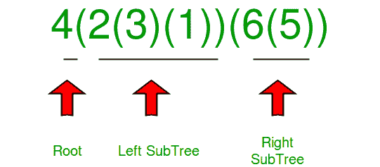

# 用括号表示的字符串构造二叉树

> 原文:[https://www . geesforgeks . org/construct-二叉树-字符串-括号-表示/](https://www.geeksforgeeks.org/construct-binary-tree-string-bracket-representation/)

从由括号和整数组成的字符串构造二叉树。整个输入代表一棵二叉树。它包含一个整数，后跟零、一对或两对括号。该整数表示根的值，一对括号包含具有相同结构的子二叉树。如果父节点存在，总是首先开始构造父节点的左子节点。

**示例:**

```
Input : "1(2)(3)" 
Output : 1 2 3
Explanation :
           1
          / \
         2   3
Explanation: first pair of parenthesis contains 
left subtree and second one contains the right 
subtree. Preorder of above tree is "1 2 3".  

Input : "4(2(3)(1))(6(5))"
Output : 4 2 3 1 6 5
Explanation :
           4
         /   \
        2     6
       / \   / 
      3   1 5   
```

我们知道字符串中的第一个字符是根。第一对相邻括号内的子字符串代表左子树，第二对括号内的子字符串代表右子树，如下图所示。



我们需要找到对应于左子树的子串和对应于右子树的子串，然后递归调用这两个子串。

为此，首先找到每个子串的起始索引和结束索引的索引。
要找到左子树子串右括号的索引，使用栈。让找到的索引存储在索引变量中。

## C++

```
/* C++ program to construct a binary tree from
   the given string */
#include <bits/stdc++.h>
using namespace std;

/* A binary tree node has data, pointer to left
   child and a pointer to right child */
struct Node {
    int data;
    Node *left, *right;
};
/* Helper function that allocates a new node */
Node* newNode(int data)
{
    Node* node = (Node*)malloc(sizeof(Node));
    node->data = data;
    node->left = node->right = NULL;
    return (node);
}

/* This function is here just to test  */
void preOrder(Node* node)
{
    if (node == NULL)
        return;
    printf("%d ", node->data);
    preOrder(node->left);
    preOrder(node->right);
}

// function to return the index of close parenthesis
int findIndex(string str, int si, int ei)
{
    if (si > ei)
        return -1;

    // Inbuilt stack
    stack<char> s;

    for (int i = si; i <= ei; i++) {

        // if open parenthesis, push it
        if (str[i] == '(')
            s.push(str[i]);

        // if close parenthesis
        else if (str[i] == ')') {
            if (s.top() == '(') {
                s.pop();

                // if stack is empty, this is
                // the required index
                if (s.empty())
                    return i;
            }
        }
    }
    // if not found return -1
    return -1;
}

// function to construct tree from string
Node* treeFromString(string str, int si, int ei)
{
    // Base case
    if (si > ei)
        return NULL;

    // new root
    Node* root = newNode(str[si] - '0');
    int index = -1;

    // if next char is '(' find the index of
    // its complement ')'
    if (si + 1 <= ei && str[si + 1] == '(')
        index = findIndex(str, si + 1, ei);

    // if index found
    if (index != -1) {

        // call for left subtree
        root->left = treeFromString(str, si + 2, index - 1);

        // call for right subtree
        root->right
            = treeFromString(str, index + 2, ei - 1);
    }
    return root;
}

// Driver Code
int main()
{
    string str = "4(2(3)(1))(6(5))";
    Node* root = treeFromString(str, 0, str.length() - 1);
    preOrder(root);
}
```

## Java 语言(一种计算机语言，尤用于创建网站)

```
/* Java program to cona binary tree from
   the given String */
import java.util.*;
class GFG
{

  /* A binary tree node has data, pointer to left
   child and a pointer to right child */
  static class Node
  {
    int data;
    Node left, right;
  };

  /* Helper function that allocates a new node */
  static Node newNode(int data)
  {
    Node node = new Node();
    node.data = data;
    node.left = node.right = null;
    return (node);
  }

  /* This function is here just to test  */
  static void preOrder(Node node)
  {
    if (node == null)
      return;
    System.out.printf("%d ", node.data);
    preOrder(node.left);
    preOrder(node.right);
  }

  // function to return the index of close parenthesis
  static int findIndex(String str, int si, int ei)
  {
    if (si > ei)
      return -1;

    // Inbuilt stack
    Stack<Character> s = new Stack<>();
    for (int i = si; i <= ei; i++)
    {

      // if open parenthesis, push it
      if (str.charAt(i) == '(')
        s.add(str.charAt(i));

      // if close parenthesis
      else if (str.charAt(i) == ')')
      {
        if (s.peek() == '(')
        {
          s.pop();

          // if stack is empty, this is
          // the required index
          if (s.isEmpty())
            return i;
        }
      }
    }

    // if not found return -1
    return -1;
  }

  // function to contree from String
  static Node treeFromString(String str, int si, int ei)
  {

    // Base case
    if (si > ei)
      return null;

    // new root
    Node root = newNode(str.charAt(si) - '0');
    int index = -1;

    // if next char is '(' find the index of
    // its complement ')'
    if (si + 1 <= ei && str.charAt(si+1) == '(')
      index = findIndex(str, si + 1, ei);

    // if index found
    if (index != -1)
    {

      // call for left subtree
      root.left = treeFromString(str, si + 2, index - 1);

      // call for right subtree
      root.right
        = treeFromString(str, index + 2, ei - 1);
    }
    return root;
  }

  // Driver Code
  public static void main(String[] args)
  {
    String str = "4(2(3)(1))(6(5))";
    Node root = treeFromString(str, 0, str.length() - 1);
    preOrder(root);
  }
}

// This code is contributed by gauravrajput1
```

## 计算机编程语言

```
# Python3 program to conStruct a
# binary tree from the given String

# Helper class that allocates a new node

class newNode:
    def __init__(self, data):
        self.data = data
        self.left = self.right = None

# This function is here just to test

def preOrder(node):
    if (node == None):
        return
    print(node.data, end=" ")
    preOrder(node.left)
    preOrder(node.right)

# function to return the index of
# close parenthesis

def findIndex(Str, si, ei):
    if (si > ei):
        return -1

    # Inbuilt stack
    s = []
    for i in range(si, ei + 1):

        # if open parenthesis, push it
        if (Str[i] == '('):
            s.append(Str[i])

        # if close parenthesis
        elif (Str[i] == ')'):
            if (s[-1] == '('):
                s.pop(-1)

                # if stack is empty, this is
                # the required index
                if len(s) == 0:
                    return i
    # if not found return -1
    return -1

# function to conStruct tree from String

def treeFromString(Str, si, ei):

    # Base case
    if (si > ei):
        return None

    # new root
    root = newNode(ord(Str[si]) - ord('0'))
    index = -1

    # if next char is '(' find the
    # index of its complement ')'
    if (si + 1 <= ei and Str[si + 1] == '('):
        index = findIndex(Str, si + 1, ei)

    # if index found
    if (index != -1):

        # call for left subtree
        root.left = treeFromString(Str, si + 2,
                                   index - 1)

        # call for right subtree
        root.right = treeFromString(Str, index + 2,
                                    ei - 1)
    return root

# Driver Code
if __name__ == '__main__':
    Str = "4(2(3)(1))(6(5))"
    root = treeFromString(Str, 0, len(Str) - 1)
    preOrder(root)

# This code is contributed by pranchalK
```

## C#

```
/* C# program to cona binary tree from
   the given String */
using System;
using System.Collections.Generic;

public class GFG
{

  /* A binary tree node has data, pointer to left
   child and a pointer to right child */
  public

 class Node
  {
    public

 int data;
    public

 Node left, right;
  };

  /* Helper function that allocates a new node */
  static Node newNode(int data)
  {
    Node node = new Node();
    node.data = data;
    node.left = node.right = null;
    return (node);
  }

  /* This function is here just to test  */
  static void preOrder(Node node)
  {
    if (node == null)
      return;
    Console.Write("{0} ", node.data);
    preOrder(node.left);
    preOrder(node.right);
  }

  // function to return the index of close parenthesis
  static int findIndex(String str, int si, int ei)
  {
    if (si > ei)
      return -1;

    // Inbuilt stack
    Stack<char> s = new Stack<char>();
    for (int i = si; i <= ei; i++)
    {

      // if open parenthesis, push it
      if (str[i] == '(')
        s.Push(str[i]);

      // if close parenthesis
      else if (str[i] == ')')
      {
        if (s.Peek() == '(')
        {
          s.Pop();

          // if stack is empty, this is
          // the required index
          if (s.Count==0)
            return i;
        }
      }
    }

    // if not found return -1
    return -1;
  }

  // function to contree from String
  static Node treeFromString(String str, int si, int ei)
  {

    // Base case
    if (si > ei)
      return null;

    // new root
    Node root = newNode(str[si] - '0');
    int index = -1;

    // if next char is '(' find the index of
    // its complement ')'
    if (si + 1 <= ei && str[si+1] == '(')
      index = findIndex(str, si + 1, ei);

    // if index found
    if (index != -1)
    {

      // call for left subtree
      root.left = treeFromString(str, si + 2, index - 1);

      // call for right subtree
      root.right
        = treeFromString(str, index + 2, ei - 1);
    }
    return root;
  }

  // Driver Code
  public static void Main(String[] args)
  {
    String str = "4(2(3)(1))(6(5))";
    Node root = treeFromString(str, 0, str.Length - 1);
    preOrder(root);
  }
}

// This code is contributed by gauravrajput1
```

## java 描述语言

```
<script>
/* Javascript program to cona binary tree from
   the given String */

 /* A binary tree node has data, pointer to left
   child and a pointer to right child */
class Node
{
    constructor()
    {
        this.data = 0;
        this.left = this.right = null;
    }
}

/* Helper function that allocates a new node */
function newNode(data)
{
    let node = new Node();
    node.data = data;
    node.left = node.right = null;
    return (node);
}

/* This function is here just to test  */
function preOrder(node)
{
    if (node == null)
      return;
    document.write(node.data + " ");
    preOrder(node.left);
    preOrder(node.right);
}

  // function to return the index of close parenthesis
function findIndex(str, si, ei)
{
    if (si > ei)
      return -1;

    // Inbuilt stack
    let s = [];
    for (let i = si; i <= ei; i++)
    {

      // if open parenthesis, push it
      if (str[i] == '(')
        s.push(str[i]);

      // if close parenthesis
      else if (str[i] == ')')
      {
        if (s[s.length-1] == '(')
        {
          s.pop();

          // if stack is empty, this is
          // the required index
          if (s.length == 0)
            return i;
        }
      }
    }

    // if not found return -1
    return -1;
}

// function to contree from String
function treeFromString(str,si,ei)
{
    // Base case
    if (si > ei)
      return null;

    // new root
    let root = newNode(str[si].charCodeAt(0) - '0'.charCodeAt(0));
    let index = -1;

    // if next char is '(' find the index of
    // its complement ')'
    if (si + 1 <= ei && str[si + 1] == '(')
      index = findIndex(str, si + 1, ei);

    // if index found
    if (index != -1)
    {

      // call for left subtree
      root.left = treeFromString(str, si + 2, index - 1);

      // call for right subtree
      root.right
        = treeFromString(str, index + 2, ei - 1);
    }
    return root;
}

 // Driver Code
let str = "4(2(3)(1))(6(5))";
let root = treeFromString(str, 0, str.length - 1);
preOrder(root);

// This code is contributed by patel2127
</script>
```

**Output**

```
4 2 3 1 6 5 
```

**时间复杂度:**O(N<sup>2</sup>)
T5】辅助空间: O(N)

**另一种递归方法:**

算法:

1.  字符串的第一个元素是根。
2.  如果接下来的两个连续元素是“(”和“)”，这意味着没有左子节点，否则我们将创建并递归地将左子节点添加到父节点。
3.  一旦左边的子节点被递归添加，我们将寻找连续的”("并将右边的子节点添加到父节点。
4.  “相遇”)意味着左边或右边节点的结束，我们将增加开始索引
5.  当开始索引大于等于结束索引时，递归结束

## C++

```
#include <bits/stdc++.h>
using namespace std;

// custom data type for tree building
struct Node {
    int data;
    struct Node* left;
    struct Node* right;
    Node(int val)
    {
        data = val;
        left = right = NULL;
    }
};

// Below function accepts string and a pointer variable as
// an argument
// and draw the tree. Returns the root of the tree
Node* constructtree(string s, int* start)
{
    // Assuming there is/are no negative
    // character/characters in the string
    if (s.size() == 0 || *start >= s.size())
        return NULL;

    // constructing a number from the continuous digits
    int num = 0;
    while (*start < s.size() && s[*start] != '('
           && s[*start] != ')') {
        int num_here = (int)(s[*start] - '0');
        num = num * 10 + num_here;
        *start = *start + 1;
    }

    // creating a node from the constructed number from
    // above loop
    struct Node* root = new Node(num);

    // check if start has reached the end of the string
    if (*start >= s.size())
        return root;

    // As soon as we see first right parenthesis from the
    // current node we start to construct the tree in the
    // left
    if (*start < s.size() && s[*start] == '(') {
        *start = *start + 1;
        root->left = constructtree(s, start);
    }
    if (*start < s.size() && s[*start] == ')')
        *start = *start + 1;

    // As soon as we see second right parenthesis from the
    // current node we start to construct the tree in the
    // right
    if (*start < s.size() && s[*start] == '(') {
        *start = *start + 1;
        root->right = constructtree(s, start);
    }
    if (*start < s.size() && s[*start] == ')')
        *start = *start + 1;
    return root;
}
void preorder(Node* root)
{
    if (root == NULL)
        return;
    cout << root->data << " ";
    preorder(root->left);
    preorder(root->right);
}
int main()
{
    string s = "4(2(3)(1))(6(5))";
    // cin>>s;
    int start = 0;
    Node* root = constructtree(s, &start);
    preorder(root);
    return 0;
}
//This code is contributed by Chaitanya Sharma.
```

## Java 语言(一种计算机语言，尤用于创建网站)

```
import java.io.*;
import java.util.*;

class GFG{

// Node class for the Tree
static class Node
{
    int data;
    Node left,right;

    Node(int data)
    {
        this.data = data;
        this.left = this.right = null;
    }
}

// static variable to point to the
// starting index of the string.
static int start = 0;

// Construct Tree Function which accepts
// a string and return root of the tree;
static Node constructTree(String s)
{

    // Check for null or empty string
    // and return null;
    if (s.length() == 0 || s == null)
    {
        return null;
    }

    if (start >= s.length())
        return null;

    // Boolean variable to check
    // for negative numbers
    boolean neg = false;

    // Condition to check for negative number
    if (s.charAt(start) == '-')
    {
        neg = true;
        start++;
    }

    // This loop basically construct the
    // number from the continuous digits
    int num = 0;
    while (start < s.length() &&
           Character.isDigit(s.charAt(start)))
    {
        int digit = Character.getNumericValue(
            s.charAt(start));
        num = num * 10 + digit;
        start++;
    }

    // If string contains - minus sign
    // then append - to the number;
    if (neg)
        num = -num;

    // Create the node object i.e. root of
    // the tree with data = num;
    Node node = new Node(num);

    if (start >= s.length())
    {
        return node;
    }

    // Check for open bracket and add the
    // data to the left subtree recursively
    if (start < s.length() && s.charAt(start) == '(' )
    {
        start++;
        node.left = constructTree(s);
    }

    if (start < s.length() && s.charAt(start) == ')')
    {
        start++;
        return node;
    }

    // Check for open bracket and add the data
    // to the right subtree recursively
    if (start < s.length() && s.charAt(start) == '(')
    {
        start++;
        node.right = constructTree(s);
    }

    if (start < s.length() && s.charAt(start) == ')')
    {
        start++;
        return node;
    }
    return node;
}

// Print tree function
public static void printTree(Node node)
{
    if (node == null)
        return;

    System.out.println(node.data + " ");
    printTree(node.left);
    printTree(node.right);
}

// Driver Code
public static void main(String[] args)
{

    // Input
    String s = "4(2(3)(1))(6(5))";

    // Call the function cunstruct tree
    // to create the tree pass the string;
    Node root = constructTree(s);

    // Function to print preorder of the tree
    printTree(root);
}
}

// This code is contributed by yash181999
```

## 蟒蛇 3

```
class newNode:
    def __init__(self, data):
        self.data = data
        self.left = self.right = None

def preOrder(node):
    if (node == None):
        return
    print(node.data, end=" ")
    preOrder(node.left)
    preOrder(node.right)

def treeFromStringHelper(si, ei, arr, root):

    if si[0] >= ei:
        return None

    if arr[si[0]] == "(":

        if arr[si[0]+1] != ")":
            if root.left is None:
                if si[0] >= ei:
                    return
                new_root = newNode(arr[si[0]+1])
                root.left = new_root
                si[0] += 2
                treeFromStringHelper(si, ei, arr, new_root)

        else:
            si[0] += 2

        if root.right is None:
            if si[0] >= ei:
                return

            if arr[si[0]] != "(":
                si[0] += 1
                return

            new_root = newNode(arr[si[0]+1])
            root.right = new_root
            si[0] += 2
            treeFromStringHelper(si, ei, arr, new_root)
        else:
            return

    if arr[si[0]] == ")":
        if si[0] >= ei:
            return
        si[0] += 1
        return

    return

def treeFromString(string):

    root = newNode(string[0])

    if len(string) > 1:
        si = [1]
        ei = len(string)-1

        treeFromStringHelper(si, ei, string, root)

    return root

# Driver Code
if __name__ == '__main__':
    Str = "4(2(3)(1))(6(5))"
    root = treeFromString(Str)
    preOrder(root)

# This code is contributed by dheerajalimchandani
```

## C#

```
using System;
class GFG {

    // Class containing left and
    // right child of current
    // node and key value
    class Node {

        public int data;
        public Node left, right;

        public Node(int data)
        {
            this.data = data;
            left = right = null;
        }
    }

    // static variable to point to the
    // starting index of the string.
    static int start = 0;

    // Construct Tree Function which accepts
    // a string and return root of the tree;
    static Node constructTree(string s)
    {

        // Check for null or empty string
        // and return null;
        if (s.Length == 0 || s == null)
        {
            return null;
        }

        if (start >= s.Length)
            return null;

        // Boolean variable to check
        // for negative numbers
        bool neg = false;

        // Condition to check for negative number
        if (s[start] == '-')
        {
            neg = true;
            start++;
        }

        // This loop basically construct the
        // number from the continuous digits
        int num = 0;
        while (start < s.Length &&
               Char.IsDigit(s[start]))
        {
            int digit = (int)Char.GetNumericValue(
                s[start]);
            num = num * 10 + digit;
            start++;
        }

        // If string contains - minus sign
        // then append - to the number;
        if (neg)
            num = -num;

        // Create the node object i.e. root of
        // the tree with data = num;
        Node node = new Node(num);

        if (start >= s.Length)
        {
            return node;
        }

        // Check for open bracket and add the
        // data to the left subtree recursively
        if (start < s.Length && s[start] == '(' )
        {
            start++;
            node.left = constructTree(s);
        }

        if (start < s.Length && s[start] == ')')
        {
            start++;
            return node;
        }

        // Check for open bracket and add the data
        // to the right subtree recursively
        if (start < s.Length && s[start] == '(')
        {
            start++;
            node.right = constructTree(s);
        }

        if (start < s.Length && s[start] == ')')
        {
            start++;
            return node;
        }
        return node;
    }

    // Print tree function
    static void printTree(Node node)
    {
        if (node == null)
            return;

        Console.Write(node.data + " ");
        printTree(node.left);
        printTree(node.right);
    }

  // Driver code
  static void Main()
  {

    // Input
    string s = "4(2(3)(1))(6(5))";

    // Call the function cunstruct tree
    // to create the tree pass the string;
    Node root = constructTree(s);

    // Function to print preorder of the tree
    printTree(root);
  }
}

// This code is contributed by decode2207.
```

## java 描述语言

```
<script>

// Node class for the Tree
class Node
{
    constructor(data)
    {
        this.data=data;
        this.left = this.right = null;
    }
}

// static variable to point to the
// starting index of the string.
let start = 0;

// Construct Tree Function which accepts
// a string and return root of the tree;
function constructTree(s)
{
    // Check for null or empty string
    // and return null;
    if (s.length == 0 || s == null)
    {
        return null;
    }

    if (start >= s.length)
        return null;

    // Boolean variable to check
    // for negative numbers
    let neg = false;

    // Condition to check for negative number
    if (s[start] == '-')
    {
        neg = true;
        start++;
    }

    // This loop basically construct the
    // number from the continuous digits
    let num = 0;
    while (start < s.length && !isNaN(s[start] -
    parseInt(s[start])))
    {
        let digit = parseInt(
            s[start]);
        num = num * 10 + digit;
        start++;
    }

    // If string contains - minus sign
    // then append - to the number;
    if (neg)
        num = -num;

    // Create the node object i.e. root of
    // the tree with data = num;
    let node = new Node(num);

    if (start >= s.length)
    {
        return node;
    }

    // Check for open bracket and add the
    // data to the left subtree recursively
    if (start < s.length && s[start] == '(' )
    {
        start++;
        node.left = constructTree(s);
    }

    if (start < s.length && s[start] == ')')
    {
        start++;
        return node;
    }

    // Check for open bracket and add the data
    // to the right subtree recursively
    if (start < s.length && s[start] == '(')
    {
        start++;
        node.right = constructTree(s);
    }

    if (start < s.length && s[start] == ')')
    {
        start++;
        return node;
    }
    return node;
}

// Print tree function
function printTree(node)
{
    if (node == null)
        return;

    document.write(node.data + " ");
    printTree(node.left);
    printTree(node.right);
}

// Driver Code
// Input
let s = "4(2(3)(1))(6(5))";

// Call the function cunstruct tree
// to create the tree pass the string;
let root = constructTree(s);

// Function to print preorder of the tree
printTree(root);

// This code is contributed by unknown2108

</script>
```

**Output**

```
4 2 3 1 6 5 
```

本文由 [**查哈维**](https://auth.geeksforgeeks.org/profile.php?user=chhavi saini 1) 供稿。如果你喜欢 GeeksforGeeks 并想投稿，你也可以使用[contribute.geeksforgeeks.org](http://www.contribute.geeksforgeeks.org)写一篇文章或者把你的文章邮寄到 review-team@geeksforgeeks.org。看到你的文章出现在极客博客主页上，帮助其他极客。
如果发现有不正确的地方，或者想分享更多关于上述话题的信息，请写评论。