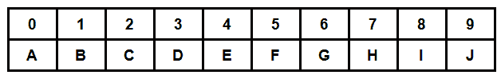

# 根据给定条件

构建密码串

> 原文:[https://www . geeksforgeeks . org/基于给定条件构造字符串/](https://www.geeksforgeeks.org/construct-the-cypher-string-based-on-the-given-conditions/)

给定一个数字 **N** ，任务是根据以下条件将给定的数字转换成密码字符串:

*   如果 **N** 是一个[半素](https://www.geeksforgeeks.org/check-whether-number-semiprime-not/)，那么将 N 的偶数处的每一个数字都改为其对应的匹配字母，如下所示。
*   如果 **N** 可以写成两个素数的[和，那么将 N 的奇数位的每一个数字都改成它对应的匹配字母表，如下所示。](https://www.geeksforgeeks.org/find-two-prime-numbers-with-given-sum/)
*   如果两个条件都满足，则连接上述两个字符串。
*   如果 N 不能满足以上三个标准，那么打印“-1”。

下面是匹配字符的列表:



**示例:**

> **输入:** N = 61
> **输出:** 6B
> **解释:**
> 由于 61 可以表示为两个素数之和:61 = 2 + 59
> 因此，在偶数索引处改变字符后得到的字符串为“6B”。
> **输入:** N = 1011243
> **输出:** B0B1C4D
> **说明:**
> 由于 1011243 是半素数:1011243 = 3 * 337081
> 因此，在偶数索引处改变字符后得到的字符串为“B0B1C4D”。

**进场:**

*   使用本文[中讨论的方法检查给定的数字 **N** 是否为](https://www.geeksforgeeks.org/check-whether-number-semiprime-not/)[半素数](https://www.geeksforgeeks.org/check-whether-number-semiprime-not/)。如果是，请执行以下操作:
    *   使用 [to_string()](https://www.geeksforgeeks.org/stdto_string-in-cpp/) 功能将给定的数字 **N** 转换为字符串(比如 **str** )。
    *   遍历上面形成的字符串，并将偶数索引处的字符更改为:

```
str[i] = char((str[i] - '0') + 65)
```

*   打印新形成的字符串。
*   使用[这篇](https://www.geeksforgeeks.org/check-if-a-prime-number-can-be-expressed-as-sum-of-two-prime-numbers/)文章中讨论的方法，检查给定的数 **N** 是否可以表示为两个素数的和。如果是，请执行以下操作:
    *   使用 [to_string()](https://www.geeksforgeeks.org/stdto_string-in-cpp/) 功能将给定的数字 **N** 转换为字符串(比如 **str** )。
    *   遍历上面形成的字符串，并将奇数索引处的字符更改为:

```
str[i] = char((str[i] - '0') + 65)
```

*   打印新形成的字符串。
*   如果以上两个条件不满足，那么我们就不能形成密码串。打印**-1”**。

以下是上述方法的实现:

## C++

```
// C++ program for the above approach

#include "bits/stdc++.h"
using namespace std;

// Function to check whether a number
// is prime or not
bool isPrime(int n)
{
    if (n <= 1)
        return false;

    for (int i = 2; i <= sqrt(n); i++) {
        if (n % i == 0)
            return false;
    }

    return true;
}

// Function to check if a prime number
// can be expressed as sum of
// two Prime Numbers
bool isPossibleSum(int N)
{
    // If the N && (N-2) is Prime
    if (isPrime(N)
        && isPrime(N - 2)) {
        return true;
    }
    else {
        return false;
    }
}

// Function to check semiPrime
bool checkSemiprime(int num)
{
    int cnt = 0;

    // Loop from 2 to sqrt(num)
    for (int i = 2; cnt < 2
                    && i * i <= num;
         ++i) {
        while (num % i == 0) {
            num /= i,

                // Increment the count of
                // prime numbers
                ++cnt;
        }
    }

    // If num is greater than 1, then
    // add 1 to it
    if (num > 1) {
        ++cnt;
    }

    // Return '1' if count is 2 else
    // return '0'
    return cnt == 2;
}

// Function to make the Cypher string
void makeCypherString(int N)
{

    // Resultant string
    string semiPrime = "";
    string sumOfPrime = "";

    // Make string for the number N
    string str = to_string(N);

    // Check for semiPrime
    if (checkSemiprime(N)) {

        // Traverse to make Cypher string
        for (int i = 0; str[i]; i++) {

            // If index is odd add the
            // current character
            if (i & 1) {
                semiPrime += str[i];
            }

            // Else current character is
            // changed
            else {
                semiPrime
                    += char(
                        str[i] - '0' + 65);
            }
        }
    }

    // Check for sum of two primes
    if (isPossibleSum(N)) {

        // Traverse to make Cypher string
        for (int i = 0; str[i]; i++) {

            // If index is odd then
            // current character is
            // changed
            if (i & 1) {
                sumOfPrime
                    += char(
                        str[i] - '0' + 65);
            }

            // Else add the current
            // character
            else {
                sumOfPrime += str[i];
            }
        }
    }

    // If the resultant string is ""
    // then print -1
    if (semiPrime + sumOfPrime == "") {
        cout << "-1";
    }

    // Else print the resultant string
    else {
        cout << semiPrime + sumOfPrime;
    }
}

// Driver Code
int main()
{

    // Given Number
    int N = 1011243;

    // Function Call
    makeCypherString(N);

    return 0;
}
```

## Java 语言(一种计算机语言，尤用于创建网站)

```
// Java program for
// the above approach
import java.util.*;
class GFG{

// Function to check
// whether a number
// is prime or not
static boolean isPrime(int n)
{
  if (n <= 1)
    return false;

  for (int i = 2; i <= Math.sqrt(n); i++)
  {
    if (n % i == 0)
      return false;
  }
  return true;
}

// Function to check if a prime number
// can be expressed as sum of
// two Prime Numbers
static boolean isPossibleSum(int N)
{
  // If the N && (N-2) is Prime
  if (isPrime(N) && isPrime(N - 2))
  {
    return true;
  }
  else
  {
    return false;
  }
}

// Function to check semiPrime
static boolean checkSemiprime(int num)
{
  int cnt = 0;

  // Loop from 2 to Math.sqrt(num)
  for (int i = 2; cnt < 2 &&
           i * i <= num; ++i)
  {
    while (num % i == 0)
    {
      num /= i;

      // Increment the count of
      // prime numbers
      ++cnt;
    }
  }

  // If num is greater than 1, then
  // add 1 to it
  if (num > 1)
  {
    ++cnt;
  }

  // Return '1' if count is 2 else
  // return '0'
  return cnt == 2;
}

// Function to make the Cypher String
static void makeCypherString(int N)
{
  // Resultant String
  String semiPrime = "";
  String sumOfPrime = "";

  // Make String for the number N
  String str = String.valueOf(N);

  // Check for semiPrime
  if (checkSemiprime(N))
  {
    // Traverse to make Cypher String
    for (int i = 0; i < str.length(); i++)
    {
      // If index is odd add the
      // current character
      if (i % 2 == 1)
      {
        semiPrime += str.charAt(i);
      }

      // Else current character is
      // changed
      else
      {
        semiPrime += (char)(str.charAt(i) -
                            '0' + 65);
      }
    }
  }

  // Check for sum of two primes
  if (isPossibleSum(N))
  {
    // Traverse to make Cypher String
    for (int i = 0; i < str.length(); i++)
    {
      // If index is odd then
      // current character is
      // changed
      if (i % 2 == 1)
      {
        sumOfPrime += (char)(str.charAt(i) -
                             '0' + 65);
      }

      // Else add the current
      // character
      else
      {
        sumOfPrime += str.charAt(i);
      }
    }
  }

  // If the resultant String is ""
  // then print -1
  if (semiPrime + sumOfPrime == "")
  {
    System.out.print("-1");
  }

  // Else print the resultant String
  else
  {
    System.out.print(semiPrime +
                     sumOfPrime);
  }
}

// Driver Code
public static void main(String[] args)
{
  // Given Number
  int N = 1011243;

  // Function Call
  makeCypherString(N);
}
}

// This code is contributed by Rajput-Ji
```

## 蟒蛇 3

```
# Python3 program for the above approach
import math

# Function to check whether a number
# is prime or not
def isPrime(n):

    if (n <= 1):
        return False

    sqt = (int)(math.sqrt(n))
    for i in range(2, sqt):
        if (n % i == 0):
            return False

    return True

# Function to check if a prime number
# can be expressed as sum of
# two Prime Numbers
def isPossibleSum(N):

    # If the N && (N-2) is Prime
    if (isPrime(N) and isPrime(N - 2)):
        return True
    else:
        return False

# Function to check semiPrime
def checkSemiprime(num):

    cnt = 0

    # Loop from 2 to sqrt(num)
    i = 2
    while cnt < 2 and i * i <= num:
        while (num % i == 0):
            num //= i

            # Increment the count of
            # prime numbers
            cnt += 1

        i += 1

    # If num is greater than 1, then
    # add 1 to it
    if (num > 1):
        cnt += 1

    # Return '1' if count is 2 else
    # return '0'
    return cnt == 2

# Function to make the Cypher string
def makeCypherString(N):

    # Resultant string
    semiPrime = ""
    sumOfPrime = ""

    # Make string for the number N
    st = str(N)

    # Check for semiPrime
    if (checkSemiprime(N)):

        # Traverse to make Cypher string
        for i in range(len(st)):

            # If index is odd add the
            # current character
            if (i & 1):
                semiPrime += st[i]

            # Else current character is
            # changed
            else:
                semiPrime += chr(ord(st[i]) -
                                 ord('0') + 65)

    # Check for sum of two primes
    if (isPossibleSum(N)):

        # Traverse to make Cypher string
        for i in range(len(st)):

            # If index is odd then
            # current character is
            # changed
            if (i & 1):
                sumOfPrime += chr(ord(st[i]) -
                                  ord('0') + 65)

            # Else add the current
            # character
            else:
                sumOfPrime += st[i]

    # If the resultant string is ""
    # then print -1
    if (semiPrime + sumOfPrime == ""):
        print("-1")

    # Else print the resultant string
    else:
        print(semiPrime + sumOfPrime)

# Driver Code
if __name__ == "__main__":

    # Given number
    N = 1011243

    # Function call
    makeCypherString(N)

# This code is contributed by chitranayal
```

## C#

```
// C# program for
// the above approach
using System;
class GFG{

// Function to check
// whether a number
// is prime or not
static bool isPrime(int n)
{
  if (n <= 1)
    return false;

  for (int i = 2;
           i <= Math.Sqrt(n); i++)
  {
    if (n % i == 0)
      return false;
  }
  return true;
}

// Function to check if a prime number
// can be expressed as sum of
// two Prime Numbers
static bool isPossibleSum(int N)
{
  // If the N && (N-2) is Prime
  if (isPrime(N) && isPrime(N - 2))
  {
    return true;
  }
  else
  {
    return false;
  }
}

// Function to check semiPrime
static bool checkSemiprime(int num)
{
  int cnt = 0;

  // Loop from 2 to Math.Sqrt(num)
  for (int i = 2; cnt < 2 &&
           i * i <= num; ++i)
  {
    while (num % i == 0)
    {
      num /= i;

      // Increment the count of
      // prime numbers
      ++cnt;
    }
  }

  // If num is greater than 1, then
  // add 1 to it
  if (num > 1)
  {
    ++cnt;
  }

  // Return '1' if count is 2 else
  // return '0'
  return cnt == 2;
}

// Function to make the Cypher String
static void makeCypherString(int N)
{
  // Resultant String
  String semiPrime = "";
  String sumOfPrime = "";

  // Make String for the number N
  String str = String.Join("", N);

  // Check for semiPrime
  if (checkSemiprime(N))
  {
    // Traverse to make Cypher String
    for (int i = 0; i < str.Length; i++)
    {
      // If index is odd add the
      // current character
      if (i % 2 == 1)
      {
        semiPrime += str[i];
      }

      // Else current character is
      // changed
      else
      {
        semiPrime += (char)(str[i] -
                            '0' + 65);
      }
    }
  }

  // Check for sum of two primes
  if (isPossibleSum(N))
  {
    // Traverse to make Cypher String
    for (int i = 0; i < str.Length; i++)
    {
      // If index is odd then
      // current character is
      // changed
      if (i % 2 == 1)
      {
        sumOfPrime += (char)(str[i] -
                             '0' + 65);
      }

      // Else add the current
      // character
      else
      {
        sumOfPrime += str[i];
      }
    }
  }

  // If the resultant String is ""
  // then print -1
  if (semiPrime + sumOfPrime == "")
  {
    Console.Write("-1");
  }

  // Else print the resultant String
  else
  {
    Console.Write(semiPrime +
                  sumOfPrime);
  }
}

// Driver Code
public static void Main(String[] args)
{
  // Given Number
  int N = 1011243;

  // Function Call
  makeCypherString(N);
}
}

// This code is contributed by Rajput-Ji
```

## java 描述语言

```
<script>
// Javascript program for
// the above approach

// Function to check
// whether a number
// is prime or not
function isPrime(n)
{
    if (n <= 1)
        return false;

  for (let i = 2; i <= Math.sqrt(n); i++)
  {
    if (n % i == 0)
      return false;
  }
  return true;
}

// Function to check if a prime number
// can be expressed as sum of
// two Prime Numbers
function isPossibleSum(N)
{
    // If the N && (N-2) is Prime
  if (isPrime(N) && isPrime(N - 2))
  {
    return true;
  }
  else
  {
    return false;
  }
}

// Function to check semiPrime
function checkSemiprime(num)
{
    let cnt = 0;

  // Loop from 2 to Math.sqrt(num)
  for (let i = 2; cnt < 2 &&
           i * i <= num; ++i)
  {
    while (num % i == 0)
    {
      num = Math.floor(num/i);

      // Increment the count of
      // prime numbers
      ++cnt;
    }
  }

  // If num is greater than 1, then
  // add 1 to it
  if (num > 1)
  {
    ++cnt;
  }

  // Return '1' if count is 2 else
  // return '0'
  return cnt == 2;
}

// Function to make the Cypher String
function makeCypherString(N)
{
    // Resultant String
  let semiPrime = "";
  let sumOfPrime = "";

  // Make String for the number N
  let str = (N).toString();

  // Check for semiPrime
  if (checkSemiprime(N))
  {
    // Traverse to make Cypher String
    for (let i = 0; i < str.length; i++)
    {
      // If index is odd add the
      // current character
      if (i % 2 == 1)
      {
        semiPrime += str[i];
      }

      // Else current character is
      // changed
      else
      {
        semiPrime += String.fromCharCode(str[i].charCodeAt(0) -
                            '0'.charCodeAt(0) + 65);
      }
    }
  }

  // Check for sum of two primes
  if (isPossibleSum(N))
  {

    // Traverse to make Cypher String
    for (let i = 0; i < str.length; i++)
    {

      // If index is odd then
      // current character is
      // changed
      if (i % 2 == 1)
      {
        sumOfPrime += String.fromCharCode(str[i].charCodeAt(0) -
                             '0'.charCodeAt(0) + 65);
      }

      // Else add the current
      // character
      else
      {
        sumOfPrime += str[i];
      }
    }
  }

  // If the resultant String is ""
  // then print -1
  if (semiPrime + sumOfPrime == "")
  {
    document.write("-1");
  }

  // Else print the resultant String
  else
  {
    document.write(semiPrime +
                     sumOfPrime);
  }
}

// Driver Code

// Given Number
  let N = 1011243;

  // Function Call
  makeCypherString(N);

// This code is contributed by avanitrachhadiya2155
</script>
```

**Output:** 

```
B0B1C4D
```