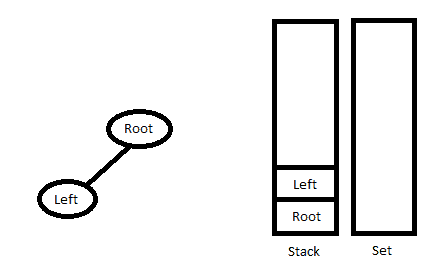
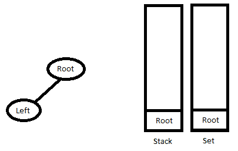
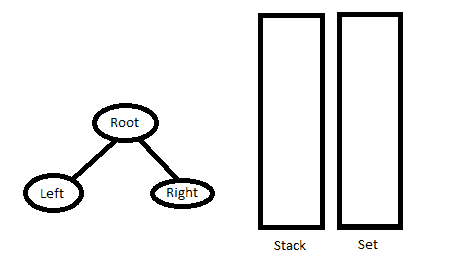

# 从给定的有序和预有序遍历构建树

> 原文:[https://www . geeksforgeeks . org/construct-tree-from-给定-order-and-preorder-遍历/](https://www.geeksforgeeks.org/construct-tree-from-given-inorder-and-preorder-traversal/)

让我们考虑以下遍历:按顺序排列的:D B E A F C
按顺序排列的前序:A B D E C F

在 Preorder 序列中，最左边的元素是树的根。所以我们知道‘A’是给定序列的根。通过在 Inorder 序列中搜索“A”，我们可以发现“A”左侧的所有元素都在左子树中，右侧的元素在右子树中。现在我们知道了下面的结构。

```
                 A
               /   \
             /       \
           D B E     F C
```

我们递归地遵循上面的步骤，得到下面的树。

```
         A
       /   \
     /       \
    B         C
   / \        /
 /     \    /
D       E  F
```

算法:buildTree()
1)从 Preorder 中挑选一个元素。递增一个 Preorder Index 变量(下面代码中的 preIndex)来选择下一个递归调用中的下一个元素。
2)创建一个新的树节点 tNode，数据作为拾取的元素。
3)在 Inorder 中找到所选元素的索引。让索引在索引中。
4)在 inIndex 之前为元素调用 buildTree，并使构建的树成为 tNode 的左子树。
5)为索引后的元素调用构建树，并将构建的树作为节点的右子树。
6)返回 tNode。

## C++

```
/* C++ program to construct tree using
inorder and preorder traversals */
#include <bits/stdc++.h>
using namespace std;

/* A binary tree node has data, pointer to left child
and a pointer to right child */
class node
{
    public:
    char data;
    node* left;
    node* right;
};

/* Prototypes for utility functions */
int search(char arr[], int strt, int end, char value);
node* newNode(char data);

/* Recursive function to construct binary
of size len from Inorder traversal in[]
and Preorder traversal pre[]. Initial values
of inStrt and inEnd should be 0 and len -1.
The function doesn't do any error checking
for cases where inorder and preorder do not
form a tree */
node* buildTree(char in[], char pre[], int inStrt, int inEnd)
{
    static int preIndex = 0;

    if (inStrt > inEnd)
        return NULL;

    /* Pick current node from Preorder
    traversal using preIndex
    and increment preIndex */
    node* tNode = newNode(pre[preIndex++]);

    /* If this node has no children then return */
    if (inStrt == inEnd)
        return tNode;

    /* Else find the index of this node in Inorder traversal */
    int inIndex = search(in, inStrt, inEnd, tNode->data);

    /* Using index in Inorder traversal, construct left and
    right subtress */
    tNode->left = buildTree(in, pre, inStrt, inIndex - 1);
    tNode->right = buildTree(in, pre, inIndex + 1, inEnd);

    return tNode;
}

/* UTILITY FUNCTIONS */
/* Function to find index of value in arr[start...end]
The function assumes that value is present in in[] */
int search(char arr[], int strt, int end, char value)
{
    int i;
    for (i = strt; i <= end; i++)
    {
        if (arr[i] == value)
            return i;
    }
}

/* Helper function that allocates a new node with the
given data and NULL left and right pointers. */
node* newNode(char data)
{
    node* Node = new node();
    Node->data = data;
    Node->left = NULL;
    Node->right = NULL;

    return (Node);
}

/* This function is here just to test buildTree() */
void printInorder(node* node)
{
    if (node == NULL)
        return;

    /* first recur on left child */
    printInorder(node->left);

    /* then print the data of node */
    cout<<node->data<<" ";

    /* now recur on right child */
    printInorder(node->right);
}

/* Driver code */
int main()
{
    char in[] = { 'D', 'B', 'E', 'A', 'F', 'C' };
    char pre[] = { 'A', 'B', 'D', 'E', 'C', 'F' };
    int len = sizeof(in) / sizeof(in[0]);
    node* root = buildTree(in, pre, 0, len - 1);

    /* Let us test the built tree by
    printing Inorder traversal */
    cout << "Inorder traversal of the constructed tree is \n";
    printInorder(root);
}

// This is code is contributed by rathbhupendra
```

## C

```
/* program to construct tree using inorder and preorder traversals */
#include <stdio.h>
#include <stdlib.h>

/* A binary tree node has data, pointer to left child
   and a pointer to right child */
struct node {
    char data;
    struct node* left;
    struct node* right;
};

/* Prototypes for utility functions */
int search(char arr[], int strt, int end, char value);
struct node* newNode(char data);

/* Recursive function to construct binary of size len from
   Inorder traversal in[] and Preorder traversal pre[].  Initial values
   of inStrt and inEnd should be 0 and len -1.  The function doesn't
   do any error checking for cases where inorder and preorder
   do not form a tree */
struct node* buildTree(char in[], char pre[], int inStrt, int inEnd)
{
    static int preIndex = 0;

    if (inStrt > inEnd)
        return NULL;

    /* Pick current node from Preorder traversal using preIndex
    and increment preIndex */
    struct node* tNode = newNode(pre[preIndex++]);

    /* If this node has no children then return */
    if (inStrt == inEnd)
        return tNode;

    /* Else find the index of this node in Inorder traversal */
    int inIndex = search(in, inStrt, inEnd, tNode->data);

    /* Using index in Inorder traversal, construct left and
     right subtress */
    tNode->left = buildTree(in, pre, inStrt, inIndex - 1);
    tNode->right = buildTree(in, pre, inIndex + 1, inEnd);

    return tNode;
}

/* UTILITY FUNCTIONS */
/* Function to find index of value in arr[start...end]
   The function assumes that value is present in in[] */
int search(char arr[], int strt, int end, char value)
{
    int i;
    for (i = strt; i <= end; i++) {
        if (arr[i] == value)
            return i;
    }
}

/* Helper function that allocates a new node with the
   given data and NULL left and right pointers. */
struct node* newNode(char data)
{
    struct node* node = (struct node*)malloc(sizeof(struct node));
    node->data = data;
    node->left = NULL;
    node->right = NULL;

    return (node);
}

/* This function is here just to test buildTree() */
void printInorder(struct node* node)
{
    if (node == NULL)
        return;

    /* first recur on left child */
    printInorder(node->left);

    /* then print the data of node */
    printf("%c ", node->data);

    /* now recur on right child */
    printInorder(node->right);
}

/* Driver program to test above functions */
int main()
{
    char in[] = { 'D', 'B', 'E', 'A', 'F', 'C' };
    char pre[] = { 'A', 'B', 'D', 'E', 'C', 'F' };
    int len = sizeof(in) / sizeof(in[0]);
    struct node* root = buildTree(in, pre, 0, len - 1);

    /* Let us test the built tree by printing Inorder traversal */
    printf("Inorder traversal of the constructed tree is \n");
    printInorder(root);
    getchar();
}
```

## Java 语言(一种计算机语言，尤用于创建网站)

```
// Java program to construct a tree using inorder and preorder traversal

/* A binary tree node has data, pointer to left child
   and a pointer to right child */
class Node {
    char data;
    Node left, right;

    Node(char item)
    {
        data = item;
        left = right = null;
    }
}

class BinaryTree {
    Node root;
    static int preIndex = 0;

    /* Recursive function to construct binary of size len from
       Inorder traversal in[] and Preorder traversal pre[].
       Initial values of inStrt and inEnd should be 0 and len -1. 
       The function doesn't do any error checking for cases where
       inorder and preorder do not form a tree */
    Node buildTree(char in[], char pre[], int inStrt, int inEnd)
    {
        if (inStrt > inEnd)
            return null;

        /* Pick current node from Preorder traversal using preIndex
           and increment preIndex */
        Node tNode = new Node(pre[preIndex++]);

        /* If this node has no children then return */
        if (inStrt == inEnd)
            return tNode;

        /* Else find the index of this node in Inorder traversal */
        int inIndex = search(in, inStrt, inEnd, tNode.data);

        /* Using index in Inorder traversal, construct left and
           right subtress */
        tNode.left = buildTree(in, pre, inStrt, inIndex - 1);
        tNode.right = buildTree(in, pre, inIndex + 1, inEnd);

        return tNode;
    }

    /* UTILITY FUNCTIONS */

    /* Function to find index of value in arr[start...end]
     The function assumes that value is present in in[] */
    int search(char arr[], int strt, int end, char value)
    {
        int i;
        for (i = strt; i <= end; i++) {
            if (arr[i] == value)
                return i;
        }
        return i;
    }

    /* This function is here just to test buildTree() */
    void printInorder(Node node)
    {
        if (node == null)
            return;

        /* first recur on left child */
        printInorder(node.left);

        /* then print the data of node */
        System.out.print(node.data + " ");

        /* now recur on right child */
        printInorder(node.right);
    }

    // driver program to test above functions
    public static void main(String args[])
    {
        BinaryTree tree = new BinaryTree();
        char in[] = new char[] { 'D', 'B', 'E', 'A', 'F', 'C' };
        char pre[] = new char[] { 'A', 'B', 'D', 'E', 'C', 'F' };
        int len = in.length;
        Node root = tree.buildTree(in, pre, 0, len - 1);

        // building the tree by printing inorder traversal
        System.out.println("Inorder traversal of constructed tree is : ");
        tree.printInorder(root);
    }
}

// This code has been contributed by Mayank Jaiswal
```

## 计算机编程语言

```
# Python program to construct tree using inorder and
# preorder traversals

# A binary tree node
class Node:

    # Constructor to create a new node
    def __init__(self, data):
        self.data = data
        self.left = None
        self.right = None

"""Recursive function to construct binary of size len from
   Inorder traversal in[] and Preorder traversal pre[].  Initial values
   of inStrt and inEnd should be 0 and len -1.  The function doesn't
   do any error checking for cases where inorder and preorder
   do not form a tree """
def buildTree(inOrder, preOrder, inStrt, inEnd):

    if (inStrt > inEnd):
        return None

    # Pich current node from Preorder traversal using
    # preIndex and increment preIndex
    tNode = Node(preOrder[buildTree.preIndex])
    buildTree.preIndex += 1

    # If this node has no children then return
    if inStrt == inEnd :
        return tNode

    # Else find the index of this node in Inorder traversal
    inIndex = search(inOrder, inStrt, inEnd, tNode.data)

    # Using index in Inorder Traversal, construct left
    # and right subtrees
    tNode.left = buildTree(inOrder, preOrder, inStrt, inIndex-1)
    tNode.right = buildTree(inOrder, preOrder, inIndex + 1, inEnd)

    return tNode

# UTILITY FUNCTIONS
# Function to find index of value in arr[start...end]
# The function assumes that value is present in inOrder[]

def search(arr, start, end, value):
    for i in range(start, end + 1):
        if arr[i] == value:
            return i

def printInorder(node):
    if node is None:
        return

    # first recur on left child
    printInorder(node.left)

    # then print the data of node
    print node.data,

    # now recur on right child
    printInorder(node.right)

# Driver program to test above function
inOrder = ['D', 'B', 'E', 'A', 'F', 'C']
preOrder = ['A', 'B', 'D', 'E', 'C', 'F']
# Static variable preIndex
buildTree.preIndex = 0
root = buildTree(inOrder, preOrder, 0, len(inOrder)-1)

# Let us test the build tree by printing Inorder traversal
print "Inorder traversal of the constructed tree is"
printInorder(root)

# This code is contributed by Nikhil Kumar Singh(nickzuck_007)
```

## C#

```
// C# program to construct a tree using
// inorder and preorder traversal
using System;

/* A binary tree node has data, pointer
to left child and a pointer to right child */
public class Node {
    public char data;
    public Node left, right;

    public Node(char item)
    {
        data = item;
        left = right = null;
    }
}

class GFG {
    public Node root;
    public static int preIndex = 0;

    /* Recursive function to construct binary
of size len from Inorder traversal in[]
and Preorder traversal pre[]. Initial values
of inStrt and inEnd should be 0 and len -1.
The function doesn't do any error checking for
cases where inorder and preorder do not form a tree */
    public virtual Node buildTree(char[] arr, char[] pre,
                                  int inStrt, int inEnd)
    {
        if (inStrt > inEnd) {
            return null;
        }

        /* Pick current node from Preorder traversal
     using preIndex and increment preIndex */
        Node tNode = new Node(pre[preIndex++]);

        /* If this node has no children then return */
        if (inStrt == inEnd) {
            return tNode;
        }

        /* Else find the index of this
       node in Inorder traversal */
        int inIndex = search(arr, inStrt,
                             inEnd, tNode.data);

        /* Using index in Inorder traversal,
    construct left and right subtress */
        tNode.left = buildTree(arr, pre, inStrt, inIndex - 1);
        tNode.right = buildTree(arr, pre, inIndex + 1, inEnd);

        return tNode;
    }

    /* UTILITY FUNCTIONS */

    /* Function to find index of value in arr[start...end]
The function assumes that value is present in in[] */
    public virtual int search(char[] arr, int strt,
                              int end, char value)
    {
        int i;
        for (i = strt; i <= end; i++) {
            if (arr[i] == value) {
                return i;
            }
        }
        return i;
    }

    /* This function is here just to test buildTree() */
    public virtual void printInorder(Node node)
    {
        if (node == null) {
            return;
        }

        /* first recur on left child */
        printInorder(node.left);

        /* then print the data of node */
        Console.Write(node.data + " ");

        /* now recur on right child */
        printInorder(node.right);
    }

    // Driver Code
    public static void Main(string[] args)
    {
        GFG tree = new GFG();
        char[] arr = new char[] { 'D', 'B', 'E', 'A', 'F', 'C' };
        char[] pre = new char[] { 'A', 'B', 'D', 'E', 'C', 'F' };
        int len = arr.Length;
        Node root = tree.buildTree(arr, pre, 0, len - 1);

        // building the tree by printing inorder traversal
        Console.WriteLine("Inorder traversal of "
                          + "constructed tree is : ");
        tree.printInorder(root);
    }
}

// This code is contributed by Shrikant13
```

## java 描述语言

```
<script>

// Javascript program to construct a
// tree using inorder and preorder traversal

// A binary tree node has data, pointer
// to left child and a pointer to right child
class Node
{
    constructor(item)
    {
        this.data = item;
        this.left = this.right = null;
    }
}

let root;
let preIndex = 0;

// Recursive function to construct binary
// of size len from Inorder traversal in[]
// and Preorder traversal pre[]. Initial
// values of inStrt and inEnd should be 0
// and len -1\. The function doesn't do any
// error checking for cases where inorder
// and preorder do not form a tree
function buildTree(In, pre, inStrt, inEnd)
{
    if (inStrt > inEnd)
        return null;

    // Pick current node from Preorder
    // traversal using preIndex and
    // increment preIndex
    let tNode = new Node(pre[preIndex++]);

    // If this node has no children then return
    if (inStrt == inEnd)
        return tNode;

    // Else find the index of this
    // node in Inorder traversal
    let inIndex = search(In, inStrt,
                         inEnd, tNode.data);

    // Using index in Inorder traversal,
    // construct left and right subtress
    tNode.left = buildTree(In, pre, inStrt,
                           inIndex - 1);
    tNode.right = buildTree(In, pre,
                            inIndex + 1,
                            inEnd);

    return tNode;
}

/* UTILITY FUNCTIONS */

// Function to find index of value
// in arr[start...end]. The function
// assumes that value is present in in[]
function search(arr, strt, end, value)
{
    let i;
    for(i = strt; i <= end; i++)
    {
        if (arr[i] == value)
            return i;
    }
    return i;
}

// This function is here just
// to test buildTree()
function printInorder(node)
{
    if (node == null)
            return;

    // First recur on left child
    printInorder(node.left);

    // Then print the data of node
    document.write(node.data + " ");

    // Now recur on right child
    printInorder(node.right);
}

// Driver code
let In = [ 'D', 'B', 'E', 'A', 'F', 'C' ];
let pre = [ 'A', 'B', 'D', 'E', 'C', 'F'];
let len = In.length;
root = buildTree(In, pre, 0, len - 1);

// Building the tree by printing
// inorder traversal
document.write("Inorder traversal of " +
               "constructed tree is : <br>");
printInorder(root);

// This code is contributed by patel2127

</script>
```

**Output:** 

```
Inorder traversal of the constructed tree is 
D B E A F C
```

**时间复杂度:O(n^2)** 。最糟糕的情况发生在树向左倾斜的时候。最坏情况下的前序和中序遍历示例为{A，B，C，D}和{D，C，B，A}。

**高效方法:**
我们可以使用散列法(C++中的无序 _map 或 Java 中的 HashMap)来优化上述解决方案。我们在散列表中存储有序遍历的索引。这样搜索可以进行 O(1)次。

## C++

```
/* C++ program to construct tree using inorder
   and preorder traversals */
#include <bits/stdc++.h>
using namespace std;

/* A binary tree node has data, pointer to left child
and a pointer to right child */
struct Node {
    char data;
    struct Node* left;
    struct Node* right;
};

struct Node* newNode(char data)
{
    struct Node* node = new Node;
    node->data = data;
    node->left = node->right = NULL;
    return (node);
}

/* Recursive function to construct binary of size
len from Inorder traversal in[] and Preorder traversal
pre[]. Initial values of inStrt and inEnd should be
0 and len -1\. The function doesn't do any error
checking for cases where inorder and preorder
do not form a tree */
struct Node* buildTree(char in[], char pre[], int inStrt,
                       int inEnd, unordered_map<char, int>& mp)
{
    static int preIndex = 0;

    if (inStrt > inEnd)
        return NULL;

    /* Pick current node from Preorder traversal using preIndex
    and increment preIndex */
    char curr = pre[preIndex++];
    struct Node* tNode = newNode(curr);

    /* If this node has no children then return */
    if (inStrt == inEnd)
        return tNode;

    /* Else find the index of this node in Inorder traversal */
    int inIndex = mp[curr];

    /* Using index in Inorder traversal, construct left and
    right subtress */
    tNode->left = buildTree(in, pre, inStrt, inIndex - 1, mp);
    tNode->right = buildTree(in, pre, inIndex + 1, inEnd, mp);

    return tNode;
}

// This function mainly creates an unordered_map, then
// calls buildTree()
struct Node* buldTreeWrap(char in[], char pre[], int len)
{
    // Store indexes of all items so that we
    // we can quickly find later
    unordered_map<char, int> mp;
    for (int i = 0; i < len; i++)
        mp[in[i]] = i;

    return buildTree(in, pre, 0, len - 1, mp);
}

/* This function is here just to test buildTree() */
void printInorder(struct Node* node)
{
    if (node == NULL)
        return;
    printInorder(node->left);
    printf("%c ", node->data);
    printInorder(node->right);
}

/* Driver program to test above functions */
int main()
{
    char in[] = { 'D', 'B', 'E', 'A', 'F', 'C' };
    char pre[] = { 'A', 'B', 'D', 'E', 'C', 'F' };
    int len = sizeof(in) / sizeof(in[0]);

    struct Node* root = buldTreeWrap(in, pre, len);

    /* Let us test the built tree by printing
      Inorder traversal */
    printf("Inorder traversal of the constructed tree is \n");
    printInorder(root);
}
```

## Java 语言(一种计算机语言，尤用于创建网站)

```
/* Java program to construct tree using inorder
   and preorder traversals */
import java.io.*;
import java.util.*;

/* A binary tree node has data, pointer to left child
and a pointer to right child */
class Node
{
  char data;
  Node left,right;
  Node(char item)
  {
    data = item;
    left = right = null;
  }
}
class Tree
{

  public static Node root;

  // Store indexes of all items so that we
  // we can quickly find later
  static HashMap<Character,Integer> mp = new HashMap<>();
  static int preIndex = 0;

  /* Recursive function to construct binary of size
    len from Inorder traversal in[] and Preorder traversal
    pre[]. Initial values of inStrt and inEnd should be
    0 and len -1\. The function doesn't do any error
    checking for cases where inorder and preorder
    do not form a tree */
  public static Node buildTree(char[] in, char[] pre, int inStrt, int inEnd)
  {

    if(inStrt > inEnd)
    {
      return null;
    }

    /* Pick current node from Preorder traversal using preIndex
        and increment preIndex */
    char curr = pre[preIndex++];
    Node tNode;
    tNode = new Node(curr);

    /* If this node has no children then return */
    if (inStrt == inEnd)
    {
      return tNode;
    }

    /* Else find the index of this node in Inorder traversal */
    int inIndex = mp.get(curr);

    /* Using index in Inorder traversal, construct left and
        right subtress */
    tNode.left = buildTree(in, pre, inStrt, inIndex - 1);
    tNode.right = buildTree(in, pre, inIndex + 1, inEnd);
    return tNode;
  }

  // This function mainly creates an unordered_map, then
  // calls buildTree()
  public static Node buldTreeWrap(char[] in, char[] pre, int len)
  {
    for(int i = 0; i < len; i++)
    {
      mp.put(in[i], i);
    }
    return buildTree(in, pre, 0, len - 1);
  }

  /* This function is here just to test buildTree() */
  static void printInorder(Node node)
  {
    if(node == null)
    {
      return;
    }
    printInorder(node.left);
    System.out.print(node.data + " ");
    printInorder(node.right);
  }

  /* Driver code */
  public static void main (String[] args)
  {
    char[] in = {'D', 'B', 'E', 'A', 'F', 'C'};
    char[] pre = {'A', 'B', 'D', 'E', 'C', 'F'};
    int len = in.length;

    Tree.root=buldTreeWrap(in, pre, len);

    /* Let us test the built tree by printing
        Inorder traversal */
    System.out.println("Inorder traversal of the constructed tree is");
    printInorder(root);
  }
}

// This code is contributed by avanitrachhadiya2155
```

## 蟒蛇 3

```
# Python3 program to construct tree using inorder
# and preorder traversals

# A binary tree node has data, pointer to left child
# and a pointer to right child
class Node:

    def __init__(self, x):

        self.data = x
        self.left = None
        self.right = None

# Recursive function to construct binary of size
# len from Inorder traversal in[] and Preorder traversal
# pre[]. Initial values of inStrt and inEnd should be
# 0 and len -1\. The function doesn't do any error
# checking for cases where inorder and preorder
# do not form a tree
def buildTree(inn, pre, inStrt, inEnd):

    global preIndex, mp

    if (inStrt > inEnd):
        return None

    # Pick current node from Preorder traversal
    # using preIndex and increment preIndex
    curr = pre[preIndex]
    preIndex += 1
    tNode = Node(curr)

    # If this node has no children then return
    if (inStrt == inEnd):
        return tNode

    # Else find the index of this
    # node in Inorder traversal
    inIndex = mp[curr]

    # Using index in Inorder traversal,
    # construct left and right subtress
    tNode.left = buildTree(inn, pre, inStrt,
                           inIndex - 1)
    tNode.right = buildTree(inn, pre, inIndex + 1,
                            inEnd)

    return tNode

# This function mainly creates an
# unordered_map, then calls buildTree()
def buldTreeWrap(inn, pre, lenn):

    global mp

    # Store indexes of all items so that we
    # we can quickly find later
    # unordered_map<char, int> mp;
    for i in range(lenn):
        mp[inn[i]] = i

    return buildTree(inn, pre, 0, lenn - 1)

# This function is here just to test buildTree()
def prInorder(node):

    if (node == None):
        return

    prInorder(node.left)
    print(node.data, end = " ")
    prInorder(node.right)

# Driver code
if __name__ == '__main__':

    mp = {}
    preIndex = 0

    inn = [ 'D', 'B', 'E', 'A', 'F', 'C' ]
    pre = [ 'A', 'B', 'D', 'E', 'C', 'F' ]
    lenn = len(inn)

    root = buldTreeWrap(inn, pre,lenn)

    # Let us test the built tree by printing
    # Inorder traversal
    print("Inorder traversal of "
          "the constructed tree is")

    prInorder(root)

# This code is contributed by mohit kumar 29
```

## C#

```
/* C# program to construct tree using inorder
   and preorder traversals */
using System;
using System.Collections.Generic;

/* A binary tree node has data, pointer to left child
and a pointer to right child */
public class Node
{
    public char data;
    public Node left, right;

    public Node(char d)
    {
        data = d;
        left = right = null;
    }
}
public class Tree
{
    public static Node root;

    // Store indexes of all items so that we
    // we can quickly find later
    static Dictionary<char,int> mp = new Dictionary<char,int>();
    static int preIndex = 0;

    /* Recursive function to construct binary of size
    len from Inorder traversal in[] and Preorder traversal
    pre[]. Initial values of inStrt and inEnd should be
    0 and len -1\. The function doesn't do any error
    checking for cases where inorder and preorder
    do not form a tree */
    static Node buildTree(char[] In, char[] pre,
                          int inStrt, int inEnd)
    {
        if(inStrt > inEnd)
        {
            return null;
        }

        /* Pick current node from Preorder traversal using preIndex
        and increment preIndex */
        char curr = pre[preIndex++];
        Node tNode;
        tNode = new Node(curr);

        /* If this node has no children then return */
        if(inStrt == inEnd)
        {
            return tNode;
        }

        /* Else find the index of this node in Inorder traversal */
        int inIndex = mp[curr];

        /* Using index in Inorder traversal, construct left and
        right subtress */
        tNode.left = buildTree(In, pre, inStrt, inIndex - 1);
        tNode.right = buildTree(In, pre, inIndex + 1, inEnd);
        return tNode;
    }

    // This function mainly creates an unordered_map, then
    // calls buildTree()
    public static Node buldTreeWrap(char[] In, char[] pre, int len)
    {
        for(int i = 0; i < len; i++)
        {
            mp.Add(In[i], i);
        }
        return buildTree(In, pre, 0, len - 1);
    }

    /* This function is here just to test buildTree() */
    static void printInorder(Node node)
    {
        if(node == null)
        {
            return;
        }
        printInorder(node.left);
        Console.Write(node.data + " ");
        printInorder(node.right);
    }

    /* Driver code */
    static public void Main (){
        char[] In = {'D', 'B', 'E', 'A', 'F', 'C'};
        char[] pre = {'A', 'B', 'D', 'E', 'C', 'F'};
        int len = In.Length;
        Tree.root = buldTreeWrap(In, pre, len);

        /* Let us test the built tree by printing
        Inorder traversal */
        Console.WriteLine("Inorder traversal of the constructed tree is");
        printInorder(Tree.root);
    }
}

// This code is contributed by rag2127
```

**Output:** 

```
Inorder traversal of the constructed tree is 
D B E A F C
```

**时间复杂度:** O(n)

**另一种方法:**
利用 InOrder 遍历是左-根-右，PreOrder 遍历是根-左-右的事实。另外，PreOrder 遍历中的第一个节点总是根节点，而 InOrder 遍历中的第一个节点是树中最左边的节点。
维护两个数据结构:Stack(存储我们遍历 PreOrder 数组时访问的路径)和 Set(维护下一个右子树所在的节点)。

1.执行以下操作，直到到达最左边的节点。
继续从 PreOrder 遍历
创建节点如果堆栈最顶端的元素不在集合中，将创建的节点链接到堆栈最顶端元素的左子元素(如果有)，而不弹出该元素。
否则将创建的节点链接到堆栈最顶层元素的右子节点。从集合和堆栈中移除堆栈的最顶层元素。
将节点推至堆栈。



2.继续从堆栈中弹出节点，直到堆栈为空，或者堆栈的最顶层元素与 InOrder 遍历的当前元素相比较。循环结束后，将最后一个节点推回到堆栈和集合中。



3.转到步骤 1。



## C++

```
// C++ program to construct a tree using
// inorder and preorder traversal
#include<bits/stdc++.h>
using namespace std;

class TreeNode
{
    public:
    int val;
    TreeNode* left;
    TreeNode* right;
    TreeNode(int x) { val = x; }
};

set<TreeNode*> s;
stack<TreeNode*> st;

// Function to build tree using given traversal
TreeNode* buildTree(int preorder[], int inorder[],int n)
{

    TreeNode* root = NULL;
    for (int pre = 0, in = 0; pre < n;)
    {

        TreeNode* node = NULL;
        do
        {
            node = new TreeNode(preorder[pre]);
            if (root == NULL)
            {
                root = node;
            }
            if (st.size() > 0)
            {
                if (s.find(st.top()) != s.end())
                {
                    s.erase(st.top());
                    st.top()->right = node;
                    st.pop();
                }
                else
                {
                    st.top()->left = node;
                }
            }
            st.push(node);
        } while (preorder[pre++] != inorder[in] && pre < n);

        node = NULL;
        while (st.size() > 0 && in < n &&
                st.top()->val == inorder[in])
        {
            node = st.top();
            st.pop();
            in++;
        }

        if (node != NULL)
        {
            s.insert(node);
            st.push(node);
        }
    }

    return root;
}

// Function to print tree in Inorder
void printInorder(TreeNode* node)
{
    if (node == NULL)
        return;

    /* first recur on left child */
    printInorder(node->left);

    /* then print the data of node */
    cout << node->val << " ";

    /* now recur on right child */
    printInorder(node->right);
}

// Driver code
int main()
{
    int in[] = { 9, 8, 4, 2, 10, 5, 10, 1, 6, 3, 13, 12, 7 };
    int pre[] = { 1, 2, 4, 8, 9, 5, 10, 10, 3, 6, 7, 12, 13 };
    int len = sizeof(in)/sizeof(int);

    TreeNode *root = buildTree(pre, in, len);

    printInorder(root);
    return 0;
}

// This code is contributed by Arnab Kundu
```

## Java 语言(一种计算机语言，尤用于创建网站)

```
// Java program to construct a tree using inorder and preorder traversal
import java.util.*;

public class TreeNode {
    int val;
    TreeNode left;
    TreeNode right;
    TreeNode(int x) { val = x; }
}

class BinaryTree {
    static Set<TreeNode> set = new HashSet<>();
    static Stack<TreeNode> stack = new Stack<>();

    // Function to build tree using given traversal
    public TreeNode buildTree(int[] preorder, int[] inorder)
    {

        TreeNode root = null;
        for (int pre = 0, in = 0; pre < preorder.length;) {

            TreeNode node = null;
            do {
                node = new TreeNode(preorder[pre]);
                if (root == null) {
                    root = node;
                }
                if (!stack.isEmpty()) {
                    if (set.contains(stack.peek())) {
                        set.remove(stack.peek());
                        stack.pop().right = node;
                    }
                    else {
                        stack.peek().left = node;
                    }
                }
                stack.push(node);
            } while (preorder[pre++] != inorder[in] && pre < preorder.length);

            node = null;
            while (!stack.isEmpty() && in < inorder.length &&
                    stack.peek().val == inorder[in]) {
                node = stack.pop();
                in++;
            }

            if (node != null) {
                set.add(node);
                stack.push(node);
            }
        }

        return root;
    }

    // Function to print tree in Inorder
    void printInorder(TreeNode node)
    {
        if (node == null)
            return;

        /* first recur on left child */
        printInorder(node.left);

        /* then print the data of node */
        System.out.print(node.val + " ");

        /* now recur on right child */
        printInorder(node.right);
    }

    // driver program to test above functions
    public static void main(String args[])
    {
        BinaryTree tree = new BinaryTree();

        int in[] = new int[] { 9, 8, 4, 2, 10, 5, 10, 1, 6, 3, 13, 12, 7 };
        int pre[] = new int[] { 1, 2, 4, 8, 9, 5, 10, 10, 3, 6, 7, 12, 13 };
        int len = in.length;

        TreeNode root = tree.buildTree(pre, in);

        tree.printInorder(root);
    }
}
```

## 蟒蛇 3

```
# Python3 program to construct a tree using
# inorder and preorder traversal
class TreeNode:

    def __init__(self, x):     
        self.val = x
        self.left = None
        self.right = None

s = set()
st = []

# Function to build tree using given traversal
def buildTree(preorder, inorder, n):
    root = None;

    pre = 0
    in_t = 0

    while pre < n:
        node = None;

        while True:   
            node = TreeNode(preorder[pre])

            if (root == None):           
                root = node;

            if (len(st) > 0):       
                if (st[-1] in s):               
                    s.discard(st[-1]);
                    st[-1].right = node;
                    st.pop();

                else:               
                    st[-1].left = node;

            st.append(node);

            if pre>=n or preorder[pre] == inorder[in_t]:
                pre += 1
                break
            pre += 1

        node = None;

        while (len(st) > 0 and in_t < n and st[-1].val == inorder[in_t]):       
            node = st[-1];
            st.pop();
            in_t += 1

        if (node != None):       
            s.add(node);
            st.append(node);

    return root;

# Function to print tree in_t Inorder
def printInorder( node):

    if (node == None):
        return;

    ''' first recur on left child '''
    printInorder(node.left);

    ''' then prthe data of node '''
    print(node.val, end=" ");

    ''' now recur on right child '''
    printInorder(node.right);

# Driver code
if __name__=='__main__':

    in_t = [ 9, 8, 4, 2, 10, 5, 10, 1, 6, 3, 13, 12, 7 ]
    pre = [ 1, 2, 4, 8, 9, 5, 10, 10, 3, 6, 7, 12, 13 ]
    l = len(in_t)

    root = buildTree(pre, in_t, l);

    printInorder(root);

    # This code is contributed by rutvik_56.
```

## C#

```
// C# program to construct a tree
// using inorder and preorder traversal
using System;
using System.Collections.Generic;

public class TreeNode
{
    public int val;
    public TreeNode left;
    public TreeNode right;
    public TreeNode(int x) { val = x; }
}

class GFG
{
    static HashSet<TreeNode> set = new HashSet<TreeNode>();
    static Stack<TreeNode> stack = new Stack<TreeNode>();

    // Function to build tree using given traversal
    public TreeNode buildTree(int[] preorder, int[] inorder)
    {
        TreeNode root = null;
        for (int pre = 0, iN = 0; pre < preorder.Length;)
        {
            TreeNode node = null;
            do {
                node = new TreeNode(preorder[pre]);
                if (root == null)
                {
                    root = node;
                }
                if (stack.Count != 0)
                {
                    if (set.Contains(stack.Peek()))
                    {
                        set.Remove(stack.Peek());
                        stack.Pop().right = node;
                    }
                    else
                    {
                        stack.Peek().left = node;
                    }
                }
                stack.Push(node);
            } while (preorder[pre++] != inorder[iN] &&
                     pre < preorder.Length);

            node = null;
            while (stack.Count != 0 && iN < inorder.Length &&
                   stack.Peek().val == inorder[iN])
            {
                node = stack.Pop();
                iN++;
            }
            if (node != null)
            {
                set.Add(node);
                stack.Push(node);
            }
        }
        return root;
    }

    // Function to print tree in Inorder
    void printInorder(TreeNode node)
    {
        if (node == null)
            return;

        /* first recur on left child */
        printInorder(node.left);

        /* then print the data of node */
        Console.Write(node.val + " ");

        /* now recur on right child */
        printInorder(node.right);
    }

    // Driver Code
    public static void Main(String []args)
    {
        GFG tree = new GFG();

        int []iN = new int[] { 9, 8, 4, 2, 10, 5, 10,
                                 1, 6, 3, 13, 12, 7 };
        int []pre = new int[] { 1, 2, 4, 8, 9, 5, 10,
                                 10, 3, 6, 7, 12, 13 };
        int len = iN.Length;

        TreeNode root = tree.buildTree(pre, iN);

        tree.printInorder(root);
    }
}

// This code is contributed by 29AjayKumar
```

## java 描述语言

```
<script>
// Javascript program to construct a tree using inorder and preorder traversal

    class TreeNode
    {
        constructor(x) {
            this.val = x;
            this.left = null;
            this.right = null;
          }
    }

    let set = new Set();
    let stack = [];

    // Function to build tree using given traversal
    function buildTree(preorder,inorder)
    {
        let root = null;

        for (let pre = 0,In=0; pre < preorder.length;) {

            let node = null;
            do {
                node = new TreeNode(preorder[pre]);
                if (root == null) {
                    root = node;
                }
                if (stack.length!=0) {
                    if (set.has(stack[stack.length-1])) {
                        set.delete(stack[stack.length-1]);
                        stack.pop().right = node;
                    }
                    else {
                        stack[stack.length-1].left = node;
                    }
                }
                stack.push(node);
            } while (preorder[pre++] != inorder[In] && pre < preorder.length);

            node = null;
            while (stack.length!=0 && In < inorder.length &&
                    stack[stack.length-1].val == inorder[In]) {
                node = stack.pop();
                In++;
            }

            if (node != null) {
                set.add(node);
                stack.push(node);
            }
        }

        return root;
    }

    // Function to print tree in Inorder
    function printInorder(node)
    {
        if (node == null)
            return;

        /* first recur on left child */
        printInorder(node.left);

        /* then print the data of node */
        document.write(node.val + " ");

        /* now recur on right child */
        printInorder(node.right);
    }

    // driver program to test above functions
    let In=[9, 8, 4, 2, 10, 5, 10, 1, 6, 3, 13, 12, 7 ];
    let pre=[1, 2, 4, 8, 9, 5, 10, 10, 3, 6, 7, 12, 13 ];
    let len = In.length;
    let root=buildTree(pre, In);
    printInorder(root);

    // This code is contributed by unknown2108
</script>
```

**Output:** 

```
9 8 4 2 10 5 10 1 6 3 13 12 7
```

[从后序和序](https://www.geeksforgeeks.org/construct-a-binary-tree-from-postorder-and-inorder/)
构建二叉树