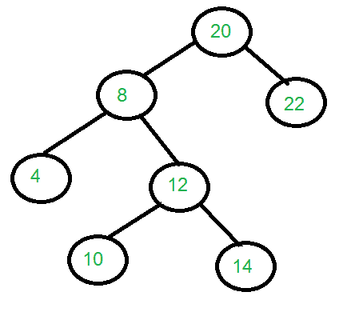

# 从有序和水平顺序遍历|集合 1

构建一棵树

> 原文:[https://www . geesforgeks . org/construct-tree-order-level-order-traversals/](https://www.geeksforgeeks.org/construct-tree-inorder-level-order-traversals/)

给定二叉树的有序和水平顺序遍历，构造二叉树。下面是一个例子来说明这个问题。



```
Input: Two arrays that represent Inorder
       and level order traversals of a 
       Binary Tree
in[]    = {4, 8, 10, 12, 14, 20, 22};
level[] = {20, 8, 22, 4, 12, 10, 14};

Output: Construct the tree represented 
        by the two arrays.
        For the above two arrays, the 
        constructed tree is shown in 
        the diagram on right side
```

以下职位可以被认为是这方面的先决条件。
[从给定的有序和预有序遍历中构建树](https://www.geeksforgeeks.org/construct-tree-from-given-inorder-and-preorder-traversal/)

让我们考虑上面的例子。
in[] = {4，8，10，12，14，20，22 }；
level[] = {20，8，22，4，12，10，14 }；
在 Levelorder 序列中，第一个元素是树根。所以我们知道‘20’是给定序列的根。通过按顺序搜索“20”，我们可以发现“20”左侧的所有元素都在左子树中，右侧的元素都在右子树中。所以我们现在知道下面的结构。

```
             20
           /    \
          /      \ 
 {4,8,10,12,14}  {22}
```

让我们将{4，8，10，12，14}称为有序遍历中的左子数组，将{22}称为有序遍历中的右子数组。
在级序遍历中，左右子树的键不连续。因此，我们从水平顺序遍历中提取出所有位于有序遍历的左子阵中的节点。为了构造根的左子树，我们对从层次顺序遍历和顺序遍历的左子数组中提取的元素进行递归。在上面的例子中，我们重复了以下两个数组。

```
// Recur for following arrays to construct the left subtree
In[]    = {4, 8, 10, 12, 14}
level[] = {8, 4, 12, 10, 14}
```

类似地，我们重复以下两个数组，并构造正确的子树。

```
// Recur for following arrays to construct the right subtree
In[]    = {22}
level[] = {22}
```

以下是上述方法的实施情况:

## C++

```
/* program to construct tree using inorder and levelorder
 * traversals */
#include <bits/stdc++.h>
using namespace std;

/* A binary tree node */
struct Node {
    int key;
    struct Node *left, *right;
};

/* Function to find index of value in arr[start...end] */
int search(int arr[], int strt, int end, int value)
{
    for (int i = strt; i <= end; i++)
        if (arr[i] == value)
            return i;
    return -1;
}

// n is size of level[], m is size of in[] and m < n. This
// function extracts keys from level[] which are present in
// in[].  The order of extracted keys must be maintained
int* extrackKeys(int in[], int level[], int m, int n)
{
    int *newlevel = new int[m], j = 0;
    for (int i = 0; i < n; i++)
        if (search(in, 0, m - 1, level[i]) != -1)
            newlevel[j] = level[i], j++;
    return newlevel;
}

/* function that allocates a new node with the given key  */
Node* newNode(int key)
{
    Node* node = new Node;
    node->key = key;
    node->left = node->right = NULL;
    return (node);
}

/* Recursive function to construct binary tree of size n
   from Inorder traversal in[] and Level Order traversal
   level[]. inStrt and inEnd are start and end indexes of
   array in[] Initial values of inStrt and inEnd should be 0
   and n -1\. The function doesn't do any error checking for
   cases where inorder and levelorder do not form a tree */
Node* buildTree(int in[], int level[], int inStrt,
                int inEnd, int n)
{

    // If start index is more than the end index
    if (inStrt > inEnd)
        return NULL;

    /* The first node in level order traversal is root */
    Node* root = newNode(level[0]);

    /* If this node has no children then return */
    if (inStrt == inEnd)
        return root;

    /* Else find the index of this node in Inorder traversal
     */
    int inIndex = search(in, inStrt, inEnd, root->key);

    // Extract left subtree keys from level order traversal
    int* llevel = extrackKeys(in, level, inIndex, n);

    // Extract right subtree keys from level order traversal
    int* rlevel
        = extrackKeys(in + inIndex + 1, level, n - 1, n);

    /* construct left and right subtrees */
    root->left = buildTree(in, llevel, inStrt, inIndex - 1,
                           inIndex - inStrt);
    root->right = buildTree(in, rlevel, inIndex + 1, inEnd,
                            inEnd - inIndex);

    // Free memory to avoid memory leak
    delete[] llevel;
    delete[] rlevel;

    return root;
}

/* utility function to print inorder traversal of binary
 * tree */
void printInorder(Node* node)
{
    if (node == NULL)
        return;
    printInorder(node->left);
    cout << node->key << " ";
    printInorder(node->right);
}

/* Driver program to test above functions */
int main()
{
    int in[] = { 4, 8, 10, 12, 14, 20, 22 };
    int level[] = { 20, 8, 22, 4, 12, 10, 14 };
    int n = sizeof(in) / sizeof(in[0]);
    Node* root = buildTree(in, level, 0, n - 1, n);

    /* Let us test the built tree by printing Inorder
     * traversal */
    cout << "Inorder traversal of the constructed tree is "
            "\n";
    printInorder(root);

    return 0;
}
```

## Java 语言(一种计算机语言，尤用于创建网站)

```
// Java program to construct a tree from level order and
// and inorder traversal

// A binary tree node
class Node {
    int data;
    Node left, right;

    Node(int item)
    {
        data = item;
        left = right = null;
    }

    public void setLeft(Node left) { this.left = left; }

    public void setRight(Node right) { this.right = right; }
}

class Tree {
    Node root;

    Node buildTree(int in[], int level[])
    {
        Node startnode = null;
        return constructTree(startnode, level, in, 0,
                             in.length - 1);
    }

    Node constructTree(Node startNode, int[] levelOrder,
                       int[] inOrder, int inStart,
                       int inEnd)
    {

        // if start index is more than end index
        if (inStart > inEnd)
            return null;

        if (inStart == inEnd)
            return new Node(inOrder[inStart]);

        boolean found = false;
        int index = 0;

        // it represents the index in inOrder array of
        // element that appear first in levelOrder array.
        for (int i = 0; i < levelOrder.length - 1; i++) {
            int data = levelOrder[i];
            for (int j = inStart; j < inEnd; j++) {
                if (data == inOrder[j]) {
                    startNode = new Node(data);
                    index = j;
                    found = true;
                    break;
                }
            }
            if (found == true)
                break;
        }

        // elements present before index are part of left
        // child of startNode. elements present after index
        // are part of right child of startNode.
        startNode.setLeft(
            constructTree(startNode, levelOrder, inOrder,
                          inStart, index - 1));
        startNode.setRight(
            constructTree(startNode, levelOrder, inOrder,
                          index + 1, inEnd));

        return startNode;
    }

    /* Utility function to print inorder traversal of binary
     * tree */
    void printInorder(Node node)
    {
        if (node == null)
            return;
        printInorder(node.left);
        System.out.print(node.data + " ");
        printInorder(node.right);
    }

    // Driver program to test the above functions
    public static void main(String args[])
    {
        Tree tree = new Tree();
        int in[] = new int[] { 4, 8, 10, 12, 14, 20, 22 };
        int level[]
            = new int[] { 20, 8, 22, 4, 12, 10, 14 };
        int n = in.length;
        Node node = tree.buildTree(in, level);

        /* Let us test the built tree by printing Inorder
         * traversal */
        System.out.print(
            "Inorder traversal of the constructed tree is ");
        tree.printInorder(node);
    }
}

// This code has been contributed by Mayank Jaiswal
```

## 蟒蛇 3

```
# Python program to construct tree using
# inorder and level order traversals

# A binary tree node

class Node:

    # Constructor to create a new node
    def __init__(self, key):
        self.data = key
        self.left = None
        self.right = None

"""Recursive function to construct binary tree of size n from
Inorder traversal ino[] and Level Order traversal level[].
The function doesn't do any error checking for cases
where inorder and levelorder do not form a tree """

def buildTree(level, ino):

    # If ino array is not empty
    if ino:

        # Check if that element exist in level order
        for i in range(0, len(level)):

            if level[i] in ino:

                # Create a new node with
                # the matched element
                node = Node(level[i])

                # Get the index of the matched element
                # in level order array
                io_index = ino.index(level[i])
                break

        # Construct left and right subtree
        node.left = buildTree(level, ino[0:io_index])
        node.right = buildTree(level, ino[io_index + 1:len(ino)])
        return node

    else:
        return None

def printInorder(node):
    if node is None:
        return

    # first recur on left child
    printInorder(node.left)

    # then print the data of node
    print(node.data, end=" ")

    # now recur on right child
    printInorder(node.right)

# Driver code

levelorder = [20, 8, 22, 4, 12, 10, 14]
inorder = [4, 8, 10, 12, 14, 20, 22]

ino_len = len(inorder)
root = buildTree(levelorder, inorder)

# Let us test the build tree by
# printing Inorder traversal
print("Inorder traversal of the constructed tree is")
printInorder(root)

# This code is contributed by 'Vaibhav Kumar'
```

## C#

```
// C# program to construct a tree from
// level order and and inorder traversal
using System;

// A binary tree node
public class Node {
    public int data;
    public Node left, right;

    public Node(int item)
    {
        data = item;
        left = right = null;
    }

    public virtual Node Left
    {
        set { this.left = value; }
    }

    public virtual Node Right
    {
        set { this.right = value; }
    }
}

class GFG {
    public Node root;

    public virtual Node buildTree(int[] arr, int[] level)
    {
        Node startnode = null;
        return constructTree(startnode, level, arr, 0,
                             arr.Length - 1);
    }

    public virtual Node
    constructTree(Node startNode, int[] levelOrder,
                  int[] inOrder, int inStart, int inEnd)
    {

        // if start index is more than end index
        if (inStart > inEnd) {
            return null;
        }

        if (inStart == inEnd) {
            return new Node(inOrder[inStart]);
        }

        bool found = false;
        int index = 0;

        // it represents the index in inOrder
        // array of element that appear first
        // in levelOrder array.
        for (int i = 0; i < levelOrder.Length - 1; i++) {
            int data = levelOrder[i];
            for (int j = inStart; j < inEnd; j++) {
                if (data == inOrder[j]) {
                    startNode = new Node(data);
                    index = j;
                    found = true;
                    break;
                }
            }
            if (found == true) {
                break;
            }
        }

        // elements present before index are
        // part of left child of startNode.
        // elements present after index are
        // part of right child of startNode.
        startNode.Left
            = constructTree(startNode, levelOrder, inOrder,
                            inStart, index - 1);
        startNode.Right
            = constructTree(startNode, levelOrder, inOrder,
                            index + 1, inEnd);

        return startNode;
    }

    /* Utility function to print inorder
       traversal of binary tree */
    public virtual void printInorder(Node node)
    {
        if (node == null) {
            return;
        }
        printInorder(node.left);
        Console.Write(node.data + " ");
        printInorder(node.right);
    }

    // Driver Code
    public static void Main(string[] args)
    {
        GFG tree = new GFG();
        int[] arr = new int[] { 4, 8, 10, 12, 14, 20, 22 };
        int[] level
            = new int[] { 20, 8, 22, 4, 12, 10, 14 };
        int n = arr.Length;
        Node node = tree.buildTree(arr, level);

        /* Let us test the built tree by
        printing Inorder traversal */
        Console.Write("Inorder traversal of the "
                      + "constructed tree is "
                      + "\n");
        tree.printInorder(node);
    }
}

// This code is contributed by Shrikant13
```

**输出:**

```
Inorder traversal of the constructed tree is
4 8 10 12 14 20 22
```

上述方法的时间复杂度上限为 O(n <sup>3</sup> )。在主递归函数中，提取节点()被调用，这需要 O(n <sup>2</sup> )时间。
代码可以通过多种方式进行优化，可能会有更好的解决方案。
[从有序和水平顺序遍历中构建一棵树|第 2 集](https://www.geeksforgeeks.org/construct-tree-inorder-level-order-traversals-set-2/)
本文由 **Abhay Rathi** 提供。如果您发现任何不正确的地方，或者您想分享更多关于上面讨论的主题的信息，请写评论