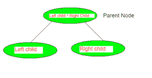
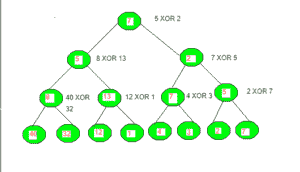

# 通过给定完美二叉树的叶节点构造异或树

> 原文:[https://www . geeksforgeeks . org/construct-xor-tree-by-给定叶节点的完美二叉树/](https://www.geeksforgeeks.org/construct-xor-tree-by-given-leaf-nodes-of-perfect-binary-tree/)

给定一个[完美二叉树](https://www.geeksforgeeks.org/binary-tree-set-3-types-of-binary-tree/)的叶节点，任务是构造异或树并打印该树的根节点。
异或树是指父节点是树的左子节点和右子节点的异或的树。
**父节点=左子节点^右子节点**



**示例:**

> **输入:** arr = {40，32，12，1，4，3，2，7}
> **输出:**异或树的节点
> 7 5 2 8 13 7 5 40 32 12 1 4 3 2 7
> 根:7
> **解释:**
> 
> 
> 
> **输入:** arr = {5，7，2，8，12，3，9，1}
> **输出:**异或树的节点
> 15 8 7 2 10 15 8 5 7 8 12 3 9 1
> 根:15
> 
> **输入:** arr = {4，2，10，1，14，30，21，7}
> **输出:**异或树的节点
> 15 13 2 6 11 16 18 4 2 10 1 14 30 21 7
> 根:15
> 
> **输入:** arr = {1，2，3，4}
> **输出:**异或树的节点
> 4 3 7 1 2 3 4
> 根:4
> 
> **输入:** arr = {47，62，8，10，4，3，1，7}
> **输出:**异或树的节点
> 18 19 1 17 2 7 6 47 62 8 10 4 3 1 7
> 根:18

**进场:**

1.  因为它是一棵完美的二叉树，所以总共有**个 2^h-1** 节点，其中 h 是 XOR 树的高度。
2.  由于完美二叉树的叶节点是给定的，根节点是通过先递归构建左右子树来构建的。
3.  左右子树中的每个节点都是通过对其子树执行异或运算而形成的。

下面是上述方法的实现。

## C++

```
// C++ implementation of the above approach
#include <bits/stdc++.h>
using namespace std;

// Maximum size for xor tree
int maxsize = 100005;

// Allocating space to xor tree
vector<int> xor_tree(maxsize);

// A recursive function that constructs xor tree
// for vector array[start.....end].
// x is index of current node in XOR tree

void construct_Xor_Tree_Util(vector<int> current,
                             int start, int end, int x)
{
    // If there is one element in vector array, store it
    // in current node of XOR tree
    if (start == end) {
        xor_tree[x] = current[start];
        // cout<<xor_tree[x]<<" x";
        return;
    }
    // for left subtree
    int left = x * 2 + 1;
    // for right subtree
    int right = x * 2 + 2;

    // for getting the middle index from corner indexes.
    int mid = start + (end - start) / 2;

    // Build the left and the right subtrees by xor operation
    construct_Xor_Tree_Util(current, start, mid, left);

    construct_Xor_Tree_Util(current, mid + 1, end, right);

    // merge the left and right subtrees by
    // XOR operation

    xor_tree[x] = (xor_tree[left] ^ xor_tree[right]);
}

// Function to construct XOR tree from the given vector array.
// This function calls construct_Xor_Tree_Util() to fill the
// allocated memory of xor_tree vector array
void construct_Xor_Tree(vector<int> arr, int n)
{
    construct_Xor_Tree_Util(arr, 0, n - 1, 0);
}

// Driver Code
int main()
{

    // leaf nodes  of Perfect Binary Tree
    vector<int> leaf_nodes = { 40, 32, 12, 1, 4, 3, 2, 7 };

    int n = leaf_nodes.size();

    // Build the xor tree
    construct_Xor_Tree(leaf_nodes, n);

    // Height of xor tree
    int x = (int)(ceil(log2(n)));

    // Maximum size of xor tree
    int max_size = 2 * (int)pow(2, x) - 1;

    cout << "Nodes of the XOR Tree:\n";
    for (int i = 0; i < max_size; i++) {
        cout << xor_tree[i] << " ";
    }

    // Root node is at index 0 considering
    // 0-based indexing in XOR Tree
    int root = 0;

    // print value at root node
    cout << "\nRoot: " << xor_tree[root];
}
```

## C

```
// C program to build xor tree by leaf nodes
// of perfect binary tree and root node value of tree

#include <math.h>
#include <stdio.h>

// maximum size for xor tree
#define maxsize 10005

// Allocating space to xor tree
int xortree[maxsize];

// A recursive function that constructs xor tree
// for  array[start.....end].
// x is index of current node in xor tree st
void construct_Xor_Tree_Util(int current[],
                             int start, int end, int x)
{
    // If there is one element in array, store it
    // in current node of xor tree and return
    if (start == end) {
        xortree[x] = current[start];
        // printf("%d ", xortree[x]);
        return;
    }
    // for left subtree
    int left = x * 2 + 1;
    // for right subtree
    int right = x * 2 + 2;

    // for getting the middle index
    // from corner indexes.
    int mid = start + (end - start) / 2;

    // Build the left and the right subtrees
    // by xor operation
    construct_Xor_Tree_Util(current, start, mid, left);

    construct_Xor_Tree_Util(current, mid + 1, end, right);

    // merge the left and right subtrees by
    // XOR operation

    xortree[x] = (xortree[left] ^ xortree[right]);
}

// Function to construct XOR tree from given array.
// This function calls construct_Xor_Tree_Util()
// to fill the allocated memory of xort  array
void construct_Xor_Tree(int arr[], int n)
{
    int i = 0;
    for (i = 0; i < maxsize; i++)
        xortree[i] = 0;
    construct_Xor_Tree_Util(arr, 0, n - 1, 0);
}

// Driver Code
int main()
{

    // leaf nodes of Binary Tree
    int leaf_nodes[] = { 40, 32, 12, 1, 4, 3, 2, 7 }, i = 0;

    int n = sizeof(leaf_nodes) / sizeof(leaf_nodes[0]);

    // Build the xor tree
    construct_Xor_Tree(leaf_nodes, n);

    // Height of xor tree
    int x = (int)(ceil(log2(n)));

    // Maximum size of xor tree
    int max_size = 2 * (int)pow(2, x) - 1;

    printf("Nodes of the XOR tree\n");
    for (i = 0; i < max_size; i++) {
        printf("%d ", xortree[i]);
    }

    // Root node is at index 0 considering
    // 0-based indexing in XOR Tree
    int root = 0;

    // print value at root node
    printf("\nRoot: %d", xortree[root]);
}
```

## Java 语言(一种计算机语言，尤用于创建网站)

```
// Java implementation of the above approach
class GFG
{

// Maximum size for xor tree
static int maxsize = 100005;

// Allocating space to xor tree
static int []xor_tree = new int[maxsize];

// A recursive function that constructs xor tree
// for vector array[start.....end].
// x is index of current node in XOR tree

static void construct_Xor_Tree_Util(int []current,
                            int start, int end, int x)
{
    // If there is one element in vector array, store it
    // in current node of XOR tree
    if (start == end)
    {
        xor_tree[x] = current[start];

        // System.out.print(xor_tree[x]+" x";
        return;
    }

    // for left subtree
    int left = x * 2 + 1;

    // for right subtree
    int right = x * 2 + 2;

    // for getting the middle index from corner indexes.
    int mid = start + (end - start) / 2;

    // Build the left and the right subtrees by xor operation
    construct_Xor_Tree_Util(current, start, mid, left);

    construct_Xor_Tree_Util(current, mid + 1, end, right);

    // merge the left and right subtrees by
    // XOR operation

    xor_tree[x] = (xor_tree[left] ^ xor_tree[right]);
}

// Function to conXOR tree from the given vector array.
// This function calls construct_Xor_Tree_Util() to fill the
// allocated memory of xor_tree vector array
static void construct_Xor_Tree(int []arr, int n)
{
    construct_Xor_Tree_Util(arr, 0, n - 1, 0);
}

// Driver Code
public static void main(String[] args)
{

    // leaf nodes of Perfect Binary Tree
    int []leaf_nodes = { 40, 32, 12, 1, 4, 3, 2, 7 };

    int n = leaf_nodes.length;

    // Build the xor tree
    construct_Xor_Tree(leaf_nodes, n);

    // Height of xor tree
    int x = (int)(Math.ceil(Math.log(n)));

    // Maximum size of xor tree
    int max_size = 2 * (int)Math.pow(2, x) - 1;

    System.out.print("Nodes of the XOR Tree:\n");
    for (int i = 0; i < max_size; i++)
    {
        System.out.print(xor_tree[i]+ " ");
    }

    // Root node is at index 0 considering
    // 0-based indexing in XOR Tree
    int root = 0;

    // print value at root node
    System.out.print("\nRoot: " + xor_tree[root]);
}
}

// This code is contributed by PrinciRaj1992
```

## 计算机编程语言

```
# Python3 implementation of the above approach
from math import ceil,log

# Maximum size for xor tree
maxsize = 100005

# Allocating space to xor tree
xor_tree = [0] * maxsize

# A recursive function that constructs xor tree
# for vector array[start.....end].
# x is index of current node in XOR tree
def construct_Xor_Tree_Util(current, start, end, x):

    # If there is one element in vector array, store it
    # in current node of XOR tree
    if (start == end):
        xor_tree[x] = current[start]

        # cout<<xor_tree[x]<<" x"
        return

    # for left subtree
    left = x * 2 + 1

    # for right subtree
    right = x * 2 + 2

    # for getting the middle index from corner indexes.
    mid = start + (end - start) // 2

    # Build the left and the right subtrees by xor operation
    construct_Xor_Tree_Util(current, start, mid, left)

    construct_Xor_Tree_Util(current, mid + 1, end, right)

    # merge the left and right subtrees by
    # XOR operation
    xor_tree[x] = (xor_tree[left] ^ xor_tree[right])

# Function to construct XOR tree from the given vector array.
# This function calls construct_Xor_Tree_Util() to fill the
# allocated memory of xor_tree vector array
def construct_Xor_Tree(arr, n):
    construct_Xor_Tree_Util(arr, 0, n - 1, 0)

# Driver Code
if __name__ == '__main__':

    # leaf nodes of Perfect Binary Tree
    leaf_nodes = [40, 32, 12, 1, 4, 3, 2, 7]

    n = len(leaf_nodes)

    # Build the xor tree
    construct_Xor_Tree(leaf_nodes, n)

    # Height of xor tree
    x = (ceil(log(n, 2)))

    # Maximum size of xor tree
    max_size = 2 * pow(2, x) - 1

    print("Nodes of the XOR Tree:")
    for i in range(max_size):
        print(xor_tree[i], end=" ")

    # Root node is at index 0 considering
    # 0-based indexing in XOR Tree
    root = 0

    # prevalue at root node
    print("\nRoot: ", xor_tree[root])

    # This code is contributed by mohit kumar 29
```

## C#

```
// C# implementation of the above approach
using System;
using System.Collections.Generic;

class GFG
{

// Maximum size for xor tree
static int maxsize = 100005;

// Allocating space to xor tree
static int []xor_tree = new int[maxsize];

// A recursive function that constructs xor tree
// for vector array[start.....end].
// x is index of current node in XOR tree
static void construct_Xor_Tree_Util(int []current,
                            int start, int end, int x)
{
    // If there is one element in vector array, store it
    // in current node of XOR tree
    if (start == end)
    {
        xor_tree[x] = current[start];

        // Console.Write(xor_tree[x]+" x";
        return;
    }

    // for left subtree
    int left = x * 2 + 1;

    // for right subtree
    int right = x * 2 + 2;

    // for getting the middle index from corner indexes.
    int mid = start + (end - start) / 2;

    // Build the left and the right subtrees by xor operation
    construct_Xor_Tree_Util(current, start, mid, left);

    construct_Xor_Tree_Util(current, mid + 1, end, right);

    // merge the left and right subtrees by
    // XOR operation
    xor_tree[x] = (xor_tree[left] ^ xor_tree[right]);
}

// Function to conXOR tree from the given vector array.
// This function calls construct_Xor_Tree_Util() to fill the
// allocated memory of xor_tree vector array
static void construct_Xor_Tree(int []arr, int n)
{
    construct_Xor_Tree_Util(arr, 0, n - 1, 0);
}

// Driver Code
public static void Main(String[] args)
{

    // leaf nodes of Perfect Binary Tree
    int []leaf_nodes = { 40, 32, 12, 1, 4, 3, 2, 7 };

    int n = leaf_nodes.Length;

    // Build the xor tree
    construct_Xor_Tree(leaf_nodes, n);

    // Height of xor tree
    int x = (int)(Math.Ceiling(Math.Log(n)));

    // Maximum size of xor tree
    int max_size = 2 * (int)Math.Pow(2, x) - 1;

    Console.Write("Nodes of the XOR Tree:\n");
    for (int i = 0; i < max_size; i++)
    {
        Console.Write(xor_tree[i] + " ");
    }

    // Root node is at index 0 considering
    // 0-based indexing in XOR Tree
    int root = 0;

    // print value at root node
    Console.Write("\nRoot: " + xor_tree[root]);
}
}

// This code is contributed by PrinciRaj1992
```

## java 描述语言

```
<script>

// Javascript implementation of the above approach

// Maximum size for xor tree
var maxsize = 100005;

// Allocating space to xor tree
var xor_tree = Array(maxsize);

// A recursive function that constructs xor tree
// for vector array[start.....end].
// x is index of current node in XOR tree

function construct_Xor_Tree_Util(current, start, end, x)
{
    // If there is one element in vector array, store it
    // in current node of XOR tree
    if (start == end) {
        xor_tree[x] = current[start];
        // cout<<xor_tree[x]<<" x";
        return;
    }
    // for left subtree
    var left = x * 2 + 1;
    // for right subtree
    var right = x * 2 + 2;

    // for getting the middle index from corner indexes.
    var mid = start + parseInt((end - start) / 2);

    // Build the left and the right subtrees by xor operation
    construct_Xor_Tree_Util(current, start, mid, left);

    construct_Xor_Tree_Util(current, mid + 1, end, right);

    // merge the left and right subtrees by
    // XOR operation

    xor_tree[x] = (xor_tree[left] ^ xor_tree[right]);
}

// Function to construct XOR tree from the given vector array.
// This function calls construct_Xor_Tree_Util() to fill the
// allocated memory of xor_tree vector array
function construct_Xor_Tree(arr, n)
{
    construct_Xor_Tree_Util(arr, 0, n - 1, 0);
}

// Driver Code
// leaf nodes  of Perfect Binary Tree
var leaf_nodes = [40, 32, 12, 1, 4, 3, 2, 7 ];
var n = leaf_nodes.length;
// Build the xor tree
construct_Xor_Tree(leaf_nodes, n);
// Height of xor tree
var x = (Math.ceil(Math.log2(n)));
// Maximum size of xor tree
var max_size = 2 * Math.pow(2, x) - 1;
document.write( "Nodes of the XOR Tree:<br>");
for (var i = 0; i < max_size; i++) {
    document.write( xor_tree[i] + " ");
}
// Root node is at index 0 considering
// 0-based indexing in XOR Tree
var root = 0;
// print value at root node
document.write( "<br>Root: " + xor_tree[root]);

</script>
```

**Output:** 

```
Nodes of the XOR Tree:
7 5 2 8 13 7 5 40 32 12 1 4 3 2 7 
Root: 7
```

**时间复杂度:** O(N)