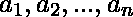
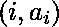
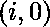

# 盛水最多的容器

> 原文:[https://www.geeksforgeeks.org/container-with-most-water/](https://www.geeksforgeeks.org/container-with-most-water/)

给定 n 个非负整数，其中每个整数代表坐标上的一个点。画出 n '条垂直线，使得线 I 的两个端点在和处。
找两条线，和 x 轴一起组成一个容器，这样容器装的水最多。
程序应该返回一个整数，该整数对应于可容纳的最大水面积(最大面积而不是最大体积听起来很奇怪，但为了简单起见，这是我们正在使用的 2D 飞机)。

***注意:*** 不可以倾斜容器。

**示例:**

```
Input: array = [1, 5, 4, 3]
Output: 6
Explanation : 
5 and 3 are distance 2 apart. 
So the size of the base = 2\. 
Height of container = min(5, 3) = 3\. 
So total area = 3 * 2 = 6

Input: array = [3, 1, 2, 4, 5]
Output: 12
Explanation : 
5 and 3 are distance 4 apart. 
So the size of the base = 4\. 
Height of container = min(5, 3) = 3\. 
So total area = 4 * 3 = 12
```

**<u>天真解:</u>**

*   **方法:**思路相当简单，涉及检查每一对边界或数组元素，找出任意一对边界下的最大面积。
*   **算法:**
    1.  创建一个嵌套循环，外部循环从 0 到结束遍历数组(这个循环的索引是 *i* )。
    2.  内循环从 *i + 1* 到结束遍历数组(该循环的索引为 *j* )。
    3.  找出边界高度为数组[i]和数组[j]的容器中可以容纳的水，即*面积=(j–I)* min(数组[i]，数组[j])* ，如果该面积大于当前最大值，则更新当前最大值
    4.  打印当前最大值。
*   **实施:**

## C++14

```
// C++ code for Max
// Water Container
#include <iostream>
using namespace std;

int maxArea(int A[], int len)
{
    int area = 0;
    for (int i = 0; i < len; i++) {
        for (int j = i + 1; j < len; j++) {
            // Calculating the max area
            area = max(area, min(A[j], A[i]) * (j - i));
        }
    }
    return area;
}

// Driver code
int main()
{
    int a[] = { 1, 5, 4, 3 };
    int b[] = { 3, 1, 2, 4, 5 };

    int len1 = sizeof(a) / sizeof(a[0]);
    cout << maxArea(a, len1);

    int len2 = sizeof(b) / sizeof(b[0]);
    cout << endl << maxArea(b, len2);
}
```

## Java 语言(一种计算机语言，尤用于创建网站)

```
// Java code for Max 
// Water Container
import java.io.*;

class GFG{

public static int maxArea(int[] a)
{

    int Area = 0;

    for(int i = 0; i < a.length; i++)
    {
        for(int j = i + 1; j < a.length; j++)
        {
            Area = Math.max(
                Area, Math.min(a[i], a[j]) *
                              (j - i));
        }
    }
    return Area;
}

// Driver code
public static void main(String[] args)
{
    int a[] = { 1, 5, 4, 3 };
    int b[] = { 3, 1, 2, 4, 5 };

    System.out.println(maxArea(a));
    System.out.println(maxArea(b));
}
}

// This code is contributed by mulchandanimanisha5
```

## 蟒蛇 3

```
# Python3 code for Max
# Water Container
def maxArea(A, Len) :
    area = 0
    for i in range(Len) :
        for j in range(i + 1, Len) :

            # Calculating the max area
            area = max(area, min(A[j], A[i]) * (j - i))
    return area

# Driver code
a = [ 1, 5, 4, 3 ]
b = [ 3, 1, 2, 4, 5 ]

len1 = len(a)
print(maxArea(a, len1))

len2 = len(b)
print(maxArea(b, len2))

# This code is contributed by divyesh072019.
```

## C#

```
// C# code for Max
// Water Container
using System;
class GFG
{

public static int maxArea(int[] a)
{

    int Area = 0;

    for(int i = 0; i < a.Length; i++)
    {
        for(int j = i + 1; j < a.Length; j++)
        {
            Area = Math.Max(Area, Math.Min(a[i], a[j]) *
                            (j - i));
        }
    }
    return Area;
}

// Driver code
public static void Main(String[] args)
{
    int []a = { 1, 5, 4, 3 };
    int []b = { 3, 1, 2, 4, 5 };

    Console.WriteLine(maxArea(a));
    Console.Write(maxArea(b));
}
}

// This code is contributed by shivanisinghss2110
```

## java 描述语言

```
<script>
    // Javascript code for Max
    // Water Container

    function maxArea(A, len)
    {
        let area = 0;
        for (let i = 0; i < len; i++) {
            for (let j = i + 1; j < len; j++) {
                // Calculating the max area
                area = Math.max(area, Math.min(A[j], A[i]) * (j - i));
            }
        }
        return area;
    }

      let a = [ 1, 5, 4, 3 ];
    let b = [ 3, 1, 2, 4, 5 ];

    let len1 = a.length;
    document.write(maxArea(a, len1) + "</br>");

    let len2 = b.length;
    document.write(maxArea(b, len2));

    // This code is contributed by mukesh07.
</script>
```

**Output:** 

```
6
12
```

**复杂度分析:**

*   **时间复杂度:** O(n^2).
    由于需要嵌套遍历数组，因此时间复杂度为 O(n^2)
*   **空间复杂度:** O(1)。
    由于不需要额外的空间，因此空间复杂度是恒定的。

**<u>高效解决方案:</u>**

*   **方法:**给定一组容器边界线的高度，找出一个容器能储存的最大水量。所以从第一个也是最后一个元素开始，检查容器中可以容纳和储存的水量。现在问题来了，有没有更好的边界或线可以容纳最大量的水。所以有一个聪明的方法可以找到它。最初，有两个索引，第一个和最后一个索引指向第一个和最后一个元素(充当容器的边界)，如果第一个索引的值小于最后一个索引的值，则增加第一个索引，否则减少最后一个索引。由于宽度的减少是恒定的，通过遵循上述过程，可以得到最佳答案。
    *下面的 GIF 解释了这种方法。*


*   **算法:**
    1.  保留两个索引，*第一个= 0* 和*最后一个= n-1* 以及一个存储最大面积的 max_area 值。
    2.  运行一个循环，直到第一个小于最后一个。
    3.  用最大面积和*最小值的最大值更新最大面积(数组[第一个]，数组[最后一个])*(倒数第一个)*
    4.  如果数组[第一个]的值大于数组[最后一个],则将最后一个更新为最后一个–1，否则将首先更新为第一个+ 1
    5.  打印最大面积。
*   **实施:**

## C++

```
// C++ code for Max
// Water Container
#include<iostream>
using namespace std;

int maxArea(int A[], int len)
{
    int l = 0;
    int r = len -1;
    int area = 0;

    while (l < r)
    {
        // Calculating the max area
        area = max(area, min(A[l],
                        A[r]) * (r - l));

            if (A[l] < A[r])
                l += 1;

            else
                r -= 1;
    }
    return area;
}

// Driver code
int main()
{
    int a[] = {1, 5, 4, 3};
    int b[] = {3, 1, 2, 4, 5};

    int len1 = sizeof(a) / sizeof(a[0]);
    cout << maxArea(a, len1);

    int len2 = sizeof(b) / sizeof(b[0]);
    cout << endl << maxArea(b, len2);
}

// This code is contributed by Smitha Dinesh Semwal
```

## Java 语言(一种计算机语言，尤用于创建网站)

```
// Java code for Max
// Water Container
import java.util.*;

class Area{

    public static int maxArea(int A[], int len)
    {
        int l = 0;
        int r = len -1;
        int area = 0;

        while (l < r)
        {
            // Calculating the max area
            area = Math.max(area,
                        Math.min(A[l], A[r]) * (r - l));

            if (A[l] < A[r])
                l += 1;

            else
                r -= 1;
        }
        return area;
    }

    public static void main(String[] args)
    {
        int a[] = {1, 5, 4, 3};
        int b[] = {3, 1, 2, 4, 5};

        int len1 = 4;
        System.out.print( maxArea(a, len1)+"\n" );

        int len2 = 5;
        System.out.print( maxArea(b, len2) );
    }
}

// This code is contributed by rishabh_jain
```

## 蟒蛇 3

```
# Python3 code for Max
# Water Container
def maxArea( A):
    l = 0
    r = len(A) -1
    area = 0

    while l < r:
        # Calculating the max area
        area = max(area, min(A[l],
                        A[r]) * (r - l))

        if A[l] < A[r]:
            l += 1
        else:
            r -= 1
    return area

# Driver code
a = [1, 5, 4, 3]
b = [3, 1, 2, 4, 5]

print(maxArea(a))
print(maxArea(b))
```

## C#

```
// C# code for Max
// Water Container
using System;

class Area{

    public static int maxArea(int []A, int len)
    {
        int l = 0;
        int r = len -1;
        int area = 0;

        while (l < r)
        {
            // Calculating the max area
            area = Math.Max(area,
                        Math.Min(A[l], A[r]) * (r - l));

            if (A[l] < A[r])
                l += 1;

            else
                r -= 1;
        }
        return area;
    }

    // Driver code
    public static void Main()
    {
        int []a = {1, 5, 4, 3};
        int []b = {3, 1, 2, 4, 5};

        int len1 = 4;
        Console.WriteLine( maxArea(a, len1));

        int len2 = 5;
        Console.WriteLine( maxArea(b, len2) );
    }
}

// This code is contributed by Vt_M
```

## 服务器端编程语言（Professional Hypertext Preprocessor 的缩写）

```
<?php
// PHP code for Max
// Water Container
function maxArea($A, $len)
{
    $l = 0;
    $r = $len -1;
    $area = 0;

    while ($l < $r)
    {
        // Calculating the max area
        $area = max($area, min($A[$l],
                    $A[$r]) * ($r - $l));

            if ($A[$l] < $A[$r])
                $l += 1;

            else
                $r -= 1;
    }
    return $area;
}

// Driver code
$a = array(1, 5, 4, 3);
$b = array(3, 1, 2, 4, 5);

$len1 = sizeof($a) / sizeof($a[0]);
echo maxArea($a, $len1). "\n";

$len2 = sizeof($b) / sizeof($b[0]);
echo maxArea($b, $len2);

// This code is contributed by mits
?>
```

## java 描述语言

```
<script>

// Javascript code for Max
// Water Container
function maxArea(A, len)
{
    let l = 0;
    let r = len -1;
    let area = 0;

    while (l < r)
    {

        // Calculating the max area
        area = Math.max(area, Math.min(A[l],
                        A[r]) * (r - l));

        if (A[l] < A[r])
            l += 1;
        else
            r -= 1;
    }
    return area;
}

// Driver code
let a = [ 1, 5, 4, 3 ];
let b = [ 3, 1, 2, 4, 5 ];

let len1 = a.length;
document.write(maxArea(a, len1) + "</br>");

let len2 = b.length;
document.write(maxArea(b, len2));

// This code is contributed by rameshtravel07

</script>
```

**Output**

```
6
12
```

**复杂度分析:**

*   **时间复杂度:** O(n)。
    由于只需要遍历一次数组，所以时间复杂度为 O(n)。
*   **空间复杂度:** O(1)。
    不需要额外的空间，所以空间复杂度不变。