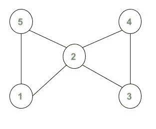

# 无向图到有向欧拉回路的转换

> 原文:[https://www . geesforgeks . org/无向图到有向欧拉回路的转换/](https://www.geeksforgeeks.org/conversion-of-an-undirected-graph-to-a-directed-euler-circuit/)

给定一个有 **V** 节点(从 1 到 V 编号)和 **E** 边的无向图，任务是检查该图是否是[欧拉图](https://www.geeksforgeeks.org/eulerian-path-and-circuit/)，如果是，则将其转换为有向欧拉回路。

> 一个**有向欧拉回路**是一个有向图，这样如果你从任何一个节点开始遍历这个图，并且精确地穿过每条边一次，你将在开始节点结束。

**注意:**当遍历欧拉回路时，每条边恰好遍历一次。如果需要，可以多次遍历一个节点，但是不能多次遍历一条边。

**示例:**

> **输入:**
> 
> 
> 
> **输出:**
> 1 2
> 2 5
> 5 1
> 2 4
> 4 3
> 3 2
> **解释:**
> 给定无向图的有向欧拉回路将为:
> 
> 

**进场:**

1.  首先，我们需要确定给定的无向图[是否为欧拉](https://www.geeksforgeeks.org/eulerian-path-and-circuit/)。如果无向图不是欧拉图，我们就不能把它转换成有向欧拉图。
    *   为了检查它，我们只需要计算每个节点的度数。如果所有节点的**度**为**偶**且不等于 0，则该图为欧拉图。
2.  我们将使用[深度优先搜索遍历](https://www.geeksforgeeks.org/depth-first-search-or-dfs-for-a-graph/)来分配方向。
    *   遍历时，我们将设置边从父到子的方向。我们将维护一个地图，以确保一条边只被遍历一次。

下面是上述算法的实现:

## C++

```
// C++ program to Convert an
// Undirected Graph to a
// Directed Euler Circuit

#include <bits/stdc++.h>
using namespace std;

vector<int> g[100];

// Array to store degree
// of nodes.
int deg[100] = { 0 };

// Map to keep a track of
// visited edges
map<pair<int, int>, int> m1;

// Vector to store the edge
// pairs
vector<pair<int, int> > v;

// Function to add Edge
void addEdge(int u, int v)
{
    deg[u]++;
    deg[v]++;
    g[u].push_back(v);
    g[v].push_back(u);
}

// Function to check if graph
// is Eulerian or not
bool CheckEulerian(int n)
{
    int check = 0;
    for (int i = 1; i <= n; i++) {
        // Checking if odd degree
        // or zero degree nodes
        // are present
        if (deg[i] % 2 || deg[i] == 0) {
            check = 1;
            break;
        }
    }

    // If any degree is odd or
    // any vertex has degree 0
    if (check) {
        return false;
    }
    return true;
}
// DFS Function to assign the direction
void DirectedEuler(int node,
                   vector<int> g[])
{
    for (auto i = g[node].begin();
         i != g[node].end(); i++) {
        // Checking if edge is already
        // visited
        if (m1[make_pair(node, *i)]
            || m1[make_pair(*i, node)])
            continue;

        m1[make_pair(node, *i)]++;

        // Storing the edge
        v.push_back(make_pair(node, *i));
        DirectedEuler(*i, g);
    }
}

// Function prints the convert
// Directed graph
void ConvertDirectedEuler(int n,
                          int e)
{
    if (!CheckEulerian(n)) {
        cout << "NOT POSSIBLE"
             << endl;
        return;
    }

    DirectedEuler(1, g);

    // Printing directed edges
    for (auto i = v.begin();
         i != v.end(); i++) {
        cout << (*i).first
             << " "
             << (*i).second
             << endl;
    }
}
// Driver code
int main()
{
    int N = 5;
    int E = 6;
    addEdge(1, 2);
    addEdge(1, 5);
    addEdge(5, 2);
    addEdge(2, 4);
    addEdge(2, 3);
    addEdge(4, 3);

    ConvertDirectedEuler(N, E);
}
```

## Java 语言(一种计算机语言，尤用于创建网站)

```
// Java program to Convert an
// Undirected Graph to a
// Directed Euler Circuit
import java.io.*;
import java.lang.*;
import java.util.*;

class GFG{

// Pair class to store Key in map
static class Pair
{
    int first;
    int second;

    Pair(int first, int second)
    {
        this.first = first;
        this.second = second;
    }

    @Override
    public int hashCode()
    {
        final int prime = 31;
        int result = 1;
        result = prime * result + first;
        result = prime * result + second;
        return result;
    }

    @Override
    public boolean equals(Object obj)
    {
        if (this == obj)
            return true;
        if (obj == null)
            return false;
        if (getClass() != obj.getClass())
            return false;
        Pair other = (Pair) obj;
        if (first != other.first)
            return false;
        if (second != other.second)
            return false;

        return true;
    }
}

// To store graph
static ArrayList<Integer> g[];

// Array to store degree of nodes.
static int deg[];

// Vector to store the edge pairs
static ArrayList<Pair> v;

// Map to keep a track of
// visited edges
static HashMap<Pair, Integer> m1;

@SuppressWarnings("unchecked")
static void initialize()
{
    g = new ArrayList[100];
    for(int i = 0; i < 100; i++)
        g[i] = new ArrayList<>();

    deg = new int[100];
    v = new ArrayList<>();
    m1 = new HashMap<>();
}

// Function to add Edge
static void addEdge(int u, int v)
{
    deg[u]++;
    deg[v]++;
    g[u].add(v);
    g[v].add(u);
}

// Function to check if graph
// is Eulerian or not
static boolean CheckEulerian(int n)
{
    int check = 0;
    for(int i = 1; i <= n; i++)
    {

        // Checking if odd degree
        // or zero degree nodes
        // are present
        if (deg[i] % 2 == 1 || deg[i] == 0)
        {
            check = 1;
            break;
        }
    }

    // If any degree is odd or
    // any vertex has degree 0
    if (check == 1)
    {
        return false;
    }
    return true;
}

// DFS Function to assign the direction
static void DirectedEuler(int node,
                          ArrayList<Integer> g[])
{
    for(int i : g[node])
    {

        // Checking if edge is already
        // visited
        if (m1.containsKey(new Pair(node, i)) ||
            m1.containsKey(new Pair(i, node)))
            continue;

        m1.put(new Pair(node, i), 1);

        // Storing the edge
        v.add(new Pair(node, i));
        DirectedEuler(i, g);
    }
}

// Function prints the convert
// Directed graph
static void ConvertDirectedEuler(int n, int e)
{
    if (!CheckEulerian(n))
    {
        System.out.println("NOT POSSIBLE");
        return;
    }

    DirectedEuler(1, g);

    // Printing directed edges
    for(Pair p : v)
    {
        System.out.println(p.first + " " + p.second);
    }
}

// Driver Code
public static void main(String[] args)
{
    int N = 5;
    int E = 6;

    // To initialize
    initialize();

    addEdge(1, 2);
    addEdge(1, 5);
    addEdge(5, 2);
    addEdge(2, 4);
    addEdge(2, 3);
    addEdge(4, 3);

    ConvertDirectedEuler(N, E);
}
}

// This code is contributed by Kingash
```

## 蟒蛇 3

```
# Python program to Convert an
# Undirected Graph to a
# Directed Euler Circuit
from typing import List
g = [[] for _ in range(100)]

# Array to store degree
# of nodes.
deg = [0 for _ in range(100)]

# Map to keep a track of
# visited edges
m1 = dict()

# Vector to store the edge
# pairs
v = []

# Function to add Edge
def addEdge(u: int, v: int) -> None:
    global deg, g
    deg[u] += 1
    deg[v] += 1
    g[u].append(v)
    g[v].append(u)

# Function to check if graph
# is Eulerian or not
def CheckEulerian(n: int) -> bool:

    check = 0
    for i in range(1, n + 1):

        # Checking if odd degree
        # or zero degree nodes
        # are present
        if (deg[i] % 2 or deg[i] == 0):
            check = 1
            break

    # If any degree is odd or
    # any vertex has degree 0
    if (check):
        return False

    return True

# DFS Function to assign the direction
def DirectedEuler(node: int, g: List[List[int]]) -> None:

    for i in g[node]:

        # Checking if edge is already
        # visited
        if ((node, i) in m1 or (i, node) in m1):
            continue

        if (node, i) not in m1:
            m1[(node, i)] = 0
        m1[(node, i)] += 1

        # Storing the edge
        v.append((node, i))
        DirectedEuler(i, g)

# Function prints the convert
# Directed graph
def ConvertDirectedEuler(n: int, e: int) -> None:
    if (not CheckEulerian(n)):
        print("NOT POSSIBLE")
        return
    DirectedEuler(1, g)

    # Printing directed edges
    for i in v:
        print("{} {}".format(i[0], i[1]))

# Driver code
if __name__ == "__main__":

    N = 5
    E = 6
    addEdge(1, 2)
    addEdge(1, 5)
    addEdge(5, 2)
    addEdge(2, 4)
    addEdge(2, 3)
    addEdge(4, 3)

    ConvertDirectedEuler(N, E)

# This code is contributed by sanjeev2552
```

## C#

```
// C# program to Convert an
// Undirected Graph to a
// Directed Euler Circuit
using System;
using System.Collections.Generic;
class GFG {

    static List<List<int>> g = new List<List<int>>();

    // Array to store degree
    // of nodes.
    static int[] deg = new int[100];

    // Map to keep a track of
    // visited edges
    static Dictionary<Tuple<int,int>, int> m1 = new Dictionary<Tuple<int,int>, int>();

    // Vector to store the edge
    // pairs
    static List<Tuple<int,int>> v = new List<Tuple<int,int>>();

    // Function to add Edge
    static void addEdge(int u, int v)
    {
        deg[u]++;
        deg[v]++;
        g[u].Add(v);
        g[v].Add(u);
    }

    // Function to check if graph
    // is Eulerian or not
    static bool CheckEulerian(int n)
    {
        int check = 0;
        for (int i = 1; i <= n; i++) {
            // Checking if odd degree
            // or zero degree nodes
            // are present
            if (deg[i] % 2 != 0 || deg[i] == 0) {
                check = 1;
                break;
            }
        }

        // If any degree is odd or
        // any vertex has degree 0
        if (check == 1) {
            return false;
        }
        return true;
    }
    // DFS Function to assign the direction
    static void DirectedEuler(int node, List<List<int>> g)
    {
        int[,] m = {{1, 2}, {2, 5}, {5, 1}, {2, 4}, {4, 3}, {3, 2}};
        for(int i = 0; i < g[node].Count; i++) {
            // Checking if edge is already
            // visited
            if (!m1.ContainsKey(new Tuple<int,int>(node, g[node][i]))
                || !m1.ContainsKey(new Tuple<int,int>(g[node][i], node)))
                continue;

            m1[new Tuple<int,int>(node, g[node][i])] = 1;
            // Storing the edge
            v.Add(new Tuple<int,int>(node, g[node][i]));
            DirectedEuler(g[node][i], g);
        }
        for(int i = 0; i < m.GetLength(0); i++)
        {
            Console.WriteLine(m[i,0] + " " + m[i,1]);
        }
    }

    // Function prints the convert
    // Directed graph
    static void ConvertDirectedEuler(int n, int e)
    {
        if (!CheckEulerian(n)) {
            Console.Write("NOT POSSIBLE");
            return;
        }

        DirectedEuler(1, g);

        // Printing directed edges
        for (int i = 0; i < v.Count; i++) {
            Console.WriteLine(v[i].Item1 + " " + v[i].Item2);
        }
    }

  static void Main() {

    for(int i = 0; i < 100; i++)
    {
        g.Add(new List<int>());
    }

    int N = 5;
    int E = 6;
    addEdge(1, 2);
    addEdge(1, 5);
    addEdge(5, 2);
    addEdge(2, 4);
    addEdge(2, 3);
    addEdge(4, 3);

    ConvertDirectedEuler(N, E);
  }
}

// This code is contributed by suresh07.
```

## java 描述语言

```
<script>
    // Javascript program to Convert an
    // Undirected Graph to a
    // Directed Euler Circuit
    let g = [];
    for(let i = 0; i < 100; i++)
    {
        g.push([]);
    }

    // Array to store degree
    // of nodes.
    let deg = new Array(100);
    deg.fill(0);

    // Map to keep a track of
    // visited edges
    let m1 = new Map();

    // Vector to store the edge
    // pairs
    let v = [];

    // Function to add Edge
    function addEdge(u, v)
    {
        deg[u]++;
        deg[v]++;
        g[u].push(v);
        g[v].push(u);
    }

    // Function to check if graph
    // is Eulerian or not
    function CheckEulerian(n)
    {
        let check = 0;
        for (let i = 1; i <= n; i++) {
            // Checking if odd degree
            // or zero degree nodes
            // are present
            if (deg[i] % 2 != 0 || deg[i] == 0) {
                check = 1;
                break;
            }
        }

        // If any degree is odd or
        // any vertex has degree 0
        if (check == 1) {
            return false;
        }
        return true;
    }
    // DFS Function to assign the direction
    function DirectedEuler(node, g)
    {
        let m = [[1, 2], [2, 5], [5, 1], [2, 4], [4, 3], [3, 2]];
        for(let i = 0; i < g[node].length; i++) {
            // Checking if edge is already
            // visited
            if (!m1.has([node, g[node][i]])
                || !m1.has([g[node][i], node]))
                continue;

            m1.set([node, g[node][i]], 1);
            // Storing the edge
            v.push([node, g[node][i]]);
            DirectedEuler(g[node][i], g);
        }
        for(let i = 0; i < m.length; i++)
        {
            document.write(m[i][0] + " " + m[i][1] + "</br>");
        }
    }

    // Function prints the convert
    // Directed graph
    function ConvertDirectedEuler(n, e)
    {
        if (!CheckEulerian(n)) {
            document.write("NOT POSSIBLE");
            return;
        }

        DirectedEuler(1, g);

        // Printing directed edges
        for (let i = 0; i < v.length; i++) {
            document.write(v[i][0] + " " + v[i][1] + "</br>");
        }
    }

    let N = 5;
    let E = 6;
    addEdge(1, 2);
    addEdge(1, 5);
    addEdge(5, 2);
    addEdge(2, 4);
    addEdge(2, 3);
    addEdge(4, 3);

    ConvertDirectedEuler(N, E);

// This code is contributed by divyesh072019.
</script>
```

**Output:** 

```
1 2
2 5
5 1
2 4
4 3
3 2
```

***时间复杂度:**O((V+E)* log(E))*
***空间复杂度:** O(max( V，E ))*