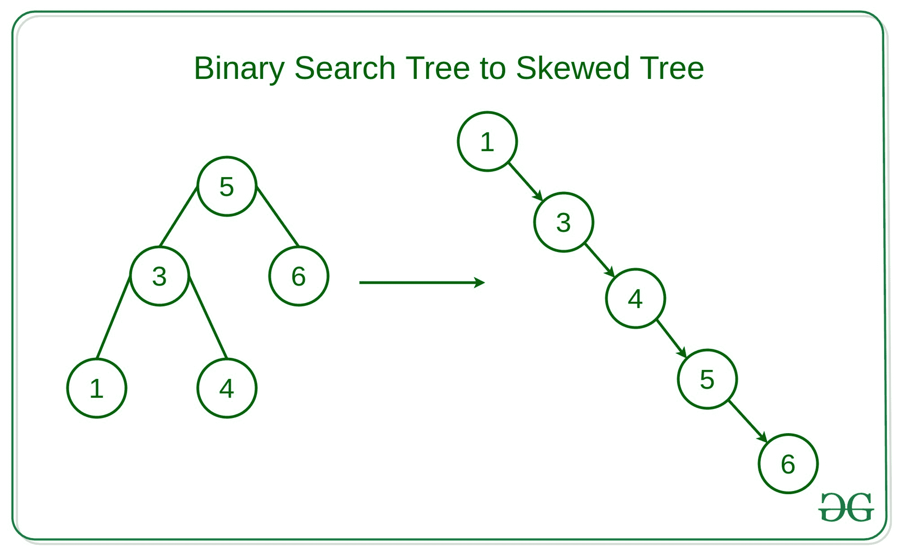

# 按照递增或递减的顺序将二叉查找树转换为斜树

> 原文:[https://www . geeksforgeeks . org/convert-a-binary-search-tree-a-skew-tree-in-递增或递减顺序/](https://www.geeksforgeeks.org/convert-a-binary-search-tree-into-a-skewed-tree-in-increasing-or-decreasing-order/)

给定一个[二叉查找树](https://www.geeksforgeeks.org/binary-search-tree-set-1-search-and-insertion/)和一个二进制整数 **K** ，任务是在 **K = 0** 的情况下，按照递增的顺序，或者在 **K = 1** 的情况下，按照递减的顺序，将二叉查找树转换为[斜树](https://www.geeksforgeeks.org/skewed-binary-tree/)。



**示例:**

```
Input: K = 0, 
           5
          / \
         3   6
Output:
       3
        \
         5
          \
           6

Input: K = 1,
          2
         / \
        1   3
Output:
     3
      \
       2
        \
         1
```

**进场:**

*   问题中的关键观察是，偏斜树的第一个节点将是 BST 的**最左或最右**节点，分别为升序和降序。
*   对于**递增顺序**我们需要进行 [**有序遍历**](https://www.geeksforgeeks.org/inorder-tree-traversal-without-recursion/) ，因为 BST 的有序遍历为我们提供了节点值的递增顺序。因此，每个节点的遍历顺序是:
    1.  **左节点:**如果存在，则递归到其左节点，以获得较小的值。
    2.  **根节点:**在其左节点/子树完成遍历后，将歪斜树的前一个节点连接到根节点。
    3.  **右节点:**如果存在右节点，则递归到右节点，以获得更大的值。
*   对于**递减顺序**，每个节点的遍历顺序为:
    1.  **右节点:**如果存在，则递归到其右节点，以获得更大的值。
    2.  **根节点:**在其右节点/子树完成遍历后，将歪斜树的前一个节点连接到根节点。
    3.  **左节点:**递归到左节点/子树以获得更小的值。
*   类似地，通过跟踪前一个节点，我们可以根据需要的顺序遍历二叉查找树并形成倾斜的树。

下面是上述方法的实现:

## C++14

```
// C++ implementation to flatten the
// binary search tree into a skewed
// tree in increasing / decreasing order
#include<bits/stdc++.h>
using namespace std;

// Class of the node
struct Node
{
    int val;
    Node *left, *right;

    Node(int x)
    {
        val = x;
        left = right = NULL;
    }
};

Node *prevNode = NULL;
Node *headNode = NULL;

// Function to to flatten the binary
// search tree into a skewed tree in
// increasing / decreasing order
void flattenBTToSkewed(Node *root, int order)
{

    // Base Case
    if (!root)
        return;

    // Condition to check the order
    // in which the skewed tree to
    // maintained
    if (order)
        flattenBTToSkewed(root->right, order);
    else
        flattenBTToSkewed(root->left, order);

    Node *rightNode = root->right;
    Node *leftNode = root->left;

    // Condition to check if the root Node
    // of the skewed tree is not defined
    if (!headNode)
    {
        headNode = root;
        root->left = NULL;
        prevNode = root;
    }
    else
    {
        prevNode->right = root;
        root->left = NULL;
        prevNode = root;
    }

    // Similarly recurse for the left / right
    // subtree on the basis of the order required
    if (order)
        flattenBTToSkewed(leftNode, order);
    else
        flattenBTToSkewed(rightNode, order);
}

// Function to traverse the right
// skewed tree using recursion
void traverseRightSkewed(Node *root)
{
    if (!root)
        return;

    cout << root->val << " ";
    traverseRightSkewed(root->right);
}

// Driver Code
int main()
{

    //    5
    //     / \
    //  3   6
    Node *root =new Node(5);
    root->left = new Node(3);
    root->right = new Node(6);

    // Order of the Skewed tree can
    // be defined as follows -
    // For Increasing order - 0
    // For Decreasing order - 1
    int order = 0;

    flattenBTToSkewed(root, order);

    traverseRightSkewed(headNode);
}

// This code is contributed by mohit kumar 29
```

## Java 语言(一种计算机语言，尤用于创建网站)

```
// Java implementation to flatten the
// binary search tree into a skewed
// tree in increasing / decreasing order
import java.io.*;

// Class of the node
class Node
{
    int val;
    Node left, right;

    // Helper function that allocates a new node
    // with the given data and NULL left and right
    // pointers.
    Node(int item)
    {
        val = item;
        left = right = null;
    }
}
class GFG
{
    public static Node node;
    static Node prevNode = null;
    static Node headNode = null;

    // Function to to flatten the binary
    // search tree into a skewed tree in
    // increasing / decreasing order
    static void flattenBTToSkewed(Node root,
                                  int order)
    {

        // Base Case
        if(root == null)
        {
            return;
        }

        // Condition to check the order
        // in which the skewed tree to
        // maintained
        if(order > 0)
        {
            flattenBTToSkewed(root.right, order);
        }
        else
        {
            flattenBTToSkewed(root.left, order);
        }
        Node rightNode = root.right;
        Node leftNode = root.left;

        // Condition to check if the root Node
        // of the skewed tree is not defined
        if(headNode == null)
        {
            headNode = root;
            root.left = null;
            prevNode = root;
        }
        else
        {
            prevNode.right = root;
            root.left = null;
            prevNode = root;
        }

        // Similarly recurse for the left / right
        // subtree on the basis of the order required
        if (order > 0)
        {
            flattenBTToSkewed(leftNode, order);
        }
        else
        {
            flattenBTToSkewed(rightNode, order);
        }
    }

    // Function to traverse the right
    // skewed tree using recursion
    static void traverseRightSkewed(Node root)
    {
        if(root == null)
        {
            return;
        }
        System.out.print(root.val + " ");
        traverseRightSkewed(root.right);       
    }

    // Driver Code
    public static void main (String[] args)
    {
       //    5
       //     / \
       //  3   6
        GFG tree = new GFG();
        tree.node = new Node(5);
        tree.node.left = new Node(3);
        tree.node.right = new Node(6);

        // Order of the Skewed tree can
        // be defined as follows -
        // For Increasing order - 0
        // For Decreasing order - 1
        int order = 0;
        flattenBTToSkewed(node, order);
        traverseRightSkewed(headNode);
    }
}

// This code is contributed by avanitrachhadiya2155
```

## 蟒蛇 3

```
# Python3 implementation to flatten
# the binary search tree into a skewed
# tree in increasing / decreasing order

# Class of the node
class Node:

    # Constructor of node
    def __init__(self, val):
        self.val = val
        self.left = None
        self.right = None

prevNode = None
headNode = None

# Function to to flatten
# the binary search tree into a skewed
# tree in increasing / decreasing order
def flattenBTToSkewed(root, order):

    # Base Case
    if not root:
        return

    # Condition to check the order
    # in which the skewed tree to maintained
    if order:
        flattenBTToSkewed(root.right, order)
    else:
        flattenBTToSkewed(root.left, order)

    global headNode; global prevNode
    rightNode = root.right
    leftNode = root.left

    # Condition to check if the root Node
    # of the skewed tree is not defined
    if not headNode:
        headNode = root
        root.left = None
        prevNode = root
    else:
        prevNode.right = root
        root.left = None
        prevNode = root

    # Similarly recurse for the left / right
    # subtree on the basis of the order required
    if order:
        flattenBTToSkewed(leftNode, order)
    else:
        flattenBTToSkewed(rightNode, order)

# Function to traverse the right
# skewed tree using recursion
def traverseRightSkewed(root):
    if not root:
        return
    print(root.val, end = " ")
    traverseRightSkewed(root.right)

# Driver Code
if __name__ == "__main__":
    # 5
    #      / \
    # 3   6
    root = Node(5)
    root.left = Node(3)
    root.right = Node(6)

    prevNode = None
    headNode = None

    # Order of the Skewed tree can
    # be defined as follows -
    # For Increasing order - 0
    # For Decreasing order - 1
    order = 0

    flattenBTToSkewed(root, order)

    traverseRightSkewed(headNode)
```

## C#

```
// C# implementation to flatten the
// binary search tree into a skewed
// tree in increasing / decreasing order
using System;

// Class of the node
class Node
{
    public int val;
    public Node left, right;

    // Helper function that allocates a new
    // node with the given data and NULL
    // left and right pointers.
    public Node(int item)
    {
        val = item;
        left = right = null;
    }
}

class GFG{

public static Node node;
static Node prevNode = null;
static Node headNode = null;

// Function to to flatten the binary
// search tree into a skewed tree in
// increasing / decreasing order
static void flattenBTToSkewed(Node root, int order)
{

    // Base Case
    if (root == null)
    {
        return;
    }

    // Condition to check the order
    // in which the skewed tree to
    // maintained
    if (order > 0)
    {
        flattenBTToSkewed(root.right, order);
    }
    else
    {
        flattenBTToSkewed(root.left, order);
    }
    Node rightNode = root.right;
    Node leftNode = root.left;

    // Condition to check if the root Node
    // of the skewed tree is not defined
    if (headNode == null)
    {
        headNode = root;
        root.left = null;
        prevNode = root;
    }
    else
    {
        prevNode.right = root;
        root.left = null;
        prevNode = root;
    }

    // Similarly recurse for the left / right
    // subtree on the basis of the order required
    if (order > 0)
    {
        flattenBTToSkewed(leftNode, order);
    }
    else
    {
        flattenBTToSkewed(rightNode, order);
    }
}

// Function to traverse the right
// skewed tree using recursion
static void traverseRightSkewed(Node root)
{
    if (root == null)
    {
        return;
    }
    Console.Write(root.val + " ");
    traverseRightSkewed(root.right);
}

// Driver Code
static public void Main()
{

    //      5
    //     / \
    //    3   6
    GFG.node = new Node(5);
    GFG.node.left = new Node(3);
    GFG.node.right = new Node(6);

    // Order of the Skewed tree can
    // be defined as follows -
    // For Increasing order - 0
    // For Decreasing order - 1
    int order = 0;

    flattenBTToSkewed(node, order);
    traverseRightSkewed(headNode);
}
}

// This code is contributed by rag2127
```

## java 描述语言

```
<script>
// Javascript implementation to flatten the
// binary search tree into a skewed
// tree in increasing / decreasing order

// Class of the node
class Node
{
    // Helper function that allocates a new node
    // with the given data and NULL left and right
    // pointers.
    constructor(item)
    {
        this.val = item;
        this.left = this.right = null;
    }
}

let node;
let prevNode = null;
let headNode = null;

// Function to to flatten the binary
    // search tree into a skewed tree in
    // increasing / decreasing order
function flattenBTToSkewed(root,order)
{
    // Base Case
        if(root == null)
        {
            return;
        }

        // Condition to check the order
        // in which the skewed tree to
        // maintained
        if(order > 0)
        {
            flattenBTToSkewed(root.right, order);
        }
        else
        {
            flattenBTToSkewed(root.left, order);
        }
        let rightNode = root.right;
        let leftNode = root.left;

        // Condition to check if the root Node
        // of the skewed tree is not defined
        if(headNode == null)
        {
            headNode = root;
            root.left = null;
            prevNode = root;
        }
        else
        {
            prevNode.right = root;
            root.left = null;
            prevNode = root;
        }

        // Similarly recurse for the left / right
        // subtree on the basis of the order required
        if (order > 0)
        {
            flattenBTToSkewed(leftNode, order);
        }
        else
        {
            flattenBTToSkewed(rightNode, order);
        }
}

// Function to traverse the right
    // skewed tree using recursion
function traverseRightSkewed(root)
{
    if(root == null)
        {
            return;
        }
        document.write(root.val + " ");
        traverseRightSkewed(root.right);   
}

// Driver Code

//    5
       //     / \
       //  3   6
node = new Node(5);
node.left = new Node(3);
node.right = new Node(6);

// Order of the Skewed tree can
// be defined as follows -
// For Increasing order - 0
// For Decreasing order - 1
let order = 0;
flattenBTToSkewed(node, order);
traverseRightSkewed(headNode);

// This code is contributed by unknown2108
</script>
```

**Output:** 

```
3 5 6
```