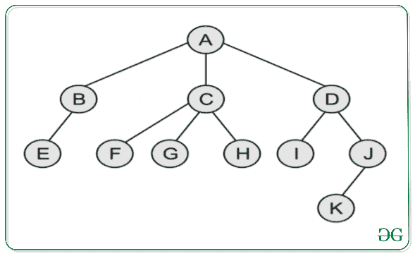
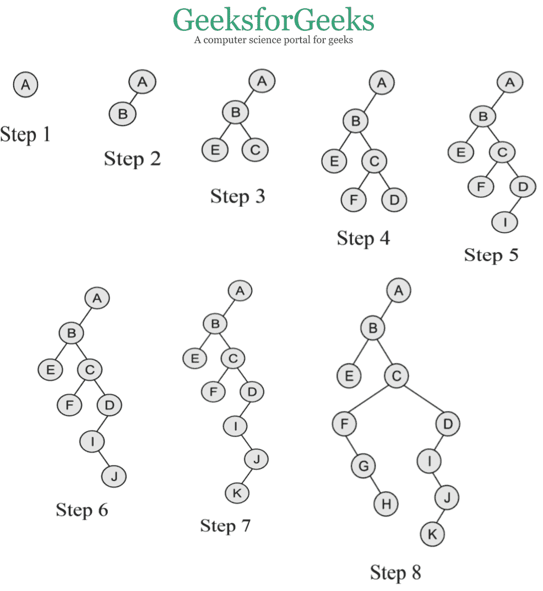

# 将类属树(N 数组树)转换为二叉树

> 原文:[https://www . geesforgeks . org/convert-a-generic-treen-array-tree-to-二叉树/](https://www.geeksforgeeks.org/convert-a-generic-treen-array-tree-to-binary-tree/)

**先决条件:** [通用树(N 阵树)](https://www.geeksforgeeks.org/generic-treesn-array-trees/)

在本文中，我们将讨论泛型树到二叉树的转换。以下是将[泛型(N 数组树)](https://www.geeksforgeeks.org/generic-treesn-array-trees/)转换为[二叉树](https://www.geeksforgeeks.org/binary-tree-data-structure/)的规则:

*   二叉树的根是类属树的根。
*   类属树中节点的左子节点是二叉树中该节点的左子节点。
*   类属树中任何节点的右同级都是二叉树中该节点的右子节点。

**示例:**
将以下类属树转换为二叉树:

<u>下图为上述类属树</u>的二叉树:

> **注意:**如果父节点在一般树中只有右边的子节点，那么它将成为二叉树中父节点之后的最后一个节点的最右边的子节点。
> 在上面的例子中，如果节点 **B** 有正确的子节点 **L** ，那么在二叉树表示中 **L** 将是节点 **D** 的正确子节点。

以下是将类属树转换为二叉树的步骤:

1.  根据上述规则，一般树 **A** 的根节点是二叉树的根节点。
2.  现在一般树中根节点最左边的子节点是 **B** ，是二叉树最左边的子节点。
3.  现在由于 **B** 有 **E** 作为它最左边的子节点，所以它是它在二叉树中最左边的子节点，而它有 **C** 作为它最右边的兄弟节点，所以它是它在二叉树中最右边的子节点。
4.  现在 **C** 有 **F** 作为它最左边的子节点， **D** 作为它最右边的兄弟节点，所以它们在二叉树中分别是它的左右子节点。
5.  现在 **D** 有 **I** 作为它最左边的子节点，也就是它在二叉树中的左子节点，但是没有最右边的兄弟节点，所以在二叉树中没有右子节点。
6.  现在对于 **I** ， **J** 是它最右边的兄弟节点，因此它是二叉树中它的右子节点。
7.  类似地，对于 **J** ， **K** 是其最左边的子节点，因此是其在二叉树中的左子节点。
8.  现在对于 **C** ， **F** 是其最左边的子节点，其最右边的兄弟节点是 **G** ，其最右边的兄弟节点是 **H** ，因此它们分别形成它们的左、右、右子节点。