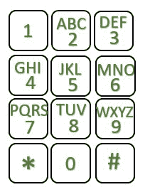

# 将移动数字键盘序列转换为等效句子

> 原文:[https://www . geesforgeks . org/convert-a-mobile-numeric-keypad-sequence-to-equal-句子/](https://www.geeksforgeeks.org/convert-a-mobile-numeric-keypad-sequence-to-equivalent-sentence/)

给定一个大小为 **N** 的[字符串](https://www.geeksforgeeks.org/string-data-structure/) **S** ，由数字**【0–9】**和字符**' '组成**，任务是打印按给定顺序按移动小键盘即可获得的字符串。

***注:** **' . '**代表打字时的休息时间。*

> 下图表示与键盘中每个数字相关的字符。
> 
> [](https://media.geeksforgeeks.org/wp-content/uploads/20210321174831/Keypad2.jpg)

**示例:**

> **输入:** S = "234"
> **输出:** ADG
> **解释:**
> 按一次键 2、3、4，得到的字符串为“ADG”。
> 
> **输入:** S = "22.22"
> **输出:** BB
> **说明:**
> 按两次键 2 给出 B，再按两次键给出 B，因此合成的字符串为“BB”。

**方法:**给定的问题可以通过将移动键盘映射存储在一个数组中，然后[遍历字符串](https://www.geeksforgeeks.org/iterate-over-characters-of-a-string-in-c/) **S** 并将其转换为等效字符串来解决。按照以下步骤解决问题:

*   初始化一个空字符串，说**和**来存储需要的结果。
*   将与移动键盘中的每个键相关联的字符串存储在一个数组中 **nums[]** ，使得 **nums[i]** 表示按下数字 **i** 时的字符集。
*   [使用变量 **i** 遍历给定的字符串](https://www.geeksforgeeks.org/iterate-over-characters-of-a-string-in-c/) **S** ，并执行以下步骤:
    *   如果 **S[i]** 等于**'**，然后将 **i** 增加 1，[继续下一次迭代](https://www.geeksforgeeks.org/continue-statement-cpp/)。
    *   否则，将变量 **cnt** 初始化为 **0** 来存储相同字符的计数。
    *   迭代直到 **S[i]** 等于 **S[i + 1]** ，并且在每次迭代中检查以下条件:
        *   如果 **cnt** 等于 2 而**S【I】**是 2、3、4、5、6 或 8，那么[会跳出循环](https://www.geeksforgeeks.org/break-statement-cc/)，因为键:2、3、4、5、6 和 8 包含相同数量的字符，即 3。
        *   如果 **cnt** 等于 3 而**S【I】**是 7 或 9，那么[就会跳出循环](https://www.geeksforgeeks.org/break-statement-cc/)，因为键:7 和 9 包含相同数量的字符，即 4。
        *   将 **cnt** 和 **i** 的值增加 1。
    *   如果 **S[i]** 是 7 或 9，那么将字符 **nums[str[i]][cnt%4]** 添加到字符串 **ans** 中。
    *   否则，将字符 **nums[str[i]][cnt%3]** 添加到字符串**和**中。
    *   将 **i** 的值增加 1。
*   完成上述步骤后，打印值字符串**和**作为结果。

下面是上述方法的实现:

## C++

```
// C++ program for the above approach
#include <bits/stdc++.h>
using namespace std;

// Function to convert mobile numeric
// keypad sequence into its equivalent
// string
void printSentence(string str)
{
    // Store the mobile keypad mappings
    char nums[][5]
        = { "", "", "ABC", "DEF", "GHI",
            "JKL", "MNO", "PQRS", "TUV",
            "WXYZ" };

    // Traverse the string str
    int i = 0;
    while (str[i] != '\0') {

        // If the current character is
        // '.', then continue to the
        // next iteration
        if (str[i] == '.') {
            i++;
            continue;
        }

        // Stores the number of
        // continuous clicks
        int count = 0;

        // Iterate a loop to find the
        // count of same characters
        while (str[i + 1]
               && str[i] == str[i + 1]) {

            // 2, 3, 4, 5, 6 and 8 keys will
            // have maximum of 3 letters
            if (count == 2
                && ((str[i] >= '2'
                     && str[i] <= '6')
                    || (str[i] == '8')))
                break;

            // 7 and 9 keys will have
            // maximum of 4 keys
            else if (count == 3
                     && (str[i] == '7'
                         || str[i] == '9'))
                break;
            count++;
            i++;

            // Handle the end condition
            if (str[i] == '\0')
                break;
        }

        // Check if the current pressed
        // key is 7 or 9
        if (str[i] == '7' || str[i] == '9') {
            cout << nums[str[i] - 48][count % 4];
        }

        // Else, the key pressed is
        // either 2, 3, 4, 5, 6 or 8
        else {
            cout << nums[str[i] - 48][count % 3];
        }
        i++;
    }
}

// Driver Code
int main()
{
    string str = "234";
    printSentence(str);
    return 0;
}
```

## Java 语言(一种计算机语言，尤用于创建网站)

```
// java program for the above approach
import java.io.*;
import java.lang.*;
import java.util.*;

public class GFG {

    // Function to convert mobile numeric
    // keypad sequence into its equivalent
    // string
    static void printSentence(String S)
    {
        // Store the mobile keypad mappings
        String nums[]
            = { "",    "",    "ABC",  "DEF", "GHI",
                "JKL", "MNO", "PQRS", "TUV", "WXYZ" };

        char str[] = S.toCharArray();

        // Traverse the string str
        int i = 0;
        while (i < str.length) {

            // If the current character is
            // '.', then continue to the
            // next iteration
            if (str[i] == '.') {
                i++;
                continue;
            }

            // Stores the number of
            // continuous clicks
            int count = 0;

            // Iterate a loop to find the
            // count of same characters
            while (i + 1 < str.length
                   && str[i] == str[i + 1]) {

                // 2, 3, 4, 5, 6 and 8 keys will
                // have maximum of 3 letters
                if (count == 2
                    && ((str[i] >= '2' && str[i] <= '6')
                        || (str[i] == '8')))
                    break;

                // 7 and 9 keys will have
                // maximum of 4 keys
                else if (count == 3
                         && (str[i] == '7'
                             || str[i] == '9'))
                    break;
                count++;
                i++;

                // Handle the end condition
                if (i == str.length)
                    break;
            }

            // Check if the current pressed
            // key is 7 or 9
            if (str[i] == '7' || str[i] == '9') {
                System.out.print(
                    nums[str[i] - 48].charAt(count % 4));
            }

            // Else, the key pressed is
            // either 2, 3, 4, 5, 6 or 8
            else {
                System.out.print(
                    nums[str[i] - 48].charAt(count % 3));
            }
            i++;
        }
    }

    // Driver Code
    public static void main(String[] args)
    {

        String str = "234";
        printSentence(str);
    }
}

// This code is contributed by Kingash.
```

## 蟒蛇 3

```
# Python3 program for the above approach

# Function to convert mobile numeric
# keypad sequence into its equivalent
# string
def printSentence(str1):

    # Store the mobile keypad mappings
    nums = [ "", "", "ABC", "DEF", "GHI", "JKL",
             "MNO", "PQRS", "TUV", "WXYZ" ]

    # Traverse the str1ing str1
    i = 0

    while (i < len(str1)):

        # If the current character is
        # '.', then continue to the
        # next iteration
        if (str1[i] == '.'):
            i += 1
            continue

        # Stores the number of
        # continuous clicks
        count = 0

        # Iterate a loop to find the
        # count of same characters
        while (i + 1 < len(str1) and str1[i + 1] and
                          str1[i] == str1[i + 1]):

            # 2, 3, 4, 5, 6 and 8 keys will
            # have maximum of 3 letters
            if (count == 2 and ((str1[i] >= '2' and
             str1[i] <= '6') or (str1[i] == '8'))):
                break

            # 7 and 9 keys will have
            # maximum of 4 keys
            elif (count == 3 and (str1[i] == '7' or
                                  str1[i] == '9')):
                break

            count += 1
            i += 1

            # Handle the end condition
            if (i < len(str)):
                break

        # Check if the current pressed
        # key is 7 or 9
        if (str1[i] == '7' or str1[i] == '9'):
            print(nums[ord(str1[i]) - 48][count % 4], end = "")

        # Else, the key pressed is
        # either 2, 3, 4, 5, 6 or 8
        else:
            print(nums[ord(str1[i]) - 48][count % 3], end = "")

        i += 1

# Driver Code
if __name__ == '__main__':

    str1 = "234"
    printSentence(str1)

# This code is contributed by bgangwar59
```

## C#

```
// C# program for the above approach
using System;
public class GFG
{

    // Function to convert mobile numeric
    // keypad sequence into its equivalent
    // string
    static void printSentence(string S)
    {

        // Store the mobile keypad mappings
        string[] nums
            = { "",    "",    "ABC",  "DEF", "GHI",
                "JKL", "MNO", "PQRS", "TUV", "WXYZ" };

        char[] str = S.ToCharArray();

        // Traverse the string str
        int i = 0;
        while (i < str.Length) {

            // If the current character is
            // '.', then continue to the
            // next iteration
            if (str[i] == '.') {
                i++;
                continue;
            }

            // Stores the number of
            // continuous clicks
            int count = 0;

            // Iterate a loop to find the
            // count of same characters
            while (i + 1 < str.Length
                   && str[i] == str[i + 1]) {

                // 2, 3, 4, 5, 6 and 8 keys will
                // have maximum of 3 letters
                if (count == 2
                    && ((str[i] >= '2' && str[i] <= '6')
                        || (str[i] == '8')))
                    break;

                // 7 and 9 keys will have
                // maximum of 4 keys
                else if (count == 3
                         && (str[i] == '7'
                             || str[i] == '9'))
                    break;
                count++;
                i++;

                // Handle the end condition
                if (i == str.Length)
                    break;
            }

            // Check if the current pressed
            // key is 7 or 9
            if (str[i] == '7' || str[i] == '9') {
                Console.Write(nums[str[i] - 48][count % 4]);
            }

            // Else, the key pressed is
            // either 2, 3, 4, 5, 6 or 8
            else {
                Console.Write(nums[str[i] - 48][count % 3]);
            }
            i++;
        }
    }

    // Driver Code
    public static void Main(string[] args)
    {

        string str = "234";
        printSentence(str);
    }
}

// This code is contributed by ukasp.
```

## java 描述语言

```
<script>

// Javascript program for the above approach

// Function to convert mobile numeric
// keypad sequence into its equivalent
// string
function printSentence(S)
{

    // Store the mobile keypad mappings
    let nums = [ "", "", "ABC", "DEF", "GHI",
                 "JKL", "MNO", "PQRS", "TUV", "WXYZ"];

    let str = S.split("");

    // Traverse the string str
    let i = 0;
    while (i < str.length)
    {

        // If the current character is
        // '.', then continue to the
        // next iteration
        if (str[i] == '.')
        {
            i++;
            continue;
        }

        // Stores the number of
        // continuous clicks
        let count = 0;

        // Iterate a loop to find the
        // count of same characters
        while (i + 1 < str.length &&
               str[i] == str[i + 1])
        {

            // 2, 3, 4, 5, 6 and 8 keys will
            // have maximum of 3 letters
            if (count == 2 && ((str[i] >= '2' &&
                str[i] <= '6') || (str[i] == '8')))
                break;

            // 7 and 9 keys will have
            // maximum of 4 keys
            else if (count == 3 && (str[i] == '7' ||
                                    str[i] == '9'))
                break;

            count++;
            i++;

            // Handle the end condition
            if (i == str.length)
                break;
        }

        // Check if the current pressed
        // key is 7 or 9
        if (str[i] == '7' || str[i] == '9')
        {
            document.write(
                nums[str[i].charCodeAt(0) - 48][count % 4]);
        }

        // Else, the key pressed is
        // either 2, 3, 4, 5, 6 or 8
        else
        {
            document.write(
                nums[str[i].charCodeAt(0) - 48][count % 3]);
        }
        i++;
    }
}

// Driver Code
let str = "234";

printSentence(str);

// This code is contributed by _saurabh_jaiswal.

</script>
```

**Output:** 

```
ADG
```

***时间复杂度:**O(N)*
T5**辅助空间:** O(1)