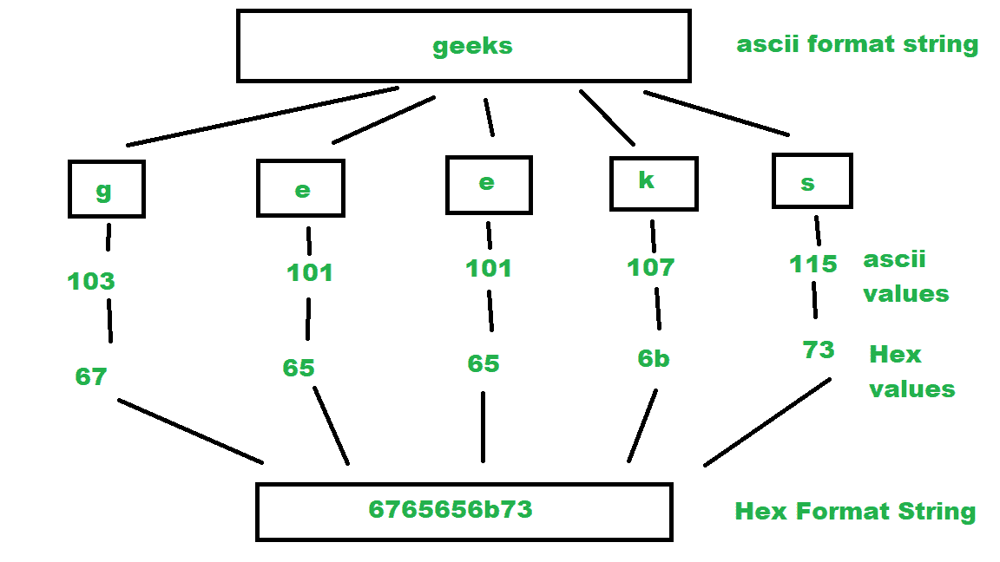

# 将字符串转换为十六进制 ASCII 值

> 原文:[https://www . geesforgeks . org/convert-a-string-to-十六进制-ascii-values/](https://www.geeksforgeeks.org/convert-a-string-to-hexadecimal-ascii-values/)

给定一个字符串作为输入，编写一个程序将给定字符串的字符转换成十六进制等价 ASCII 值。
**例:**

```
Input : Geek
Output : 4765656b 

Input :  IronMan part 3
Output : 49726f6e4d616e20706172742033
```

ASCII 代表美国信息交换标准代码。ASCII 是一种标准，在 8 位代码的 256 个可用槽中分配字母、数字和其他字符。例如，小写“h”字符(Char)的十进制值为 104，二进制为“01101000”，十六进制为“68”。 [ASCII 表](https://www.asciitable.com/)
十六进制或简称为“十六进制”的编号系统使用 16 的基数系统。十六进制数使用 16 个符号{0，1，2，4，5，6，7，8，9，A，B，C，D，E，F}来表示所有的数字。这里，(A，B，C，D，E，F)代表(10，11，12，13，14，15)。

> **算法:**
> 
> 1.  将最终十六进制字符串初始化为空。
> 2.  考虑输入的每个字符，将其转换为整数。该整数值是该字符的 ascii 值。
> 3.  将该整数值更改为十六进制值，并将该十六进制值添加到最终的十六进制字符串中。



上述思路的基本实现:

## Java 语言(一种计算机语言，尤用于创建网站)

```
// Java program to convert ASCII
// string to Hexadecimal format string
import java.util.Scanner;

class ASCIItoHEX {

    // function to convert ASCII to HEX
    public static String ASCIItoHEX(String ascii)
    {

        // Initialize final String
        String hex = "";

        // Make a loop to iterate through
        // every character of ascii string
        for (int i = 0; i < ascii.length(); i++) {

            // take a char from
            // position i of string
            char ch = ascii.charAt(i);

            // cast char to integer and
            // find its ascii value
            int in = (int)ch;

            // change this ascii value
            // integer to hexadecimal value
            String part = Integer.toHexString(in);

            // add this hexadecimal value
            // to final string.
            hex += part;
        }

        // return the final string hex
        return hex;
    }

    // Driver Function
    public static void main(String arg[])
    {
        // print the Hex String
        System.out.println(ASCIItoHEX("Geek"));
    }
}
```

## 蟒蛇 3

```
# Python3 program to convert ASCII
# string to Hexadecimal format string

# function to convert ASCII to HEX
def ASCIItoHEX(ascii):

    # Initialize final String
    hexa = ""

    # Make a loop to iterate through
    # every character of ascii string
    for i in range(len(ascii)):

        # take a char from
        # position i of string
        ch = ascii[i]

        # cast char to integer and
        # find its ascii value
        in1 = ord(ch)

        # change this ascii value
        # integer to hexadecimal value
        part = hex(in1).lstrip("0x").rstrip("L")

        # add this hexadecimal value
        # to final string.
        hexa += part

    # return the final string hex
    return hexa

# Driver Function
if __name__ == '__main__':

    # print the Hex String
    print(ASCIItoHEX("Geek"))

# This code is contributed by pratham76
```

## C#

```
// C# program to convert
// ASCII string to Hexadecimal
// format string
using System;
class GFG{

// Function to convert
// decimal to hexadecimal
static string decToHexa(int n)
{   
  // char array to store
  // hexadecimal number
  char []hexaDeciNum =
         new char[100];

  // counter for hexadecimal
  // number array
  int i = 0;

  while(n != 0)
  {   
    // temporary variable
    // to store remainder
    int temp  = 0;

    // Storing remainder
    // in temp variable.
    temp = n % 16;

    // Check if temp < 10
    if(temp < 10)
    {
      hexaDeciNum[i] =
          (char)(temp + 48);
      i++;
    }
    else
    {
      hexaDeciNum[i] =
          (char)(temp + 87);
      i++;
    }

    n = n / 16;
  }

  string ans = "";

  // Printing hexadecimal number
  // array in reverse order
  for(int j = i - 1;
          j >= 0; j--)
  {
    ans += hexaDeciNum[j];
  }

  return ans;
}  

// Function to convert ASCII to HEX
public static string ASCIItoHEX(string ascii)
{
  // Initialize final String
  string hex = "";

  // Make a loop to iterate through
  // every character of ascii string
  for (int i = 0;
           i < ascii.Length; i++)
  {
    // Take a char from
    // position i of string
    char ch = ascii[i];

    // Cast char to integer and
    // find its ascii value
    int tmp = (int)ch;

    // Change this ascii value
    // integer to hexadecimal value
    string part = decToHexa(tmp);

    // Add this hexadecimal value
    // to final string.
    hex += part;
  }

  // Return the final
  // string hex
  return hex;
}

// Driver code
public static void Main(string []arg)
{
  // Print the Hex String
  Console.Write(ASCIItoHEX("Geek"));
}
}

// This code is contributed by rutvik_56
```

## java 描述语言

```
<script>
      // JavaScript program to convert
      // ASCII string to Hexadecimal
      // format string
      // Function to convert
      // decimal to hexadecimal
      function decToHexa(n) {
        // char array to store
        // hexadecimal number
        var hexaDeciNum = new Array(100).fill(0);

        // counter for hexadecimal
        // number array
        var i = 0;

        while (n !== 0) {
          // temporary variable
          // to store remainder
          var temp = 0;

          // Storing remainder
          // in temp variable.
          temp = n % 16;

          // Check if temp < 10
          if (temp < 10) {
            hexaDeciNum[i] = String.fromCharCode(temp + 48);
            i++;
          } else {
            hexaDeciNum[i] = String.fromCharCode(temp + 87);
            i++;
          }

          n = parseInt(n / 16);
        }

        var ans = "";

        // Printing hexadecimal number
        // array in reverse order
        for (var j = i - 1; j >= 0; j--) {
          ans += hexaDeciNum[j];
        }

        return ans;
      }

      // Function to convert ASCII to HEX
      function ASCIItoHEX(ascii) {
        // Initialize final String
        var hex = "";

        // Make a loop to iterate through
        // every character of ascii string
        for (var i = 0; i < ascii.length; i++) {
          // Take a char from
          // position i of string
          var ch = ascii[i];

          // Cast char to integer and
          // find its ascii value
          var tmp = ch.charCodeAt(0);

          // Change this ascii value
          // integer to hexadecimal value
          var part = decToHexa(tmp);

          // Add this hexadecimal value
          // to final string.
          hex += part;
        }

        // Return the final
        // string hex
        return hex;
      }

      // Driver code
      // Print the Hex String
      document.write(ASCIItoHEX("Geek"));
    </script>
```

**输出:**

```
4765656b
```