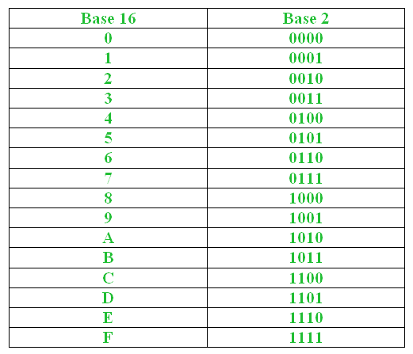
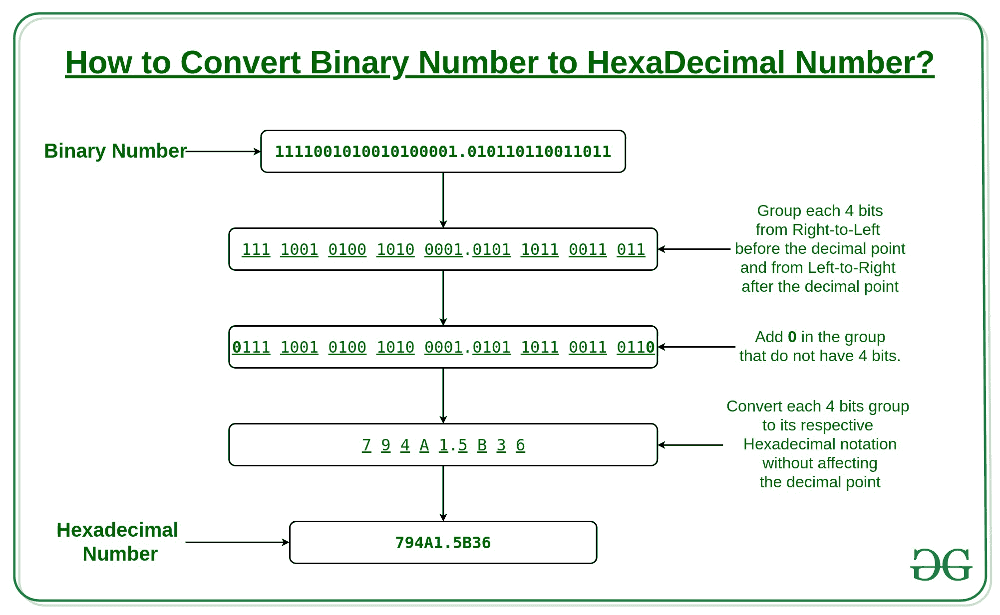

# 将二进制数转换为十六进制数

> 原文:[https://www . geesforgeks . org/convert-binary-number-十六进制-number/](https://www.geeksforgeeks.org/convert-binary-number-hexadecimal-number/)

给定一个[二进制数](https://www.geeksforgeeks.org/binary-representation-of-a-given-number/)，任务是将给定的二进制数转换成其等价的[十六进制数](https://www.geeksforgeeks.org/count-hexadecimal-number/)。输入可能非常大，甚至可能不适合无符号长整型。

**示例:**

```
Input: 110001110
Output: 18E

Input: 1111001010010100001.010110110011011
Output: 794A1.5B36

```

**<u>逼近 1:</u>**
**二进制数:**二进制数是用基数为 2 的二进制数制表示的数，它只使用两个符号:0(零)和 1(一)。

**<sup>4</sup> 十六进制数:**十六进制数是以 16 为基数的位置数字系统，使用十六个不同的符号:0、1、2、3、4、5、6、7、8、9、A、B、C、D、E 和 f。



**将二进制转换为十六进制:**
我们都知道，2 <sup>4</sup> = 16 <sup>1</sup> 。
换句话说，基数 16 中的一位数可以用基数 2 中的 4 位数来表示。



要将二进制数转换为十六进制数，请执行以下步骤:

1.  将给定的二进制数分成 4 位一组，每组分别从小数点的左边和右边开始。
2.  获取小数点左右的子串长度**(' . ')**为**左 _ 伦**和**右 _ 伦**。
3.  如果 **left_len** 不是 4 的倍数，即不可能分组为 4 位的精确组，则在开头加上最小数量的 0，使左子串的长度为 4 的倍数。
4.  同样，如果 **right_len** 不是 4 的倍数，那么在末尾加上最小数量的 0，使右子串的长度为 4 的倍数。
5.  现在，从左边开始，逐个提取每个组(长度为 4 的子串)，并将其对应的十六进制代码添加到结果中。
6.  如果在小数点('.'之间)被计数，然后将其添加到结果中。

下面是上述方法的实现:

## C++

```
// C++ implementation to
// convert a binary number to hexadecimal number

#include <bits/stdc++.h>
using namespace std;

// Function to create map between binary
// number and its equivalent hexadecimal
void createMap(unordered_map<string, char> *um)
{
    (*um)["0000"] = '0';
    (*um)["0001"] = '1';
    (*um)["0010"] = '2';
    (*um)["0011"] = '3';
    (*um)["0100"] = '4';
    (*um)["0101"] = '5';
    (*um)["0110"] = '6';
    (*um)["0111"] = '7';
    (*um)["1000"] = '8';
    (*um)["1001"] = '9';
    (*um)["1010"] = 'A';
    (*um)["1011"] = 'B';
    (*um)["1100"] = 'C';
    (*um)["1101"] = 'D';
    (*um)["1110"] = 'E';
    (*um)["1111"] = 'F';
}

// function to find hexadecimal
// equivalent of binary
string convertBinToHex(string bin)
{
    int l = bin.size();
    int t = bin.find_first_of('.');

    // length of string before '.'
    int len_left = t != -1 ? t : l;

    // add min 0's in the beginning to make
    // left substring length divisible by 4
    for (int i = 1; i <= (4 - len_left % 4) % 4; i++)
        bin = '0' + bin;

    // if decimal point exists   
    if (t != -1)   
    {
        // length of string after '.'
        int len_right = l - len_left - 1;

        // add min 0's in the end to make right
        // substring length divisible by 4
        for (int i = 1; i <= (4 - len_right % 4) % 4; i++)
            bin = bin + '0';
    }

    // create map between binary and its
    // equivalent hex code
    unordered_map<string, char> bin_hex_map;
    createMap(&bin_hex_map);

    int i = 0;
    string hex = "";

    while (1)
    {
        // one by one extract from left, substring
        // of size 4 and add its hex code
        hex += bin_hex_map[bin.substr(i, 4)];
        i += 4;
        if (i == bin.size())
            break;

        // if '.' is encountered add it
        // to result
        if (bin.at(i) == '.')   
        {
            hex += '.';
            i++;
        }
    }

    // required hexadecimal number
    return hex;   
}

// Driver program to test above
int main()
{
    string bin = "1111001010010100001.010110110011011";
    cout << "Hexadecimal number = "
         << convertBinToHex(bin);
    return 0;    
}
```

## Java 语言(一种计算机语言，尤用于创建网站)

```
// Java implementation to convert a
// binary number to hexadecimal number
import java.io.*;
import java.util.*;

class GFG{

// Function to create map between binary
// number and its equivalent hexadecimal
static void createMap(Map<String, Character> um)
{
    um.put("0000", '0');
    um.put("0001", '1');
    um.put("0010", '2');
    um.put("0011", '3');
    um.put("0100", '4');
    um.put("0101", '5');
    um.put("0110", '6');
    um.put("0111", '7');
    um.put("1000", '8');
    um.put("1001", '9');
    um.put("1010", 'A');
    um.put("1011", 'B');
    um.put("1100", 'C');
    um.put("1101", 'D');
    um.put("1110", 'E');
    um.put("1111", 'F');
}

// Function to find hexadecimal
// equivalent of binary
static String convertBinToHex(String bin)
{
    int l = bin.length();
    int t = bin.indexOf('.');

    // Length of string before '.'
    int len_left = t != -1 ? t : l;

    // Add min 0's in the beginning to make
    // left substring length divisible by 4
    for(int i = 1;
            i <= (4 - len_left % 4) % 4;
            i++)
        bin = '0' + bin;

    // If decimal point exists
    if (t != -1)
    {

        // Length of string after '.'
        int len_right = l - len_left - 1;

        // Add min 0's in the end to make right
        // substring length divisible by 4
        for(int i = 1;
                i <= (4 - len_right % 4) % 4;
                i++)
            bin = bin + '0';
    }

    // Create map between binary and its
    // equivalent hex code
    Map<String,
        Character> bin_hex_map = new HashMap<String,
                                             Character>();
    createMap(bin_hex_map);

    int i = 0;
    String hex = "";

    while (true)
    {

        // One by one extract from left, substring
        // of size 4 and add its hex code
        hex += bin_hex_map.get(
            bin.substring(i, i + 4));
        i += 4;

        if (i == bin.length())
            break;

        // If '.' is encountered add it
        // to result
        if (bin.charAt(i) == '.')
        {
            hex += '.';
            i++;
        }
    }

    // Required hexadecimal number
    return hex;
}

// Driver code
public static void main(String[] args)
{
    String bin = "1111001010010100001.010110110011011";

    System.out.print("Hexadecimal number = " +
                      convertBinToHex(bin));
}
}

// This code is contributed by jithin
```

**输出:**

```
Hexadecimal number = 794A1.5B36

```

**时间复杂度:O(n)** ，其中 n 为字符串的长度。
**<u>方法 2:</u>** 将二进制数转换为十六进制数的另一种方法是先[将二进制数转换为十进制数](https://www.geeksforgeeks.org/program-binary-decimal-conversion/)，再[将得到的十进制数转换为等价的十六进制数](https://www.geeksforgeeks.org/program-decimal-hexadecimal-conversion/)。
**练习题:**
(1)将二进制数 111000 转换为六进制。
(2)将二进制数 100100001 转换为六进制数。
(3)将二进制数 1001001111 转换为六进制数。
(4)六进制数 A7C5 的二进制等价数是多少。
(5)六进制数 2A.FF 的二进制等价物是什么

```
Answers:
(1) 38
(2) 121
(3) 24F
(4) 1010011111000101
(5) 101010.11111111

```

本文由**阿育什·乔哈里**供稿。如果你喜欢 GeeksforGeeks 并想投稿，你也可以使用[contribute.geeksforgeeks.org](http://contribute.geeksforgeeks.org)写一篇文章或者把你的文章邮寄到 contribute@geeksforgeeks.org。看到你的文章出现在极客博客主页上，帮助其他极客。
如果你发现任何不正确的地方，或者你想分享更多关于上面讨论的话题的信息，请写评论。