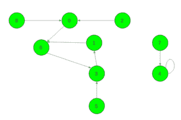

# 将有向图转换成树

> 原文:[https://www . geesforgeks . org/convert-directed-graph-to-a-tree/](https://www.geeksforgeeks.org/convert-directed-graph-into-a-tree/)

给定一个大小为 **N** 的数组 **arr[]** 。从 **i** 到**arr【I】**有一条边。任务是通过改变一些边将这个有向图转换成树。如果对于某些 **i** ， **arr[i] = i** ，那么 **i** 代表树根。如果有多个答案，打印其中任何一个。
**举例:**

> **输入:** arr[] = {6，6，0，1，4，3，3，4，0}
> **输出:** {6，6，0，1，4，3，4，4，0}
> 
> 
> 
> **输入:** arr[] = {1，2，0 }；
> T3】输出: {0，2，0}。

**方法:**考虑上面的第二个示例图像，它显示了一个函数图的示例。它包括两个循环 1、6、3 和 4。我们的目标是使图由恰好一个顶点的一个圈组成。
改变的操作相当于移除一些输出边并添加一个新边，转到其他顶点。首先，让我们的图只包含一个循环。要做到这一点，你可以选择任何最初呈现的周期，并说这将是唯一的一个。然后应该考虑每隔一个循环，移除它的任何循环内的边，并用一条到所选循环的任何顶点的边来替换它。因此，循环将被打破，它的顶点(连同树的顶点)将被连接到唯一选择的循环。一个人需要做的正是**循环账户-1**这样的操作。请注意，移除任何非循环边都没有意义，因为它不会中断任何循环。
接下来就是让周期长度等于 1。如果选择一个最小长度的循环，并且这个长度等于 1，那么这可能已经满足了。因此，如果初始图形包含长度为 1 的任何循环，我们就完成了**循环计数–1**操作。否则，循环包含多个顶点。只需一次操作就可以修复它——只需打破任何循环内的边，比如从 u 到 arr[u]，并从 u 到 u 添加一条边。图将仍然由一个循环组成，但由一个自循环顶点组成。在这种情况下，我们就完成了循环计数操作。
要完成以上所有操作，可以使用 DSU 结构，或者只是一系列 DFS。请注意，不需要实现边缘去除和创建，只需要分析初始图形。
以下是上述方法的实施:

## C++

```
// CPP program to convert directed graph into tree
#include <bits/stdc++.h>
using namespace std;

// Function to find root of the vertex
int find(int x, int a[], int vis[], int root[])
{
    if (vis[x])
        return root[x];

    vis[x] = 1;
    root[x] = x;
    root[x] = find(a[x], a, vis, root);
    return root[x];
}

// Function to convert directed graph into tree
void Graph_to_tree(int a[], int n)
{
    // Vis array to check if an index is visited or not
    // root[] array is to store parent of each vertex
    int vis[n] = { 0 }, root[n] = { 0 };

    // Find parent of each parent
    for (int i = 0; i < n; i++)
        find(a[i], a, vis, root);

    // par stores the root of the resulting tree
    int par = -1;
    for (int i = 0; i < n; i++)
        if (i == a[i])
            par = i;

    // If no self loop exists
    if (par == -1) {
        for (int i = 0; i < n; i++) {

            // Make vertex in a cycle as root of the tree
            if (i == find(a[i], a, vis, root)) {
                par = i;
                a[i] = i;
                break;
            }
        }
    }

    // Remove all cycles
    for (int i = 0; i < n; i++) {
        if (i == find(a[i], a, vis, root)) {
            a[i] = par;
        }
    }

    // Print the resulting array
    for (int i = 0; i < n; i++)
        cout << a[i] << " ";
}

// Driver code to test above functions
int main()
{
    int a[] = { 6, 6, 0, 1, 4, 3, 3, 4, 0 };

    int n = sizeof(a) / sizeof(a[0]);

    // Function call
    Graph_to_tree(a, n);
}
```

## Java 语言(一种计算机语言，尤用于创建网站)

```
// Java program to convert
// directed graph into tree
import java.util.*;

class GFG
{

// Function to find root of the vertex
static int find(int x, int a[],
                int vis[], int root[])
{
    if (vis[x] == 1)
        return root[x];

    vis[x] = 1;
    root[x] = x;
    root[x] = find(a[x], a, vis, root);
    return root[x];
}

// Function to convert directed graph into tree
static void Graph_to_tree(int a[], int n)
{
    // Vis array to check if an index is
    // visited or not root[] array is to
    // store parent of each vertex
    int []vis = new int[n];
    int []root = new int[n];

    // Find parent of each parent
    for (int i = 0; i < n; i++)
        find(a[i], a, vis, root);

    // par stores the root of the resulting tree
    int par = -1;
    for (int i = 0; i < n; i++)
        if (i == a[i])
            par = i;

    // If no self loop exists
    if (par == -1)
    {
        for (int i = 0; i < n; i++)
        {

            // Make vertex in a cycle as root of the tree
            if (i == find(a[i], a, vis, root))
            {
                par = i;
                a[i] = i;
                break;
            }
        }
    }

    // Remove all cycles
    for (int i = 0; i < n; i++)
    {
        if (i == find(a[i], a, vis, root))
        {
            a[i] = par;
        }
    }

    // Print the resulting array
    for (int i = 0; i < n; i++)
        System.out.print(a[i] + " ");
}

// Driver Code
static public void main ( String []arr)
{
    int a[] = { 6, 6, 0, 1, 4, 3, 3, 4, 0 };

    int n = a.length;

    // Function call
    Graph_to_tree(a, n);
}
}

// This code is contributed by 29AjayKumar
```

## 蟒蛇 3

```
# A Python3 program to convert
# directed graph into tree

# Function to find root of the vertex
def find(x, a, vis, root):
    if vis[x]:
        return root[x]

    vis[x] = 1
    root[x] = x
    root[x] = find(a[x], a, vis, root)
    return root[x]

# Function to convert directed graph into tree
def Graph_To_Tree(a, n):

    # Vis array to check if an index is visited or not
    # root[] array is to store parent of each vertex
    vis = [0] * n
    root = [0] * n

    # Find parent of each parent
    for i in range(n):
        find(a[i], a, vis, root)

    # par stores the root of the resulting tree
    par = -1
    for i in range(n):
        if i == a[i]:
            par = i

    # If no self loop exists
    if par == -1:
        for i in range(n):

            # Make vertex in a cycle as root of the tree
            if i == find(a[i], a, vis, root):
                par = i
                a[i] = i
                break

    # Remove all cycles
    for i in range(n):
        if i == find(a[i], a, vis, root):
            a[i] = par

    # Print the resulting array
    for i in range(n):
        print(a[i], end = " ")

# Driver Code
if __name__ == "__main__":
    a = [6, 6, 0, 1, 4, 3, 3, 4, 0]
    n = len(a)

    # Function call
    Graph_To_Tree(a, n)

# This code is contributed by
# sanjeev2552
```

## C#

```
// C# program to convert
// directed graph into tree
using System;
using System.Collections.Generic;

class GFG
{

// Function to find root of the vertex
static int find(int x, int []a,
                int []vis, int []root)
{
    if (vis[x] == 1)
        return root[x];

    vis[x] = 1;
    root[x] = x;
    root[x] = find(a[x], a, vis, root);
    return root[x];
}

// Function to convert directed graph into tree
static void Graph_to_tree(int []a, int n)
{
    // Vis array to check if an index is
    // visited or not root[] array is to
    // store parent of each vertex
    int []vis = new int[n];
    int []root = new int[n];

    // Find parent of each parent
    for (int i = 0; i < n; i++)
        find(a[i], a, vis, root);

    // par stores the root of the resulting tree
    int par = -1;
    for (int i = 0; i < n; i++)
        if (i == a[i])
            par = i;

    // If no self loop exists
    if (par == -1)
    {
        for (int i = 0; i < n; i++)
        {

            // Make vertex in a cycle as root of the tree
            if (i == find(a[i], a, vis, root))
            {
                par = i;
                a[i] = i;
                break;
            }
        }
    }

    // Remove all cycles
    for (int i = 0; i < n; i++)
    {
        if (i == find(a[i], a, vis, root))
        {
            a[i] = par;
        }
    }

    // Print the resulting array
    for (int i = 0; i < n; i++)
        Console.Write(a[i] + " ");
}

// Driver Code
static public void Main ( String []arr)
{
    int []a = { 6, 6, 0, 1, 4, 3, 3, 4, 0 };

    int n = a.Length;

    // Function call
    Graph_to_tree(a, n);
}
}

// This code is contributed by Princi Singh
```

## java 描述语言

```
<script>

// Javascript program to convert
// directed graph into tree

// Function to find root of the vertex
function find(x, a, vis, root)
{
    if (vis[x] == 1)
        return root[x];

    vis[x] = 1;
    root[x] = x;
    root[x] = find(a[x], a, vis, root);
    return root[x];
}

// Function to convert directed graph into tree
function Graph_to_tree(a, n)
{
    // Vis array to check if an index is
    // visited or not root[] array is to
    // store parent of each vertex
    var vis = Array(n).fill(0);
    var root = Array(n).fill(0);

    // Find parent of each parent
    for (var i = 0; i < n; i++)
        find(a[i], a, vis, root);

    // par stores the root of the resulting tree
    var par = -1;
    for (var i = 0; i < n; i++)
        if (i == a[i])
            par = i;

    // If no self loop exists
    if (par == -1)
    {
        for (var i = 0; i < n; i++)
        {

            // Make vertex in a cycle as root of the tree
            if (i == find(a[i], a, vis, root))
            {
                par = i;
                a[i] = i;
                break;
            }
        }
    }

    // Remove all cycles
    for (var i = 0; i < n; i++)
    {
        if (i == find(a[i], a, vis, root))
        {
            a[i] = par;
        }
    }

    // Print the resulting array
    for (var i = 0; i < n; i++)
        document.write(a[i] + " ");
}

// Driver Code
var a = [6, 6, 0, 1, 4, 3, 3, 4, 0];
var n = a.length;

// Function call
Graph_to_tree(a, n);

// This code is contributed by rrrtnx.
</script>
```

**Output:** 

```
6 6 0 1 4 3 4 4 0
```