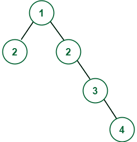
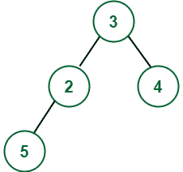
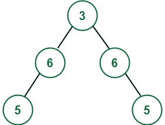

# 通过增加最小节点数将给定的二叉树转换为对称树

> 原文:[https://www . geesforgeks . org/通过添加最小节点数将给定二叉树转换为对称树/](https://www.geeksforgeeks.org/convert-given-binary-tree-to-symmetric-tree-by-adding-minimum-number-of-nodes/)

给定一棵[二叉树](https://www.geeksforgeeks.org/binary-tree-data-structure/)，任务是通过增加给定树上的最小节点数，将给定的二叉树转换成[对称树](https://www.geeksforgeeks.org/symmetric-tree-tree-which-is-mirror-image-of-itself/)。

**示例:**

> **输入:**
> 
> 
> 
> **输出:**
> 
> 
> 
> **输入:**
> 
> 
> 
> **输出:**
> 
> 

**方法:**要解决此问题，请按照以下步骤操作:

1.  创建一个函数**建立对称**，该函数将接受两个参数**根 1** 和**根 2** 。
2.  这里，**根 1** 和**根 2** 是彼此对称的节点。
3.  所以最初，**根 1** 和**根 2** 都包含根的值，并且在每个递归调用中:
    *   如果 root1 存在但 **root2** 不存在，则创建一个与 **root1** 值相同的新节点，并将其放置在 **root2** 的位置。
    *   如果 **root2** 存在而 **root1** 不存在，也要按照上述步骤进行。
    *   如果**根 1** 和**根 2** 的值不相同，那么将两个节点的值改为它们的总和。
    *   现在，对 **(root1- >左，root2- >右)**和 **(root1- >右，root2- >左)的对称位置进行下两次递归调用。**
4.  在所有递归调用完成后，树将变得对称。

下面是上述方法的实现:

## C++

```
// C++ program for the above approach

#include <bits/stdc++.h>
using namespace std;

// Node
class Node {
public:
    int val;
    Node *left, *right;
    Node(int val)
    {
        this->val = val;
        left = right = NULL;
    }
};

// Function to convert the given tree
// into a symmetric
Node* buidSymmetericTree(Node* root1,
                         Node* root2)
{
    // Base Case
    if (root1 == NULL and root2 == NULL) {
        return NULL;
    }

    // If root1 == NULL & root2 != NULL
    if (root1 == NULL) {

        // Create new node for root2
        // and attaching it to tree
        Node* node = new Node(root2->val);
        root1 = node;
    }

    // If root2 == NULL and root1 != NULL
    if (root2 == NULL) {

        // Create new node for root1
        // and attaching it to tree
        Node* node = new Node(root1->val);
        root2 = node;
    }

    // If both nodes are different
    // then change both nodes values
    // to the sum of them
    if (root1->val != root2->val) {
        int temp = root1->val + root2->val;
        root1->val = temp;
        root2->val = temp;
    }

    // Recuring to the left
    root1->left
        = buidSymmetericTree(
            root1->left, root2->right);

    // Recurring to the right
    root1->right
        = buidSymmetericTree(
            root1->right, root2->left);

    // Return root pointer
    return root1;
}

// Function to perform the Inorder
// Traversal of the tree
void inorder(Node* root)
{
    // Base Case
    if (root == NULL)
        return;

    inorder(root->left);
    cout << root->val << " ";
    inorder(root->right);
}

// Driver Code
int main()
{
    Node* root = new Node(3);
    root->left = new Node(2);
    root->right = new Node(4);
    root->left->left = new Node(5);

    // Function to make the given
    // tree symmetric
    buidSymmetericTree(root, root);

    // Print the inorder traversal
    inorder(root);

    return 0;
}
```

## Java 语言(一种计算机语言，尤用于创建网站)

```
// Java program for the above approach
import java.util.*;
class GFG{

// Node
static class Node {
    int val;
    Node left, right;
    Node(int val)
    {
        this.val = val;
        left = right = null;
    }
};

// Function to convert the given tree
// into a symmetric
static Node buidSymmetericTree(Node root1,
                         Node root2)
{
    // Base Case
    if (root1 == null && root2 == null) {
        return null;
    }

    // If root1 == null & root2 != null
    if (root1 == null) {

        // Create new node for root2
        // and attaching it to tree
        Node node = new Node(root2.val);
        root1 = node;
    }

    // If root2 == null and root1 != null
    if (root2 == null) {

        // Create new node for root1
        // and attaching it to tree
        Node node = new Node(root1.val);
        root2 = node;
    }

    // If both nodes are different
    // then change both nodes values
    // to the sum of them
    if (root1.val != root2.val) {
        int temp = root1.val + root2.val;
        root1.val = temp;
        root2.val = temp;
    }

    // Recuring to the left
    root1.left
        = buidSymmetericTree(
            root1.left, root2.right);

    // Recurring to the right
    root1.right
        = buidSymmetericTree(
            root1.right, root2.left);

    // Return root pointer
    return root1;
}

// Function to perform the Inorder
// Traversal of the tree
static void inorder(Node root)
{
    // Base Case
    if (root == null)
        return;

    inorder(root.left);
    System.out.print(root.val+ " ");
    inorder(root.right);
}

// Driver Code
public static void main(String[] args)
{
    Node root = new Node(3);
    root.left = new Node(2);
    root.right = new Node(4);
    root.left.left = new Node(5);

    // Function to make the given
    // tree symmetric
    buidSymmetericTree(root, root);

    // Print the inorder traversal
    inorder(root);
}
}

// This code is contributed by umadevi9616
```

## 蟒蛇 3

```
# Python Program to implement
# the above approach

# Node
class Node:

    def __init__(self, val):
        self.val = val
        self.left = self.right = None

# Function to convert the given tree
# into a symmetric
def buidSymmetericTree(root1, root2):
    # Base Case
    if (root1 == None and root2 == None):
        return None

    # If root1 == null & root2 != null
    if (root1 == None):

        # Create new node for root2
        # and attaching it to tree
        node = Node(root2.val)
        root1 = node

    # If root2 == null and root1 != null
    if (root2 == None):

        # Create new node for root1
        # and attaching it to tree
        node = Node(root1.val)
        root2 = node

    # If both nodes are different
    # then change both nodes values
    # to the sum of them
    if (root1.val != root2.val):
        temp = root1.val + root2.val
        root1.val = temp
        root2.val = temp

    # Recuring to the left
    root1.left = buidSymmetericTree( root1.left, root2.right)

    # Recurring to the right
    root1.right = buidSymmetericTree(root1.right, root2.left)

    # Return root pointer
    return root1

# Function to perform the Inorder
# Traversal of the tree
def inorder(root):
    # Base Case
    if (root == None):
      return

    inorder(root.left)
    print(root.val, end=" ")
    inorder(root.right)

# Driver Code

root = Node(3)
root.left = Node(2)
root.right = Node(4)
root.left.left = Node(5)

# Function to make the given
# tree symmetric
buidSymmetericTree(root, root)

# Print the inorder traversal
inorder(root)

# This code is contributed by gfgking.
```

## C#

```
// C# program for the above approach
using System;
public class GFG {

    // Node
public    class Node {
    public    int val;
    public    Node left, right;

    public    Node(int val) {
            this.val = val;
            left = right = null;
        }
    };

    // Function to convert the given tree
    // into a symmetric
    static Node buidSymmetericTree(Node root1, Node root2)
    {

        // Base Case
        if (root1 == null && root2 == null) {
            return null;
        }

        // If root1 == null & root2 != null
        if (root1 == null) {

            // Create new node for root2
            // and attaching it to tree
            Node node = new Node(root2.val);
            root1 = node;
        }

        // If root2 == null and root1 != null
        if (root2 == null) {

            // Create new node for root1
            // and attaching it to tree
            Node node = new Node(root1.val);
            root2 = node;
        }

        // If both nodes are different
        // then change both nodes values
        // to the sum of them
        if (root1.val != root2.val) {
            int temp = root1.val + root2.val;
            root1.val = temp;
            root2.val = temp;
        }

        // Recuring to the left
        root1.left = buidSymmetericTree(root1.left, root2.right);

        // Recurring to the right
        root1.right = buidSymmetericTree(root1.right, root2.left);

        // Return root pointer
        return root1;
    }

    // Function to perform the Inorder
    // Traversal of the tree
    static void inorder(Node root)
    {

        // Base Case
        if (root == null)
            return;

        inorder(root.left);
        Console.Write(root.val + " ");
        inorder(root.right);
    }

    // Driver Code
    public static void Main(String[] args) {
        Node root = new Node(3);
        root.left = new Node(2);
        root.right = new Node(4);
        root.left.left = new Node(5);

        // Function to make the given
        // tree symmetric
        buidSymmetericTree(root, root);

        // Print the inorder traversal
        inorder(root);
    }
}

// This code is contributed by gauravrajput1
```

## java 描述语言

```
<script>
        // JavaScript Program to implement
        // the above approach

        // Node
        class Node {

            constructor(val) {
                this.val = val;
                this.left = this.right = null;
            }
        };

        // Function to convert the given tree
        // into a symmetric
        function buidSymmetericTree(root1,
            root2) {
            // Base Case
            if (root1 == null && root2 == null) {
                return null;
            }

            // If root1 == null & root2 != null
            if (root1 == null) {

                // Create new node for root2
                // and attaching it to tree
                let node = new Node(root2.val);
                root1 = node;
            }

            // If root2 == null and root1 != null
            if (root2 == null) {

                // Create new node for root1
                // and attaching it to tree
                let node = new Node(root1.val);
                root2 = node;
            }

            // If both nodes are different
            // then change both nodes values
            // to the sum of them
            if (root1.val != root2.val) {
                let temp = root1.val + root2.val;
                root1.val = temp;
                root2.val = temp;
            }

            // Recuring to the left
            root1.left
                = buidSymmetericTree(
                    root1.left, root2.right);

            // Recurring to the right
            root1.right
                = buidSymmetericTree(
                    root1.right, root2.left);

            // Return root pointer
            return root1;
        }

        // Function to perform the Inorder
        // Traversal of the tree
        function inorder(root) {
            // Base Case
            if (root == null)
                return;

            inorder(root.left);
            document.write(root.val + " ");
            inorder(root.right);
        }

        // Driver Code

        let root = new Node(3);
        root.left = new Node(2);
        root.right = new Node(4);
        root.left.left = new Node(5);

        // Function to make the given
        // tree symmetric
        buidSymmetericTree(root, root);

        // Print the inorder traversal
        inorder(root);

// This code is contributed by Potta Lokesh
    </script>
```

**Output:** 

```
5 6 3 6 5
```

***时间复杂度:**O(N)*
T5**辅助空间:** O(1)