# 将给定的复数转换为极坐标形式，并执行所有算术运算

> 原文:[https://www . geeksforgeeks . org/将给定复数转换为极坐标形式并执行所有算术运算/](https://www.geeksforgeeks.org/convert-given-complex-numbers-into-polar-form-and-perform-all-arithmetic-operations/)

给定两个[笛卡尔形式](https://www.geeksforgeeks.org/complex-numbers-c-set-1/)的[复数](https://www.geeksforgeeks.org/find-the-real-and-imaginary-part-of-a-complex-number/) **Z1** 和 **Z2** ，任务是将给定的复数转换成极坐标形式，并对其执行所有算术运算(加减乘除)。

**示例:**

> **输入:** Z1 = (2，3)，Z2 = (4，6)
> **输出:**
> 第一个复数的极坐标形式:(3.605551275463989，0.98279372473292)
> 第二个复数的极坐标形式:(7.2111999998
> 
> **输入:** Z1 = (1，1)，Z2 = (2，2)
> **输出:**
> 第一个复数的极坐标形式:(1.4142135623730951，0.7853981633974.82)
> 第二个复数的极坐标形式:(2.828280001

**方法:**给定的问题可以基于复数的以下性质来解决:

*   笛卡尔形式的复数 **Z** 表示为:

> 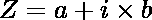、
> 其中 **a、b € R** 和 **b** 被称为复数和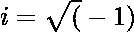的虚部

*   复数 **Z** 的极坐标形式为:

> 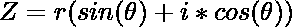
> 
> 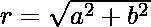
> 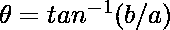
> 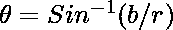
> 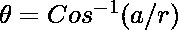
> 
> 其中， **r** 被称为复数的模，
> 是与正 **X** 轴的夹角。

*   在以 **r** 为常用表演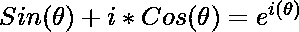的极坐标形式的复数表达中，该表达变为:
    *   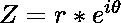，被称为复数的**欧拉形式。**
    *   欧拉形式和极坐标形式都表示为: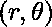。
*   两个复数的乘法和除法可以用欧拉形式完成:

> **用于乘法:**
> 
> 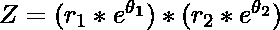
> = > 
> 
> **分部:**
> 
> 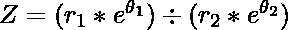
> = > 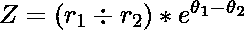

按照以下步骤解决问题:

*   使用上面讨论的公式将复数转换为极坐标，并以的形式打印出来。
*   定义一个函数**加法(Z1，Z2)** 来执行加法运算:
    *   通过将两个实数部分 **Z1** 和 **Z2、**相加找到复数的实数部分，并将其存储在一个变量中，比如说 **a** 。
    *   通过将复数的两个虚部 **Z1** 和 **Z2** 相加，找到复数的虚部，并将其存储在一个变量中，比如 **b** 。
    *   将复形的笛卡尔形式转换为极坐标形式并打印出来。
*   定义一个函数**减法(Z1，Z2)** 来执行减法运算:
    *   通过减去两个实数部分 **Z1** 和 **Z2、**找到复数的实数部分，并将其存储在一个变量中，比如 **a.**
    *   通过减去复数的两个虚部 **Z1** 和 **Z2** 找到复数的虚部，并将其存储在一个变量中，比如 **b.**
    *   将复形的笛卡尔形式转换为极坐标形式并打印出来。
*   将两个复数 **Z1** 和 **Z2** 相乘打印为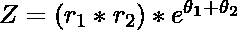
*   将两个复数 **Z1** 和 **Z2** 的除法打印为

下面是上述方法的实现:

## 蟒蛇 3

```
# Python program for the above approach
import math

# Function to find the polar form
# of the given Complex Number
def get_polar_form(z):

    # Z is in cartesian form
    re, im = z

    # Stores the modulo of complex number
    r = (re * re + im * im) ** 0.5

    # If r is greater than 0
    if r:
        theta = math.asin(im / r)
        return (r, theta)

    # Otherwise
    else:
        return (0, 0)

# Function to add two complex numbers
def Addition(z1, z2):

    # Z is in polar form
    r1, theta1 = z1
    r2, theta2 = z2

    # Real part of complex number
    a = r1 * math.cos(theta1) + r2 * math.cos(theta2)

    # Imaginary part of complex Number
    b = r1 * math.sin(theta1) + r2 * math.sin(theta2)

    # Find the polar form
    return get_polar_form((a, b))

# Function to subtract two
# given complex numbers
def Subtraction(z1, z2):

    # Z is in polar form
    r1, theta1 = z1
    r2, theta2 = z2

    # Real part of the complex number
    a = r1 * math.cos(theta1) - r2 * math.cos(theta2)

    # Imaginary part of complex number
    b = r1 * math.sin(theta1) - r2 * math.sin(theta2)

    # Converts (a, b) to polar
    # form and return
    return get_polar_form((a, b))

# Function to multiply two complex numbers
def Multiplication(z1, z2):

    # z is in polar form
    r1, theta1 = z1
    r2, theta2 = z2

    # Return the multiplication of Z1 and Z2
    return (r1 * r2, theta1 + theta2)

# Function to divide two complex numbers
def Division(z1, z2):

    # Z is in the polar form
    r1, theta1 = z1
    r2, theta2 = z2

    # Return the division of Z1 and Z2
    return (r1 / r2, theta1-theta2)

# Driver Code
if __name__ == "__main__":

    z1 = (2, 3)
    z2 = (4, 6)

    # Convert into Polar Form
    z1_polar = get_polar_form(z1)
    z2_polar = get_polar_form(z2)

    print("Polar form of the first")
    print("Complex Number: ", z1_polar)
    print("Polar form of the Second")
    print("Complex Number: ", z2_polar)

    print("Addition of two complex")
    print("Numbers: ", Addition(z1_polar, z2_polar))

    print("Subtraction of two ")
    print("complex Numbers: ",
           Subtraction(z1_polar, z2_polar))

    print("Multiplication of two ")
    print("Complex Numbers: ",
           Multiplication(z1_polar, z2_polar))

    print("Division of two complex ")
    print("Numbers: ", Division(z1_polar, z2_polar))
```

**Output:**

```
Polar form of the first
Complex Number:  (3.605551275463989, 0.9827937232473292)
Polar form of the Second
Complex Number:  (7.211102550927978, 0.9827937232473292)
Addition of two complex
Numbers:  (10.816653826391967, 0.9827937232473292)
Subtraction of two 
complex Numbers:  (3.605551275463989, -0.9827937232473292)
Multiplication of two 
Complex Numbers:  (25.999999999999996, 1.9655874464946583)
Division of two complex 
Numbers:  (0.5, 0.0)

```

***时间复杂度:**O(1)*
T5**辅助空间:** O(1)