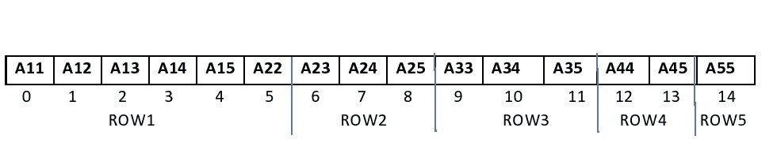
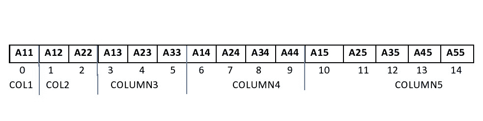

# 将给定的下三角矩阵转换为 1D 阵列

> 原文:[https://www . geesforgeks . org/convert-given-下三角矩阵转 1d-array/](https://www.geeksforgeeks.org/convert-given-lower-triangular-matrix-to-1d-array/)

给定维度为 **N * N** 的[下三角矩阵](https://www.geeksforgeeks.org/program-check-matrix-lower-triangular/) **M[][]** ，任务是通过只存储非零元素将其转换为[一维数组](https://www.geeksforgeeks.org/create-and-display-a-one-dimensional-array-like-object-using-pandas-in-python/)。

**示例:**

> **输入:** M[][] = {{1，0，0，0}，{2，3，0，0}，{4，5，6，0}，{7，8，9，10}}
> **输出:**
> 行:{1，2，3，4，5，6，7，8，9，10}
> 列:{1，2，4，7，3，5，8，6，9，10}
> **解释
> 在 1D 阵列中以行的方式排列这些元素产生序列{1，2，3，4，5，6，7，8，9，10}。
> 在 1D 阵列中以列的方式排列这些元素产生序列{1，2，4，7，3，5，8，6，9，10}。**
> 
> **输入:** M[][] = {{1，0，0，}，{2，3，0}，{4，5，6}}
> **输出:**
> 行:{1，2，3，4，5，6}
> 列:{1，2，4，3，5，6}

**方法:**要将二维矩阵转换为一维数组，可使用以下两种方法:

[**行–主订单**](https://www.geeksforgeeks.org/row-wise-vs-column-wise-traversal-matrix/) **:**

*   在此方法中，一行的相邻元素在数组中彼此相邻放置。

[](https://media.geeksforgeeks.org/wp-content/uploads/20201122204851/UPPERROW.jpg)

*   下面的公式用于找出下三角矩阵的非零元素在一维数组中的相应位置。

> 位置 **(i，j)**=**((I *(I–1))/2+j–1)**
> 处矩阵元素的索引，其中 **1 ≤ i，j ≤ N 且 i ≥ j**

[**列–主要订单**](https://www.geeksforgeeks.org/row-wise-vs-column-wise-traversal-matrix/) **:**

*   在此方法中，一列的连续元素在数组中相邻放置。

[](https://media.geeksforgeeks.org/wp-content/uploads/20201122205003/UPPERCOLUMN.jpg)

*   下面的公式用于找出下三角矩阵的非零元素在一维数组中的相应位置。

> 位置 **(i，j)**=**(N *(j–1)–((j–2)*(j–1))/2)+(I–j)**
> 处矩阵元素的索引，其中 **1 ≤ i，j ≤ N 且 i ≥ j** 。

按照以下步骤解决问题:

*   初始化一个数组，比如 **A[]** ，存储矩阵的非零元素。
*   [遍历矩阵](https://www.geeksforgeeks.org/row-wise-vs-column-wise-traversal-matrix/)**M【】【】**使用行主映射公式找到矩阵非零元素在数组**A【】**中的索引，并将每个非零元素插入到数组**A【】**中。
*   完成上述步骤后，打印数组 **A[]** 进行行主映射。
*   再次，[遍历矩阵](https://www.geeksforgeeks.org/row-wise-vs-column-wise-traversal-matrix/)**M【】【】**使用列主映射公式找到矩阵非零元素在数组**A【】**中的索引，并将每个非零元素插入到数组**A【】**中。
*   完成以上步骤后，[打印数组](https://www.geeksforgeeks.org/how-to-print-an-array-in-java-without-using-loop/) **A[]** 进行列-主映射。

下面是上述方法的实现:

## C++

```
// C++ program for the above approach
#include <iostream>
using namespace std;

// Class of Lower Triangular Matrix
class LTMatrix {

private:
    // Size of Matrix
    int n;

    // Pointer
    int* A;

    // Stores the count of non-zero
    // elements
    int tot;

public:
    // Constructor
    LTMatrix(int N)
    {
        this->n = N;
        tot = N * (N + 1) / 2;
        A = new int[N * (N + 1) / 2];
    }

    // Destructor
    ~LTMatrix() { delete[] A; }

    // Function to display array
    void Display(bool row = true);

    // Function to generate array
    // in Row - Major order
    void setRowMajor(int i, int j, int x);

    // Function to generate array
    // in Column - Major order
    void setColMajor(int i, int j, int x);

    // Function to find size of array
    int getN() { return n; }
};

// Function to generate array from
// given matrix by storing elements
// in column major order
void LTMatrix::setColMajor(
    int i, int j, int x)
{
    if (i >= j) {

        int index
            = (n * (j - 1)
               - (((j - 2)
                   * (j - 1))
                  / 2))
              + (i - j);

        A[index] = x;
    }
}

// Function to generate array from
// given matrix by storing elements
// in row major order
void LTMatrix::setRowMajor(
    int i, int j, int x)
{
    if (i >= j) {
        int index = (i * (i - 1)) / 2
                    + j - 1;
        A[index] = x;
    }
}

// Function to display array elements
void LTMatrix::Display(bool row)
{
    for (int i = 0; i < tot; i++) {
        cout << A[i] << " ";
    }
    cout << endl;
}

// Function to generate and display
// array in Row-Major Order
void displayRowMajor(int N)
{
    LTMatrix rm(N);

    // Generate the array in the
    // row-major form
    rm.setRowMajor(1, 1, 1);
    rm.setRowMajor(2, 1, 2);
    rm.setRowMajor(2, 2, 3);
    rm.setRowMajor(3, 1, 4);
    rm.setRowMajor(3, 2, 5);
    rm.setRowMajor(3, 3, 6);
    rm.setRowMajor(4, 1, 7);
    rm.setRowMajor(4, 2, 8);
    rm.setRowMajor(4, 3, 9);
    rm.setRowMajor(4, 4, 10);

    // Display array elements
    // in row-major order
    cout << "Row-Wise:\n";

    rm.Display();
}

// Function to generate and display
// array in Column-Major Order
void displayColMajor(int N)
{
    LTMatrix cm(N);

    // Generate array in
    // column-major form
    cm.setColMajor(1, 1, 1);
    cm.setColMajor(2, 1, 2);
    cm.setColMajor(2, 2, 3);
    cm.setColMajor(3, 1, 4);
    cm.setColMajor(3, 2, 5);
    cm.setColMajor(3, 3, 6);
    cm.setColMajor(4, 1, 7);
    cm.setColMajor(4, 2, 8);
    cm.setColMajor(4, 3, 9);
    cm.setColMajor(4, 4, 10);

    // Display array elements
    // in column-major form
    cout << "Column-Wise:\n";
    cm.Display(false);
}

// Driver Code
int main()
{
    // Size of row or column
    // of square matrix
    int N = 4;

    // Function Call for row major
    // mapping
    displayRowMajor(N);

    // Function Call for column
    // major mapping
    displayColMajor(N);

    return 0;
}
```

## Java 语言(一种计算机语言，尤用于创建网站)

```
// Java program for the above approach
import java.io.*;
class GFG
{

    // Class of Lower Triangular Matrix
    static class LTMatrix
    {

        // Size of Matrix
        static int n;

        // Pointer
        static int A[];

        // Stores the count of non-zero
        // elements
        static int tot;

        // Constructor
        LTMatrix(int N)
        {
            this.n = N;
            tot = N * (N + 1) / 2;
            A = new int[N * (N + 1) / 2];
        }

        // Function to display array elements
        static void Display(boolean row)
        {
            for (int i = 0; i < tot; i++)
            {
                System.out.print(A[i] + " ");
            }
            System.out.println();
        }

        // Function to generate array from
        // given matrix by storing elements
        // in row major order
        static void setRowMajor(int i, int j, int x)
        {
            if (i >= j) {
                int index = (i * (i - 1)) / 2 + j - 1;
                A[index] = x;
            }
        }

        // Function to generate array from
        // given matrix by storing elements
        // in column major order
        static void setColMajor(int i, int j, int x)
        {
            if (i >= j) {

                int index = (n * (j - 1)
                             - (((j - 2) * (j - 1)) / 2))
                            + (i - j);
                A[index] = x;
            }
        }

        // Function to find size of array
        static int getN() { return n; }
    }

    // Function to generate and display
    // array in Row-Major Order
    static void displayRowMajor(int N)
    {
        LTMatrix rm = new LTMatrix(N);

        // Generate the array in the
        // row-major form
        rm.setRowMajor(1, 1, 1);
        rm.setRowMajor(2, 1, 2);
        rm.setRowMajor(2, 2, 3);
        rm.setRowMajor(3, 1, 4);
        rm.setRowMajor(3, 2, 5);
        rm.setRowMajor(3, 3, 6);
        rm.setRowMajor(4, 1, 7);
        rm.setRowMajor(4, 2, 8);
        rm.setRowMajor(4, 3, 9);
        rm.setRowMajor(4, 4, 10);

        // Display array elements
        // in row-major order
        System.out.println("Row-Wise:");
        rm.Display(false);
    }

    // Function to generate and display
    // array in Column-Major Order
    static void displayColMajor(int N)
    {
        LTMatrix cm = new LTMatrix(N);

        // Generate array in
        // column-major form
        cm.setColMajor(1, 1, 1);
        cm.setColMajor(2, 1, 2);
        cm.setColMajor(2, 2, 3);
        cm.setColMajor(3, 1, 4);
        cm.setColMajor(3, 2, 5);
        cm.setColMajor(3, 3, 6);
        cm.setColMajor(4, 1, 7);
        cm.setColMajor(4, 2, 8);
        cm.setColMajor(4, 3, 9);
        cm.setColMajor(4, 4, 10);

        // Display array elements
        // in column-major form
        System.out.println("Column-Wise:");
        cm.Display(false);
    }

    // Driver Code
    public static void main(String[] args)
    {

        // Size of row or column
        // of square matrix
        int N = 4;

        // Function Call for row major
        // mapping
        displayRowMajor(N);

        // Function Call for column
        // major mapping
        displayColMajor(N);
    }
}

// This code is contributed by Dharanendra L V.
```

**Output:** 

```
Row-Wise:
1 2 3 4 5 6 7 8 9 10 
Column-Wise:
1 2 4 7 3 5 8 6 9 10
```

***时间复杂度:**O(N<sup>2</sup>)*
***辅助空间:** O(N <sup>2</sup> )*