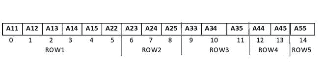
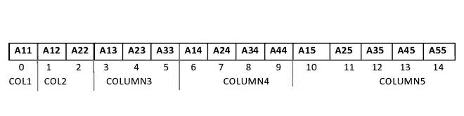

# 将给定的上三角矩阵转换为 1D 阵列

> 原文:[https://www . geesforgeks . org/convert-given-upper-trial-matrix-to-1d-array/](https://www.geeksforgeeks.org/convert-given-upper-triangular-matrix-to-1d-array/)

给定一个维度为 **N * N** 的[上三角矩阵](https://www.geeksforgeeks.org/program-check-matrix-upper-triangular/) **M[][]** ，任务是将其转换为一维数组，只存储矩阵中的非零元素。

**示例:**

> **输入:** M[][] = {{1，2，3，4}，{0，5，6，7}，{0，0，8，9}，{0，0，0，10}}
> **输出:**行:{1，2，3，4，5，6，7，8，9，10}
> 列:{1，2，5，3，6，8，4，7，9，10}
> **说明:【T8**
> 
> **输入:** M[][] = {{1，2，3，}，{0，4，5}，{0，0，6}}
> **输出:**行方向:{1，2，3，4，5，6}
> 列方向:{1，2，4，3，5，6}
> **说明:**矩阵的所有非零元素都是{1，2，3，4，5，6}

**方法:**要将给定的二维矩阵转换为一维数组，可使用以下两种方法:

**行–主订单:**

*   在这种方法中，存储元素使得一行的连续元素连续地放置在数组中。

[](https://media.geeksforgeeks.org/wp-content/uploads/20201122204851/UPPERROW-300x59.jpg)

行-主要订单

*   以下公式用于查找非零矩阵元素在数组中的正确位置:

> 矩阵中索引 **(i，j)** 处的元素位于**【N *(I–1)–(I–2)*(I-1)/2】+(j–I)**
> ，其中 **1 ≤ i，j ≤ N 和 i ≤ j**

**列-主要订单:**

*   在这种方法中，元素被存储，使得一列的连续元素被连续地放置在数组中。

[](https://media.geeksforgeeks.org/wp-content/uploads/20201122205003/UPPERCOLUMN-300x75.jpg)

列-主要订单

*   以下公式用于找出非零矩阵元素的正确位置:

> 矩阵中索引 **(i，j)** 处的元素位于**【j *(j–1)/2】+I–1**
> 处，其中 **1 ≤ i，j ≤ N 和 I≤j**

按照以下步骤解决问题:

*   初始化一个数组 **A[]** 存储非零矩阵元素。
*   [遍历矩阵](https://www.geeksforgeeks.org/row-wise-vs-column-wise-traversal-matrix/) **M[][]** 。
*   使用上述公式找到数组中非零矩阵元素的正确索引 **A[]** 。
*   相应地将非零元素放在 A[]的正确索引处。
*   最后打印得到的数组 **A[]** 。

下面是上述方法的实现:

## C++

```
// C++ Program to convert a given
// upper triangular matrix to 1D array

#include <iostream>
using namespace std;

// Create a class of Upper
// Triangular Matrix
class UTMatrix {

private:
    // Size of Matrix
    int n;

    // Pointer
    int* A;

    // Stores count of
    // non-zero elements
    int tot;

public:
    // Constructor
    UTMatrix(int N)
    {
        this->n = N;
        tot = N * (N + 1) / 2;
        A = new int[N * (N + 1) / 2];
    }

    // Destructor
    ~UTMatrix() { delete[] A; }

    // Function to display array
    void Display(bool row = true);

    // Function to generate array in
    // Row - Major order
    void setRowMajor(int i, int j, int x);

    // Function to generate array in
    // Column - Major order
    void setColMajor(int i, int j, int x);

    // Function to return size of array
    int getN() { return n; }
};

// Function to generate array from given matrix
// by storing elements in column major order
void UTMatrix::setColMajor(int i, int j, int x)
{
    if (i <= j) {
        int index = ((j * (j - 1)) / 2) + i - 1;
        A[index] = x;
    }
}

// Function to generate array from given matrix
// by storing elements in row major order
void UTMatrix::setRowMajor(int i, int j, int x)
{
    if (i <= j) {
        int index
            = (n * (i - 1) - (((i - 2) * (i - 1)) / 2))
              + (j - i);
        A[index] = x;
    }
}

// Function to display array elements
void UTMatrix::Display(bool row)
{
    for (int i = 0; i < tot; i++) {
        cout << A[i] << " ";
    }
    cout << endl;
}

// Function to generate and
// display array in Row-Major Order
void displayRowMajor(int N)
{
    UTMatrix rm(N);

    // Generate array in
    // row-major form
    rm.setRowMajor(1, 1, 1);
    rm.setRowMajor(1, 2, 2);
    rm.setRowMajor(1, 3, 3);
    rm.setRowMajor(1, 4, 4);
    rm.setRowMajor(2, 2, 5);
    rm.setRowMajor(2, 3, 6);
    rm.setRowMajor(2, 4, 7);
    rm.setRowMajor(3, 3, 8);
    rm.setRowMajor(3, 4, 9);
    rm.setRowMajor(4, 4, 10);

    // Display array elements in
    // row-major order
    cout << "Row-Wise: ";

    rm.Display();
}

// Function to generate and display
// array in Column-Major Order
void displayColMajor(int N)
{
    UTMatrix cm(N);

    // Generate array in
    // column-major form
    cm.setColMajor(1, 1, 1);
    cm.setColMajor(1, 2, 2);
    cm.setColMajor(1, 3, 3);
    cm.setColMajor(1, 4, 4);
    cm.setColMajor(2, 2, 5);
    cm.setColMajor(2, 3, 6);
    cm.setColMajor(2, 4, 7);
    cm.setColMajor(3, 3, 8);
    cm.setColMajor(3, 4, 9);
    cm.setColMajor(4, 4, 10);

    // Display array elements in
    // column-major form
    cout << "Column-wise: ";
    cm.Display(false);
}

// Driver Code
int main()
{
    // Size of row or column
    // of square matrix
    int N = 4;

    displayRowMajor(N);

    displayColMajor(N);

    return 0;
}
```

## Java 语言(一种计算机语言，尤用于创建网站)

```
// Java program to convert a given
// upper triangular matrix to 1D array

// Create a class of Upper
// Triangular Matrix
class UTMatrix{

// Size of Matrix
private int n;

private int[] A = new int[n];

// Stores count of
// non-zero elements
private int tot;

// Constructor
public UTMatrix(int N)
{
    this.n = N;
    tot = N * (N + 1) / 2;
    A = new int[N * (N + 1) / 2];
}

// Function to display array
void Display(boolean row)
{
    for(int i = 0; i < tot; i++)
    {
        System.out.print(A[i] + " ");
    }
    System.out.println();
}

// Function to generate array in
// Row - Major order
void setRowMajor(int i, int j, int x)
{
    if (i <= j)
    {
        int index = (n * (i - 1) - (((i - 2) *
                         (i - 1)) / 2)) + (j - i);
        A[index] = x;
    }
}

// Function to generate array in
// Column - Major order
void setColMajor(int i, int j, int x)
{
    if (i <= j) {
        int index = ((j * (j - 1)) / 2) + i - 1;
        A[index] = x;
    }
}

// Function to return size of array
int getN()
{
    return n;
}
}

class GFG{

// Function to generate and
// display array in Row-Major Order
static void displayRowMajor(int N)
{
    UTMatrix rm = new UTMatrix(N);

    // Generate array in
    // row-major form
    rm.setRowMajor(1, 1, 1);
    rm.setRowMajor(1, 2, 2);
    rm.setRowMajor(1, 3, 3);
    rm.setRowMajor(1, 4, 4);
    rm.setRowMajor(2, 2, 5);
    rm.setRowMajor(2, 3, 6);
    rm.setRowMajor(2, 4, 7);
    rm.setRowMajor(3, 3, 8);
    rm.setRowMajor(3, 4, 9);
    rm.setRowMajor(4, 4, 10);

    // Display array elements in
    // row-major order
    System.out.print("Row-Wise: ");

    rm.Display(false);
}

// Function to generate and display
// array in Column-Major Order
static void displayColMajor(int N)
{
    UTMatrix cm = new UTMatrix(N);

    // Generate array in
    // column-major form
    cm.setColMajor(1, 1, 1);
    cm.setColMajor(1, 2, 2);
    cm.setColMajor(1, 3, 3);
    cm.setColMajor(1, 4, 4);
    cm.setColMajor(2, 2, 5);
    cm.setColMajor(2, 3, 6);
    cm.setColMajor(2, 4, 7);
    cm.setColMajor(3, 3, 8);
    cm.setColMajor(3, 4, 9);
    cm.setColMajor(4, 4, 10);

    // Display array elements in
    // column-major form
    System.out.print("Column-wise: ");
    cm.Display(false);
}

// Driver Code
public static void main(String[] args)
{

    // Size of row or column
    // of square matrix
    int N = 4;

    displayRowMajor(N);

    displayColMajor(N);
}
}

// This code is contributed by dharanendralv23
```

**Output:** 

```
Row-Wise: 1 2 3 4 5 6 7 8 9 10 
Column-wise: 1 2 5 3 6 8 4 7 9 10
```

**时间复杂度:**O(N * N)
T3】辅助空间: O(N*N)