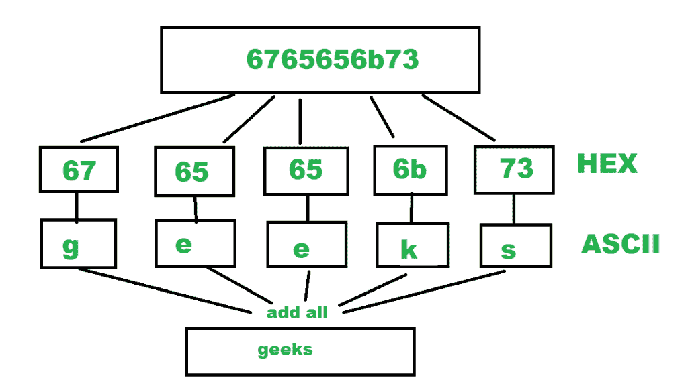

# 将十六进制值字符串转换为 ASCII 值字符串

> 原文:[https://www . geesforgeks . org/convert-十六进制-值-字符串-ascii-值-字符串/](https://www.geeksforgeeks.org/convert-hexadecimal-value-string-ascii-value-string/)

给定十六进制值字符串作为输入，任务是将给定的十六进制值字符串转换为它们相应的 ASCII 格式字符串。

**示例:**

```
Input: 6765656b73
Output: geeks

Input:  6176656e67657273
Output: avengers 
```

“十六进制”或简称为“十六进制”的编号系统使用 16 的基数系统。作为一个 16 进制系统，有 16 个可能的数字符号。十六进制数使用 16 个符号{0，1，2，4，5，6，7，8，9，A，B，C，D，E，F}来表示所有的数字。这里，(A，B，C，D，E，F)代表(10，11，12，13，14，15)。
ASCII 代表美国信息交换标准代码。ASCII 是一种标准，在 8 位代码的 256 个可用槽中分配字母、数字和其他字符。例如，小写“h”字符(Char)的十进制值为 104，二进制为“01101000”，十六进制为“68”。
更多 ASCII 值，请参考 [ASCII 表。](https://www.asciitable.com/)

> **算法:**
> 
> 1.  将最终 ascii 字符串初始化为空。
> 2.  从作为输入的十六进制字符串中提取前两个字符。
> 3.  将其转换为 16 进制整数。
> 4.  将该整数转换为字符，该字符相当于二进制十六进制字符。
> 5.  将此字符添加到最终字符串中。
> 6.  从十六进制字符串中提取下两个字符，然后转到步骤 3。
> 7.  按照以下步骤从十六进制字符串中提取所有字符。



## C++

```
// C++ program to convert hexadecimal
// string to ASCII format string
#include <bits/stdc++.h>
using namespace std;

string hexToASCII(string hex)
{
    // initialize the ASCII code string as empty.
    string ascii = "";
    for (size_t i = 0; i < hex.length(); i += 2)
    {
        // extract two characters from hex string
        string part = hex.substr(i, 2);

        // change it into base 16 and
        // typecast as the character
        char ch = stoul(part, nullptr, 16);

        // add this char to final ASCII string
        ascii += ch;
    }
    return ascii;
}

// Driver Code
int main()
{
    // print the ASCII string.
    cout << hexToASCII("6765656b73") << endl;

    return 0;
}

// This code is contributed by
// sanjeev2552
```

## Java 语言(一种计算机语言，尤用于创建网站)

```
// Java program to convert hexadecimal
// string to ASCII format string
import java.util.Scanner;

public class HexadecimalToASCII {

    public static String hexToASCII(String hex)
    {
        // initialize the ASCII code string as empty.
        String ascii = "";

        for (int i = 0; i < hex.length(); i += 2) {

            // extract two characters from hex string
            String part = hex.substring(i, i + 2);

            // change it into base 16 and typecast as the character
            char ch = (char)Integer.parseInt(part, 16);

            // add this char to final ASCII string
            ascii = ascii + ch;
        }

        return ascii;
    }
    public static void main(String[] args)
    {
        // print the ASCII string.
        System.out.println(hexToASCII("6765656b73"));
    }
}
```

## 蟒蛇 3

```
# Python3 program to convert hexadecimal
# string to ASCII format string

def hexToASCII(hexx):

    # initialize the ASCII code string as empty.
    asci = ""

    for i in range(0, len(hexx), 2):

        # extract two characters from hex string
        part = hexx[i : i + 2]

        # change it into base 16 and
        # typecast as the character
        ch = chr(int(part, 16))

        # add this char to final ASCII string
        asci += ch

    return asci

# Driver Code
if __name__ == "__main__":

    # print the ASCII string.
    print(hexToASCII("6765656b73"))

# This code is contributed by
# sanjeev2552
```

## C#

```
// C# program to convert hexadecimal
// string to ASCII format string
using System;

class GFG
{
    public static String hexToASCII(String hex)
    {
        // initialize the ASCII code string as empty.
        String ascii = "";

        for (int i = 0; i < hex.Length; i += 2)
        {

            // extract two characters from hex string
            String part = hex.Substring(i, 2);

            // change it into base 16 and
            // typecast as the character
            char ch = (char)Convert.ToInt32(part, 16);;

            // add this char to final ASCII string
            ascii = ascii + ch;
        }
        return ascii;
    }

    // Driver Code
    public static void Main(String[] args)
    {
        // print the ASCII string.
        Console.WriteLine(hexToASCII("6765656b73"));
    }
}

// This code is contributed by PrinciRaj1992
```

## java 描述语言

```
<script>
      // JavaScript program to convert hexadecimal
      // string to ASCII format string
      function hexToASCII(hex) {
        // initialize the ASCII code string as empty.
        var ascii = "";

        for (var i = 0; i < hex.length; i += 2) {
          // extract two characters from hex string
          var part = hex.substring(i, i + 2);

          // change it into base 16 and
          // typecast as the character
          var ch = String.fromCharCode(parseInt(part, 16));

          // add this char to final ASCII string
          ascii = ascii + ch;
        }
        return ascii;
      }

      // Driver Code
      // print the ASCII string.
      document.write(hexToASCII("6765656b73"));
    </script>
```

**输出:**

```
geeks
```